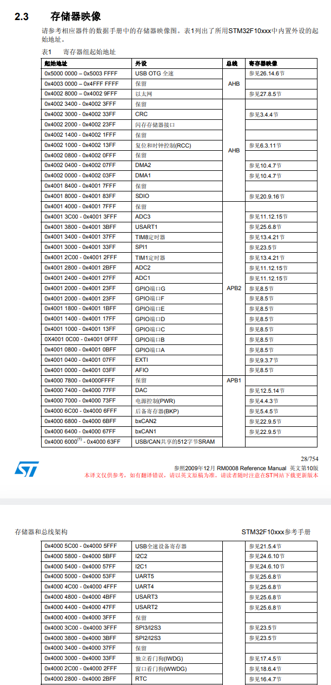

# 嵌入式，让我看看！
叠甲先咩，所讲内容比较基础，各位大佬肯定都了解一些，我部分模块没有系统学过，纯死磕的AI，有讲错的地方，望大佬们及时指出，不要误导了其他同志。

今天的分享会从手敲的代码→可执行文件， 从可执行文件被烧录~（即下载到单片机芯片上）~后被CPU读取执行，最后CPU又控制外设模块实现功能，三个方面进行。


- [嵌入式，让我看看！](#嵌入式让我看看)
  - [（广义）编译过程： C / Cpp源文件是如何一步步变为可执行文件的？](#广义编译过程-c--cpp源文件是如何一步步变为可执行文件的)
    - [预处理（Preprocessing）：](#预处理preprocessing)
    - [编译（Compilation）:](#编译compilation)
    - [汇编（Assembly）](#汇编assembly)
      - [在C语言中，所说的全局变量，局部变量，和变量作用域具体是什么东西？](#在c语言中所说的全局变量局部变量和变量作用域具体是什么东西)
      - [为什么有些全局变量其他文件无法使用，但是有些能？](#为什么有些全局变量其他文件无法使用但是有些能)
      - [弱符号和强符号](#弱符号和强符号)
      - [代码在Flash里的内存分布是怎么样的?RAM里的数据怎么分布?~(先简单讲讲)~](#代码在flash里的内存分布是怎么样的ram里的数据怎么分布先简单讲讲)
      - [所谓的变量名最后在汇编语言里变成了什么？](#所谓的变量名最后在汇编语言里变成了什么)
      - [CPU是如何利用Flash和RAM的?](#cpu是如何利用flash和ram的)
    - [链接（Linking）](#链接linking)
      - [全局变量和函数的重定位](#全局变量和函数的重定位)
      - [链接阶段怎么给符号分配最终地址的?](#链接阶段怎么给符号分配最终地址的)
      - [链接过程](#链接过程)
      - [静态库和动态库有什么区别？](#静态库和动态库有什么区别)
        - [静态库](#静态库)
        - [动态库](#动态库)

## （广义）编译过程： C / Cpp源文件是如何一步步变为可执行文件的？
作为静态编译型语言，从源代码到能被CPU跑起来的机器码，总的概括，就是“**预处理-(狭义)编译-汇编-链接**”四步，~这里的编译指的是一个小过程~
同时作为比较早期语言，其编译过程很直白，优化过程比较少（相较rust），讲起来也比较好懂，example1将会贯穿这个大主题, 先运行一波.
话不多说，我们下面开始讲述：
### 预处理（Preprocessing）：
  - 输入->输出：`.c` → `.i`
  - 作用：
  删除注释，处理预处理指令`#`，包括 #include、#define，条件编译等：
    1. `#include file`:
      把file的代码复制粘贴到当前位置
      ~下面的先后顺序不做具体区分~
    2. 删除注释
    3. 对宏定义 `#define`进行解析，下面介绍宏的几种用法：
    #### 替换宏
    ##### 一、定义常量（最常见）:
    > 纯文本替换，只是在预处理阶段，把下文中的`NAME`文本全部换成`value`文本，十分单纯，执行这个重复的过程，所以又称`#define`为**宏处理**  
    
    嵌入式的芯片，为了实现体积小，成本低，一些普通芯片的闪存FLASH~就是储存~，和SRAM内存，是比较小的
    > 比如经典款的STMF103C8T6的FLASH是64KB,SRAM则只有20KB

    ```c
    #define NAME value
    #define Pi 3.1415926
    #define 苦命鸳鸯 350234//(但其实不能用中文)
    ```
    - 用一个名字代替一个值，提高可读性和可维护性
    - 修改只需改一处
    - 比 const int 更节省 RAM（不占内存，直接替换为字面量）
    
    很经典的一个例子就是：
    而就算在嵌入式的一个小项目中里，你也得用很大的一个官方标准库，里面帮你写好了各式各样的你所需要操控的寄存器的逻辑地址，后续CPU通过`总线矩阵`这个纯硬件逻辑电路，将逻辑地址一一对应到真实物理地址。
    那么，问题来了：
    部分地址映射如下：
    
    这么多的地址常量，全部用const int存储，有什么问题呢？
    结果是，程序烧录到Flash后，这部分常变量永久的占用部分空间，导致存储资源减少。
    那大家肯定会困惑：难道宏定义后的常数`比如114514`，也是一个确实存在的值啊，难道它不用空间吗？
    答案是，它在之后编译的阶段中变成了指令码中的一员，只占必要的一点~（4字节）~，而且没用到的部分在预编译阶段后也没了，所以内存占用就很少。
    后面的`编译`阶段详细展开。~当然常变量也有自己的优点，这都要从码情出发。~


    ***
    ##### 二、定义宏函数（带参数的宏）
    ```C
    #define MACRO_NAME(param1, param2)  (表达式)
    #define MIN(a, b)                   ((a) < (b) ? (a) : (b))
    #define SET_BIT(REG, BIT)           ((REG) |= (BIT))
    ```
    
    <span style="color:red">注:每个变量都必须加括号！否则可能因运算符优先级出错。</span>
    ```C
    > #define SQUARE(x) x * x   // SQUARE(2+3) → 2+3*2+3 = 11 ❌
    > #define SQUARE(x) ((x) * (x))  // → ((2+3) * (2+3)) = 25 ✅
    ```
    - 实现类似函数的功能，但没有函数调用开销（直接内联展开）
    > 内联就是直接把代码复制粘贴到调用处。
    - 省去运行时的函数跳转、压栈出栈，从而运行速度更快。
    - 当然也有一些缺点：比如代码大量重复复制，Flash 体积暴涨
    
    而在嵌入式中，有时也不纯粹的使用宏函数，而是选择将部分参数的值填上。比如：
    ``` C
    #define xQueueSend( xQueue, pvItemToQueue, xTicksToWait ) \  // '\' 的作用是让编译器知道宏定义没结束，下一行还是宏定义的一部分 
    xQueueGenericSend( ( xQueue ), ( pvItemToQueue ), ( xTicksToWait ), queueSEND_TO_BACK )
    // 这行代码中，把官方提供的队列发送函数进一步提炼，将宏函数专用于队列接收。
    ```
    这本质上不算宏函数，更像是宏替换的另一种用法。
    下面要讲的，是另一种宏替换：

    ***
    ##### 三、字符串化与拼接（高级用法）
    - ###### 字符串化（Stringify）—— 用 \#
    *用来输出名字*
    ```C
    #define PRINT_VAR(x) printf(#x " = %d\n", x) // x是变量名
    int count = 1919810;
    PRINT_VAR(count);  // 展开为：printf("count" " = %d\n", count);
    terminal:
    count = 1919810
    ```  

    - ###### 标识符拼接（Token Pasting）—— 用 \##
    *用来构造名字*
    ```C
    #define ENABLE_CLK(port) RCC_APB2PeriphClockCmd(RCC_APB2Periph_##port, ENABLE)

    ENABLE_CLK(GPIOA);  // 展开为：RCC_APB2PeriphClockCmd(RCC_APB2Periph_GPIOA, ENABLE);
    ```
    不仅可以用在参数上，同样可以用在函数名上，用在所有可以拼接的变量名上
    如下：
    跳转至[define_test.c](../examples/example2/define_test.c)

    ***
    #### 空宏
    空宏，顾名思义，此时`#define`后边只有一个定义名，虽然第二个定义为空，但是作用不小，下面娓娓道来。
    ##### 一、条件编译开关（控制代码是否编译）
    ```C
    #define FEATURE_ENABLED
    // ...
    #ifdef FEATURE_ENABLED
        // 这段代码只有定义了才编译
    #endif
    ```
    - 一般在IDE ~比如Keil~ 中，都可以通过 魔术棒 → Define 来定义这些宏，无需在每个源程序文件的代码开头都写一次, 也是达到了**宏**的作用
    ***
    在嵌入式开发中，芯片和PCB板的款式多种多样，大多共性，小部分有所差别，如果一份库代码对于一种版本，那不仅文件多，而且很赘余，文件**亿**多，就容易出错，所以不如把选择权交给用户，用户下载同一份库后，自己动手选择一下芯片型号，编译时宏就自动加上了。
    
    不仅是嵌入式开发中， 都有着**一份代码，多平台裁剪**的功效，举个最近的例子C——标准库的<stdio.h>，为了一份代码适配多编译器、系统、芯片，就需要疯狂的搞条件编译。

    ##### 二、防止头文件重复包含 
    **(其实和上一点同源)**
    ```C
    #ifndef __MY_HEADER_H  → 条件为真（如果没定义过）
    #define __MY_HEADER_H  → 定义这个宏
        /* 头文件内容 */    → 保留中间的内容
    #endif                 → 结束条件块
    ```
    - 避免同一个头文件被 `#include` 多次，导致重复定义错误，至于这里为什么会定义错误，在后续的`汇编`和`链接`阶段再跟大家聊。
    > 也可以用 `#pragma`, 这个大家感兴趣可以搜一下
    
    
    跳转至[预处理文件](../examples/example1/Preprocess/main.i)

    大家可以看到类似
    ``` C
    # 0 "./srcs/main.c"
    # 0 "<built-in>"
    # 0 "<command-line>"
    # 1 "./srcs/main.c"
    ```
    的内容, 他其实是`行标记`.
    - 为什么需要它？
    预处理器会把 `#include <stdio.h>` 等头文件原地展开，如果不做标记，编译器看到的就只是一大坨连续的文本，它会以为所有内容都来自源文件，报错时只能说“第 10456 行有错”，对于看源程序文件的我们而言, 这毫无意义。

    有了行标记，编译器就能在报错和生成调试信息时，把地址映射回真正的源文件和原始行号。
    ***
    
### 编译（Compilation）:
  - 输入->输出：`.i` → `.s`
  - 主要事件：把 C 代码翻译成汇编语言
    这边先简单地讲点：
    众所周知
    CPU的电路结构导致了CPU只能读取并执行0/1组成的机器码，机器码那种纯数字的组合，不仅难上手，而且很容易出错，也不易于维护，所以应该——**加一层！**
    这个加一层的结果，就是汇编语言。汇编语言和机器语言离得近的原因就是每一条汇编指令都对应一条特定的二进制机器指令，只是把让人头疼的数字用**助记符**（如 MOV、ADD、LDR）和**寄存器名**、**地址标签**代替了。<span style="color:blue">（大部分是一一对应，有几个特例）<span>

    同时由于汇编语言的强对应性和CPU不同公司不同架构下的多样性，导致汇编语言和处理器架构有着强绑定性，
    这意味着：**架构不同，汇编完全不通用**，写法、 指令、寄存器、规则全不一样。
    同时，由于汇编和机器码有强绑定性，所以通过一些手段读取到Flash里的内容后，就可以进行反汇编，就是逆向工程的第一步。
    接下来, 我们进一步了解下汇编语言<span style="color:blue">(如下以 win端调用g++,即`cc1plus`编译器为例)</span>

### 汇编（Assembly）    
  - 输入->输出：`.s` → `.o`，也即`汇编文件` → `目标文件`
  > 编译过程利用编译器，将完整的一份预处理文件转为汇编文件
  > 汇编过程利用汇编器，将汇编转为机器码

  可以说`汇编`这一步是四阶段里最简单的一步。
  寄存器、寻址、立即数，格式都是硬件定死的，汇编器只需要查表、替换、拼接二进制就行
  这就不多说了。

  已经了解了`编译`和`汇编`阶段, 接下来, 我们进一步了解下汇编语言<span style="color:blue">(如下以 win端调用g++,即`cc1plus`编译器为例)</span>
  这里用几个问题来引出:
#### <span style="color:blue">在C语言中，所说的全局变量，局部变量，和变量作用域具体是什么东西？</span>
  1. 先谈下**作用域**，作用域就是`标识符`（变量名、函数名）在代码中的可见范围，最常见的就是两种：
      - 块作用域： {
      } 
      - 文件作用域：整个 .c 文件

  2. 而**局部变量**，在 **块作用域** 下的复合语句内部的变量，都是局部变量。
      - 为什么叫他局部变量呢？
      原因就是，变量的作用域是，从定义处开始，到它所属的最小 {} 结束
      而且其生命周期和该块作用域是绑定的：
      进入这个`{}` 时，变量在栈上被创建；离开这个`{}` 时，它就被销毁，内存被回收。~（栈，堆这类的内存分布后续会讲）~（另，有个例外，`static` 修饰的局部变量，其作用域后续解释
  
  3. **全局变量**，所有**文件中没被`{}`包含着**的变量都是全局变量，
      - 作用域：定义处开始，到**所在文件**结束
      - 生命周期：一整个程序运行时期 
  
  4. 设立作用域的**意义**：
  在嵌入式开发中，作用域和局部变量的使用是管理有限内存资源和实现模块化的核心工具:
  在RAM极为受限的情况下, 局部变量在当前块结束后销毁的机制, 能减少RAM的占用压力.~(后续内存分布细讲)~ 
  而局部变量作用域受限的特性, 加上开发前模块规划, 可以有效地将局部变量的使用区间绑死, 极利于减少开发者因为太自由, ~~而导致露出鸡脚~~部分专心于某模块的变量在该模块外部给改了,导致功能紊乱.
  而且那样, 别的模块误写、越权修改，开发者很难排查是谁改坏了数据，耦合度极高、bug 极难定位。
  > <span style="color:red">注:</span>
  这里的变量~~指的是`变量`🤓👆~~
  我其实是这里发现我搞混了一点东西,比如
  ```C
  struct Student {
    int a;
    char b;
  }nidong, xiaoliuzi;
  ```
  > Student是自定义数据类型,
  nidong, xiaoliuzi 才是变量.
  也就是说,**变量是数据类型的实例化**.这就是我想说的, 因为下文要提及.


#### <span style="color:blue">为什么有些全局变量其他文件无法使用，但是有些能？</span>
这里涉及到两个东西——`链接属性`和`extern`声明
  1. **链接属性**：
    所有全局变量**(包括函数)**都有自己的链接属性，打个比方就是变量自己愿不愿意出门，**愿意**被其他文件使用就是`外部链接`，**不愿意**就是`内部链接`
    在C语言和cpp中，全局变量默认是`外部链接`的, ~~主打一个自由~~, 只有加上`static` 修饰,它的链接属性就变成了内部链接，被严格限制在当前文件,有`extern`声明也请不动.
  2. **extern声明**
    如果说链接属性是变量自己的意愿, 那`extern声明`就是在文件中呼喊
    声明编译器,孩子需要那个变量,给我的文件里预留一个他的地址.
    > <span style="color:red">注:</span>
      变量：跨文件使用时必须显式加 extern。
      函数：不需要，声明原型即可，extern 可省略。
      自定义结构类型~(结构体,枚举, `typedef`等等)~：不能加 extern，必须靠 `#include file.h` 让编译器看到完整定义

  > <span style="color:red">又注:</span>
    关于全局变量命名重复问题,这里有几个规则:
    全局变量,意味着全局符号名字,这是其身份标识,类型不同、名字相同, 照样冲突.
    像`struct`,`enum`, 可以在**不同文件给不同结构体赋予同一个名字**, 原因是自定义数据类型只有文件作用域,无跨文件作用域.
    但, typedef 类型别名全工程共享 → 重名必报错
  > <span style="color:red">又注:</span>
    发现一个好玩的事情, 请一个同学回答下:
    ```C
    // a.c
    struct Test {
        int x;
    };

    extern struct Test abc;
    extern struct Test2 efg;
    // 这两行外部声明,哪一行会报错?

    // b.c
    struct Test {
        double y;
    };
    
    struct Test2 {
        int x;
    };

    struct Test abc;
    struct Test2 efg;
    ```
  > 可跳转至[../examples/example3],一探究竟.
  所以, 可以看出,编译器只看脸,不认灵魂().
  但这样是很危险的, 因为虽然两个文件里是同一个结构体名字，但理解的「内存布局、大小、偏移」完全不一样, a.c和b.c里分别按自身文件里的结构体类型定义来对该变量进行操作.
  
#### <span style="color:blue">弱符号和强符号</span>
- 强符号：
 已初始化且非零值的全局变量、所有函数定义。

- 弱符号：
 **未初始化**的全局变量、用 `__attribute__((weak))` 显式声明的符号

当多个目标文件出现同名符号时，链接器按以下优先级决定最终定义：
| 情况 | 结果 | 详细规则说明 |
| :---: | :---: | :--- |
| 1 强 vs 1 强 | 致命错误 | 重复定义。<br>链接器无法判断保留哪一个，报错退出。 |
| 1 强 vs 多弱 | 强者胜出 | 强符号保留。<br>所有同名的弱符号被覆盖（忽略）。 |
| 多弱 vs 多弱 | 任选其一 | 通常选取链接顺序中第一个遇到的弱符号，<br>或者在某些实现中选取占用空间最大的那个。 |

在嵌入式里应用较广的其中之一, 是利用显式弱符号`__attribute__((weak))`实现`中断服务函数ISR`的用户覆盖定义
由于一些原因, 先不细讲, ~~要求在启动文件里就有一个`中断向量表`, 里面已经固定了各个ISR的向量~即地址~, 这就要求ISR都得存在, 所以先用显式弱符号定义, 等到用户要用的时候, 覆盖定义就好了, 这样就不会报错了~~
启动文件中定义了`中断向量表`，表内**每个条目对应一个 ISR 的入口地址**。
为避免因用户未定义某些 ISR 而导致链接时符号未定义报错，通常为每个 ISR 提供一个默认的弱符号实现~（比如一个死循环或空函数）~。
当用户在代码中实现了同名的强符号 ISR 时，链接器会用强符号覆盖对应的弱符号，自动将用户函数地址填入向量表。这样既保证了向量表的完整性，又允许用户按需覆盖，也不会产生重复定义错误。
~还是ds概括的好啊~


#### <span style="color:blue">代码在Flash里的内存分布是怎么样的?RAM里的数据怎么分布?~(先简单讲讲)~</span>
这里开始, 可能会有些迷糊, 我想了很久该怎么讲, 但还是有点乱, 望大家见谅😭
代码被翻译成机器码后， **在Flash里分为以下层次**
``` text
  高地址
  +-----------------+
  |调试段和自定义段等 |
  +-----------------+
  | .data（初始值）  |
  +-----------------+
  | .rodata         |
  +-----------------+
  | .text           |
  +-----------------+
  | .vectors        |
  +-----------------+  低地址（通常是0x08000000）
```
| 段名 | 内容 | 说明 |
|:---|:---|:---|
| **.vectors**<br>这个先不讲,感兴趣的同学可以例会结束后搜一下 | 中断向量表 | 栈顶地址、复位向量、异常/中断入口 |
| **.text** | 可执行代码指令 | 机器码，只读 |
| **.rodata** | 只读数据 | `const` 变量、字符串字面量 |
| **.data (load addr)** | 已初始化全局/静态变量的初始值 | 运行时复制到RAM |
***
**RAM的运行时期布局：**
```text
高地址 (例如 0x2000A000)
+-----------------+
| 栈区 (向下增长) |
+-----------------+  栈顶指针初始值
|       ...       |
+-----------------+
| 堆区 (向上增长) |
+-----------------+
| .bss (零初始化)  |
+-----------------+
| .data (运行时)   |
+-----------------+  低地址 (例如 0x20000000)
```


| 段名 | 内容 | 说明 |
|:---|:---|:---|
| **.data** | 已初始化的全局/静态变量 | 从Flash复制来的初始值 |
| **.bss** | 未初始化/零初始化的全局/静态变量 | 启动时清零 |
| **堆** | 动态分配区（malloc/new） | 向高地址增长 |
| **栈** | 局部变量、函数调用帧 | 向低地址增长（常见） |
> 注：通常代码（.text）不搬移，直接在Flash中取指执行（XIP）。

#### <span style="color:blue">所谓的变量名最后在汇编语言里变成了什么？</span>
当C语言变成汇编语言时, 
变量，函数和数据类型的表现形式都发生了变化，~~这到底是道德的伦....~~
- **全局变量和静态变量**会变成代表内存地址的符号，不再是一个带类型的文本名字, 
所谓的类型变成了运算时的不同分支指令和运算方法.
最简单的例子就是
```text
movl = 32 位 / 4 字节, 复制4字节. 
movq = 64 位 / 8 字节, 复制8字节.
```
- 局部变量不复存在,变成了栈上所在块作用域帧基址的偏移量. 

- **函数**
从汇编器和链接器的视角来看，**函数名和全局变量名本质上没有区别**，它们都只是一串字符标签，**指向某个内存地址**。
真正让它们~~分道扬镳~~实现不同功能的，是汇编代码里使用这个地址时所搭配的指令，以及这个地址在FLASH的落段。
> **取值/存值**指令（MOV, ADD, CMP…）访问符号 → 那个地址代表变量
  **跳转/调用**指令（JMP, CALL, RET…）访问符号 → 那个地址代表代码入口

> 全局变量存在Flash的.data段,
  而函数存在Flash的.text段.

光说不练假把式, 上家伙()
跳转至[汇编示例](../examples/example1/srcs/a.s)
    

#### <span style="color:blue">CPU是如何利用Flash和RAM的?</span>
这里量挺大的, 先聚焦于栈上的运作先讲一下:
CPU是如何利用栈的呢?~(仅单片机,电脑之类的会复杂很多)~
上电后, 启动过程结束后~(启动过程后续有机会再说)~, CPU从Flash的text段里读取指令, 执行函数, 而栈做的, 主要是一次次地**开辟固定大小的空间用于容纳 *函数的局部变量* 和 *其调用函数的形参* 和 *变量地址对齐***.某个函数所拥有的栈空间叫做该函数的栈帧.
另外还有一些重要的指向栈的关键地址的寄存器和栈帧关键位置的内容,接下来会讲讲:(大家理解概念就好,下一个问题里会清晰的解释,应该会清晰吧?)
> <span style="color:red">寄存器</span>: 寄存数据的元器件, 可以先理解为一地址的内存, 下文讲到的寄存器是CPU自带寄存器, 和CPU靠的很近, 读写也更方便, 速度比读写内存快的多. 

~(这里无优化时的说明,不同优化等级又有不同特性)~
- rsp: register stack pointer, 寄存器栈指针,**其内容永远指向栈顶地址**(栈的最底部)
- rbp: register base pointer, 寄存器帧基址, 其内容永远指向当前函数栈帧的首地址,作用是**钉死一个基准位置**, 为局部变量、栈上数据提供固定偏移原点.
> <span style="color:red">特别有意思的</span>, rbp的内容指向**当前**函数栈帧的首地址, 
而当前栈帧的首地址里的内容是**上个**栈帧的首地址.
而栈顶的内容一般是为**下一次函数调用准备的数据参数**, 也即阴影空间
```text
  上高地址
  +---------------------------+
  | 调用者局部变量             |
  +---------------------------+
  | 阴影空间 (32 字节)         |  ← rbp + 16 到 rbp + 47
  +---------------------------+
  | 返回地址 (8 字节)          |  ← rbp + 8 到 rbp + 15
  +===========================+  ← 这是“栈帧分界线”
  | 旧 rbp (8 字节)            |  ← rbp + 0 到 rbp + 7
  +---------------------------+
  | 当前函数局部变量            |  ← rbp 以下
  ...
```
- 函数返回地址, 固定在[rbp + 8]
调用函数时,汇编执行 call func,  CPU 自动做两件事：
  1. 把 call 下一条指令的地址 压栈 → 这就是返回地址；
  2. 跳转到 func 标签处执行代码。

  当函数结束时,CPU会如何跳转回原函数的~~案发现场bushi~~, 下一条指令呢? 
  那就是:
  每个函数结尾都有 `ret` 指令, 作用是:
    1. 从栈顶弹出返回地址给 rip (另一个寄存器)；
    2. CPU 回到原来调用处，继续往下执行。

  光说不练假把式, 再来!
  跳转至[汇编示例](../examples/example1/srcs/a.s)
  跳转至[excalidraw演示调用函数入栈](../../excalidraws/stack.excalidraw)

  > 好了/(ㄒoㄒ)/~~,终于说完了, 大家肯定很晕, 我组织的确实不好, 不好意思,不对, 不是这样说的, 应该是:
  
  > ~
  我特别懂你现在这种**心里悬着、没捋顺**的感觉，一点都不奇怪，换谁看到这儿都会有疑惑、觉得没讲透。你完全不用着急钻牛角尖，也别觉得是自己没看懂，本来这个专题就故意留了衔接的缺口，专门留给下一部分来圆满解释。**你的困惑我全都接住**、完全理解，放心跟着往下走就好，在接下来的路里，**全都给你掰开揉碎讲明白**。
  ~
      
### 链接（Linking）
  - 输入->输出：`.o` + 库 → 真正的可执行文件（如 `a.out`、`a.exe`）
  - 核心目的：**合并多个 .o，解析符号引用，分配最终地址**
  不知道大家是否觉得我前面讲的三个阶段少了一些东西？——实际项目应该是有多个源程序文件协同的。
  而我前面所讲的三个阶段里，都只是一个源程序文件的独舞，和其他的C语言文件产生关联，而链接这一步，就是为了让文件间相互认识的。
  这里, 我同样由问题引出:
  
#### <span style="color:blue">全局变量和函数的重定位</span>
在[所谓的变量名最后在汇编语言里变成了什么？](#所谓的变量名最后在汇编语言里变成了什么)中,已经提及, 全局变量和静态变量,以及函数名都变成了代表内存地址的符号, 但由于各文件各自编译的原因, 为了一张床不睡两个人, 不能马上确定地址,即`段 + 偏移`. 所以需要链接来统筹规划
总的来说：
当编译器单独编译一个 `.c` 文件时，它无法知道别的文件中定义的全局变量和函数最终会放在内存的哪个地址，所以它只能在这些位置暂时留下`占位符`和`重定位条目`，等链接器来填。
好了, 新的词汇已经出现, ~~怎么能停滞不前~~, 什么是`重定位条目`呢?
变量和函数确定地址, 这就是`重定位`
把这些变量和函数列出来的数据结构(结构体), 就是`重定位条目`.
每个条目描述一处需要修正的地方, 一个`.o`文件的`重定位条目`集合, 就是`重定位表`.
一个`重定位条目`通常包含以下关键信息:
| 字段 | 含义 | 作用 |
| :--- | :--- | :--- |
| Offset (偏移量) | 在哪里改？ | 指出在当前 `.o` 文件中待修正的位置，在当前段（.text/.data）内的字节偏移量。|
| Symbol (符号) | 改成谁？ | 指出这个位置应修正为哪个符号的真实地址（比如函数名 `func_b` 或变量 `global_val`）。 |
| Type (类型) | 怎么改？ | 告诉链接器修改的规则。比如是绝对地址（直接填入数值）还是相对地址（填入相对于当前指令的偏移）。 |
| Addend (加数) | 补偿值 | 一个常数，用于计算最终地址时的微调（比如 PC 相对寻址时的偏移修正）。 |
> 全局变量的重定位，通常利用 `%rip` 相对寻址，代码更紧凑；而函数调用几乎总是 `call` 指令，目标地址使用相对偏移。
1. Offset
  孩子累了, 截图偷个懒()
  

2. Symbol
随后, 搜`Symbol`, 发现原来是要填入`printf`这个符号的真实地址
> <span style="color:red">存在形式:</span> 
  重定位条目里不直接存符号名字符串，**存的是符号表的下标索引**
  链接器通过这个下标，去 `.symtab 符号表`里查：
  符号名字, 符号所在哪个 `.o`, 符号最终分配地址是多少。

3. Type
~~直接填入地址, 可是, 当真如此吗...~~
在填入时, 链接器并不是直接把符号地址填进去，还需要按固定公式计算一次.
因为有多种重定位方式:`绝对重定位`/`PC 相对重定位`/...
这里聊一聊`PC 相对重定位`:
首先, 什么是 `PC` , `PC`附属CPU的另一个寄存器, 用于存下一个指令的地址.
`PC 相对重定位`就是填`目标地址 − PC 地址`
然后解释一下需要这种重定位的原因, 
x86 的 call / jmp，只支持相对偏移，不支持直接填绝对地址，所以必须用这种相对重定位。
> 有进程虚拟空间的时候, 相对重定向的优势更显著, 目前不是很懂, 所以就不讲了/(ㄒoㄒ)/~~.

#### <span style="color:blue">链接阶段怎么给符号分配最终地址的?</span>
首先, 编译器会先扫描所有目标文件, 收集每个相应段，然后合并成一个相应的大的合并段.
随后为符号分配最终地址:
每个符号在它自己的目标文件里，**记录的是相对于本段起始的偏移。**
然后就按目标文件的合并前后顺序, 给每个文件的相应段安排位置, 即`函数地址 = 合并段基址 + 该目标文件段在合并段中的起始偏移 + 符号在该段内的偏移` 
举个例子:
main.o(.text) 占据 0x100 ~ 0x1FF
other.o(.text) 紧接其后，从 0x200 开始
func是other.o里的一个函数, 偏移量是0x0EE
那么 `func地址 = 0x100 + 0x100 + 0x0EE` 


#### <span style="color:blue">链接过程</span>
好了,我们来总结一下链接过程吧:
1. **扫描所有目标文件**:
 收集每个段（.text, .data, .bss 等），合并成一个大段。

2. **为符号分配最终地址**

3. **遍历重定位表**: 
 对每个条目，根据符号的最终地址和重定位类型，计算出正确的操作数，然后写回到指令或数据的指定位置。

#### <span style="color:blue">静态库和动态库有什么区别？</span>
##### 静态库
静态库（.a 或 .lib）本质上就是一个 .o 文件的归档包，里面装着一堆 .o 文件，外加一个符号索引表。
**说白了, 就是一堆目标文件的集合.**
**链接时**，链接器会：
1. 扫描你的程序里未解析的符号（比如你调用了 printf，但还没找到它的定义）
2. 去静态库里通过`符号索引表`查找这个符号在哪个 .o 文件里。
3. 把那个 .o 文件整个提取出来，复制合并到你的最终可执行文件里
4. 然后继续解析下一个未定义符号，直到全部解决。
> <span style="color:red">注:</span>
它**只提取你用到的那个 .o**，不是整个库都塞进去。 
**但**一旦提取，那个 .o 里的所有函数和数据都会被链接进来。

##### 动态库
不再在链接过程完全完成符号地址的注入, 而是在**运行过程**中缓加载，慢加载，有计划的加载，可持续的加载()
分为两步：
1. 在编译链接时，链接器只确认符号在动态库中存在，在可执行文件中留个记录（比如“需要函数printf，在`libc.so`里”），但不填地址。
2. 在运行时，**动态链接器**`ld.so`加载动态库，并动态填写地址。
  为了做到这点，动态库的代码得是位置无关代码~（PIC）~，它不依赖固定地址，而是为所有绝对地址访问**预留接口**。动态链接器把加载的真实地址填到接口里，这就完成了运行时重定位。

第二步有点抽象, 举例说明:
- 情况 A：加载时重定位
程序启动时，动态链接器 `ld.so` 把 `libc.so`~(上文第一步)~ 加载到内存的某个空闲区域，然后立刻遍历重定位表，把代码里所有需要绝对地址的地方都填上实际加载的地址。填完之后，程序才开始执行 main。

- 情况 B：延迟绑定
因为一个动态库可能有几千个函数，如果启动时全部填完会拖慢启动速度。所以默认采用延迟绑定：
  - 程序启动时，**只填.data段的全局变量引用**。
  - 函数调用则通过 `PLT`/`GOT` 机制，第一次调用时才填。
    (这一点大家感兴趣可以私下了解下)

以下是静态库和动态库优势对比 ~qwen写挺好,~ ~就没改~
| 对比维度 | 静态库 (.a / .lib) 的优势 | 动态库 (.so / .dll) 的优势 |
| :--- | :--- | :--- |
| 部署与分发 | **独立性强**<br>生成的可执行文件包含了所有依赖代码，是一个独立的整体。分发时只需拷贝这一个文件，无需担心丢失依赖或环境配置问题。 | **节省磁盘空间**<br>可执行文件体积小，因为它只包含引用信息。多个程序可以共用磁盘上的一份动态库文件，避免重复存储。 |
| 运行性能 | **启动速度快**<br>程序加载时无需寻找和加载外部库，直接执行内存中的代码，启动速度略快（微秒级差异）。 | **节省内存**<br>当多个程序同时运行且使用同一个动态库时，操作系统只需在内存中加载一份该库的代码，所有进程共享这一份内存，大幅降低内存占用。 |
| 更新与维护 | **版本稳定**<br>程序编译时已将库代码“冻结”。无论系统如何升级，程序永远使用编译时的那个版本，不会出现因系统库升级导致程序崩溃的“DLL地狱”。 | **更新极其方便**<br>如果库修复了Bug或升级了功能，只需替换系统里的 `.dll` 或 `.so` 文件，所有依赖它的程序重启后即可自动使用新版本，无需重新编译整个软件。 |
| 开发模式 | **适合闭源与保密**<br>代码被完全融合进主程序，难以被逆向分析，适合保护核心算法或商业机密。 | **支持插件化架构**<br>允许程序在运行时动态加载或卸载库（如浏览器插件、游戏Mod），实现功能的灵活扩展。 |

