# stm32硬件与keil5软件的学习笔记
本笔记关于代码方面的内容，少涉及纯代码实现，更多的注重官方代码的规范性和结构特征。
温馨提示：此笔记与 江协科技的[STM32入门教程-2023版 细致讲解 中文字幕](https://www.bilibili.com/video/BV1th411z7sn/)一同食用，口感更佳。
## 目录
- [stm32硬件与keil5软件的学习笔记](#stm32硬件与keil5软件的学习笔记)
  - [目录](#目录)
  - [STM32总体情况](#stm32总体情况)
    - [STM32片上资源及其外设一览](#stm32片上资源及其外设一览)
    - [命名规则](#命名规则)
    - [系统结构](#系统结构)
    - [引脚定义](#引脚定义)
    - [引脚启动模式](#引脚启动模式)
    - [常见电子模块结构](#常见电子模块结构)
  - [GPIO（General Purpose Input Output）通用输入输出口](#gpiogeneral-purpose-input-output通用输入输出口)
    - [基本结构](#基本结构)
    - [位结构](#位结构)
      - [输入部分](#输入部分)
      - [输出部分](#输出部分)
    - [GPIO模式](#gpio模式)
    - [GPIO配置寄存器](#gpio配置寄存器)
      - [端口配置低/高寄存器](#端口配置低高寄存器)
      - [端口输入输出数据寄存器](#端口输入输出数据寄存器)
      - [端口位设置/清除寄存器`(Port Bit Set/Reset Register)`](#端口位设置清除寄存器port-bit-setreset-register)
      - [端口配置锁定寄存器`(Port Configuration Lock Register)`](#端口配置锁定寄存器port-configuration-lock-register)
        - [实例: *锁定 PA0 引脚的配置*](#实例-锁定-pa0-引脚的配置)
        - [实例: *封装成函数*](#实例-封装成函数)
  - [AFIO (Alternate Function Input Output) 复用功能输入输出口](#afio-alternate-function-input-output-复用功能输入输出口)
    - [核心功能](#核心功能)
      - [外设引脚重映射（Pin Remapping）](#外设引脚重映射pin-remapping)
      - [外部中断（EXTI）输入源选择](#外部中断exti输入源选择)
    - [关键寄存器](#关键寄存器)
    - [注意事项](#注意事项)
  - [时钟](#时钟)
    - [时钟周期](#时钟周期)
    - [同步系统](#同步系统)
    - [在不同功能模块的具体表现](#在不同功能模块的具体表现)
      - [CPU](#cpu)
      - [外设](#外设)
        - [无能的同频](#无能的同频)
        - [时钟树](#时钟树)
          - [根--时钟源](#根--时钟源)
          - [主干 -- 系统时钟 (SYSCLK)](#主干----系统时钟-sysclk)
          - [分支 -- 总线时钟分频器（Prescalers）](#分支----总线时钟分频器prescalers)
          - [叶子 -- 外设时钟使能（Clock Enable）](#叶子----外设时钟使能clock-enable)
          - [“另一棵树” -- RTC 与独立时钟域](#另一棵树----rtc-与独立时钟域)
          - [可视化：STM32F103 时钟树简化图](#可视化stm32f103-时钟树简化图)
    - [设计哲学](#设计哲学)
  - [中断系统](#中断系统)
    - [基础概念](#基础概念)
    - [STM32中断系统](#stm32中断系统)
    - [NVIC`(Nested Vectored Interrupt Controller)` 嵌套向量中断控制器](#nvicnested-vectored-interrupt-controller-嵌套向量中断控制器)
      - [中断向量](#中断向量)
      - [中断优先级](#中断优先级)
      - [设计哲学](#设计哲学-1)
    - [EXTI`(Extern Interrupt)` 外部中断](#extiextern-interrupt-外部中断)
      - [硬件模块 + 软件配置 的结合体](#硬件模块--软件配置-的结合体)
      - [功能实现和特点](#功能实现和特点)
      - [内部框架](#内部框架)
    - [注意事项](#注意事项-1)
  - [TIM(Timer)定时器](#timtimer定时器)
    - [哲学](#哲学)
    - [总概](#总概)
    - [定时器类型](#定时器类型)
      - [原理分析](#原理分析)
        - [基本定时器:](#基本定时器)
        - [通用计时器:](#通用计时器)
  - [Keil5软件使用心得](#keil5软件使用心得)
    - [使用库函数的一些方法](#使用库函数的一些方法)
      - [头文件,寻声明](#头文件寻声明)
      - [库函数用户手册](#库函数用户手册)
    - [STM32里的C语言](#stm32里的c语言)
    - [C语言数据类型](#c语言数据类型)
    - [C语言宏定义](#c语言宏定义)
    - [C语言类型转换](#c语言类型转换)
    - [C语言结构体](#c语言结构体)
    - [C语言枚举](#c语言枚举)
    - [调试方式](#调试方式)
      - [局部调试方法](#局部调试方法)
      - [核心思想](#核心思想)
  - [STM32外设及其电路](#stm32外设及其电路)
    - [LED 和 蜂鸣器](#led-和-蜂鸣器)
      - [基础常识](#基础常识)
      - [硬件电路~(电阻R1防止电流过大,还能调节功率)~](#硬件电路电阻r1防止电流过大还能调节功率)
        - [三极管](#三极管)
    - [面包板](#面包板)
    - [按键](#按键)
      - [按键抖动：](#按键抖动)
        - [不良影响](#不良影响)
        - [解决方法--过滤消抖 :](#解决方法--过滤消抖-)
      - [使用方法](#使用方法)
    - [传感器](#传感器)
      - [滤波电容](#滤波电容)
      - [电路组成](#电路组成)
        - [内部电路](#内部电路)
          - [LM393 比较器核心电路~(实现二值化的最大功臣)~](#lm393-比较器核心电路实现二值化的最大功臣)
          - [IN- 参考电压与保护电路](#in--参考电压与保护电路)
          - [IN+ 输入端电路/ AO 输出电路](#in-输入端电路-ao-输出电路)
          - [LED1 电源指示灯](#led1-电源指示灯)
        - [外部电路](#外部电路)
          - [P1 排针](#p1-排针)
          - [LED2](#led2)
      - [使用方法](#使用方法-1)
    - [OLED ：](#oled-)
      - [简介](#简介)
      - [针脚接法](#针脚接法)
    - [旋转编码器](#旋转编码器)
      - [测速原理](#测速原理)
      - [用途](#用途)

## STM32总体情况
### STM32片上资源及其外设一览
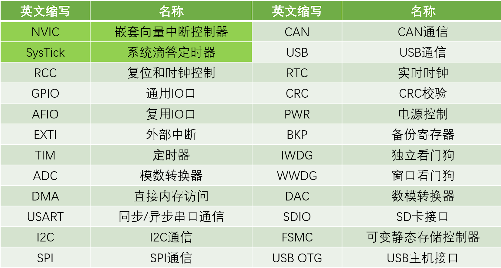

### 命名规则
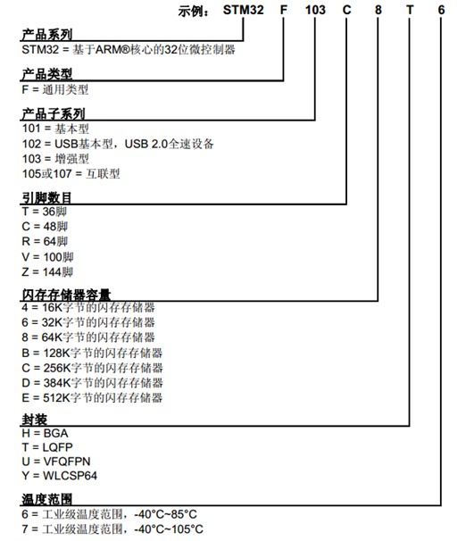
从左到右分别是
产品系列    产品类型    产品子类型   引脚数目    闪存储存器容量  封装    温度范围

### 系统结构
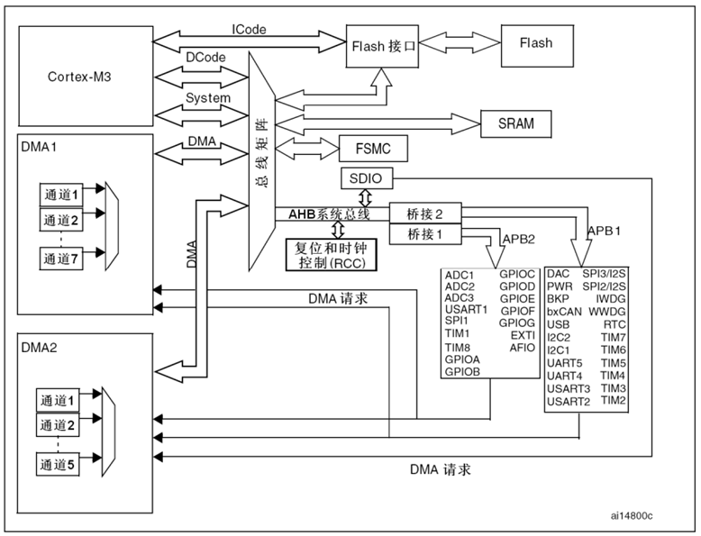

### 引脚定义
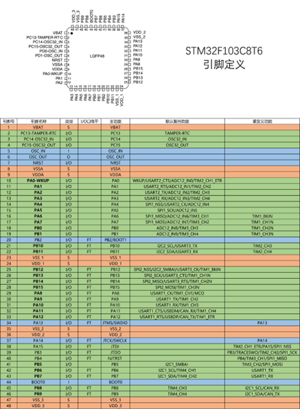

### 引脚启动模式


### 常见电子模块结构
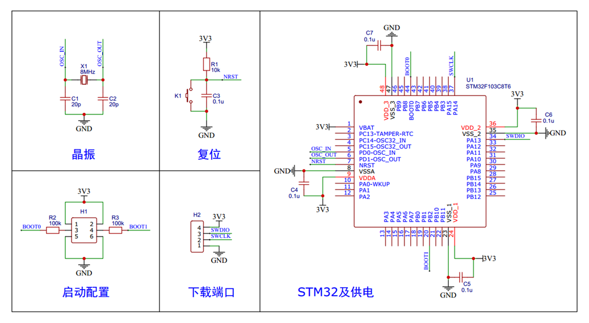

##  GPIO（General Purpose Input Output）通用输入输出口
可配置为8种输入输出模式
引脚电平：0V~3.3V，部分引脚可容忍5V
>这里的容忍是能接收5V的意思，对于输出而言，最大只能输出3.3V,因为供电只有3.3V
能容忍5V的引脚会带FT标志,(Five Tolerate)

`输出模式`下可控制端口输出高低电平，用以驱动LED、控制蜂鸣器、模拟通信协议输出时序等
`输入模式`下可读取端口的高低电平或电压，用于读取按键输入、外接模块电平信号输入、ADC电压采集、模拟通信协议接收数据等
>核心是通过输入和输出高低电平和电压实现信息的读取和传达

### 基本结构
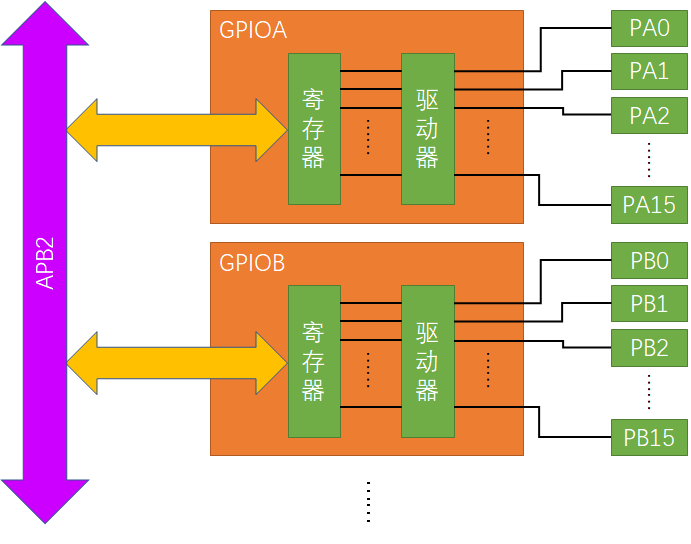
向上看,在STM32里,所有`GPIO`都挂载在`APB2外设总线`上,而`APB2外设总线`可以在[系统结构](#系统结构)的中左方找到.
向下看,每个GPIO外设都有16个引脚,编号是0-15~(什么索引笑话)~
每个引脚的命名就是显而易见的`PA0` `PA1`...

GPIO模块内主要包含**寄存器**和**驱动器**
**寄存器**就是一种比较特殊的存储器,内核可以通过APB2总线对寄存器进行读写,进而实现输出电平和读取电平.
**寄存器**的每一位对应一个引脚,当输出寄存器写1,对应引脚就会输出高电平,写0就会输出低电平. 而输入寄存器的读取亦然.
>STM32是32位微处理器,所以寄存器也是32位的, 但是寄存器端口只有16位,所以只有低16位有对应端口  

驱动器用来增加信号的驱动能力, 这样一来, 寄存器只需要存储数据,而进行操作,则需要驱动器增大驱动能力.

### 位结构
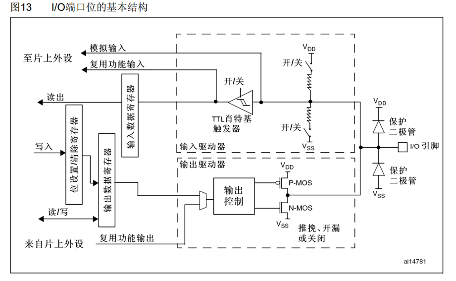
*横着看*, 左中边部分是**寄存器**,中间部分是**驱动器**,右边部分是具体的一个IO引脚.
*竖着看*, 上面是**输入部分**,下面是**输出部分**.

#### 输入部分
- **保护二极管**(看IO引脚, 这里接了两个),对输入电压进行限幅
上面的二极管接`VDD`3.3V,下面的二极管接`VSS`0V
如果电压大于3.3V,就会流向VDD,避免对GPIO的内部电路造成伤害; 小于0V,就流向VSS

- **上拉电阻和下拉电阻**(中上方),两者的开闭可由程序配置.
>上拉和下拉的作用:  给输入提供一个默认的输入电平
对应一个数字的端口(引脚),其输入不是高电平就是低电平.但是这是引脚有输入的情况,如果引脚没输入, 那算高电平还是低电平呢?
实际情况里, 这时的输入就会处于一种浮空的状态,输入电平极易受外界干扰而改变.
所以,**上下拉电阻的作用就是保证引脚悬空时的默认电平高低**. 

上下拉电阻的阻值很大,是一种弱上拉和弱下拉,目的是尽量不影响正常的输入操作.
**注 :**
 此处将上下阻值对电路的影响假想成两根弹簧,**阻值越小,拉力越大**;
而上下都有电阻,就假想成两根弹簧互拉,两弹簧的结点会靠近拉力大的那一方,
这个节点可以象征一些东西,最经典的就是电压.节点的高低就可以表示结点处~(一般是工作电路)~的电压大小

---
- **施密特触发器**(中上方),~图中的肖特基触发器是翻译错误~,目的是为了对输入电压进行整形.
>原因:
引脚的输入是数字信号,但是实习情况里可能会产生各种失真,所以信号是无规则的波形.
执行逻辑:
如果输入电压大于某一阈值,则输出瞬间为**设定好的高电压值**,直到低于某一阈值,则瞬间降为低电平.反之亦然.

- **输入数据寄存器**IDR（Input Data Register）
  经过整形的信息就可以写入输入数据寄存器了,之后我们通过程序读取输入数据寄存器对应的某一位数据后,就可以知道端口的输入电平了.

- **外设输入**(左上方)
将输入连接到片上外设的一些端口上
模拟输入--连接到ADC上,需要模拟量,所以要连在施密特触发器前面
复用功能输入--连接其他端口上(比如串口的输入引脚),要接收数字量,所以在施密特触发器前面.

#### 输出部分

- **输出数据寄存器**ODR（Output Data Register）或者**片上外设控制**
两种控制部分输出数字量,通过**数据选择器**~（就是那个梯形）~接到**输出控制**部分
>如果通过**输出数据寄存器**进行输出,就是普通的IO口输出.写此寄存器的某一位就可以操作相应端口了

- 位设置/清除寄存器~(两个不同的寄存器)~
用来单独操作输出数据寄存器的某一位,**不会影响其他位**
>原因:
**输出数据寄存器**同时控制16个端口, 并且这个寄存器**只能整体读写**
想只更改某一位的话,需要先读取寄存器,然后用按位与(&=)和按位或(|=)的方式,指定更改某一位,然后写回去.
麻烦,效率低下.

所以我们就可以通过**位设置/清除寄存器**来解决这个问题:
>方法:
如果我们要对**输出数据寄存器**某一位进行 *置1* 操作,只要在**位设置寄存器**的对应位 *写1* 即可,剩下位写0.
这样操作后,**位设置寄存器**内部电路会自动将输出数据寄存器的对应位 *置1*,*写0*位不变.

>如果我们要对**输出数据寄存器**某一位进行 *清0* 操作,只要在**位清除寄存器**的对应位 *写0* 即可,剩下位写1.
这样操作后,**位清除寄存器**内部电路会自动将输出数据寄存器的对应位 *置0*,*写1*位不变.

一步到位,简单高效.
听懂掌声()
此外,还有一种操作方式----读写STM32的"位带"区域
  
- - 什么是位带?
在STM32中,专门分配的有一段地址区域,**用来映射RAM和外设寄存器的所有位**.
所以,通过读取这段地址中的数据,相当于读写相应映射位.
主要用于基于寄存器的开发方式中.

而基于库函数的开发方式,使用的还是前两种方式.

- **MOS管**
MOS管,作用类似于开关,,负责将IO口接到VDD还是VSS,我们先前的数字信息就是用来控制此处的导通和关闭的.
此处有三种输出模式----推挽, 开漏 和 关闭:
-  - 推挽输出模式
P-MOS和 N-MOS 均有效:
寄存器对应位*置1*时,上管导通,下管断开,输出连接VDD,输出高电平.
寄存器对应位*置0*时,上管导通,下管断开,输出连接VSS,输出低电平.
>高低电平都有较强的驱动能力,所以推挽输出模式又叫**强推输出模式**
该模式下.STM32对IO口有绝对的控制权,高低电平由STM32说的算

-  - 开漏输出模式
P-MOS无效,只有N-MOS能工作.
寄存器对应位*置1*时,上下管断开,输出断开,呈高阻模式.
寄存器对应位*置0*时,上管导通,下管断开,输出连接VSS,输出低电平.
>只有低电平有驱动能力,高电平没有驱动能力.
**开漏模式可以作为通信协议的驱动方式**,原因是多机通信时可以避免多设备的相互干扰
并且,**开漏模式可以用于输出指定电压的电平信号,以兼容一些设备**,只要在IO口外额外加一个连接指定电压的上拉电阻就行利用上拉电阻`无电压我称王的特性`

- - 关闭输出模式
P-MOS,N-MOS都无效.端口电平完全取决于外部信号.

### GPIO模式
通过配置GPIO的端口配置寄存器，端口可以配置成以下8种模式:
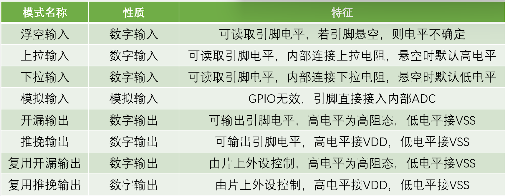
当我们配置完端口配置寄存器的模式,[位结构](#位结构)的电路也会随之改变
变化部分比如 **上下拉电阻的选择**,**MOS管的通断**,**数据选择器的选择**,**施密特触发器的开关**

>输出模式下,输入模式也是有效的,但是输入模式下,输出都是无效的
这是因为一个端口可以有多个输入,但只能有一个输出.
且,输入模式下,输出模式的**MOS管**被设置为断开,而输出模式下,并不会断开**施密特触发器**
目的是安全,多个输出会损坏电路

### GPIO配置寄存器
在 STM32（尤其是 STM32F1 系列）中，每个 GPIO 端口（如 GPIOA、GPIOB...）都有一组控制寄存器，其中：
| 寄存器缩写 | 全称 | 作用 |
|-----------|------|------|
| CRL | Port Configuration Register Low | 配置 引脚 0～7 的工作模式（输入/输出、速度、上下拉等） |
| CRH | Port Configuration Register High | 配置 引脚 8～15 的工作模式 |
| ODR | Output Data Register | 控制 所有 16 个引脚 的输出电平（高/低） |
#### 端口配置低/高寄存器
此处的高低是指其配置的端口的序号高低

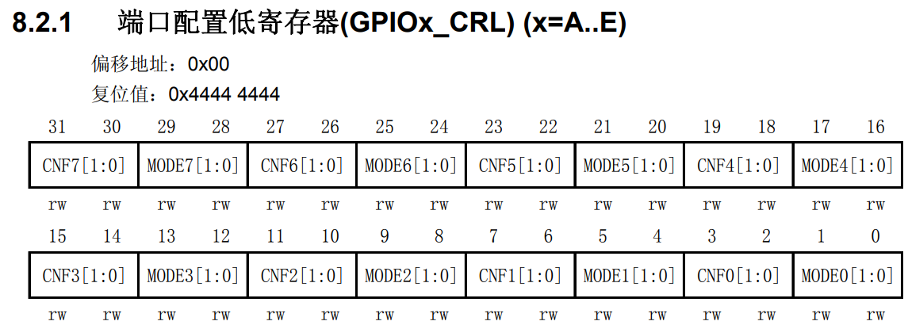
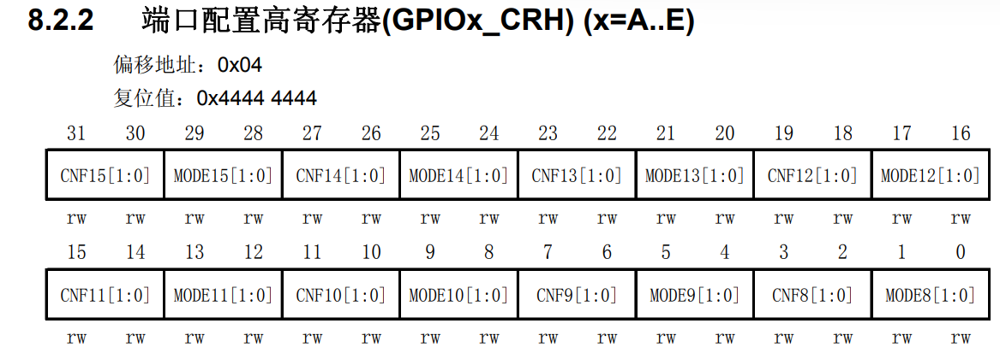
每个端口用4位配置,16个端口所以需要两个32位的寄存器进行配置

---
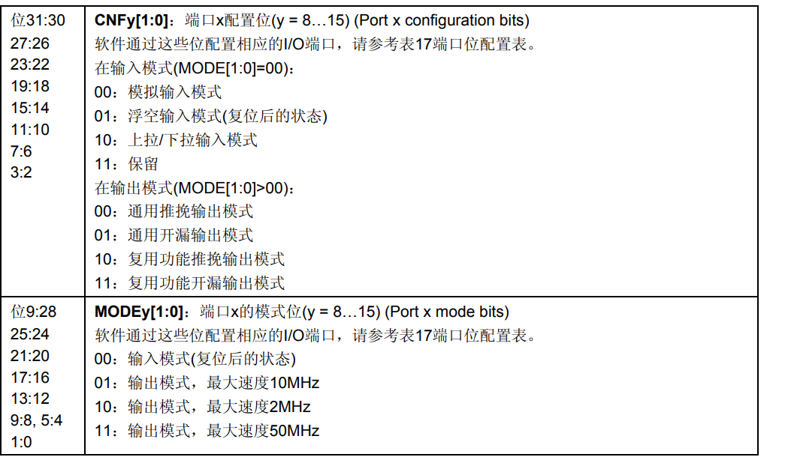
每个端口的前两位是模式位,控制一个引脚的 **工作模式与速度**
后两位是配置位,控制一个引脚的**输入/输出类型或复用功能**
也可以见得,模式位会影响配置位的模式

---
#### 端口输入输出数据寄存器
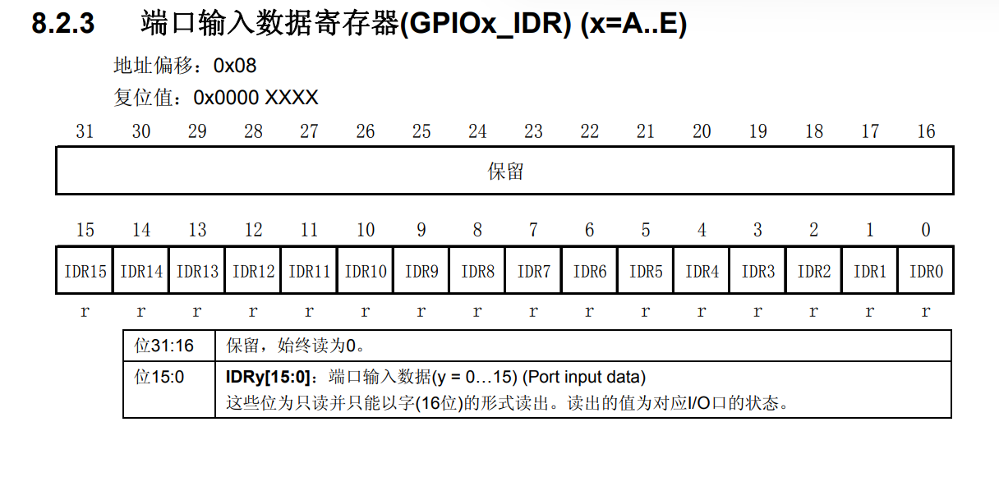

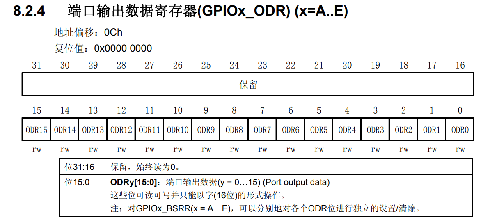

---
#### 端口位设置/清除寄存器`(Port Bit Set/Reset Register)`

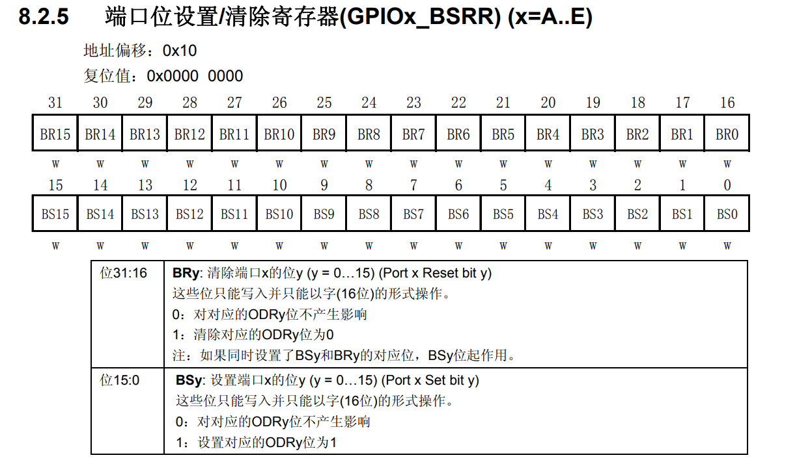
>低16位位设置，高16位位清除
注：如果同时设置了BSy和BRy的对应位，BSy位起作用。

---
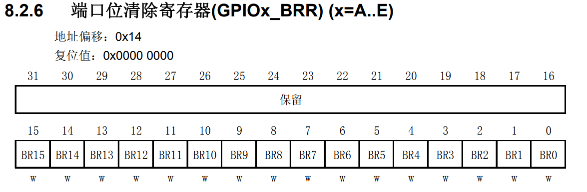
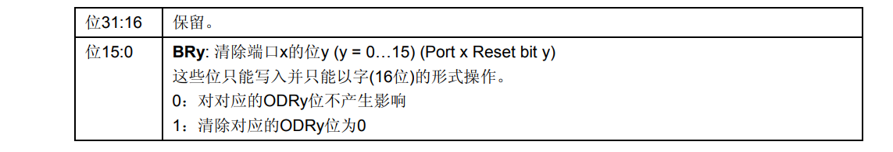
>此寄存器的低16位和`8.2.5`的寄存器的高16位功能一样
这个寄存器的设计哲学是方便操作 :
如果只想单一的进行位设置和位清除
那就位设置就用`8.2.5`,位清除就用`8.2.6`
这就保证了位设置和位清除使用的都是低16位的数据.这样方便一些

>但如果想对多个端口进行位设置和位清除,那就使用`8.2.5`,保证了位清除和位设置的**同步性**.

#### 端口配置锁定寄存器`(Port Configuration Lock Register)`

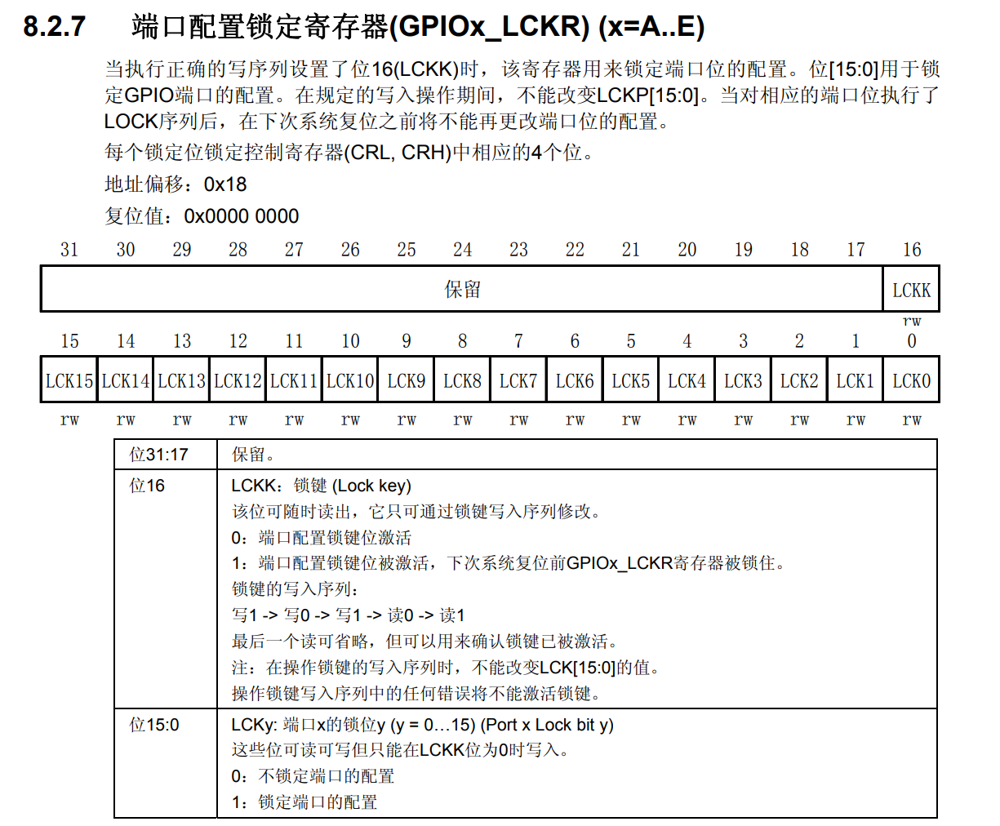
- **操作指南**
-  - 原理
只有当 CPU 在 1 个 APB1/2 时钟周期内 执行`LCKK = 1 → LCKK = 0 → LCKK = 1`写入序列时，同时，低 16 位（LCK[15:0]）必须保持不变,这样锁定才会生效.
##### 实例: *锁定 PA0 引脚的配置*
```C
  // 锁定 PA0 的配置（模式、上下拉等）
GPIOA->LCKR = (1 << 0) | (1 << 16);   // LCK0=1, LCKK=1
GPIOA->LCKR = (1 << 0);               // LCK0=1, LCKK=0
GPIOA->LCKR = (1 << 0) | (1 << 16);   // LCK0=1, LCKK=1

// 读取 LCKK 位确认是否锁定成功
if ((GPIOA->LCKR & (1 << 16)) != 0) {
  // 锁定成功！PA0 配置已锁定，直到复位
  // 函数体
}
```
- - 逐行分析:
  
第一次赋值
```C
GPIOA->LCKR = (1 << 0) | (1 << 16);   // LCK0=1, LCKK=1
```
(1 << 0) → 设置 Bit 0 = 1，此时值为0x00000001
(1 << 16) → 设置 Bit 16 (LCKK) = 1,此时值为0x00010000
当通过按位或`|`运算后, **有一则一**
整体写入值：0x00010001
效果：告诉硬件：“锁定 PA0 *(LCK0=1)*，并且现在开始锁定序列的第一步 *(LCKK=1)*”

---
再次赋值
```C
GPIOA->LCKR = (1 << 0);               // LCK0=1, LCKK=0
```
(1 << 0) → Bit 0 = 1（仍然表示锁定 PA0）
没有设置 Bit 16 → 所以 LCKK = 0
写入值：0x00000001
效果：完成锁定序列的第二步（LCKK=0），且保持 LCK0=1 不变
>注意：如果这里把 LCK0 改成 0，序列就无效！

---
再再赋值
```C
GPIOA->LCKR = (1 << 0) | (1 << 16);   // LCK0=1, LCKK=1
```
再次写入 LCK0=1 和 LCKK=1（值 0x00010001）
效果：完成第三步（LCKK=1）
>此时，STM32 的 GPIO 硬件检测到完整的 1→0→1 序列 + LCK[0]=1 始终不变，于是：
立即锁定 PA0 的配置寄存器（如 MODER、OTYPER、PUPDR 等）
LCKK 位被硬件自动置为 1 并保持（直到复位）

---
读取 LCKK 位,以确认是否锁定成功
```C
// 读取 LCKK 位确认是否锁定成功
if ((GPIOA->LCKR & (1 << 16)) != 0) {
    // 锁定成功！PA0 配置已锁定，直到复位
}
```
读取 GPIOA->LCKR 的值
用 & (1 << 16) 检查 Bit 16（LCKK）是否为 1
如果为 1 → 表示锁定已生效
如果为 0 → 锁定失败（比如序列没对齐、时序被打断等）

---
- - 锁定后会发生什么？

PA0 的配置被冻结：
你不能再修改它的：
- 模式（输入/输出/复用）
- 上拉/下拉电阻
- 输出类型（推挽/开漏）
- 速度等
任何后续对 GPIOA->MODER、PUPDR 等寄存器中 PA0 相关位的**写操作 都会被忽略**

但输出电平仍可改:
只要 PA0 是输出模式，仍可**通过 BSRR 或 ODR 控制高低电平**.

##### 实例: *封装成函数* 
```C
void lock_gpio_pins(GPIO_TypeDef* gpio, uint16_t pin_mask) {
    __IO uint32_t tmp;
    gpio->LCKR = pin_mask | GPIO_LCKR_LCKK;  // LCKK=1
    gpio->LCKR = pin_mask;                   // LCKK=0
    gpio->LCKR = pin_mask | GPIO_LCKR_LCKK;  // LCKK=1
    tmp = gpio->LCKR;                        // 读一次（必须！）
    (void)tmp;                               // 防止编译器优化
}

// 使用：锁定 PA5 和 PA6
lock_gpio_pins(GPIOA, GPIO_PIN_5 | GPIO_PIN_6);
```
- - **逐行分析**:

函数声明
```C
void lock_gpio_pins(GPIO_TypeDef* gpio, uint16_t pin_mask)
```
`gpio`：指向某个 GPIO 端口的寄存器基地址（如 GPIOA, GPIOB）
`pin_mask`：要锁定的引脚位掩码（如 GPIO_PIN_5 | GPIO_PIN_6 表示 PA5 和 PA6）

---
```C
__IO uint32_t tmp;
```
`__IO` 是 STM32 标准库中定义的宏，通常等价于 `volatile`。
这行的功能是----**声明一个 易失性（volatile）临时变量 tmp**。
目的：用于后续读取 LCKR 寄存器，**防止编译器优化掉这个“看似无用”的读操作。**
- `volatile`的设计哲学
- - 背景与困境
在嵌入式开发中，程序不仅和 CPU 交互，还直接操作硬件寄存器（比如你之前问的 GPIO 寄存器）、中断服务函数、多线程 / 多核心共享变量—— 这些**数据的取值可能 “不受程序控制” 地被硬件 / 外部因素修改**~比如温度湿度检测,数据由外界决定~
而 C 语言编译器有一个优化策略：把**频繁访问的变量缓存到寄存器中**（而不是每次都从内存读取），以提升执行效率。**但这个优化对 “会被外部因素修改的变量” 是致命的 —— 编译器会误以为变量值没变化，导致程序逻辑错误。**~外部因素修改后的变量值放在内存里,而编译器每次都读寄存器里的缓存值,结果产生错误~
- - 作用
volatile 的核心作用就是：告诉编译器 “这个变量是易变的，**不要对它做任何优化**！**每次读写都必须直接访问内存（硬件寄存器），不能缓存到 CPU 寄存器**”

- - 为什么需要 `volatile`？
因为普通变量如果只写不读，编译器会认为“没用”，直接优化没掉。但这里读 LCKR 是硬件要求的动作，必须保留！
同时,在嵌入式开发中，**所有与硬件交互的临时变量都习惯用 volatile**
这样一眼看出：`“这个变量和硬件状态有关”`

- - 注:
gpio->LCKR 本身是 **volatile**（在 STM32 头文件中已定义）

---
```C
gpio->LCKR = pin_mask | GPIO_LCKR_LCKK;  // 前面已经写过
// #define GPIO_PIN_0   ((uint16_t)0x0001) or (1 << 0)
// # difine GPIO_LCKR_LCKK (1 << 16)。
```
将用户指定的引脚`pin_mask`(如 ~0x0060=(0x0020|0x0040)~ 对应 PA5+PA6)与 LCKK 位（Bit 16） 合并。
写入后，LCKR 的低 16 位 = 要锁定的引脚，Bit 16 = 1。
这是 锁定序列的第一步：LCKK = 1

---
完成锁定序列的第二步（LCKK=0），且保持 pin_mask 不变
```c
gpio->LCKR = pin_mask;                   // LCKK=0
```

---
完成第三步（LCKK=1）,开启锁定引脚配置
```C
gpio->LCKR = pin_mask | GPIO_LCKR_LCKK;  // LCKK=1
```

---
从 LCKR 寄存器读取一次值，存入 tmp。
```C
tmp = gpio->LCKR;                        // 读一次（必须！）
```
- 为什么必须读？
- - 在 某些 STM32 型号（尤其是早期 F1 系列） 中，只有在第三次写入后立即读取 LCKR，硬件才会真正完成锁定。
- - 这是一个 硅片级别的设计要求（参考 RM0008 手册）。
- - 即使新芯片可能不需要，加上更安全、兼容性更好。

---
防止被优化
```c
(void)tmp;                               // 防止编译器优化
```
显式告诉编译器：“我知道 `tmp` 没被使用，但别删它！”
如果没有这行，高优化级别（如 -O2, -O3）下，编译器可能认为 tmp 无用，连带把上一行的读操作也优化掉！
`(void)tmp;` 是 C 语言中抑制 “unused variable” 警告的标准做法。
>这两行组合确保：读操作一定会被执行，不会被优化掉。

---
- - **总结**:

| 设计点 | 原因 |
|-------|------|
| 用函数封装 | 避免重复写三步序列，提高可读性和复用性 |
| 加 `tmp` 读操作 | 兼容所有 STM32 型号，确保锁定生效 |
| 加 `(void)tmp` | 防止编译器优化掉关键读操作 |
| 参数化 `gpio` 和 `pin_mask` | 支持任意端口（A/B/C...）和任意引脚组合 |

## AFIO (Alternate Function Input Output) 复用功能输入输出口
-  **何为`复用`?**
复用,即重复使用,个人认为称为`替用`也尚可.

- **AFIO的设计哲学**
单片机有多个内部外设, 如果每个外设都有自己引脚, 那单片机会十分臃肿.
所以便想到了,只引出GPIO等部分外设的引脚,当其他外设需要使用时,便暂时**代替GPIO使用**引脚,于是,便有了`AFIO`

- **总概**
`AFIO` 是 STM32 微控制器中一个用于管理 GPIO 引脚复用功能配置的控制模块。它本身不直接参与数据传输，而是作为一个“路由开关”，决定：
- 哪些外设信号连接到哪些物理引脚（引脚重映射）；
- 外部中断`EXTI`从哪个 GPIO 端口输入。
>注意：AFIO 主要存在于 STM32F1 系列。在 F2/F4/L4/H7 等新系列中，其功能被拆分并集成到 GPIOx_AFRL/AFRH 和 SYSCFG 模块中。

### 核心功能
#### 外设引脚重映射（Pin Remapping）
允许将某些外设（如 USART、TIM、CAN 等）的默认引脚重新映射到备用引脚组。
解决 PCB 布局冲突、引脚复用冲突等问题。
比如
| 外设     | 默认引脚       | 完全重映射引脚 |
|----------|----------------|----------------|
| USART1   | PA9 (TX), PA10 (RX) | PB6 (TX), PB7 (RX) |
| TIM1     | PA8～PA11       | PB12～PB15 + PE7～PE11（部分）|
| CAN1     | PA11 (RX), PA12 (TX) | PB8 (RX), PB9 (TX) |
>详情可看[引脚定义](#引脚定义)图的`默认复用功能`和`重定义功能`
注: 并非所有外设都支持重映射，且重映射方案是芯片预定义的，**不能任意指定**。

#### 外部中断（EXTI）输入源选择
STM32 有 16 条 EXTI 线（EXTI0 ～ EXTI15），但每个 EXTI 线可来自多个端口的同编号引脚（如 EXTI0 可来自 PA0、PB0、PC0...）。
**AFIO 决定 EXTIx 实际监听哪个端口的引脚。**
举例：
>若你想让 EXTI2 监听 PC2 的电平变化，必须通过 AFIO 配置 EXTI2 的输入源为 Port C。
否则，默认可能监听 PA2，导致中断不触发！

### 关键寄存器
| 寄存器名             | 地址偏移 | 功能说明 |
|----------------------|----------|--------|
| AFIO_EVCR        | 0x00     | 事件控制寄存器（较少用）|
| AFIO_MAPR        | 0x04     | 主重映射寄存器，控制 USART、TIM、CAN、I2C 等外设的引脚重映射 |
| AFIO_EXTICR1     | 0x08     | EXTI0～3 的输入端口选择 |
| AFIO_EXTICR2     | 0x0C     | EXTI4～7 的输入端口选择 |
| AFIO_EXTICR3     | 0x10     | EXTI8～11 的输入端口选择 |
| AFIO_EXTICR4     | 0x14     | EXTI12～15 的输入端口选择 |
| AFIO_MAPR2       | 0x1C     | 额外重映射（如 FSMC、ETH 等，仅部分型号）|

- **AFIO_MAPR（Main Remap Register）**
控制大部分外设的重映射。
每个外设有 1～2 位控制：
`00` = 不重映射（默认）
`01` = 部分重映射
`11` = 完全重映射

- **AFIO_EXTICRx（x=1～4）**
每个寄存器 32 位，分为 4 个 4-bit 字段，分别对应 4 个 EXTI 线。
每个字段值表示端口：
b0000 = PA
b0001 = PB
b0010 = PC
b0011 = PD
... 最多到 PG（0b0110）

### 注意事项
- AFIO **不传数据，只管连接**——外设连哪个脚，中断听哪个口,自己并没有加工信息.

- AFIO也是外设之一, **使能 AFIO 时钟** 之后, 才能实现 重映射或 EXTI 配置等功能.

- 重映射只是连线切换，**GPIO 需要自己配置为复用功能模式**。


## 时钟
"它是整个单片机系统的“心跳”或“节拍器”，为 CPU、外设以及各种功能模块**提供统一、协调的工作节奏**。没有时钟，STM32 就无法正常运行。"
——  Qwen3_Max

### 时钟周期
在数字电路中，**时钟（Clock）是一个周期性的方波信号**，通常由晶振（Crystal）或内部 RC 振荡器产生。时钟发出一个完整方波信号的时间,就是时钟周期.
>MHz 时钟 → 每秒 800 万次高低电平跳变；
周期 = 1 / 频率 = 1 / 8,000,000 = 125 纳秒（ns）

而每个时钟周期，就是 CPU 或外设**执行一个“基本动作”**的时间单位。
>注: 时钟周期是针对某一功能模块,各功能模块的**频率(时钟周期)往往不同**
### 同步系统
在同一时钟周期内各功能模块都仅进行一个基本动作,这保证了单一系统的同步性.
- **如果没有时钟（异步系统）：**
各个逻辑门输出变化的时间不确定;
👇
信号传播延迟不同 → 可能出现“**竞争冒险**”,说白了就是会导致预设的下一步走在上一步之前；
👇
系统行为不可预测，难以调试。

- **有了时钟（同步系统）：**
所有操作都在时钟边沿（通常是上升沿）触发；(这个具体可查看计算机组成原理的寄存器篇)
👇
数据在时钟之间稳定传输；
👇
时钟指挥整个系统,确保所有模块“步调一致”,行动不错位。

### 在不同功能模块的具体表现
#### CPU
- 以 STM32F1（Cortex-M3）为例：
主频最高 72 MHz → 每 13.89 ns 完成一个时钟周期；
大多数指令 1～2 个周期完成；
因此，72 MHz 下每秒可执行约 7200 万条指令。

| 主频 | 时钟周期 | 每秒指令数（性能） |
|------|----------|------------------|
| 8 MHz | 125 ns   | ～800 万          |
| 72 MHz| 13.9 ns  | ～7200 万         |

>提高主频 → 缩短时钟周期 → 单位时间内做更多事 → 系统响应更快。
但注意：**功耗也随频率升高而增加**（动态功耗 ∝ 频率 × 电压²）。

#### 外设
STM32 的外设并不都用同一个频率

##### 无能的同频
部分特殊的外设有自己的要求的频率,所以不能让外设统一频率
- 比如,PWM 输出（定时器）
要输出 1 kHz 的 PWM，占空比 50%；
定时器计数频率 = TIM_CLK；
自动重载值 ARR = (TIM_CLK / 1000) - 1；
若 TIM_CLK = 72 MHz → ARR = 71999 → 精确；
若 TIM_CLK 不稳或错误 → PWM 频率漂移。

那这不同的频率由谁管理呢?
👇
##### 时钟树
STM32 的时钟系统不是一个单一频率的时钟信号，而是**一个分层、多源、可配置、带分频/倍频的时钟分配网络**，称为 时钟树**（Clock Tree）：
```text
        ┌────────────┐
        │  HSI (8MHz)│
        └──────┬─────┘
               │
        ┌──────▼─────┐     ┌──────────┐
        │    PLL     ├────►│  SYSCLK  │
        └──────▲─────┘     └────┬─────┘
        ┌──────┴─────┐          │
        │  HSE (8MHz)│          ▼
        └────────────┘      ┌─────────┐
                            │  AHB    ├──► HCLK → CPU, RAM, GPIO
                            └────┬────┘
                                 │
                   ┌────────────▼────────────┐
                   │        APB1 / APB2      │
                   │ (可独立分频：2,4,8,16...)│
                   └───────┬───────────┬─────┘
                           ▼           ▼
                      Timer, I2C    USART, ADC

根   ：多个时钟源（HSI、HSE、LSI、LSE、PLL）
主干 ：系统时钟（SYSCLK）
分支 ：AHB、APB1、APB2 等总线时钟
叶子 ：CPU、内存、GPIO、UART、ADC、定时器等具体模块
```
###### 根--时钟源
STM32 提供 4 种主要时钟源，可分为高速和低速两类：
| 时钟源 | 类型 | 典型频率 | 特点 | 主要用途 |
|--------|------|----------|------|--------|
| HSI | 内部高速 RC 振荡器 | 8 MHz（F1/F4）<br>16 MHz（F0/G0） | 启动快、无需外部元件<br>精度低（±1%～2%） | 系统默认启动时钟<br>Bootloader、应急时钟 |
| HSE | 外部高速晶振 | 4–26 MHz（常用 8 MHz 或 25 MHz） | 精度高（±20 ppm）<br>需外接晶振+电容 | 主系统时钟源（经 PLL 倍频） |
| LSI | 内部低速 RC | ～40 kHz | 功耗极低<br>精度差 | 独立看门狗（IWDG）<br>低功耗 RTC 备用 |
| LSE | 外部低速晶振 | 32.768 kHz | 极高精度（日误差 <1 秒）<br>超低功耗 | 实时时钟（RTC） |
||产生源与芯片的位置关系|看看就好|||

###### 主干 -- 系统时钟 (SYSCLK)
STM32 有一个多路选择器，决定哪个信号作为 系统主时钟
```text
         ┌──── HSI ───┐
         │            │
         ├──── HSE ───┤  →  [SYSCLK MUX]  → SYSCLK
         │            │
         └──── PLL ───┘
```
上电后，默认选择 HSI（8 MHz），确保芯片能立即运行；
用户可通过软件切换为 HSE 或 PLL 输出（如 72 MHz）；
>注 : PLL 本身不是源，它需要 HSI 或 HSE 作为输入

- 锁相环（PLL）—— “频率放大器”
PLL（Phase-Locked Loop）是 STM32 实现高性能的关键：
-  - 工作原理（以 STM32F1 为例）：
>输入：HSE = 8 MHz
配置：PLLMUL = 9
输出：8 MHz × 9 = 72 MHz → 作为 `SYSCLK`

- - 更复杂的系列（如 F4/H7）：
支持 预分频（PLLM）→ 倍频（PLLN）→ 后分频（PLLP/Q/R），例如：
```text
HSE (25 MHz)
   ↓ ÷5 (PLLM)
5 MHz
   ↓ ×168 (PLLN)
840 MHz
   ↓ ÷2 (PLLP) → 420 MHz → SYSCLK
   ↓ ÷7 (PLLQ) → 120 MHz → USB OTG

如此一来,一个晶振（如 25 MHz）可同时生成 CPU、USB、SDIO 所需的不同频率
```

###### 分支 -- 总线时钟分频器（Prescalers）
`SYSCLK` 并不直接送给所有外设，而是先经过 `AHB` 和 `APB` 分频器：
- **AHB 总线（Advanced High-performance Bus）**
驱动：CPU、内存（SRAM/Flash）、DMA、GPIO
分频器：HPRE（AHB Prescaler）
可选分频：1, 2, 4, 8, ..., 512
输出：HCLK = SYSCLK / HPRE   (分频 = 系统时钟 / 分频器)

- **APB1 总线（Advanced Peripheral Bus 1）**
驱动：**低速外设**（I²C、USART2/3、SPI2/3、TIM2-7、WWDG 等）
分频器：PPRE1  （APB1 Prescaler）
最大频率限制（如 F1：APB1 ≤ 36 MHz）

- **APB2 总线（Advanced Peripheral Bus 2）**
驱动：**高速外设**（USART1、SPI1、ADC、TIM1、TIM8、GPIOA～E 等）
分频器：PPRE2 （APB2 Prescaler）
通常可跑满 SYSCLK（如 72 MHz）

>重要机制：当 APB 分频 ≠ 1 时，定时器时钟会自动 ×2！
例如：SYSCLK=72MHz，PPRE1 = 2 → PCLK1=36MHz，但 TIM2～7 时钟 = 72MHz（为了保持定时精度）。目前看不懂。

###### 叶子 -- 外设时钟使能（Clock Enable）
即使总线时钟已分配，每个外设还有独立的“**时钟使能位**”（在 RCC~复位和时钟控制~ 寄存器中）：
```C
// STM32F1 示例
RCC_APB2PeriphClockCmd(RCC_APB2Periph_GPIOA, ENABLE);  // 开 GPIOA 时钟
// 👇
// Reset and Clock Control Advanced Peripheral Bus 2 Peripheral Clock Command
// 复位和时钟控制高级外设总线2 外设时钟命令
```
**默认状态：所有外设时钟关闭（省电设计）；**
不开启 → 无法访问该外设寄存器（读写无效）；
使用完可关闭 → 进一步降低功耗。
>这就像的家庭电路：即使总闸开了，单个电器还得打开自己的开关才能工作。

###### “另一棵树” -- RTC 与独立时钟域
RTC = Real-Time Clock（实时时钟）
它的**作用是**：即使主芯片断电或休眠，也能持续记录“年月日时分秒”，就像你家墙上的挂钟。

- **典型用途：**
智能手表显示时间
工业设备记录事件发生时间
定时唤醒系统（如每天早上 6 点开机）

- **关键需求：**
必须在主系统“睡着”甚至“断电”时依然工作

因此,RTC 有独立的时钟路径，不依赖 SYSCLK.
STM32 为 RTC 设计了两条完全独立的“生命线”：
独立电源引脚~VBAT~  `+` 独立时钟源~LSE或LSI~


###### 可视化：STM32F103 时钟树简化图
```text
                      ┌──────────┐
                      │   HSI    │◄── 8 MHz (Internal)
                      └────┬─────┘
                           │
                      ┌────▼─────┐
                      │   HSE    │◄── 8 MHz (External Crystal)
                      └────┬─────┘
                           │
                      ┌────▼──────┐
                      │   PLL     │◄── Input: HSI/2 or HSE
                      │(×2 to ×16)│
                      └────┬──────┘
                           │
              ┌────────────▼────────────┐
              │      SYSCLK MUX         │◄── Select: HSI / HSE / PLL
              └────────────┬────────────┘
                           │
                    ┌──────▼──────┐
                    │    AHB      │◄── Input:( HPRE:) /1, /2, ..., /512
                    │   (HCLK)    │
                    └──────┬──────┘
         ┌─────────────────┼─────────────────┐
         ▼                 ▼                 ▼
      CPU, SRAM        DMA, FSMC         GPIO, ...
         │
    ┌────▼────┐
    │   APB2  │◄── PPRE2: /1, /2, /4... (max 72 MHz)
    │ (PCLK2) │
    └────┬────┘
         ▼
ADC, TIM1, USART1, SPI1...
         |
    ┌────▼────┐
    │   APB1  │◄── PPRE1: /1, /2, /4... (max 36 MHz)
    │ (PCLK1) │
    └────┬────┘
         ▼
TIM2-7, I2C, USART2/3, WWDG...


注:  RTC 时钟单独从 LSE/LSI 引入，不经过此树。
```

### 设计哲学
| 需求 | 时钟树如何满足 |
|------|----------------|
| 高性能 | PLL 倍频到 72/180/480 MHz 驱动 CPU |
| 低功耗 | 关闭不用外设时钟；使用 LSI/LSE 维持 RTC |
| 高精度通信 | UART/SPI 用稳定 HSE 分频，避免波特率误差 |
| 成本控制 | 只需一个晶振（HSE + LSE），内部生成所有频率 |
| 可靠性 | 时钟故障检测（CSS）、自动切换到 HSI |

| 好处 | 说明 |
|------|------|
| 控制系统性能 | 主频越高，CPU 越快；可按需降频省电 |
| 保证外设功能正确 | UART、SPI、PWM、ADC 等依赖精确时钟 |
| 实现低功耗设计 | 关闭不用外设的时钟 → 功耗接近 0 |
| 提高系统可靠性 | 避免因时钟不稳导致的通信错误、死机 |
| 支持多种时钟源切换 | HSE（高精度）用于正常运行，LSI（低功耗）用于看门狗，故障时自动切换 |
| 灵活分频/倍频 | 通过 PLL 将 8 MHz 晶振倍频到 72 MHz，满足高性能需求 |

## 中断系统
### 基础概念
- **中断：**
在主程序运行过程中，出现了特定的中断触发条件`中断源`，使得CPU暂停当前正在运行的程序，转而去处理中断程序，处理完成后又返回原来被暂停的位置继续运行
  >与  `条件语句+函数调用` 不同, 其内置于主程序中.
  如果没有中断系统, 但为了防止外部中断被忽略,而去在主程序内利用`条件语句+函数调用`,那么主程序只能不断查询是否有这些中断事件发生, 不再干别的事情,影响效率.
  但有了中断系统后, 主程序可以干其他事情, 而中断源的出现交给"小弟"`NVIC`去观测, 有事情汇报主程序就行.
  总而言之就是, 干活人多,效率高.

- **中断优先级:**
当有多个中断源同时申请中断时，CPU会根据中断源的轻重缓急进行裁决，优先响应更加紧急的中断源

- **中断嵌套：**
  当一个中断程序正在运行时，又有**新的更高优先级**的中断源申请中断，CPU再次暂停当前中断程序，转而去处理新的中断程序，处理完成后**依次进行返回**，如下图：
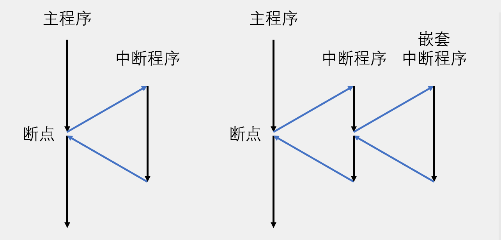
  >至于如何保证中断结束后主程序还在原来位置,这个涉及到汇编和内存布局~(栈,堆等)~和寄存器~(计算机组成原理)~的一些知识,在此不多赘述.
---
>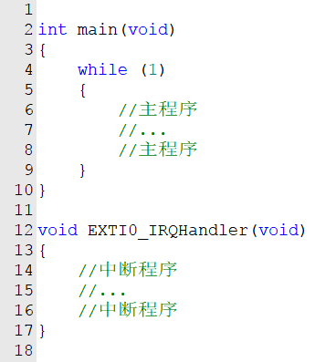
  一般把中断后执行的代码写在一个子函数里, 当中断来临时, **硬件会自动调用**这个函数
  也就是说, 我们**不需要把这个子函数写入主程序**

### STM32中断系统
- **68个可屏蔽中断通道:**
  即,**中断源**
  包含EXTI、TIM、ADC、USART、SPI、I2C、RTC等多个外设,下图是中断向量表:
  ||
  |---|
  |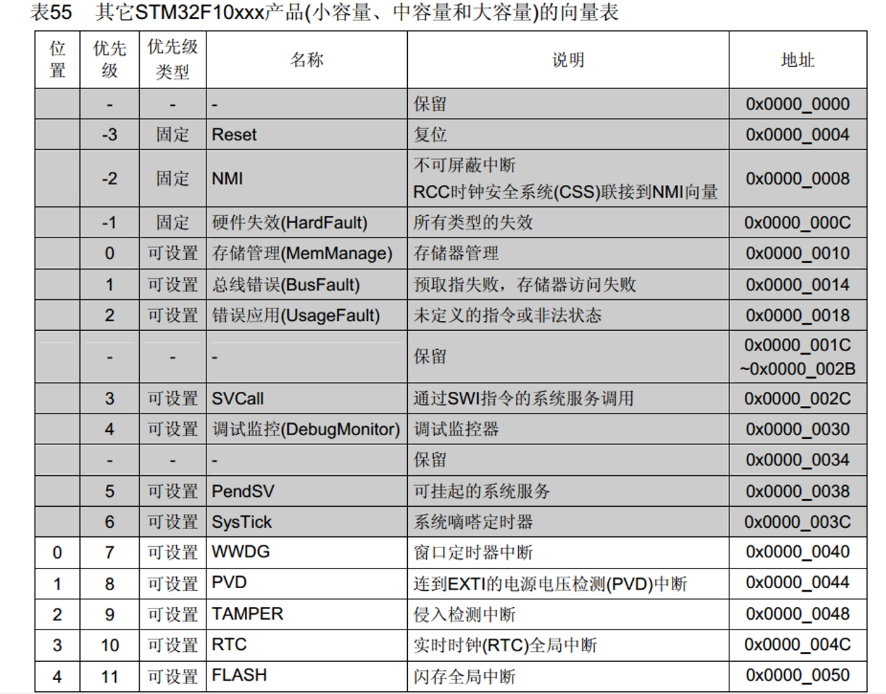|
  |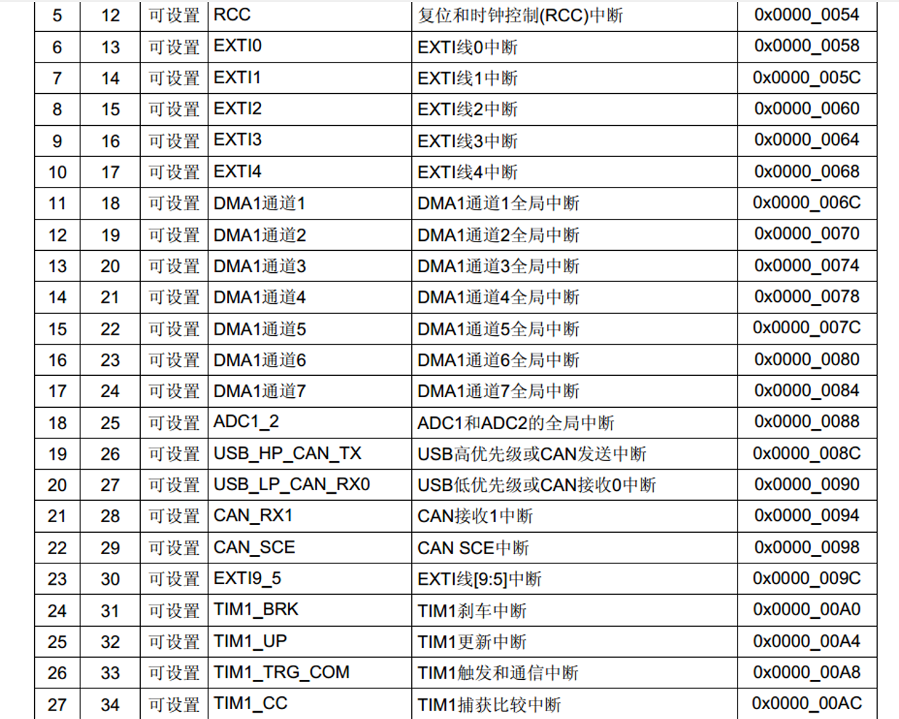|
  |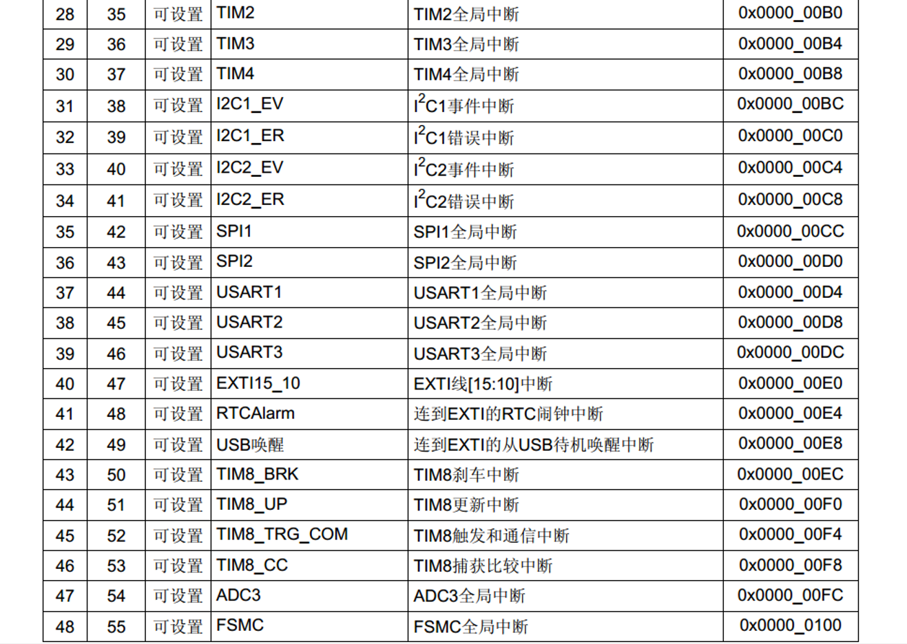|
  |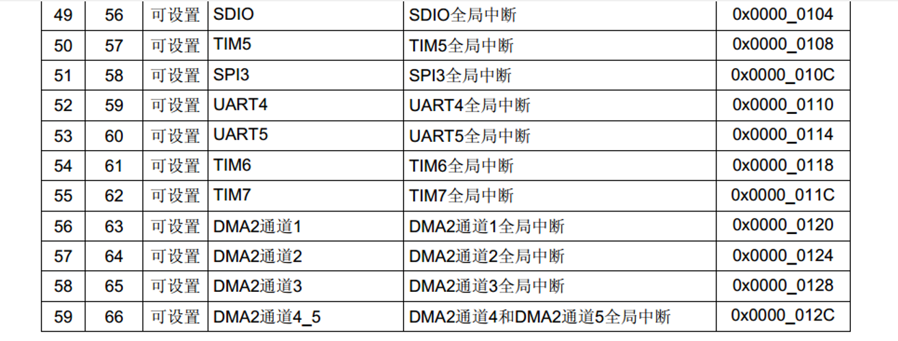|
  >上面的那些灰色背景的，是内核中断~（Core_Interrupt）~。
通常指的是由处理器内核本身产生的中断，比如系统节拍（SysTick）、PendSV、SVCall、NMI（不可屏蔽中断）等。这类中断与外设中断（如 UART、GPIO、定时器等）不同，它们直接**与 CPU 内核架构相关**。  
这些中断由 CPU **内核自动触发**，但是否启用、如何响应，是由你写的程序决定的。

可以控制的内容包括：
- - 使能/禁止某些内核中断
- - 设置中断服务函数（ISR）
- - 修改部分内核中断的优先级
- - 主动触发某些内核中断

不能控制的内容包括：
- - 不能阻止某些强制性异常的发生
- - NMI 一旦发生就无法被普通中断屏蔽
- - 内核中断的编号和基本行为由 ARM 架构规定，不能更改。
  >下面那些白色背景的就是外设中断,

  >STM32中断源极多,几乎每个模块都能申请中断.
  注:68个中断源, 是F1系列最多的中断数量,具体型号可能没这么多,具体以对应型号的数据手册为准.

### NVIC`(Nested Vectored Interrupt Controller)` 嵌套向量中断控制器
~内核外设，其时钟始终打开~
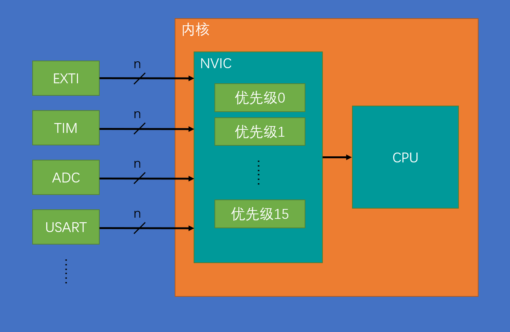
NVIC有很多输入口, 输入那的`n/`是占n条线路的意思;
且只有一个输出口来告诉CPU你现在要处理哪个中断,  NVIC会根据中断优先级进行输出

**嵌套**就是中断嵌套的意思，同时是中断优先级的管理规则
我们来着重讲一下**向量**，这个词..有力量啊....(意味浅)
#### 中断向量
**向量** 即 “有方向的量” ，在这里的隐喻:
这个地址不仅是一个 “数值”，更带有 “执行方向”,
其本质是一个**指向ISR函数的指针** —— 告诉 CPU“中断发生后，**该往哪个地址去执行处理程序**”，指引 CPU 完成中断跳转。

-  那向量怎么告诉CPU是哪个地址的呢?

答案就是上图的**中断向量表**~中断向量的载体~:
MCU~(Microcontroller_Unit,微控制器即单片机)~, 的 Flash 起始位置有一块固定的中断向量表,在汇编启动文件（.s 文件）中定义的。它本质上是一个按中断号顺序排列的**函数地址数组**。当中断源（如外设事件或内核异常）被触发时，CPU 硬件会自动根据中断号查表,寻找对应的中断向量，也就是获取对应的中断服务函数（ISR）入口地址，并直接跳转执行，无需主程序干预。执行完毕后，自动返回主程序断点继续运行。
>芯片厂商提供的启动文件（如 startup_stm32f4xx.s）已经为每个中断预定义了默认的 ISR 函数名,这是**弱符号**。
这些函数默认是空的（或跳转到一个死循环）。
我们不需要手动修改向量表指针，只需在你的 C 文件中**定义同名函数，编译器就会自动“覆盖”默认的弱符号，从而让中断发生时跳转到你写的函数。**
具体就是指针指向弱符号,然后弱符号经编译器管理后指向我们的同名函数.
所以说,我们对ISR函数,不是调用,而是实现；不是靠手动改向量表地址，而是靠链接器自动替换函数入口。

#### 中断优先级
NVIC的中断优先级分为**抢占优先级**和**响应优先级**
抢占优先级高的可以中断嵌套(打断当前执行函数)，响应优先级高的可以优先排队(当前函数执行完后,优先执行)，抢占优先级和响应优先级**均相同的按中断号排队**
这既**保证响应速度**，又**保证中断执行的有序性**。

-  这两个优先级的设置有什么规则呢?
中断优先级由**优先级寄存器**的4位（0~15）决定，**值越小,优先级越高**;
这4位可以进行切分，分为**高n位的抢占优先级和低4-n位的响应优先级**,所以有了以下五种分组方式:
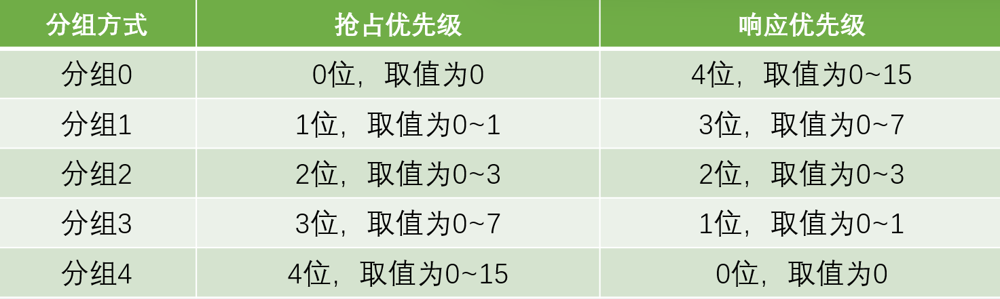
  >注:
  这是整个NVIC共用的,不能这里设置是2组,后面有出现设置3组之类的情况.
  
  .

#### 设计哲学
如果没有NVIC,就需要CPU自己去接入中断源,会引出很多线来适配,设计麻烦;
并且CPU还要自己处理这些中断的优先级和嵌套顺序问题,占算力;
把NVIC与CPU分离,各司其职,不论是运行,还是后期优化调试,效率都高;
**加一层**是这个👍

### EXTI`(Extern Interrupt)` 外部中断
~硬件电路由芯片内部的`始终使能的系统时钟域`驱动，其时钟也始终打开~
#### 硬件模块 + 软件配置 的结合体
**硬件层面（核心）:**
EXTI 是嵌入式芯片（如 STM32 系列）中的一组 **专用硬件电路模块。**
其**直接连接到 GPIO 引脚，可以实时监测电平变化。**
当检测到触发条件时，会向 `NVIC`发送中断请求信号`IRQ`，这是硬件行为。
也就是说：EXTI 是一个真实的硬件外设，存在于芯片内部。

**软件层面（配置与响应）**:
开发者通过 寄存器编程 或 HAL 库来：
**配置GPIO 引脚和 EXTI 通道的连接方式**（如 GPIO_Pin_0 → EXTI_Line0）;
**设置触发方式**（上升沿、下降沿等）;
**启用中断**（使能 EXTI 和 NVIC 中断）;
**写出对应的 中断服务函数**~（ISR）~，比如 EXTI0_IRQHandler();
在中断发生后，CPU 执行这段代码，实现业务逻辑。
也就是说：使用 EXTI 需要写代码进行配置和响应。

#### 功能实现和特点
-    - **设计思路:**
     EXTI可以监测指定GPIO口的电平信号;
     当其指定的GPIO口产生电平变化时，EXTI将立即向NVIC发出中断申请;
     经过NVIC裁决后即可中断CPU主程序，使CPU执行EXTI对应的中断程序.
-    - **支持的触发方式：**
     上升沿/ 下降沿/ 双边沿/ 软件触发(代码直接触发)
     由`寄存器`控制实现。
-    - **支持的GPIO口：**
     所有GPIO口，但**相同的Pin不能同时触发中断**
     粗字的意思是,在不同GPIO端口的同位次引脚里,只能选一个作为中断引脚
     (比如GPIOA_Pin0/GPIOB_Pin0/GPIOC_Pin0里,只能选一位作为中断引脚)
        >即, 数字不一样,字母无所谓.
-    - **通道数：**
     16个GPIO_Pin，外加PVD输出、RTC闹钟、USB唤醒、以太网唤醒
     共20个中断线路.其中,16个GPIO_Pin是主要功能,后面四个通道是为了蹭`EXTI`的某一功能--------从低功耗模式的停止模式下唤醒STM32.因为他们没能力自己唤醒STM32 
        >**通道**是~用来区分同一类外设中,多个独立功能单元的~编号或路径。
        那么**通道数**就是~同一类外设中,多个独立功能单元的~**个数**
-    - **触发响应方式：**
     中断响应/事件响应
        - 中断响应:
        正常流程,上报NVIC然后告知CPU,然后切换执行程序. 
        - 事件中断:
        不再上报NVIC,而是通向其他外设,触发其他外设的操作. 

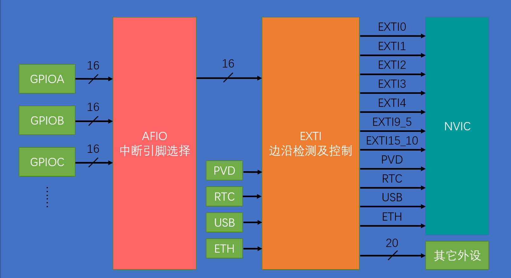
> AFIO是一个数据选择器, 可以选择不同GPIO端口的同位次引脚的其中一个连接到EXTI里, 所以上文说**相同的Pin不能同时触发中断**
> 注: 
> EXTI有20路输入,但对NVIC的输出只有11路, 原因是20路太多啦,占用太多NVIC的通道资源了;
> 所以,就把`EXTI5~9`,`EXTI10_15` 十个输入通道分到了两个输出通道`EXTI9_5`和`EXTI15_10`里.
> 这会产生一个**特性**------`EXTI5~9`,`EXTI10_15`只能触发两个中断函数,但.换言之,**这两个中断函数可以有多个中断源**,这时,我们需要通过标志位来区分是哪个中断源出现

>什么是标志位?
EXTI 控制器内部有一组状态寄存器，用于记录哪些 EXTI 线当前有挂起的中断请求。这个状态就是所谓的“**中断挂起标志位**”（Pending Flag）。

#### 内部框架
- **AFIO**
下图只展示了AFIO相关EXTI的部分结构
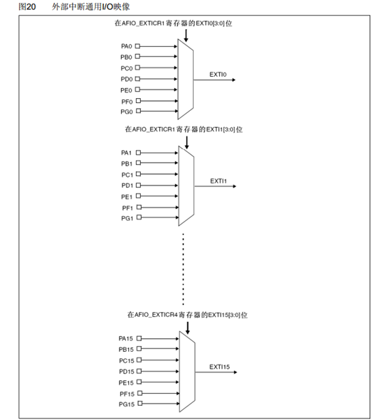
那些梯形就是一系列的数据选择器, 每个数据选择器最终会选择一个输入,并将其输出给`EXTI`;
    - 那我们怎么控制哪一个输入作为输出呢?
大家可以看见框架图里, 每一个数据选择器上头都有一个寄存器,
这意味着,我们**配置相应寄存器的相应位,就可以实现控制输出**.
    - 那AFIO有什么用呢?
详情可跳转[AFIO (Alternate Function Input Output) 复用功能输入输出口](#afio-alternate-function-input-output-复用功能输入输出口)

- `EXTI`
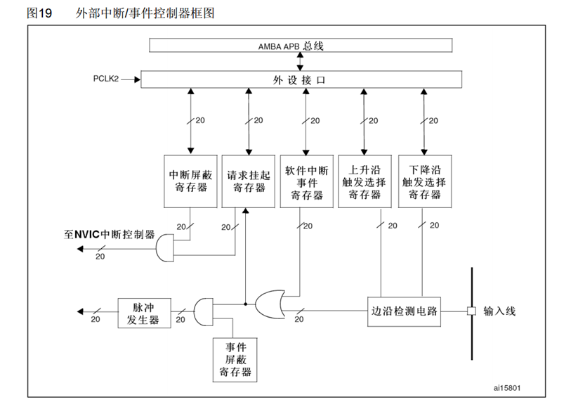
信息量有点大😵我慢慢讲:
- **输入线**（Input Lines）
共 20 根，对应 EXTI0 ～ EXTI19。
输入源可以是 GPIO 引脚、RTC、PVD、USB、CAN 等。
实际上，这些输入线通过 AFIO 模块映射到具体的物理引脚（例如 EXTI0 可来自 PA0、PB0、PC0...）。
  >注意：虽然有 20 条线，但 NVIC 只分配了 16 个中断向量（EXTI0～EXTI15），所以 EXTI16～19 通常用于系统事件（如 PVD、RTC 等）。
.

- **上升沿触发选择寄存器**（Rising Trigger Selection Register）
每位对应一条 EXTI 线（bit0～bit19）。
设置为 1 表示允许上升沿触发中断或事件。
设置为 0 则禁用。
.
- **下降沿触发选择寄存器**（Falling Trigger Selection Register）
类似于 RTSR，但控制下降沿。
设置为 1 表示允许下降沿触发;
设置为 0 则禁用。
.

- **边沿检测电路**（Edge Detection Circuit）
  - **主要功能**:
对每条输入线进行电平变化检测。
  - **支持模式**：
上升沿触发
下降沿触发
双边沿触发（上升+下降）
  - **工作流程：**
输入信号进入边沿检测电路；
当出现边沿电压时,电路结构产生的特殊窄脉冲信号
    >高电平持续一个**总线时钟**周期,且高电平的值取决于**芯片**内部的VCC;
    也就是说**输入信号的频率与输出信号的频率相关,但其高电平占比并无关系**(占空比)

    这个信号会分别和**上升/下降沿触发选择寄存器**作为 AND 门的输入,一起决定输出。
>该电路是**硬件实现，响应速度快，适合实时性要求高的场景。**
   这种自动判断信号变化并且做出相应输出的硬件电路,称为**逻辑电路**, 它自身能量很小(指电压之类的值很小),但是可以通过它的输出去控制一些大功率的电路的开闭,**达到四两拨千斤的效果**.

  .
- **软件中断事件寄存器**（SWIER）
用于软件触发中断或事件。
**写 1 到某一位，就会模拟一次边沿变化**，触发对应的中断或事件。
常用于调试、唤醒、测试等场景。
  >注: 写入后**最好手动清除~后文讲的~请求挂起寄存器（写 1 清零）**，否则对于中断会重复触发，对事件虽然不会，但是留着不如删了好。

  .
- **请求挂起寄存器**（PR - Pending Register）
记录 EXTI 线当前有效的中断请求。
当`边沿检测电路`检测到有效边沿并且触发方式已使能时，下方的线路传来的一个`边沿检测电路`的窄脉冲信号会被此寄存器接收,该位被置 1。
**这是中断是否发生的“中间状态”标志。** 也就是上文提到的**中断挂起标志位**

  >有用到就要`写 1 清零`（Write 1 to clear）机制。否则中断会反复触发！

  .
- - 为什么SWIER不要清除，而PR需要清除呢？
  >原因在于这两个寄存器的类型不同.
   SWIER:
   `只写`寄存器,更确切的说,应该叫`写后无状态`寄存器,其没有记忆功能,内部无法储存信息.更像是一个 “写即触发”的门控信号，写操作直接生成一个内部脉冲，**不经过寄存器存储**。
   PR:
   `可写可读`寄存器, 是一种`状态`寄存器.外来的**高电平**会被寄存器接收并锁存,**直到被内部电路清零**.

  .
- **中断屏蔽寄存器**（IMR - Interrupt Mask Register）
控制是否允许某个 EXTI 线产生中断。
每位对应一条线，1 = 允许中断，0 = 禁止中断。
  >即使 PR 位为 1，如果 IMR 为 0，也不会发送到 NVIC。

  .
- **事件屏蔽寄存器**（EMR - Event Mask Register）
控制是否允许某个 EXTI 线产生事件。
1 = 允许事件，0 = 禁止事件。
  >事件不进入 NVIC，而是用于触发其他外设（如启动 ADC、触发 DMA 等）。

  .
- **脉冲发生器**（Pulse Generator）
实质是上升沿检测器, 若有上升沿,就向左发出一个脉冲.
当 AND 门左端**从非全 1 到 全 1**的时候, 就会生成一个短暂脉冲（通常是 1 个时钟周期）。
输出给其他外设（如 ADC 的触发输入、TIM 的捕获输入等）。
  >这就是“事件”与“中断”的区别：
中断 → 通知 CPU
事件 → 通知其他硬件模块

- **NVIC 中断控制器**
组合逻辑：
PR[i] == 1 且 IMR[i] == 1 → AND 门通过 → 输出到 NVIC
NVIC 会根据优先级决定是否响应。

- **外设接口 & AMBA APB 总线**
    - 所有寄存器（IMR, PR, RTSR, FTSR...）都通过 APB 总线访问。
      - *访问*
    CPU（主程序）执行写/读指令时，通过系统总线结构中的 APB 总线，将数据写入或读取 EXTI、AFIO、GPIO 等外设的寄存器。 
    - 由 PCLK2 提供时钟（APB2 总线时钟）。
  >这是为了使用 EXTI前对 APB2 时钟正常运行的保证.

### 注意事项
- **中断要简短快速**
  不要在中断函数里执行耗时过长的代码.
  因为中断时处理突发事件的, 因为一个突发事件耽误主程序运行太久也是不合理的.
  .
- **最好不要在主函数和中断函数中调用相同的函数或者操作同一个硬件**
  因为单片机只对主程序做现场保护和恢复,**不会对硬件做现场保护和恢复**,导致输出的结果出错,比如输出位置出错~(OLED板)~,输出角度出错~(伺服电机)~.
  >那OLED举例, 如果主程序运行一条OLED输出指令了一半,突然接入中断函数, 那当中断结束时,其光标位置就容易出错:
  >  >未中断时,程序运行到一半, 光标到了A位置;
    中断发生后,指令使光标移动至B位置,中断函数输出完,光标移动至C位置;
    中断结束后,回到主程序,但是继续进行原先执行到一半的指令,**没有复位
    操作**,于是**在C位置后输出接下来的内容.**
    
  >具体细节和CPU内的执行逻辑相关.
  - 所以,在实现中断功能的时候,**可以在中断里操作标志位和中断测得变量内部的计算**;
    而在**返回后在将其与其他变量运算,并反馈到硬件**
    这样,就可以实现主程序和中断函数的融洽分工. 

- **很重要的!!!**,**在中断函数内一定要清除标志位**,不然会困在循环里...
~昨天被坑了2小时掉😭~
   
## TIM(Timer)定时器
作者阵亡...定时器真的好复杂...
### 哲学
把所有模拟输入转化成数字输入;
把大多连续输入转化成独立输入.
>因为定时器内部大多都是逻辑电路,执行逻辑是事件间的对应关系,
 把连续的事件分割开来,变成一次次的脉冲信号, 然后脉冲信号再告诉硬件*来活了*,然后执行指定操作.
### 总概
- **工作原理简介：**
  定时器可以对输入的时钟**进行计数**，并在**计数值达到设定值时触发中断**；
  >  在STM32中, 定时器的基准时钟一般是主频72MHz.
 
  实质上，定时器的主体是一个**边沿触发的计数器**---计数寄存器，它对**信号的指定边沿**~（通常是上升沿）~进行计数。每次检测到一个有效的指定边沿，计数器就加 1~（或减1，取决于工作模式）~。
  >其思想就是----单位时间*计次 = 总时间

  .
- **基本单元**
  有**计数寄存器、预分频器、自动重装寄存器**等时基单元。
  - 计数寄存器:~CouNt_regisTer,即CNT~
    执行计数定时的一个寄存器, 每来一个信号的指定边沿,计数器就加1.
    **定时器的计数核心**.
     .
  - 预分频器(16位):~Prescaler~ ~PSC~
    预分频器的本质也是计数器: 
    预分频器从 0 开始计数，每接收到 1 个输入时钟脉冲，计数值 + 1。
    当计数值**达到 N−1 时，输出 1 个时钟脉冲，同时计数值清零**，重新开始计数。
    **用来控制计数寄存器的计数速度**.
    >注:
    预分频器的值和实际分配系数相差了1;
    在预分频器写入`X`,  `分频后输出频率 = 输入频率/(X+1)`
    .
  - 自动重装寄存器(16位):~Auto-Reload_Register,即ARR~
    我们可以在自动重装寄存器写入一个确定的值, 当计数寄存器**与该值相等**后,
    下一周期就会让**计数寄存器会自动清零**~(即,自动重装)~ ~(轻哼)~
    同时计数寄存器会让 **TIMx_SR 寄存器的相应位置1**~(和EXTI很像)~ ~(轻哼)~
    ~TIMx_SR寄存器前文没出现过,后文有用~
    >0  →  999 → 0(1000) → 2 ...
    **用来控制计数寄存器的计数范围**
    .
  - 
  在72MHz计数时钟下可以实现最大59.65s的定时:
  >(72*10^6^) / (2*^32^)= 59.65.

- **高级功能**
  不仅具备基本的**定时中断**功能，而且还包含**内外时钟源选择、输入捕获、输出比较、编码器接口、主从触发模式**等多种功能
  - 级联
    一个定时器的输出可以当作另一个定时器的输入.
    从而**实现更长的定时时间**.
    >两个定时器相连就是(2*^32^ * 2*^32^) ≈ 8035年,嗯,够用了...

    .
   

### 定时器类型
根据复杂度和应用场景分为了**高级定时器、通用定时器、基本定时器**三种类型

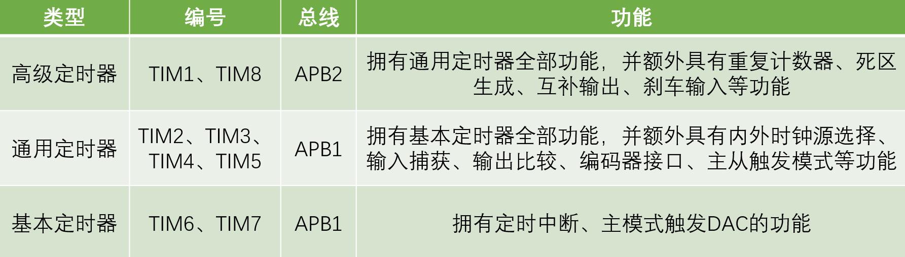
>APB2性能高,一般分给高速外设; APB1性能弱, 一般分给低速外设.
 注:
 STM32F103C8T6定时器资源：TIM1、TIM2、TIM3、TIM4;
 不同型号拥有的定时器数量和品类不同, 上面的编号对应某一品类, 而不是说所有型号的单片机都有相关编号的定时器. 
 所以用之前,要查清楚此类型有哪些编号的定时器.
#### 原理分析
##### 基本定时器:
   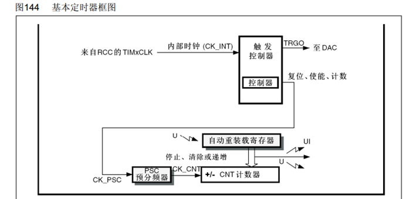
   在`基本定时器`内,  只能选择内部时钟， `控制器`处直接连接内部时钟~(CK_INT)~.
   计数流程:
  ```text
   RCC_TIMxCLK  (72MHz)
      ↓   开启
   CK_INT  
      ↓   连接
   控制器 
      ↓   连接
   预分频器 
      ↓   降低计次速度           设置目标
   计数寄存器                      ←            自动重装寄存器
  ```
- **更新中断**~UIF~:
  计数值等于自动重装值所产生的中断, 叫做`更新中断`, 也就是图中`自动重装寄存器`旁边的`UI`;
  旁边的`U`指的是`更新事件`,~~他指的就是更新中断产生的事件嘛,多简单理解啊~~
  实则不然,在[EXTI功能实现和特点](#功能实现和特点)中提及过,`EXTI`的响应方式除了中断响应,还有事件响应;
  所以这里的事件指的是, **不触发通往CPU的中断, 而是触发内部其他电路的工作.**
  由于定时器是内部外设,所以`更新中断`**不会经过EXTI**,而是直接通往NVIC;
  我们只要再设置好 NVIC 的定时器通道, 就可以实现定时器的中断功能了.
  定时器的中断/事件与[EXTI内部框架](#内部框架)的原理相近.
- **更新事件**~UEV~:
  首先的,CNT计数器达到ARR寄存器设定的目标值后,并且令`TIMx_SR`寄存器的相应位置1,在由
  >两者不是二选一的关系,可以同时发生.
   只要定时器在运行，并且计数完成一个周期，UEV 就会自动发生 —— 这是定时器的基本工作机制。


  .   
- **主模式触发DAC**:
      将定时器的更新事件启用后,**手动让更新事件映射到触发输出TRGO**~(Trigger_Out)~;
      随后让**TRGO连到DAC的触发转换引脚**上,从而实现DAC的触发.
      .
- **影子寄存器**~Shadow_Register~:
    大家可以看见图中的PSC和ARR的框图下方有阴影,这里有一定的含义在().
    其实这是内含影子寄存器的意思. 下面拿PSC举例:
    - 实际上的PSC内含两个寄存器:
      - 预装载寄存器~（preload_register）~
      - 影子寄存器~（shadow_register）~ (**PSC必选**)
       
    - 两者的关系:
    用户写入PSC的值**不会立即生效**，而是暂存在预装载寄存器，**直到发生更新事件~UEV~时**，才将值传送到影子寄存器,并开始影响计数频率。
    >ARR也有影子寄存器,**但是可选,默认不选**,不选就是立刻生效.
    - 目的:
     避免计数过程中的毛刺或非预期周期,如果立即生效：当前计数周期会被打断，产生一个极短的“毛刺”脉冲.
     >这对 PWM、编码器、精确延时等应用至关重要
    - 此更新事件的触发方式:
     
    | 触发方式 | 是否自动加载 PSC 到影子寄存器？ |
    |--------|-------------------------------|
    | 计数器溢出（ARR 匹配） | ✅ 是 |
    | 软件写 `UG` 位（TIMx_EGR.UG = 1） | ✅ 是 |
    | 主模式触发（如 TIM_TRGO） | ✅ 是 |
    | 手动写 PSC 寄存器 | ❌ 否（仅写入预装载寄存器） |
    
    .
    - 特殊情况:
    由于PSC的影子寄存器必选,所以第一次初始化时基单元的时候打包好的**库函数最后手动更新事件**了,此时需要我们在调用函数后手动清除标志位. 

 

#####  通用计时器:
  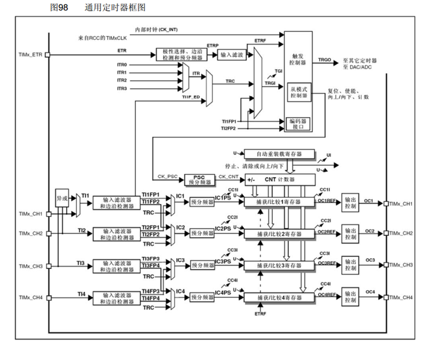
  可以看见,中央部分和基本定时器的结构一致;但多了一些东西
- **计数模式**:
    除了常规的向上计数,增加了**向下计数模式**和**中央对齐模式**.
    如果说, 向上计数,是从0自增到重装值,然后清零并中断;那么,
    向下计数,就是从重装值自减到0,然后调至重装值并中断;
    中央对齐,就是从0自增到重装值,中断;然后从重装值自减到0,中断...循环.
    >中央对齐的优势只在**计数时序和输出波形**的特性 —— **生成对称 PWM 波**;
    这与下文会讲到的`CCR`相关.
    .
- **时钟输入**:
  每个通用定时器的输入时钟选择,除了内部时钟外,还有其他选择: 
  - **外部时钟输入**
    - **TIMx_ETR**
    每个定时器都有一个TIMx_ETR引脚~(一般复用在GPIO引脚上)~ 
    .
    - **边沿检测**
    这个有点意思,和 [EXTI内部框架](#内部框架)的边沿检测电路是一个东西.
    .
    - **极性选择**
    这个和[EXTI内部框架](#内部框架)里的上下边沿触发选择寄存器原理相近;
    都是用来控制边沿检测电路检测上沿还是下沿的.
    .
    - **输入滤波**
      STM32 的输入滤波器是一个 “**连续采样 + 多数一致**” 的数字滤波器：
      - 只有当**频率为 f ,连续 N 次采样**结果都相同，才认为输入信号真正改变了状态。

      由CR1寄存器决定其采样频率,由SMCR寄存器决定其采样次数.
      >输入滤波是一种拿采样精度换采样抗干扰性的手段,面对低频率的信号时就是很好的策略,但对高频率的信号时就会面临严重失真问题.
    
    .
    - **两种输出路径**:
      - `外部时钟模式2` :
        ~为什么先讲2?因为简单....~
        如果想用ETR外部引脚提供时钟, 或者对ETR时钟进行计数,用它就够了;
        .
      - TRGI~(trigger_input)~
        触发输入, 路如其名,可以**触发定时器的从模式**.
        >当然也可以用作普通的外部时钟输入....此时TRGI这一路,就叫做`外部时钟模式1`
        .
  - **ITR 主定时器输入**    
    定时器的TRGO触发输出,可以连接到其他定时器的ITR输入上.然后的过程和TIMx_ETR一样,便不再赘述.
    >需要补充的一点: 如果走`外部时钟模式1`,那这就是**定时器级联**.
    注：每个定时器的ITRx不一定相同.
    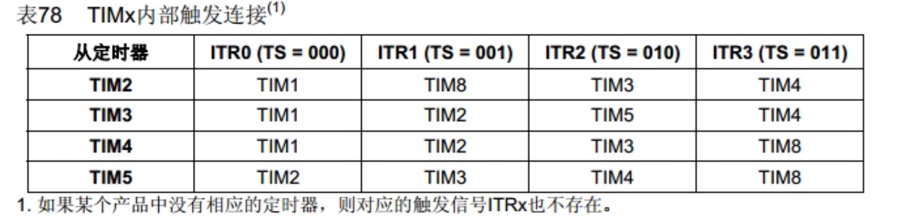

    .
  - 


## Keil5软件使用心得

### 使用库函数的一些方法
#### 头文件,寻声明
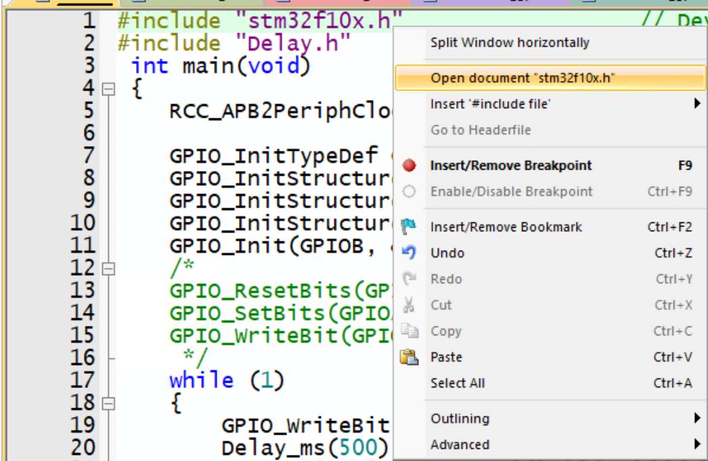
点击头文件,点击 "`open document`", 打开头文件;
你可以在所有的功能前都找到相应注释;
可以在头文件的前大半部分看见一系列的**宏定义`#define`, 以及类型定义`typedef`**,这是对抽象底层信息~(如地址)~的一种封装, 利于后期维护和优化时的理解;
可能在中间穿插几个**条件编译**;
然后可以在最后部分找到一堆**函数声明**;
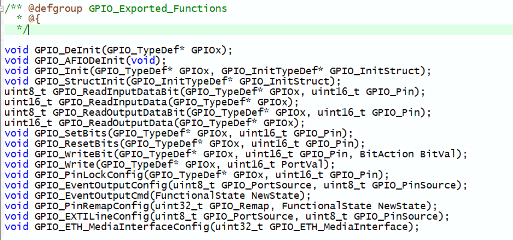
然后点击想用的函数的函数名,右键,点击"Go To Defination Of ";
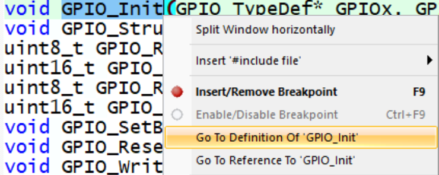

然后就可以跳转到函数实现,通过注释了解函数,参数的含义与取值;
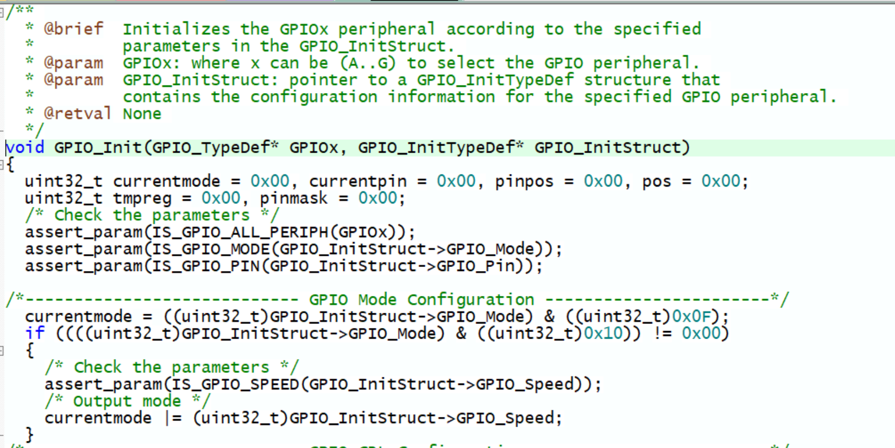

#### 库函数用户手册
可以打开[STM32F103xx固件函数库用户手册](./datum/STM32F103xx固件函数库用户手册.pdf)
这里有所有库函数的介绍和使用方法;

### STM32里的C语言
### C语言数据类型
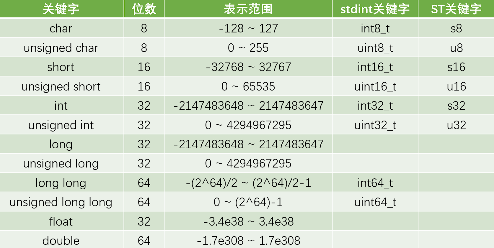
注 : 
在51单片机里`int`是16位的,但是在STM32里`int`是32位的;
右边是`stdint.h`里的类型转换.

### C语言宏定义
用一个字符串代替~(代表)~一个数字，便于理解，防止出错;
提取程序中经常出现的参数，便于快速修改;
`#define GPIOA_0 (0x0001)`
宏定义是预处理阶段的直接文本替换,必须要给替换后的值加括号,不然因为结合律可能出问题.

### C语言类型转换
关键字：typedef
用途：将一个比较长的**变量类型名**换个名字，便于使用
`typedef unsigned char uint8_t;`

### C语言结构体
用途：
数据打包，不同类型变量的集合,结构体让结构更有结构(确信)
其实更有用的是他做实参的能力,**一个结构体里有多个变量,但函数实参只要放一个结构体的`指针`就行了**
定义结构体变量,一般配合类型转换一起使用:
```C
  typedef struct
{
  uint16_t GPIO_Pin;             /*!< Specifies the GPIO pins to be configured.
                                      This parameter can be any value of @ref GPIO_pins_define */

  GPIOSpeed_TypeDef GPIO_Speed;  /*!< Specifies the speed for the selected pins.
                                      This parameter can be a value of @ref GPIOSpeed_TypeDef */

  GPIOMode_TypeDef GPIO_Mode;    /*!< Specifies the operating mode for the selected pins.
                                      This parameter can be a value of @ref GPIOMode_TypeDef */
}GPIO_InitTypeDef;\

GPIO_InitTypeDef GPIO_InitStructure;
GPIO_InitStructure.GPIO_Mode = GPIO_Mode_Out_PP;
GPIO_InitStructure.GPIO_Pin = GPIO_Pin_12;
GPIO_InitStructure.GPIO_Speed = GPIO_Speed_50MHz;
GPIO_Init(GPIOB, &GPIO_InitStructure);
```

### C语言枚举
用途：定义一个取值受限制的整型变量，用于限制变量取值范围；宏定义的集合
定义枚举变量：
```C
  enum{FALSE = 0, TRUE = 1} EnumName;
//   因为枚举变量类型较长，所以通常用typedef更改变量类型名
// 引用枚举成员：
  EnumName = FALSE;
  EnumName = TRUE;
```
这样虽然写的麻烦,但是其代表意义跃然纸上,不易写错
同时,其实枚举变量里的每一个变量都和一个整型数据对应
即, `TRUE == (EnumName) 1`(强制类型转换)

### 调试方式
- **串口调试**：
通过串口通信，将调试信息发送到电脑端，电脑使用串口助手显示调试信息
一般在造PCB板的时候,会在边上留一个`串口通信`的引脚,,把单片机连电脑伤后,就可以通过电脑屏幕打印信息; 调试好后,断开串口,程序就可以正常工作了.
  - 优势: 
   软件强大,可以显示单独参数, 还可以显示曲线、图形、图像等。
   三个字，交互爽。
  - 弊端:
   拖家带口,比较笨重; 且通常的串口助手只能通过信息流的方式呈现数据~一行一行的打印~ ,如果很多不断变化的数据要显示,会刷屏,很...难看
- **显示屏调试**：
直接将显示屏连接到单片机，将调试信息打印在显示屏上
  - 优势:
    对于不断变化的数据,可以覆盖刷新显示;
    显示屏接在单片机上,显示方式直接;
    做复杂的东西,总归会有一个人机交互的界面,这样的话显示屏也能作为产品的一部分;
  - 弊端: 
    屏幕小,显示内容有限,功能不强大;

- **Keil调试模式**：
借助Keil软件的调试模式，可使用单步运行、设置断点、查看寄存器及变量等功能,
魔法棒可以选择硬件仿真或者Keil软件仿真.
  >调试模式一通百通,但是需要一段时间细致的学习.(也就是说,我现在目前还没有)

#### 局部调试方法
- **点灯调试法**
  与`printf调试法`异曲同工.
  在你不确定有没有执行的代码区域放个点灯函数吧:
  亮了就是有运行,说明代码区域内部有坏人;
  没亮就是没运行,说明代码区域外部有坏人;

- **注释调试法**
  加了某一段代码后,程序突然死了啦~ ~(台湾音)~,可以通过对新增代码分批次注释运行,观察哪几次程序能运行,那就是哪个部分处了问题.

- **对照法**
  找一个没问题的程序,分析他的程序和你的程序的逻辑,步步替换逻辑

- **求援法**
  当然是呼叫AI大人啦 😆👆

#### 核心思想
缩小范围、控制变量、对比测试


## STM32外设及其电路
### LED 和 蜂鸣器
#### 基础常识
- LED：发光二极管，正向通电点亮，反向通电不亮
没剪过的LED中,长脚是正极,短脚是负极;也可以看LED内部,较小一半是正极,较大一半是负极
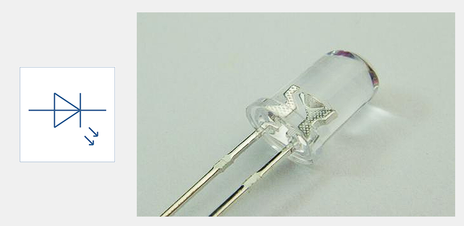
- 有源蜂鸣器：内部**自带振荡源**，将正负极接上**直流电压**即**可持续发声，频率固定**
VCC接正极,GND(ground)接负极
中间引脚接低电平,蜂鸣器就响,接高电平,蜂鸣器就关闭

- 无源蜂鸣器：内部**不带振荡源**，需要控制器**提供振荡脉冲才可发声**，**调整**提供振荡脉冲的**频率**，**可发出不同频率的声音**

#### 硬件电路~(电阻R1防止电流过大,还能调节功率)~
- **LED**
低电平触发
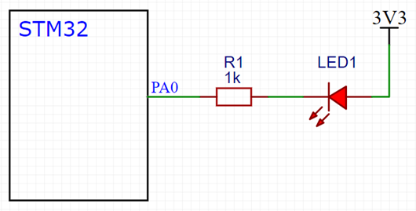
由二极管特性和电压高低决定,懂得都懂

---
高电平触发
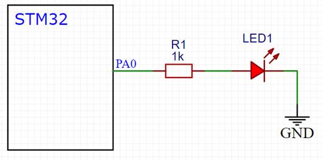
一般选第一种`低电平驱动`,因为很多单片机和芯片都使用的是高电平弱驱动,低电平强驱动的模式~(比如开漏输出,此时高电平无用)~

- **蜂鸣器**
使用了三极管开关的驱动方案
对于功率大一点的外设,如果直接用IO口驱动会导致STM32负担过重.这时就可以用一个三极管驱动电路来完成驱动,这里要先介绍一下三极管:
##### 三极管
三极管（晶体管）是电子电路中最基础、最重要的半导体器件之一，主要用于**放大信号**和**开关控制**
- **三极管的类型**

| 类型 | 全称 | 结构 | 符号特点 |
|------|------|------|--------|
| NPN | N-P-N 型 | 两层 N 型夹一层 P 型 | 箭头向外（从基极指向发射极） |
| PNP | P-N-P 型 | 两层 P 型夹一层 N 型 | 箭头向内（发射极指向基极） |
>箭头就是 发射极电流 IE 的方向.

| 类型 | 掺杂元素 | 多数载流子 | 特点 |
|:------:|--------|-----------|------|
| N 型 | 磷（P）、砷（As）等（5价元素） | 电子（负电荷） | “N” = Negative（负） |
| P 型 | 硼（B）等（3价元素） | 空穴（等效正电荷） | “P” = Positive（正） |
|N 型：多出自由电子 → 导电靠 电子流动|
|P 型：缺少电子（形成“空穴”）→ 导电靠 空穴移动|

| 对比项 | NPN | PNP |
|-------|-----|-----|
| 控制逻辑 | GPIO 高电平 → 导通 | GPIO 低电平 → 导通 |
| 接法 | 负载接 Vcc → C，E 接 GND | 负载接 E，C 接 GND |
| 常用场景 | 低边开关（Low-side switch） | 高边开关（High-side switch） |
PNP:
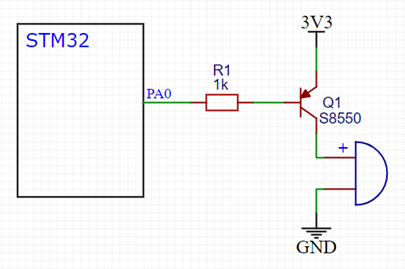
NPN:
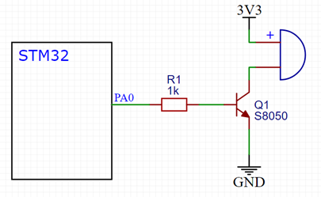
- **三个引脚**
以NPN举例

| 引脚 | 英文 | 作用 |
|:----:|-----|------|
| B | Base（基极） | 控制端：小电流输入，控制大电流 |
| C | Collector（集电极） | 接电源正（负载端） |
| E | Emitter（发射~(载流子)~极） | 接地（GND） |
|口诀： “基极控流，集电进，发射出~(载流子)~”|

- **工作原理**
  - **核心思想**
用小电流（IB）控制大电流（IC）
满足关系：IC = β × IB
（β 是电流放大倍数，典型值 50～300）
  - **工作状态**(以NPN举例----**无能的基极**)
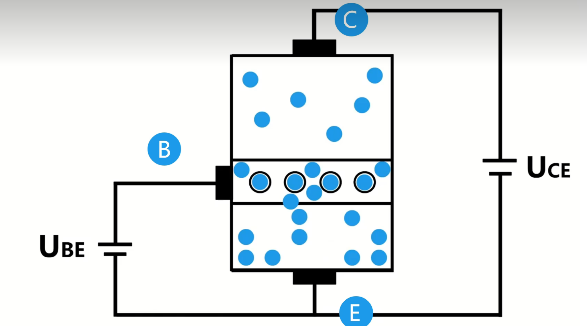
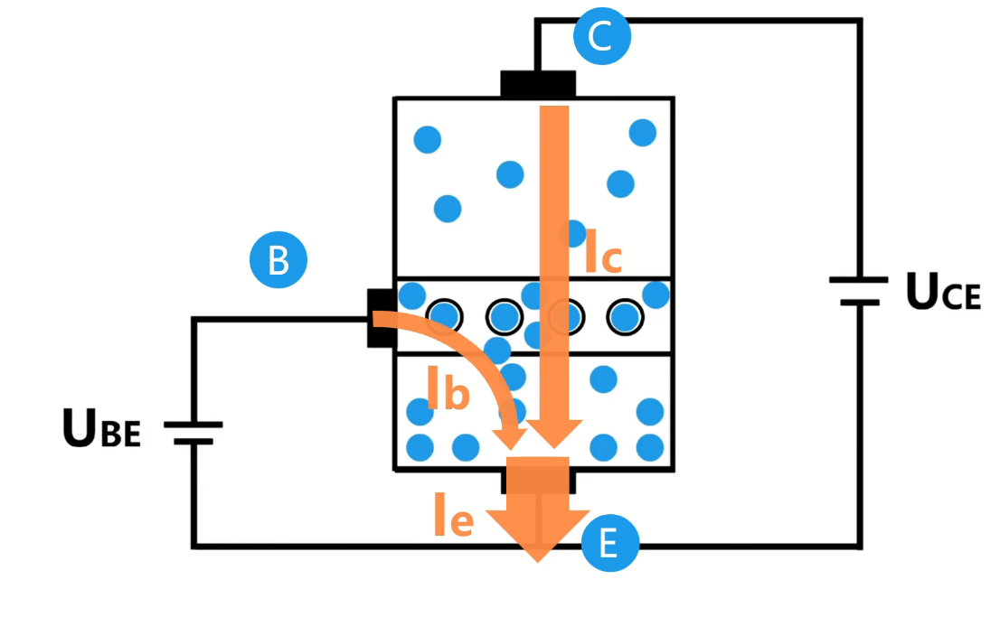
未通电时,E富集电子,B较多空穴.
B E之间开始有电压后, 空穴被电子占据(进入空穴,意味着将要流向B区);
V<sub>BE</sub>随着越来越大,空穴容纳不下所有的电子.
此时V<sub>CE</sub>开始有了电压,促使基极区的多余电子跑到了集电极去,使得CE间也有了电流,此时,B区的电流是IB,  C区的电流是IC, E区的电流是(IB+IC).

| 状态 | 条件（NPN） | 特点 | 应用 |
|------|-------------|------|------|
| 截止区 | V<sub>BE</sub> < 0.7V | IB ≈ 0，IC ≈ 0 → 关断 | 开关“断开” |
| 放大区 | V<sub>BE</sub> ≈ 0.7V，V<sub>CE</sub> > V<sub>BE</sub> | IC = β·IB，线性放大 | 音频放大、传感器信号放大 |
| 饱和区 | V<sub>BE</sub> ≈ 0.7V，V<sub>CE</sub> ≈ 0.2V | IC 不再随 IB 增大 → 完全导通 | 开关“闭合” |
>截止区 : 电压太小,BE间无法导通,所以IB ≈ 0，IC ≈ 0
放大区 : BE间导通,但空穴未被完全占满,此时由于概率关系,在空穴里的电子和未在空穴里的电子比例是恒定的.所以会说`IC = β × IB`
饱和区 : B区空穴被占满,不管多余电子全走CE电路,线性关系打破

>数字电路中，三极管只工作在 截止（0） 和 饱和（1） 两种状态，当作电子开关用。
- - 设计哲学
CE端之间隔着一层薄薄的B区,但是就是因此可望不可及;
当B区和E区开始载流子的交流后, E区的载流子才能偷偷流到B区去
真是对苦命鸳鸯!

---

这个图里,是PNP三极管的驱动电路,
基极给低电平导通,高电平断开

---

这个图里,是NPN三极管的驱动电路,
基极给高电平导通,低电平断开

### 面包板
面包板正面:
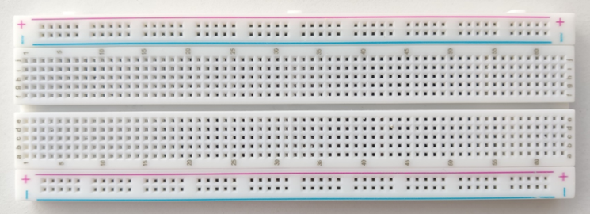
面包板背面:
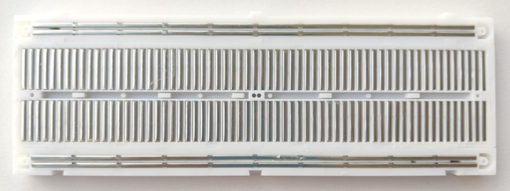
面包板的上下各两行是电源线,每行的线路连通;
面包板的中间部分,每列5个孔通过金属爪连通.想实现外设通电,就将电源行上的孔连到中间列的孔上去
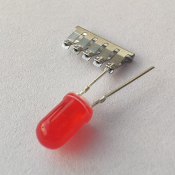

---
### 按键
常见的输入设备，按下则两引脚导通，松手则两引脚断开
#### 按键抖动：
由于按键内部使用的是**机械式弹簧片**来进行通断的，所以在*按下和松手的瞬间*会伴随**有一连串的抖动**

|||
|---|---|
|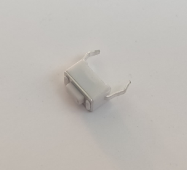|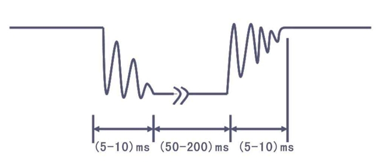|
||假设按键没按下时是高电平，按下是低电平;|
||在没有任何消抖措施的情况下每次高到低的跳变~(下降沿)~都会被记作一次触发|

##### 不良影响
那可以看见，在按下和松手的(5-10ms)均出现了电平的抖动.对人而言比较快;
但是对高速运转的单片机而言,是很漫长的,*每一次电平变化单片机都能接收到,所以会出现,我们**按一次按钮**,单片机出现**多次反馈**的情况.*,这有很多负面影响 :
- 误触发 :
抖动会使一个物理按键按下被识别为多次按下。
例如：你只按了一次按钮，但程序却执行了 3 次操作,导致单片机控制的 LED 切换状态异常（如计数器加了 3，而不是 1）。

- 状态机逻辑混乱 :
如果系统使用有限状态机（FSM），一次抖动可能让状态机错误地跳转多次。
例如：从“待机” → “运行” → “暂停” → “停止”，本应只进入“运行”，却因抖动直接跳到“停止”。

- 中断服务程序（ISR）被频繁触发 :
若按键连接到外部中断引脚，抖动会在几毫秒内产生多个上升/下降沿，导致 ISR 被反复调用。
后果：
系统负载突增
主程序被频繁打断
可能丢失其他重要中断
在极端情况下引发堆栈溢出或看门狗复位

- 计数或测量误差
在需要精确计数的场合（如转速传感器、脉冲计数器），抖动会引入**虚假脉冲**，导致数据严重失真。
例如：流量计、编码器、频率计等对边沿敏感的设备。

- 通信协议干扰
  如果按键信号被误当作通信信号（如通过 GPIO 模拟 UART 或 SPI），抖动可能被解析为错误的数据帧，导致通信失败。

##### 解决方法--过滤消抖 :
- - **硬件消抖** :
- RC 低通滤波 + 施密特触发器 :
  在开关输出端加一个 **RC 电路**（电阻+电容），构成低通滤波器，**滤除高频抖动脉冲**。
后接 **施密特触发器**，将缓慢变化的模拟信号**整形为干净的数字电平**，避免中间电平导致逻辑错误。
优点：无需 CPU 资源，响应快
缺点：增加硬件成本和 PCB 面积
- 使用专用消抖芯片
- - **软件消抖** :
- 延时检测法~最简单~ : 
```C
if (read_button() == PRESSED) {  //读取当前按键的电平状态
    delay_ms(10);               // 等待抖动结束（通常 5～20ms）
    if (read_button() == PRESSED) { //再次读取当前按键的电平状态
        // 确认按键有效
        handle_keypress();          //执行下一步操作
    }
}
```
简单直观, 但阻塞式，影响主程序运行
- 定时采样 + 状态机 ~推荐~ :
**核心思想：**
只在按键状态真正稳定且从未被处理过时，才执行一次操作
**工作步骤:**
使用定时器（如每 5ms 采样一次）读取按键状态。
连续 N 次（如 3～5 次）采样结果一致，才认为状态有效。
以下是arduino的部分代码,stm32库函数开发的版本太长了,这里先看设计哲学 :
```C
// 伪代码示例
static uint8_t button_state = 0; //记录“当前按键是否已经被确认按下并处理过” 
//  ↓                               `0`--`否`;    `1`--`是`
// 保证变量在函数多次调用之间保持值（不会每次重置为 0）
static uint8_t stable_count = 0;//记录当前状态连续被采样到的次数

void check_button() {
    uint8_t current = read_button();
    if (current == button_state) 
    {//这个判断语句就相当于一个采样计数器
        if (stable_count < 5) 
          stable_count++;
    } 
    else 
    {
        stable_count = 0;
        button_state = current;
    }

    if (stable_count == 5 && button_state == PRESSED) 
    {   //这个判断语句相当于状态机
        //必须累计5次并且按钮状态是 `pressed`,才触发一次有效事件
        on_button_pressed();
        stable_count = 0; // 避免重复触发（可选）
    }
}
```
非阻塞、可靠、可扩展
支持**长按、双击**等复杂逻辑
这段代码里用的是电平触发,但更好的方法是边沿触发
- - **其他高级方法** : ~先简单了解,后续再次进行补充~
- 计数器法 / 边沿检测法 :
检测电平变化后启动计时器，在固定时间窗口内忽略后续变化。
或使用“边沿触发 + 软件锁”机制。
- 卡尔曼滤波 / 中值滤波：一般用于模拟信号噪声，不适用于数字开关抖动。
- FPGA 实现状态机消抖：在高速或并行处理场景中使用。

#### 使用方法
|||
|:---:|:---:|
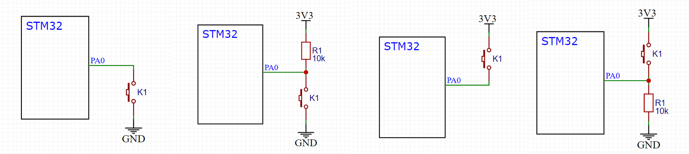
|前两种是下接法|后面两种是上接法|
|一般使用前两种,是电路设计的规范;||
|而且,使用第一种,必须要求引脚是`上拉输入`,防止引脚电压不确定||

### 传感器
- 类型:
光敏电阻传感器
热敏电阻传感器
对射式红外传感器
反射式红外传感器
- 工作原理: 
传感器模块：传感器元件的电阻会随外界模拟量的变化而变化，通过与定值电阻分压即可得到模拟电压输出，再通过电压比较器**进行二值化**即可得到数字电压输出

||
|---|
||
|图中的Rx是定值电阻,   Cx是滤波电容,  Nx是敏感电阻,   其余勿复言尔|
|定值电阻和敏感电阻形成简易分压电路; 滤波电容可以给电压输出进行滤波,使之波形平滑.
#### 滤波电容
用于平滑电压,从而抑制噪声、稳定电源或信号;
一般一边接地,一边接电路中,可以将高频交流电流导向GND,只留稳定的直流电.
所以一般就是保证电路稳定用的,日常分析可以去除.
- 工作原理 :
对于电容而言,
  - 直流电：
   电容充电完成后相当于电阻无穷大/开路。
结果就是,在电容所在路线阻断了直流
  - 交流电 (常出现在纹波 / 噪声): 
   频率`𝑓`越高 或 电容`𝐶`越大，容抗越小 → 高频信号更容易“通过”电容到地。

#### 电路组成
||||||
|:---:|---:|:---:|:---|:---:|
|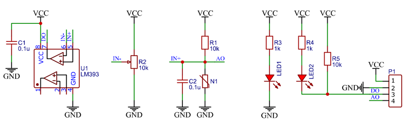|
|U1| U2 |U3|U4|     U5|
|LM393 比较器核心电路|IN- 参考电压与保护电路|IN+ 输入端电路/ AO 输出电路|LED1 电源指示灯|LED2 和 P1 排针输出电路|
|核心比较器，输出数字信号 DO|正输入端（参考电压）生成与保护|负输入端（待测信号）输入接口|电源状态指示（常亮）|DO端状态指示（低电平常亮，也就是光强大时常亮） + 外部接口|

看图方法是这样的:
前面的图都是最后一张图的黑匣子(P1)的内部部分电路;
而最后一张图,是此元件引脚的外部接法.


##### 内部电路
###### LM393 比较器核心电路~(实现二值化的最大功臣)~
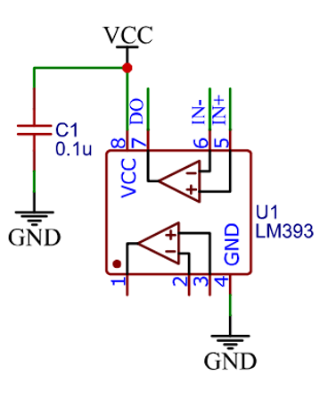
实质是  双路电压比较器（两个独立比较器）
| 引脚 | 功能 |
|------|------|
| 8 (VCC) | 电源正极（2.7V～36V） |
| 4 (GND) | 接地 |
| 5 (IN+) | 正输入端（参考电压或信号） |
| 6 (IN-) | 负输入端（待测信号） |
| 7 (DO) | 数字输出（OUT） |
| 1,2,3 | 第二路比较器（本电路未使用） |
|这个例子里的IN+ IN-作用似乎反了,但原理一样||
- 电压比较器(运算放大器)
**每个比较器有：**
同相输入端/正输入端（IN+）
反相输入端/负输入端（IN-）
输出端(DO)~其实和DO没什么关系,只是这里输出作为数字输出,所以叫DO~
**输出逻辑：**
如果 IN+ > IN- → 输出 8号引脚(接VCC)（内部晶体管导通到 VCC）
如果 IN+ < IN- → 输出 4号引脚(接GND)（内部晶体管导通到 GND）

###### IN- 参考电压与保护电路
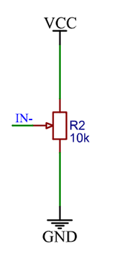
连接一个分压电路,可以调整滑片从而改变参考电压(即IN-的电平)

###### IN+ 输入端电路/ AO 输出电路
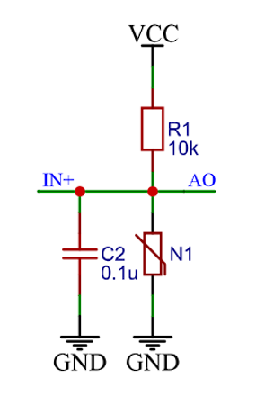
因为N1和R1 的分压, 得到红点处电压(即IN+和AO的电平)

###### LED1 电源指示灯
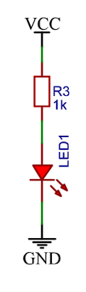
这个电路与AO/DO无关，单纯接上VCC和GND，检测外接的VCC和GND是否故障

##### 外部电路
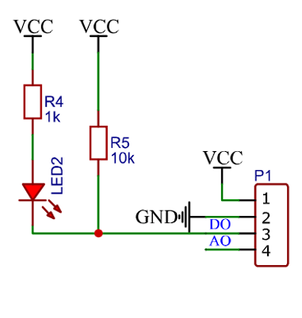
######  P1 排针
P1代表的就是传感器元件及其引脚(接口)
内部电路的所有VCC和GND就是这里接入的
内部电路的AO/DO 就是在这里输出的

###### LED2
这个电路通过**LED2的发亮与否**.就可以判断**DO端的输出值**, 进而判断某一**环境变量是否超过阈值**;
而那个上拉电阻是为了保证**无输出情况下,DO端的电平是VCC**

#### 使用方法

具体使用已经在电路组成那一块说明了,便不再赘述.


### OLED ：
#### 简介
OLED（Organic Light Emitting Diode）：有机发光二极管
OLED显示屏：性能优异的新型显示屏，具有**功耗低、相应速度快、宽视角、轻薄柔韧**等特点
0.96寸OLED模块：小巧玲珑、占用接口少、简单易用，是电子设计中非常常见的显示屏模块
供电：3~5.5V，
通信协议：I^2^C/SPI，
分辨率：128*64
||
|:---:|
|**实物图**|
|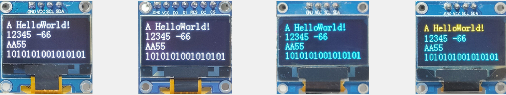|
|其中,四针脚用的是 I^2^C 通信协议;七针脚用的是 SPI 通信协议.|
|**屏幕坐标图**|
|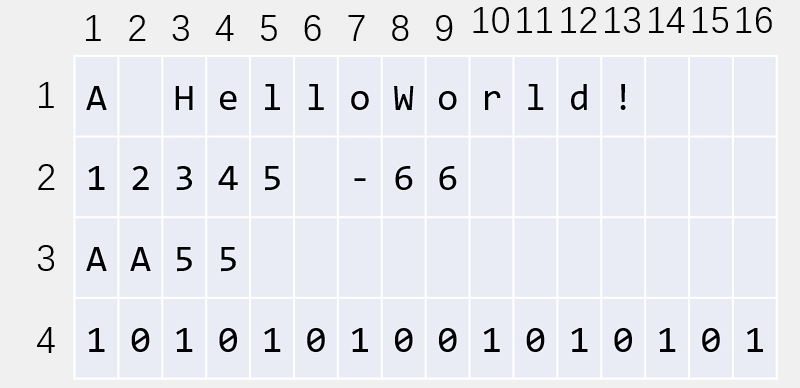|
|4*16|

#### 针脚接法
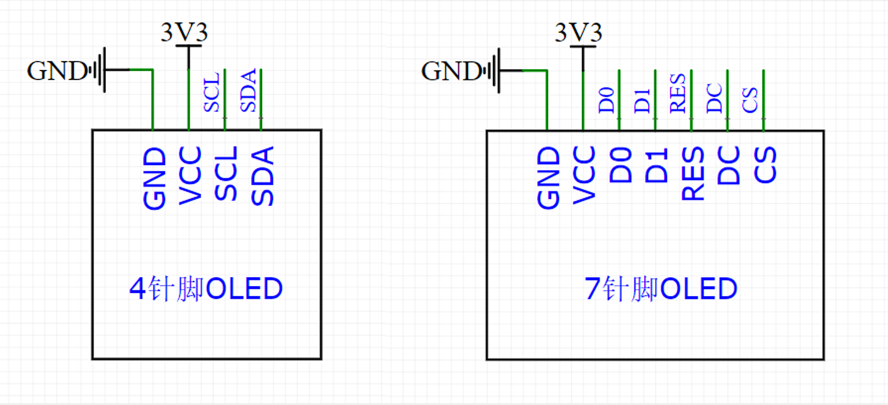
- 四针脚OLED
SCL和SDA都是I^2^C的通信引脚,需要接在单片机的I^2^C的通信引脚上,
但是可以通过驱动函数模块,用GPIO口模拟I^2^C通信;

- 七针脚OLED
剩下五个都是SPI的通信引脚,需要接在单片机的SPI的通信引脚上,
但是可以通过驱动函数模块,用GPIO口模拟SPI通信;

### 旋转编码器
**用来测量位置、速度或旋转方向**的装置，当其旋转轴旋转时，其输出端可以输出**与旋转速度和方向对应的方波**信号，读取方波信号的频率和相位信息即可得知旋转轴的速度和方向
- 类型：光栅式/机械触点式/霍尔传感器式
  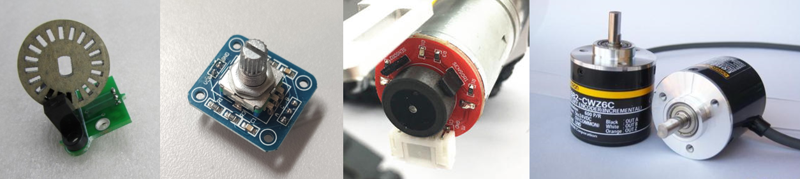

#### 测速原理
- 第一张图---**光栅式编码器**
    ~属于增量式编码器~
    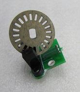
    最简单的编码器样式，主要由`对射式红外传感器`和`光栅编码盘`构成.
    **工作原理:**
    当光栅编码盘转动的时候, 红外传感器也就会发射高低电平交替的方波.
    方波个数可以代表转过的角度值, 方波的频率从而可以表示转速. 
    我们可以通过设置外部中断, 来捕获边沿, 从而测量位置和速度.
    >缺点: 
    不能测量旋转方向.

    .
- 第二张图---**机械触点式编码器**
  ~属于增量式编码器~
  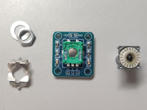
  **主要组成 :**
  - 中央绿色电路板模块：
五个引脚：VCC、GND、C（开关信号输出）、A/B(旋转信号输出)
绿色部分左右两侧是各有三个金属触点,通过电平变化传递旋转和开关信息;  而中间圆的金属圆片是个按键,内置弹簧~(动件是电刷,静件是触点)~
**所有触点连接上拉电阻**
    .
  - 右侧的小型白色旋转部件：
    是编码器的独立旋转头，底部和电路板结合部分带有内外共三圈电刷结构.
    >其实没有所谓的金属圈电刷,有的只是一层金属实心薄片, 其上方有一个部分镂空的塑料片.
    其中,外圈/中圈被覆其上的塑料部分遮挡,分成一段段的扇形;
    而内圈无塑料遮挡,是完整的圈.

    **所有金属片连接GND**
    .
  - 右边是固定器件,便不多展开描述

  **工作原理:**
  我们放大来看:
  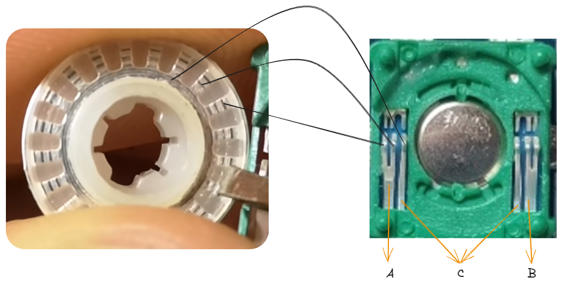
  三个电刷金属圈和左边三个金属弹簧触点的对应关系如上(右边同理);
  六个金属弹簧触点和A/C/B引脚的关系也如上;
  如下,是电路图:
  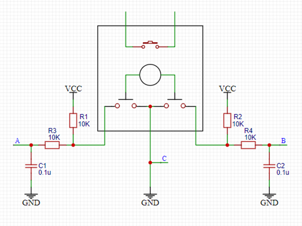
    - **旋转测速功能**
      由前文的概述,我们可以得知,我们通过旋转产生的方波电平信号,从而推断转速.
      这里也同理,拿隶属A引脚的两个触点举例:
      触点在旋转时,
      可能**接触塑料**,因为触点连接上拉电阻,**A引脚呈高电平**;
      可能**接触金属片**,此时**A引脚呈低电平**;
      从而产生方波状的电平信号
      那现在会有三个问题:
      - 测速有一个触点就行,为什么设计时采用了分叉的两个触点呢?
        其实是为了保证稳定性, 采用了两个触点的设计形式,这样确保了如果其中一个触点失灵,整个器件仍然可以正常工作.
        .
      - 测速有一个A引脚就够了,为什么设计时采用了A/B双引脚的形式呢?
        前一句是对的, 测速有一个A引脚就够了.
        **B引脚的作用其实是判断旋转方向**:
        废话不多说,上图(excalidarw真好用😋)
        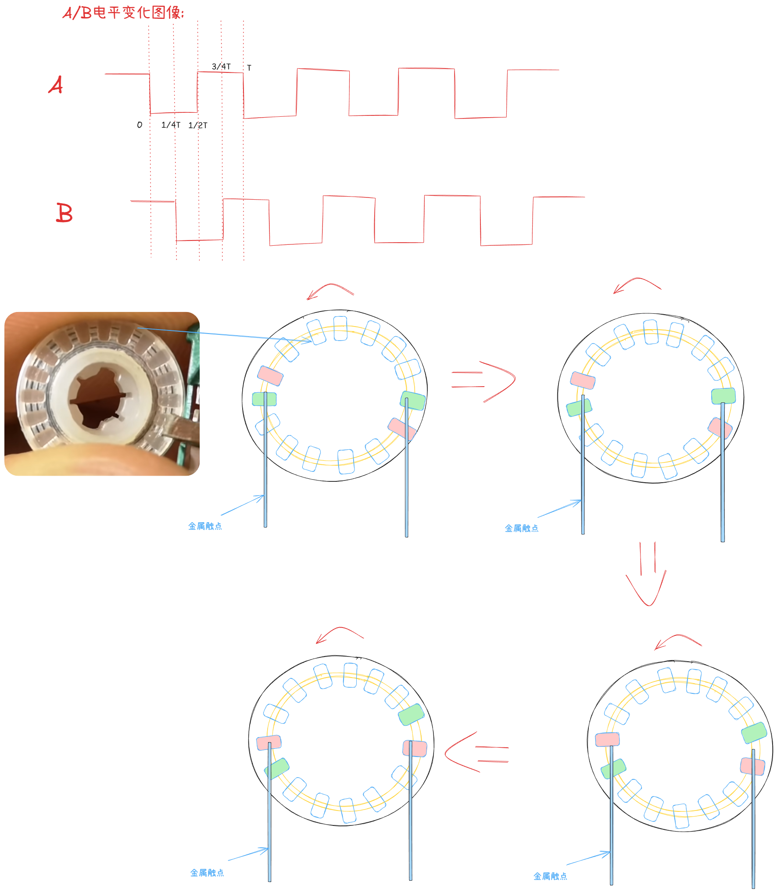
        >由于该码盘中塑料块的个数和角度设计,保证了A/B的电平变化图像相位差始终在90°.
        因此,这种编码器也叫正交输出的编码器
        
        当A边沿变化后,会检测A/B的电平:
        若电平不同,则逆时针;
        若电平相同.则顺时针;
        ~(具体情况和结构相关)~
        .
      - 靠北,那为什么还有C引脚啊?!!
        首先,我们知道**金属片电刷与GND相连**,那大家有没有想过,他们是如何相连的呢?
        其实最大功臣就是我们的C引脚:
        >**在PCB板的背面,GND与C引脚相连**, 同时C引脚相连的两个金属弹簧触点与无塑料遮挡的内圈相接触-----从而一整个金属片都是GND电平.
      .

    - 按压确认功能 
    ~(疑似没有这个功能，按键按下不会产生任何反应)~
      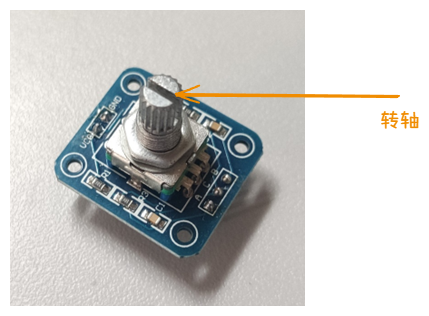
- 第三张图---**霍尔传感器式编码器**
  ~一般直接附在电机后面~
  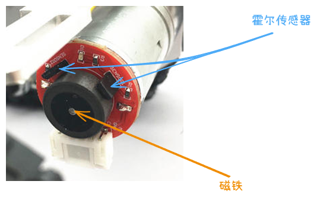
  **主要组成:**
  红色PCB板：安装在电机轴端
  中间的圆柱体：是电机转子的一部分，**上面嵌有一个磁铁**
  霍尔传感器：静止不动，相差90°地安装在PCB上，用于感应磁场变化
  .
  **工作原理**
  每个霍尔传感器会检测到经过它上方的磁极极性（N/S）。
  当 N 极靠近传感器 → 输出 低电平
  当 S 极靠近传感器 → 输出相反电平
  >具体的输出电平取决于设计
  和机械触点式的编码器一样,也属于正交输出的编码器
  不再赘述.
  
  .

- 第四张图---**独立编码器元件**
  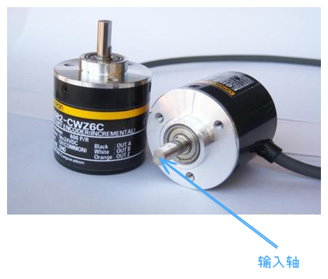
  可以塞入电机内,然后测速,比较精细.
  虽然似乎是光电式的,但工作原理与前两个大差不大

#### 用途
第二张图的机械触点式的旋转编码器,**作交互类功能**,比如调节音量之类的功能
其余的旋转编码器,非接触的形式, 可以与其他元件一同封装,用于电机测速等.
