# stm32硬件与keil5软件的学习笔记
本笔记关于代码方面的内容，少涉及纯代码实现，更多的注重官方代码的规范性和结构特征。
温馨提示：此笔记与 江协科技的[STM32入门教程-2023版 细致讲解 中文字幕](https://www.bilibili.com/video/BV1th411z7sn/)一同食用，口感更佳。
## 目录
- [stm32硬件与keil5软件的学习笔记](#stm32硬件与keil5软件的学习笔记)
  - [目录](#目录)
  - [STM32总体情况](#stm32总体情况)
    - [STM32片上资源及其外设一览](#stm32片上资源及其外设一览)
    - [命名规则](#命名规则)
    - [系统结构](#系统结构)
    - [引脚定义](#引脚定义)
    - [引脚启动模式](#引脚启动模式)
    - [常见电子模块结构](#常见电子模块结构)
  - [GPIO（General Purpose Input Output）通用输入输出口](#gpiogeneral-purpose-input-output通用输入输出口)
    - [基本结构](#基本结构)
    - [位结构](#位结构)
      - [输入部分](#输入部分)
      - [输出部分](#输出部分)
    - [GPIO模式](#gpio模式)
    - [GPIO配置寄存器](#gpio配置寄存器)
      - [端口配置低/高寄存器](#端口配置低高寄存器)
      - [端口输入输出数据寄存器](#端口输入输出数据寄存器)
      - [端口位设置/清除寄存器`(Port Bit Set/Reset Register)`](#端口位设置清除寄存器port-bit-setreset-register)
      - [端口配置锁定寄存器`(Port Configuration Lock Register)`](#端口配置锁定寄存器port-configuration-lock-register)
        - [实例: *锁定 PA0 引脚的配置*](#实例-锁定-pa0-引脚的配置)
        - [实例: *封装成函数*](#实例-封装成函数)
  - [AFIO (Alternate Function Input Output) 复用功能输入输出口](#afio-alternate-function-input-output-复用功能输入输出口)
    - [核心功能](#核心功能)
      - [外设引脚重映射（Pin Remapping）](#外设引脚重映射pin-remapping)
      - [外部中断（EXTI）输入源选择](#外部中断exti输入源选择)
    - [关键寄存器](#关键寄存器)
    - [注意事项](#注意事项)
  - [时钟](#时钟)
    - [时钟周期](#时钟周期)
    - [同步系统](#同步系统)
    - [在不同功能模块的具体表现](#在不同功能模块的具体表现)
      - [CPU](#cpu)
      - [外设](#外设)
        - [无能的同频](#无能的同频)
        - [时钟树](#时钟树)
          - [根--时钟源](#根--时钟源)
          - [主干 -- 系统时钟 (SYSCLK)](#主干----系统时钟-sysclk)
          - [分支 -- 总线时钟分频器（Prescalers）](#分支----总线时钟分频器prescalers)
          - [叶子 -- 外设时钟使能（Clock Enable）](#叶子----外设时钟使能clock-enable)
          - [“另一棵树” -- RTC 与独立时钟域](#另一棵树----rtc-与独立时钟域)
          - [可视化：STM32F103 时钟树简化图](#可视化stm32f103-时钟树简化图)
    - [设计哲学](#设计哲学)
  - [中断系统](#中断系统)
    - [基础概念](#基础概念)
    - [STM32中断系统](#stm32中断系统)
    - [NVIC`(Nested Vectored Interrupt Controller)` 嵌套向量中断控制器](#nvicnested-vectored-interrupt-controller-嵌套向量中断控制器)
      - [中断向量](#中断向量)
      - [中断优先级](#中断优先级)
      - [设计哲学](#设计哲学-1)
    - [EXTI`(Extern Interrupt)` 外部中断](#extiextern-interrupt-外部中断)
      - [硬件模块 + 软件配置 的结合体](#硬件模块--软件配置-的结合体)
      - [功能实现和特点](#功能实现和特点)
      - [内部框架](#内部框架)
    - [注意事项](#注意事项-1)
  - [TIM(Timer)定时器](#timtimer定时器)
    - [哲学](#哲学)
    - [总概](#总概)
    - [定时器类型](#定时器类型)
      - [框图简析](#框图简析)
        - [基本定时器:](#基本定时器)
        - [通用计时器:](#通用计时器)
        - [高级定时器:](#高级定时器)
    - [重大模块](#重大模块)
      - [PWM~(Pulse\_Width\_Modulation)~](#pwmpulse_width_modulation)
      - [主从触发模式](#主从触发模式)
      - [输入捕获](#输入捕获)
        - [频率测算](#频率测算)
        - [PWMI](#pwmi)
      - [输出比较](#输出比较)
      - [编码器接口模式 `Encoder Interface`](#编码器接口模式-encoder-interface)
        - [工作原理](#工作原理)
  - [ADC 模数转换器](#adc-模数转换器)
    - [简介](#简介)
    - [DAC 数模转换器](#dac-数模转换器)
      - [R-2R梯形电阻网络](#r-2r梯形电阻网络)
      - [电流舵](#电流舵)
      - [电容阵列型](#电容阵列型)
    - [诞生背景](#诞生背景)
    - [基础逐次逼近型ADC的结构](#基础逐次逼近型adc的结构)
      - [SA状态机](#sa状态机)
        - [具体职能](#具体职能)
    - [STM32内置ADC的结构](#stm32内置adc的结构)
      - [转换模式](#转换模式)
      - [转换时间](#转换时间)
  - [MDA 直接存储器储存](#mda-直接存储器储存)
    - [简介](#简介-1)
    - [存储器映像](#存储器映像)
      - [关于存储器的基本知识](#关于存储器的基本知识)
        - [存储器分类](#存储器分类)
        - [存储器地址](#存储器地址)
      - [STM32中的存储器及其地址](#stm32中的存储器及其地址)
    - [DMA框图](#dma框图)
    - [DMA基本结构图](#dma基本结构图)
    - [数据宽度与对齐](#数据宽度与对齐)
  - [位段](#位段)
    - [简介](#简介-2)
    - [硬件原理：](#硬件原理)
      - [核心思想](#核心思想)
    - [地址映射原理](#地址映射原理)
    - [诞生原因](#诞生原因)
  - [USART 串行通信接口](#usart-串行通信接口)
    - [简介](#简介-3)
    - [通信接口](#通信接口)
    - [数据收发单元——数据帧](#数据收发单元数据帧)
      - [输入采样](#输入采样)
      - [CRC检测](#crc检测)
        - [模 2 算法](#模-2-算法)
        - [检测原理](#检测原理)
        - [优点](#优点)
    - [硬件电路](#硬件电路)
      - [外部接口](#外部接口)
      - [USART框图](#usart框图)
        - [波特率发生器](#波特率发生器)
    - [数据包收发](#数据包收发)
      - [作用](#作用)
      - [包长选择](#包长选择)
      - [收发状态机](#收发状态机)
      - [字节流](#字节流)
  - [I2C 集成电路间总线](#i2c-集成电路间总线)
    - [简介](#简介-4)
    - [I2C时序基本单元](#i2c时序基本单元)
      - [起始 / 终止条件](#起始--终止条件)
      - [发送 / 接收数据](#发送--接收数据)
      - [时序集成](#时序集成)
        - [指定地址写](#指定地址写)
        - [当前地址读](#当前地址读)
        - [指定地址读](#指定地址读)
    - [SCL / SDA 设计哲学](#scl--sda-设计哲学)
      - [总线掌控权](#总线掌控权)
      - [开漏输出和弱上拉输入的智慧:](#开漏输出和弱上拉输入的智慧)
  - [软件使用](#软件使用)
    - [Keil\_v5](#keil_v5)
      - [使用库函数的一些方法](#使用库函数的一些方法)
        - [头文件,寻声明](#头文件寻声明)
        - [库函数用户手册](#库函数用户手册)
      - [STM32里的C语言](#stm32里的c语言)
        - [C语言数据类型](#c语言数据类型)
        - [C语言宏定义](#c语言宏定义)
        - [C语言类型转换](#c语言类型转换)
        - [C语言结构体](#c语言结构体)
        - [C语言枚举](#c语言枚举)
      - [调试方式](#调试方式)
        - [局部调试方法](#局部调试方法)
        - [核心思想](#核心思想-1)
    - [FlyMcu——串口程序烧录软件](#flymcu串口程序烧录软件)
      - [基础使用步骤](#基础使用步骤)
      - [其他功能](#其他功能)
    - [ST-LINK Utility](#st-link-utility)
      - [基本使用步骤](#基本使用步骤)
      - [其他功能](#其他功能-1)
  - [STM32外设及其电路](#stm32外设及其电路)
    - [LED 和 蜂鸣器](#led-和-蜂鸣器)
      - [基础常识](#基础常识)
      - [硬件电路~(电阻R1防止电流过大,还能调节功率)~](#硬件电路电阻r1防止电流过大还能调节功率)
        - [三极管](#三极管)
    - [面包板](#面包板)
    - [按键](#按键)
      - [按键抖动：](#按键抖动)
        - [不良影响](#不良影响)
        - [解决方法--过滤消抖 :](#解决方法--过滤消抖-)
      - [使用方法](#使用方法)
    - [传感器](#传感器)
      - [滤波电容](#滤波电容)
      - [电路组成](#电路组成)
        - [内部电路](#内部电路)
          - [LM393 比较器核心电路~(实现二值化的最大功臣)~](#lm393-比较器核心电路实现二值化的最大功臣)
          - [IN- 参考电压与保护电路](#in--参考电压与保护电路)
          - [IN+ 输入端电路/ AO 输出电路](#in-输入端电路-ao-输出电路)
          - [LED1 电源指示灯](#led1-电源指示灯)
        - [外部电路](#外部电路)
          - [P1 排针](#p1-排针)
          - [LED2](#led2)
      - [使用方法](#使用方法-1)
    - [OLED ：](#oled-)
      - [简介](#简介-5)
      - [针脚接法](#针脚接法)
    - [旋转编码器](#旋转编码器)
      - [测速原理](#测速原理)
      - [用途](#用途)
    - [直流电机\&驱动芯片](#直流电机驱动芯片)
    - [舵机](#舵机)
      - [核心逻辑](#核心逻辑)
    - [USB转串口模块](#usb转串口模块)
      - [内部电路图](#内部电路图)
        - [核心电路](#核心电路)
        - [指示电路](#指示电路)
    - [MPU6050](#mpu6050)
      - [简介](#简介-6)
      - [加速度计 Accelerometer](#加速度计-accelerometer)
      - [陀螺仪传感器](#陀螺仪传感器)
        - [扭矩, 角动量和进动](#扭矩-角动量和进动)
        - [传统机械陀螺仪](#传统机械陀螺仪)
        - [科里奥利效应振动陀螺仪](#科里奥利效应振动陀螺仪)
        - [光学陀螺仪](#光学陀螺仪)

## STM32总体情况
### STM32片上资源及其外设一览


### 命名规则

从左到右分别是
产品系列    产品类型    产品子类型   引脚数目    闪存储存器容量  封装    温度范围

### 系统结构


### 引脚定义


### 引脚启动模式


### 常见电子模块结构


##  GPIO（General Purpose Input Output）通用输入输出口
可配置为8种输入输出模式
引脚电平：0V~3.3V，部分引脚可容忍5V
>这里的容忍是能接收5V的意思，对于输出而言，最大只能输出3.3V,因为供电只有3.3V
能容忍5V的引脚会带FT标志,(Five Tolerate)

`输出模式`下可控制端口输出高低电平，用以驱动LED、控制蜂鸣器、模拟通信协议输出时序等
`输入模式`下可读取端口的高低电平或电压，用于读取按键输入、外接模块电平信号输入、ADC电压采集、模拟通信协议接收数据等
>核心是通过输入和输出高低电平和电压实现信息的读取和传达

### 基本结构

向上看,在STM32里,所有`GPIO`都挂载在`APB2外设总线`上,而`APB2外设总线`可以在[系统结构](#系统结构)的中左方找到.
向下看,每个GPIO外设都有16个引脚,编号是0-15~(什么索引笑话)~
每个引脚的命名就是显而易见的`PA0` `PA1`...

GPIO模块内主要包含**寄存器**和**驱动器**
**寄存器**就是一种比较特殊的存储器,内核可以通过APB2总线对寄存器进行读写,进而实现输出电平和读取电平.
**寄存器**的每一位对应一个引脚,当输出寄存器写1,对应引脚就会输出高电平,写0就会输出低电平. 而输入寄存器的读取亦然.
>STM32是32位微处理器,所以寄存器也是32位的, 但是寄存器端口只有16位,所以只有低16位有对应端口  

驱动器用来增加信号的驱动能力, 这样一来, 寄存器只需要存储数据,而进行操作,则需要驱动器增大驱动能力.

### 位结构

*横着看*, 左中边部分是**寄存器**,中间部分是**驱动器**,右边部分是具体的一个IO引脚.
*竖着看*, 上面是**输入部分**,下面是**输出部分**.

#### 输入部分
- **保护二极管**(看IO引脚, 这里接了两个),对输入电压进行限幅
上面的二极管接`VDD`3.3V,下面的二极管接`VSS`0V
如果电压大于3.3V,就会流向VDD,避免对GPIO的内部电路造成伤害; 小于0V,就流向VSS

- **上拉电阻和下拉电阻**(中上方),两者的开闭可由程序配置.
>上拉和下拉的作用:  给输入提供一个默认的输入电平
对应一个数字的端口(引脚),其输入不是高电平就是低电平.但是这是引脚有输入的情况,如果引脚没输入, 那算高电平还是低电平呢?
实际情况里, 这时的输入就会处于一种浮空的状态,输入电平极易受外界干扰而改变.
所以,**上下拉电阻的作用就是保证引脚悬空时的默认电平高低**. 

上下拉电阻的阻值很大,是一种弱上拉和弱下拉,目的是尽量不影响正常的输入操作.
**注 :**
 此处将上下阻值对电路的影响假想成两根弹簧,**阻值越小,拉力越大**;
而上下都有电阻,就假想成两根弹簧互拉,两弹簧的结点会靠近拉力大的那一方,
这个节点可以象征一些东西,最经典的就是电压.节点的高低就可以表示结点处~(一般是工作电路)~的电压大小

---
- **施密特触发器**(中上方),~图中的肖特基触发器是翻译错误~,目的是为了对输入电压进行整形.
>原因:
引脚的输入是数字信号,但是实习情况里可能会产生各种失真,所以信号是无规则的波形.
执行逻辑:
如果输入电压大于某一阈值,则输出瞬间为**设定好的高电压值**,直到低于某一阈值,则瞬间降为低电平.反之亦然.

- **输入数据寄存器**IDR（Input Data Register）
  经过整形的信息就可以写入输入数据寄存器了,之后我们通过程序读取输入数据寄存器对应的某一位数据后,就可以知道端口的输入电平了.

- **外设输入**(左上方)
将输入连接到片上外设的一些端口上
模拟输入--连接到ADC上,需要模拟量,所以要连在施密特触发器前面
复用功能输入--连接其他端口上(比如串口的输入引脚),要接收数字量,所以在施密特触发器前面.

#### 输出部分

- **输出数据寄存器**ODR（Output Data Register）或者**片上外设控制**
两种控制部分输出数字量,通过**数据选择器**~（就是那个梯形）~接到**输出控制**部分
>如果通过**输出数据寄存器**进行输出,就是普通的IO口输出.写此寄存器的某一位就可以操作相应端口了

- 位设置/清除寄存器~(两个不同的寄存器)~
用来单独操作输出数据寄存器的某一位,**不会影响其他位**
>原因:
**输出数据寄存器**同时控制16个端口, 并且这个寄存器**只能整体读写**
想只更改某一位的话,需要先读取寄存器,然后用按位与(&=)和按位或(|=)的方式,指定更改某一位,然后写回去.
麻烦,效率低下.

所以我们就可以通过**位设置/清除寄存器**来解决这个问题:
>方法:
如果我们要对**输出数据寄存器**某一位进行 *置1* 操作,只要在**位设置寄存器**的对应位 *写1* 即可,剩下位写0.
这样操作后,**位设置寄存器**内部电路会自动将输出数据寄存器的对应位 *置1*,*写0*位不变.

>如果我们要对**输出数据寄存器**某一位进行 *清0* 操作,只要在**位清除寄存器**的对应位 *写0* 即可,剩下位写1.
这样操作后,**位清除寄存器**内部电路会自动将输出数据寄存器的对应位 *置0*,*写1*位不变.

一步到位,简单高效.
听懂掌声()
此外,还有一种操作方式----读写STM32的"位带"区域
  
- - 什么是位带?
在STM32中,专门分配的有一段地址区域,**用来映射RAM和外设寄存器的所有位**.
所以,通过读取这段地址中的数据,相当于读写相应映射位.
主要用于基于寄存器的开发方式中.

而基于库函数的开发方式,使用的还是前两种方式.

- **MOS管**
MOS管,作用类似于开关,,负责将IO口接到VDD还是VSS,我们先前的数字信息就是用来控制此处的导通和关闭的.
此处有三种输出模式----推挽, 开漏 和 关闭:
-  - 推挽输出模式
P-MOS和 N-MOS 均有效:
寄存器对应位*置1*时,上管导通,下管断开,输出连接VDD,输出高电平.
寄存器对应位*置0*时,上管导通,下管断开,输出连接VSS,输出低电平.
>高低电平都有较强的驱动能力,所以推挽输出模式又叫**强推输出模式**
该模式下.STM32对IO口有绝对的控制权,高低电平由STM32说的算

-  - 开漏输出模式
P-MOS无效,只有N-MOS能工作.
寄存器对应位*置1*时,上下管断开,输出断开,呈高阻模式.
寄存器对应位*置0*时,上管导通,下管断开,输出连接VSS,输出低电平.
>只有低电平有驱动能力,高电平没有驱动能力.
**开漏模式可以作为通信协议的驱动方式**,原因是多机通信时可以避免多设备的相互干扰
并且,**开漏模式可以用于输出指定电压的电平信号,以兼容一些设备**,只要在IO口外额外加一个连接指定电压的上拉电阻就行利用上拉电阻`无电压我称王的特性`

- - 关闭输出模式
P-MOS,N-MOS都无效.端口电平完全取决于外部信号.

### GPIO模式
通过配置GPIO的端口配置寄存器，端口可以配置成以下8种模式:

当我们配置完端口配置寄存器的模式,[位结构](#位结构)的电路也会随之改变
变化部分比如 **上下拉电阻的选择**,**MOS管的通断**,**数据选择器的选择**,**施密特触发器的开关**

>输出模式下,输入模式也是有效的,但是输入模式下,输出都是无效的
这是因为一个端口可以有多个输入,但只能有一个输出.
且,输入模式下,输出模式的**MOS管**被设置为断开,而输出模式下,并不会断开**施密特触发器**
目的是安全,多个输出会损坏电路

### GPIO配置寄存器
在 STM32（尤其是 STM32F1 系列）中，每个 GPIO 端口（如 GPIOA、GPIOB...）都有一组控制寄存器，其中：
| 寄存器缩写 | 全称 | 作用 |
|-----------|------|------|
| CRL | Port Configuration Register Low | 配置 引脚 0～7 的工作模式（输入/输出、速度、上下拉等） |
| CRH | Port Configuration Register High | 配置 引脚 8～15 的工作模式 |
| ODR | Output Data Register | 控制 所有 16 个引脚 的输出电平（高/低） |
#### 端口配置低/高寄存器
此处的高低是指其配置的端口的序号高低


每个端口用4位配置,16个端口所以需要两个32位的寄存器进行配置

---

每个端口的前两位是模式位,控制一个引脚的 **工作模式与速度**
后两位是配置位,控制一个引脚的**输入/输出类型或复用功能**
也可以见得,模式位会影响配置位的模式

---
#### 端口输入输出数据寄存器


---
#### 端口位设置/清除寄存器`(Port Bit Set/Reset Register)`


>低16位位设置，高16位位清除
注：如果同时设置了BSy和BRy的对应位，BSy位起作用。

---


>此寄存器的低16位和`8.2.5`的寄存器的高16位功能一样
这个寄存器的设计哲学是方便操作 :
如果只想单一的进行位设置和位清除
那就位设置就用`8.2.5`,位清除就用`8.2.6`
这就保证了位设置和位清除使用的都是低16位的数据.这样方便一些

>但如果想对多个端口进行位设置和位清除,那就使用`8.2.5`,保证了位清除和位设置的**同步性**.

#### 端口配置锁定寄存器`(Port Configuration Lock Register)`


- **操作指南**
-  - 原理
只有当 CPU 在 1 个 APB1/2 时钟周期内 执行`LCKK = 1 → LCKK = 0 → LCKK = 1`写入序列时，同时，低 16 位（LCK[15:0]）必须保持不变,这样锁定才会生效.
##### 实例: *锁定 PA0 引脚的配置*
```C
  // 锁定 PA0 的配置（模式、上下拉等）
GPIOA->LCKR = (1 << 0) | (1 << 16);   // LCK0=1, LCKK=1
GPIOA->LCKR = (1 << 0);               // LCK0=1, LCKK=0
GPIOA->LCKR = (1 << 0) | (1 << 16);   // LCK0=1, LCKK=1

// 读取 LCKK 位确认是否锁定成功
if ((GPIOA->LCKR & (1 << 16)) != 0) {
  // 锁定成功！PA0 配置已锁定，直到复位
  // 函数体
}
```
- - 逐行分析:
  
第一次赋值
```C
GPIOA->LCKR = (1 << 0) | (1 << 16);   // LCK0=1, LCKK=1
```
(1 << 0) → 设置 Bit 0 = 1，此时值为0x00000001
(1 << 16) → 设置 Bit 16 (LCKK) = 1,此时值为0x00010000
当通过按位或`|`运算后, **有一则一**
整体写入值：0x00010001
效果：告诉硬件：“锁定 PA0 *(LCK0=1)*，并且现在开始锁定序列的第一步 *(LCKK=1)*”

---
再次赋值
```C
GPIOA->LCKR = (1 << 0);               // LCK0=1, LCKK=0
```
(1 << 0) → Bit 0 = 1（仍然表示锁定 PA0）
没有设置 Bit 16 → 所以 LCKK = 0
写入值：0x00000001
效果：完成锁定序列的第二步（LCKK=0），且保持 LCK0=1 不变
>注意：如果这里把 LCK0 改成 0，序列就无效！

---
再再赋值
```C
GPIOA->LCKR = (1 << 0) | (1 << 16);   // LCK0=1, LCKK=1
```
再次写入 LCK0=1 和 LCKK=1（值 0x00010001）
效果：完成第三步（LCKK=1）
>此时，STM32 的 GPIO 硬件检测到完整的 1→0→1 序列 + LCK[0]=1 始终不变，于是：
立即锁定 PA0 的配置寄存器（如 MODER、OTYPER、PUPDR 等）
LCKK 位被硬件自动置为 1 并保持（直到复位）

---
读取 LCKK 位,以确认是否锁定成功
```C
// 读取 LCKK 位确认是否锁定成功
if ((GPIOA->LCKR & (1 << 16)) != 0) {
    // 锁定成功！PA0 配置已锁定，直到复位
}
```
读取 GPIOA->LCKR 的值
用 & (1 << 16) 检查 Bit 16（LCKK）是否为 1
如果为 1 → 表示锁定已生效
如果为 0 → 锁定失败（比如序列没对齐、时序被打断等）

---
- - 锁定后会发生什么？

PA0 的配置被冻结：
你不能再修改它的：
- 模式（输入/输出/复用）
- 上拉/下拉电阻
- 输出类型（推挽/开漏）
- 速度等
任何后续对 GPIOA->MODER、PUPDR 等寄存器中 PA0 相关位的**写操作 都会被忽略**

但输出电平仍可改:
只要 PA0 是输出模式，仍可**通过 BSRR 或 ODR 控制高低电平**.

##### 实例: *封装成函数* 
```C
void lock_gpio_pins(GPIO_TypeDef* gpio, uint16_t pin_mask) {
    __IO uint32_t tmp;
    gpio->LCKR = pin_mask | GPIO_LCKR_LCKK;  // LCKK=1
    gpio->LCKR = pin_mask;                   // LCKK=0
    gpio->LCKR = pin_mask | GPIO_LCKR_LCKK;  // LCKK=1
    tmp = gpio->LCKR;                        // 读一次（必须！）
    (void)tmp;                               // 防止编译器优化
}

// 使用：锁定 PA5 和 PA6
lock_gpio_pins(GPIOA, GPIO_PIN_5 | GPIO_PIN_6);
```
- - **逐行分析**:

函数声明
```C
void lock_gpio_pins(GPIO_TypeDef* gpio, uint16_t pin_mask)
```
`gpio`：指向某个 GPIO 端口的寄存器基地址（如 GPIOA, GPIOB）
`pin_mask`：要锁定的引脚位掩码（如 GPIO_PIN_5 | GPIO_PIN_6 表示 PA5 和 PA6）

---
```C
__IO uint32_t tmp;
```
`__IO` 是 STM32 标准库中定义的宏，通常等价于 `volatile`。
这行的功能是----**声明一个 易失性（volatile）临时变量 tmp**。
目的：用于后续读取 LCKR 寄存器，**防止编译器优化掉这个“看似无用”的读操作。**
- `volatile`的设计哲学
- - 背景与困境
在嵌入式开发中，程序不仅和 CPU 交互，还直接操作硬件寄存器（比如你之前问的 GPIO 寄存器）、中断服务函数、多线程 / 多核心共享变量—— 这些**数据的取值可能 “不受程序控制” 地被硬件 / 外部因素修改**~比如温度湿度检测,数据由外界决定~
而 C 语言编译器有一个优化策略：把**频繁访问的变量缓存到寄存器中**（而不是每次都从内存读取），以提升执行效率。**但这个优化对 “会被外部因素修改的变量” 是致命的 —— 编译器会误以为变量值没变化，导致程序逻辑错误。**~外部因素修改后的变量值放在内存里,而编译器每次都读寄存器里的缓存值,结果产生错误~
- - 作用
volatile 的核心作用就是：告诉编译器 “这个变量是易变的，**不要对它做任何优化**！**每次读写都必须直接访问内存（硬件寄存器），不能缓存到 CPU 寄存器**”

- - 为什么需要 `volatile`？
因为普通变量如果只写不读，编译器会认为“没用”，直接优化没掉。但这里读 LCKR 是硬件要求的动作，必须保留！
同时,在嵌入式开发中，**所有与硬件交互的临时变量都习惯用 volatile**
这样一眼看出：`“这个变量和硬件状态有关”`

- - 注:
gpio->LCKR 本身是 **volatile**（在 STM32 头文件中已定义）

---
```C
gpio->LCKR = pin_mask | GPIO_LCKR_LCKK;  // 前面已经写过
// #define GPIO_PIN_0   ((uint16_t)0x0001) or (1 << 0)
// # difine GPIO_LCKR_LCKK (1 << 16)。
```
将用户指定的引脚`pin_mask`(如 ~0x0060=(0x0020|0x0040)~ 对应 PA5+PA6)与 LCKK 位（Bit 16） 合并。
写入后，LCKR 的低 16 位 = 要锁定的引脚，Bit 16 = 1。
这是 锁定序列的第一步：LCKK = 1

---
完成锁定序列的第二步（LCKK=0），且保持 pin_mask 不变
```c
gpio->LCKR = pin_mask;                   // LCKK=0
```

---
完成第三步（LCKK=1）,开启锁定引脚配置
```C
gpio->LCKR = pin_mask | GPIO_LCKR_LCKK;  // LCKK=1
```

---
从 LCKR 寄存器读取一次值，存入 tmp。
```C
tmp = gpio->LCKR;                        // 读一次（必须！）
```
- 为什么必须读？
- - 在 某些 STM32 型号（尤其是早期 F1 系列） 中，只有在第三次写入后立即读取 LCKR，硬件才会真正完成锁定。
- - 这是一个 硅片级别的设计要求（参考 RM0008 手册）。
- - 即使新芯片可能不需要，加上更安全、兼容性更好。

---
防止被优化
```c
(void)tmp;                               // 防止编译器优化
```
显式告诉编译器：“我知道 `tmp` 没被使用，但别删它！”
如果没有这行，高优化级别（如 -O2, -O3）下，编译器可能认为 tmp 无用，连带把上一行的读操作也优化掉！
`(void)tmp;` 是 C 语言中抑制 “unused variable” 警告的标准做法。
>这两行组合确保：读操作一定会被执行，不会被优化掉。

---
- - **总结**:

| 设计点 | 原因 |
|-------|------|
| 用函数封装 | 避免重复写三步序列，提高可读性和复用性 |
| 加 `tmp` 读操作 | 兼容所有 STM32 型号，确保锁定生效 |
| 加 `(void)tmp` | 防止编译器优化掉关键读操作 |
| 参数化 `gpio` 和 `pin_mask` | 支持任意端口（A/B/C...）和任意引脚组合 |

## AFIO (Alternate Function Input Output) 复用功能输入输出口
-  **何为`复用`?**
复用,即重复使用,个人认为称为`替用`也尚可.

- **AFIO的设计哲学**
单片机有多个内部外设, 如果每个外设都有自己引脚, 那单片机会十分臃肿.
所以便想到了,只引出GPIO等部分外设的引脚,当其他外设需要使用时,便暂时**代替GPIO使用**引脚,于是,便有了`AFIO`

- **总概**
`AFIO` 是 STM32 微控制器中一个用于管理 GPIO 引脚复用功能配置的控制模块。它本身不直接参与数据传输，而是作为一个“路由开关”，决定：
- 哪些外设信号连接到哪些物理引脚（引脚重映射）；
- 外部中断`EXTI`从哪个 GPIO 端口输入。
>注意：AFIO 主要存在于 STM32F1 系列。在 F2/F4/L4/H7 等新系列中，其功能被拆分并集成到 GPIOx_AFRL/AFRH 和 SYSCFG 模块中。

### 核心功能
#### 外设引脚重映射（Pin Remapping）
允许将某些外设（如 USART、TIM、CAN 等）的默认引脚重新映射到备用引脚组。
解决 PCB 布局冲突、引脚复用冲突等问题。
比如
| 外设     | 默认引脚       | 完全重映射引脚 |
|----------|----------------|----------------|
| USART1   | PA9 (TX), PA10 (RX) | PB6 (TX), PB7 (RX) |
| TIM1     | PA8～PA11       | PB12～PB15 + PE7～PE11（部分）|
| CAN1     | PA11 (RX), PA12 (TX) | PB8 (RX), PB9 (TX) |
>详情可看[引脚定义](#引脚定义)图的`默认复用功能`和`重定义功能`
注: 并非所有外设都支持重映射，且重映射方案是芯片预定义的，**不能任意指定**。

#### 外部中断（EXTI）输入源选择
STM32 有 16 条 EXTI 线（EXTI0 ～ EXTI15），但每个 EXTI 线可来自多个端口的同编号引脚（如 EXTI0 可来自 PA0、PB0、PC0...）。
**AFIO 决定 EXTIx 实际监听哪个端口的引脚。**
举例：
>若你想让 EXTI2 监听 PC2 的电平变化，必须通过 AFIO 配置 EXTI2 的输入源为 Port C。
否则，默认可能监听 PA2，导致中断不触发！

### 关键寄存器
| 寄存器名             | 地址偏移 | 功能说明 |
|----------------------|----------|--------|
| AFIO_EVCR        | 0x00     | 事件控制寄存器（较少用）|
| AFIO_MAPR        | 0x04     | 主重映射寄存器，控制 USART、TIM、CAN、I2C 等外设的引脚重映射 |
| AFIO_EXTICR1     | 0x08     | EXTI0～3 的输入端口选择 |
| AFIO_EXTICR2     | 0x0C     | EXTI4～7 的输入端口选择 |
| AFIO_EXTICR3     | 0x10     | EXTI8～11 的输入端口选择 |
| AFIO_EXTICR4     | 0x14     | EXTI12～15 的输入端口选择 |
| AFIO_MAPR2       | 0x1C     | 额外重映射（如 FSMC、ETH 等，仅部分型号）|

- **AFIO_MAPR（Main Remap Register）**
控制大部分外设的重映射。
每个外设有 1～2 位控制：
`00` = 不重映射（默认）
`01` = 部分重映射
`11` = 完全重映射

- **AFIO_EXTICRx（x=1～4）**
每个寄存器 32 位，分为 4 个 4-bit 字段，分别对应 4 个 EXTI 线。
每个字段值表示端口：
b0000 = PA
b0001 = PB
b0010 = PC
b0011 = PD
... 最多到 PG（0b0110）

### 注意事项
- AFIO **不传数据，只管连接**——外设连哪个脚，中断听哪个口,自己并没有加工信息.

- AFIO也是外设之一, **使能 AFIO 时钟** 之后, 才能实现 重映射或 EXTI 配置等功能.

- 重映射只是连线切换，**GPIO 需要自己配置为复用功能模式**。


## 时钟
"它是整个单片机系统的“心跳”或“节拍器”，为 CPU、外设以及各种功能模块**提供统一、协调的工作节奏**。没有时钟，STM32 就无法正常运行。"
——  Qwen3_Max

### 时钟周期
在数字电路中，**时钟（Clock）是一个周期性的方波信号**，通常由晶振（Crystal）或内部 RC 振荡器产生。时钟发出一个完整方波信号的时间,就是时钟周期.
>MHz 时钟 → 每秒 800 万次高低电平跳变；
周期 = 1 / 频率 = 1 / 8,000,000 = 125 纳秒（ns）

而每个时钟周期，就是 CPU 或外设**执行一个“基本动作”**的时间单位。
>注: 时钟周期是针对某一功能模块,各功能模块的**频率(时钟周期)往往不同**
### 同步系统
在同一时钟周期内各功能模块都仅进行一个基本动作,这保证了单一系统的同步性.
- **如果没有时钟（异步系统）：**
各个逻辑门输出变化的时间不确定;
👇
信号传播延迟不同 → 可能出现“**竞争冒险**”,说白了就是会导致预设的下一步走在上一步之前；
👇
系统行为不可预测，难以调试。

- **有了时钟（同步系统）：**
所有操作都在时钟边沿（通常是上升沿）触发；(这个具体可查看计算机组成原理的寄存器篇)
👇
数据在时钟之间稳定传输；
👇
时钟指挥整个系统,确保所有模块“步调一致”,行动不错位。

### 在不同功能模块的具体表现
#### CPU
- 以 STM32F1（Cortex-M3）为例：
主频最高 72 MHz → 每 13.89 ns 完成一个时钟周期；
大多数指令 1～2 个周期完成；
因此，72 MHz 下每秒可执行约 7200 万条指令。

| 主频 | 时钟周期 | 每秒指令数（性能） |
|------|----------|------------------|
| 8 MHz | 125 ns   | ～800 万          |
| 72 MHz| 13.9 ns  | ～7200 万         |

>提高主频 → 缩短时钟周期 → 单位时间内做更多事 → 系统响应更快。
但注意：**功耗也随频率升高而增加**（动态功耗 ∝ 频率 × 电压²）。

#### 外设
STM32 的外设并不都用同一个频率

##### 无能的同频
部分特殊的外设有自己的要求的频率,所以不能让外设统一频率
- 比如,PWM 输出（定时器）
要输出 1 kHz 的 PWM，占空比 50%；
定时器计数频率 = TIM_CLK；
自动重载值 ARR = (TIM_CLK / 1000) - 1；
若 TIM_CLK = 72 MHz → ARR = 71999 → 精确；
若 TIM_CLK 不稳或错误 → PWM 频率漂移。

那这不同的频率由谁管理呢?
👇
##### 时钟树
STM32 的时钟系统不是一个单一频率的时钟信号，而是**一个分层、多源、可配置、带分频/倍频的时钟分配网络**，称为 时钟树 ,
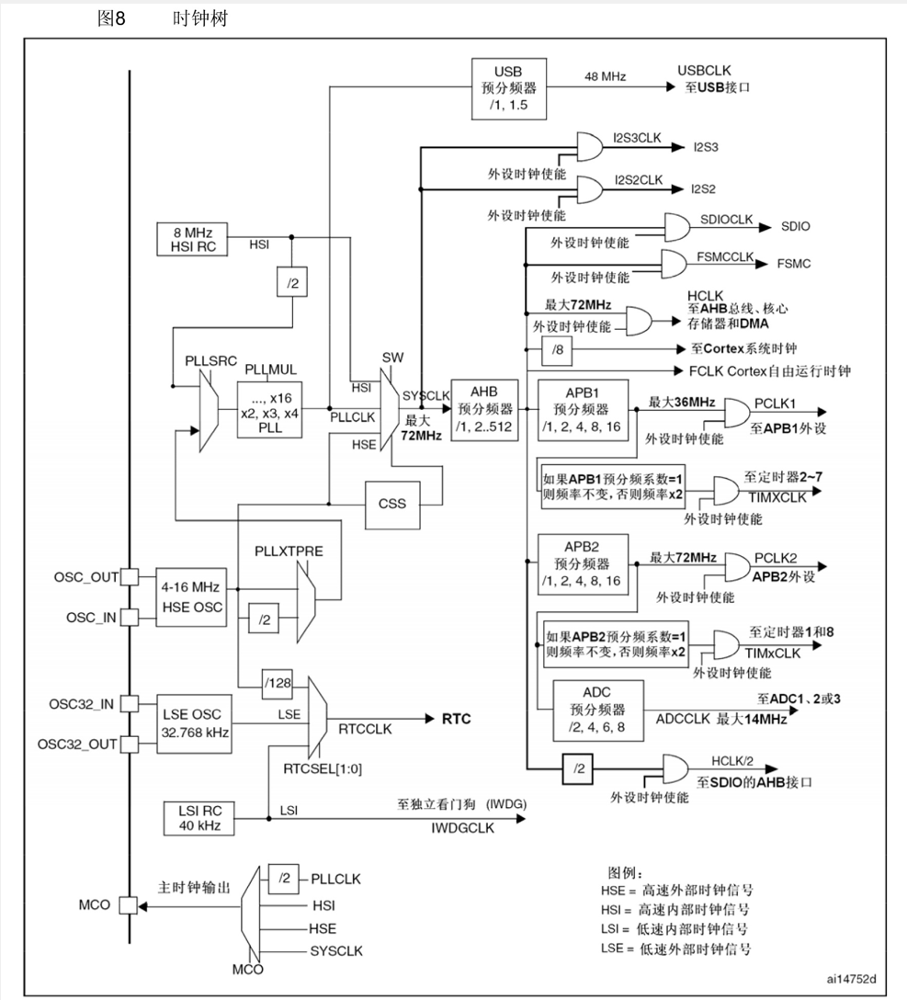
可以简单如下表示:
```text
        ┌────────────┐
        │  HSI (8MHz)│
        └──────┬─────┘
               │
        ┌──────▼─────┐     ┌──────────┐
        │    PLL     ├────►│  SYSCLK  │
        └──────▲─────┘     └────┬─────┘
        ┌──────┴─────┐          │
        │  HSE (8MHz)│          ▼
        └────────────┘      ┌─────────┐
                            │  AHB    ├──► HCLK → CPU, RAM, GPIO
                            └────┬────┘
                                 │
                   ┌────────────▼────────────┐
                   │        APB1 / APB2      │
                   │ (可独立分频：2,4,8,16...)│
                   └───────┬───────────┬─────┘
                           ▼           ▼
                      Timer, I2C    USART, ADC

根   ：多个时钟源（HSI、HSE、LSI、LSE、PLL）
主干 ：系统时钟（SYSCLK）
分支 ：AHB、APB1、APB2 等总线时钟
叶子 ：CPU、内存、GPIO、UART、ADC、定时器等具体模块
```
###### 根--时钟源
STM32 提供 4 种主要时钟源，可分为高速和低速两类：
| 时钟源 | 类型 | 典型频率 | 特点 | 主要用途 |
|--------|------|----------|------|--------|
| HSI | 内部高速 RC 振荡器 | 8 MHz（F1/F4）<br>16 MHz（F0/G0） | 启动快、无需外部元件<br>精度低（±1%～2%） | 系统默认启动时钟<br>Bootloader、应急时钟 |
| HSE | 外部高速晶振 | 4–26 MHz（常用 8 MHz 或 25 MHz） | 精度高（±20 ppm）<br>需外接晶振+电容 | 主系统时钟源（经 PLL 倍频） |
| LSI | 内部低速 RC | ～40 kHz | 功耗极低<br>精度差 | 独立看门狗（IWDG）<br>低功耗 RTC 备用 |
| LSE | 外部低速晶振 | 32.768 kHz | 极高精度（日误差 <1 秒）<br>超低功耗 | 实时时钟（RTC） |
||产生源与芯片的位置关系|看看就好|||

###### 主干 -- 系统时钟 (SYSCLK)
STM32 有一个多路选择器，决定哪个信号作为 系统主时钟
```text
         ┌──── HSI ───┐
         │            │
         ├──── HSE ───┤  →  [SYSCLK MUX]  → SYSCLK
         │            │
         └──── PLL ───┘
```
上电后，通过先于主函数的`systemInit`函数默认选择 HSI ~8MHz~ 为系统时钟，确保芯片能立即运行；随后**芯片能动了**, 随后激活HSE, 将其输入PLL进行9倍倍频, 得到输出为 72MHz的时钟. 待PLL输出稳定后,选择PLL为系统时钟.

>注 : PLL 本身不是源，它需要 HSI 或 HSE 作为输入

- **锁相环（PLL）**—— “频率放大器”
PLL（Phase-Locked Loop）是 STM32 实现高性能的关键：
  - 工作原理（以 STM32F1 为例）：
    >输入：HSE = 8 MHz
    配置：PLLMUL = 9
    输出：8 MHz × 9 = 72 MHz → 作为 `SYSCLK`

  - 更复杂的系列（如 F4/H7）：
  支持 预分频（PLLM）→ 倍频（PLLN）→ 后分频（PLLP/Q/R），例如：
  ```text
  HSE (25 MHz)
    ↓ ÷5 (PLLM)
  5 MHz
   ↓ ×168 (PLLN)
  840 MHz
   ↓ ÷2 (PLLP) → 420 MHz → SYSCLK
   ↓ ÷7 (PLLQ) → 120 MHz → USB OTG

  如此一来,一个晶振（如 25 MHz）可同时生成 CPU、USB、SDIO 所需的不同频率
  ```
- **时钟安全系统(CSS)**
检测外部时钟的运行状态, 一旦外部时钟失效, 就会切换回内部时钟;
这样可以保证系统时钟的运行, **防止程序卡死造成事故**.
###### 分支 -- 总线时钟分频器（Prescalers）
`SYSCLK` 并不直接送给所有外设，而是先经过 `AHB` 和 `APB` 分频器：
- **AHB 总线（Advanced High-performance Bus）**
驱动：CPU、内存（SRAM/Flash）、DMA、GPIO
分频器：HPRE（AHB Prescaler）
可选分频：1, 2, 4, 8, ..., 512
输出：HCLK = SYSCLK / HPRE   (分频 = 系统时钟 / 分频器)

- **APB1 总线（Advanced Peripheral Bus 1）**
驱动：**低速外设**（I²C、USART2/3、SPI2/3、TIM2-7、WWDG 等）
分频器：PPRE1  （APB1 Prescaler）
最大频率限制（如 F1：APB1 ≤ 36 MHz）

- **APB2 总线（Advanced Peripheral Bus 2）**
驱动：**高速外设**（USART1、SPI1、ADC、TIM1、TIM8、GPIOA～E 等）
分频器：PPRE2 （APB2 Prescaler）
通常可跑满 SYSCLK（如 72 MHz）

>重要机制：当 APB 分频 ≠ 1 时，定时器时钟会自动 ×2！
例如：SYSCLK=72MHz，PPRE1 = 2 → PCLK1=36MHz，但 TIM2～7 时钟 = 36 * 2 =72MHz（为了保持定时精度）。

###### 叶子 -- 外设时钟使能（Clock Enable）
即使总线时钟已分配，每个外设还有独立的“**时钟使能位**”（在 RCC~复位和时钟控制~ 寄存器中）：
```C
// STM32F1 示例
RCC_APB2PeriphClockCmd(RCC_APB2Periph_GPIOA, ENABLE);  // 开 GPIOA 时钟
// 👇
// Reset and Clock Control Advanced Peripheral Bus 2 Peripheral Clock Command
// 复位和时钟控制高级外设总线2 外设时钟命令
```
**默认状态：所有外设时钟关闭（省电设计）；**
不开启 → 无法访问该外设寄存器（读写无效）；
使用完可关闭 → 进一步降低功耗。
>这就像的家庭电路：即使总闸开了，单个电器还得打开自己的开关才能工作。

###### “另一棵树” -- RTC 与独立时钟域
RTC = Real-Time Clock（实时时钟）
它的**作用是**：即使主芯片断电或休眠，也能持续记录“年月日时分秒”，就像你家墙上的挂钟。

- **典型用途：**
智能手表显示时间
工业设备记录事件发生时间
定时唤醒系统（如每天早上 6 点开机）

- **关键需求：**
必须在主系统“睡着”甚至“断电”时依然工作

因此,RTC 有独立的时钟路径，不依赖 SYSCLK.
STM32 为 RTC 设计了两条完全独立的“生命线”：
独立电源引脚~VBAT~  `+` 独立时钟源~LSE或LSI~


###### 可视化：STM32F103 时钟树简化图
```text
                      ┌──────────┐
                      │   HSI    │◄── 8 MHz (Internal)
                      └────┬─────┘
                           │
                      ┌────▼─────┐
                      │   HSE    │◄── 8 MHz (External Crystal)
                      └────┬─────┘
                           │
                      ┌────▼──────┐
                      │   PLL     │◄── Input: HSI/2 or HSE
                      │(×2 to ×16)│
                      └────┬──────┘
                           │
              ┌────────────▼────────────┐
              │      SYSCLK MUX         │◄── Select: HSI / HSE / PLL
              └────────────┬────────────┘
                           │
                    ┌──────▼──────┐
                    │    AHB      │◄── Input:( HPRE:) /1, /2, ..., /512
                    │   (HCLK)    │
                    └──────┬──────┘
         ┌─────────────────┼─────────────────┐
         ▼                 ▼                 ▼
      CPU, SRAM        DMA, FSMC         GPIO, ...
         │
    ┌────▼────┐
    │   APB2  │◄── PPRE2: /1, /2, /4... (max 72 MHz)
    │ (PCLK2) │
    └────┬────┘
         ▼
ADC, TIM1, USART1, SPI1...
         |
    ┌────▼────┐
    │   APB1  │◄── PPRE1: /1, /2, /4... (max 36 MHz)
    │ (PCLK1) │
    └────┬────┘
         ▼
TIM2-7, I2C, USART2/3, WWDG...


注:  RTC 时钟单独从 LSE/LSI 引入，不经过此树。
```

### 设计哲学
| 需求 | 时钟树如何满足 |
|------|----------------|
| 高性能 | PLL 倍频到 72/180/480 MHz 驱动 CPU |
| 低功耗 | 关闭不用外设时钟；使用 LSI/LSE 维持 RTC |
| 高精度通信 | UART/SPI 用稳定 HSE 分频，避免波特率误差 |
| 成本控制 | 只需一个晶振（HSE + LSE），内部生成所有频率 |
| 可靠性 | 时钟故障检测（CSS）、自动切换到 HSI |

| 好处 | 说明 |
|------|------|
| 控制系统性能 | 主频越高，CPU 越快；可按需降频省电 |
| 保证外设功能正确 | UART、SPI、PWM、ADC 等依赖精确时钟 |
| 实现低功耗设计 | 关闭不用外设的时钟 → 功耗接近 0 |
| 提高系统可靠性 | 避免因时钟不稳导致的通信错误、死机 |
| 支持多种时钟源切换 | HSE（高精度）用于正常运行，LSI（低功耗）用于看门狗，故障时自动切换 |
| 灵活分频/倍频 | 通过 PLL 将 8 MHz 晶振倍频到 72 MHz，满足高性能需求 |

## 中断系统
### 基础概念
- **中断：**
在主程序运行过程中，出现了特定的中断触发条件`中断源`，使得CPU暂停当前正在运行的程序，转而去处理中断程序，处理完成后又返回原来被暂停的位置继续运行
  >与  `条件语句+函数调用` 不同, 其内置于主程序中.
  如果没有中断系统, 但为了防止外部中断被忽略,而去在主程序内利用`条件语句+函数调用`,那么主程序只能不断查询是否有这些中断事件发生, 不再干别的事情,影响效率.
  但有了中断系统后, 主程序可以干其他事情, 而中断源的出现交给"小弟"`NVIC`去观测, 有事情汇报主程序就行.
  总而言之就是, 干活人多,效率高.

- **中断优先级:**
当有多个中断源同时申请中断时，CPU会根据中断源的轻重缓急进行裁决，优先响应更加紧急的中断源

- **中断嵌套：**
  当一个中断程序正在运行时，又有**新的更高优先级**的中断源申请中断，CPU再次暂停当前中断程序，转而去处理新的中断程序，处理完成后**依次进行返回**，如下图：

  >至于如何保证中断结束后主程序还在原来位置,这个涉及到汇编和内存布局~(栈,堆等)~和寄存器~(计算机组成原理)~的一些知识,在此不多赘述.
---
>
  一般把中断后执行的代码写在一个子函数里, 当中断来临时, **硬件会自动调用**这个函数
  也就是说, 我们**不需要把这个子函数写入主程序**

### STM32中断系统
- **68个可屏蔽中断通道:**
  即,**中断源**
  包含EXTI、TIM、ADC、USART、SPI、I2C、RTC等多个外设,下图是中断向量表:
  ||
  |---|
  ||
  ||
  ||
  ||
  >上面的那些灰色背景的，是内核中断~（Core_Interrupt）~。
通常指的是由处理器内核本身产生的中断，比如系统节拍（SysTick）、PendSV、SVCall、NMI（不可屏蔽中断）等。这类中断与外设中断（如 UART、GPIO、定时器等）不同，它们直接**与 CPU 内核架构相关**。  
这些中断由 CPU **内核自动触发**，但是否启用、如何响应，是由你写的程序决定的。

可以控制的内容包括：
- - 使能/禁止某些内核中断
- - 设置中断服务函数（ISR）
- - 修改部分内核中断的优先级
- - 主动触发某些内核中断

不能控制的内容包括：
- - 不能阻止某些强制性异常的发生
- - NMI 一旦发生就无法被普通中断屏蔽
- - 内核中断的编号和基本行为由 ARM 架构规定，不能更改。
  >下面那些白色背景的就是外设中断,

  >STM32中断源极多,几乎每个模块都能申请中断.
  注:68个中断源, 是F1系列最多的中断数量,具体型号可能没这么多,具体以对应型号的数据手册为准.

### NVIC`(Nested Vectored Interrupt Controller)` 嵌套向量中断控制器
~内核外设，其时钟始终打开~

NVIC有很多输入口, 输入那的`n/`是占n条线路的意思;
且只有一个输出口来告诉CPU你现在要处理哪个中断,  NVIC会根据中断优先级进行输出

**嵌套**就是中断嵌套的意思，同时是中断优先级的管理规则
我们来着重讲一下**向量**，这个词..有力量啊....(意味浅)
#### 中断向量
**向量** 即 “有方向的量” ，在这里的隐喻:
这个地址不仅是一个 “数值”，更带有 “执行方向”,
其本质是一个**指向ISR函数的指针** —— 告诉 CPU“中断发生后，**该往哪个地址去执行处理程序**”，指引 CPU 完成中断跳转。

-  那向量怎么告诉CPU是哪个地址的呢?

答案就是上图的**中断向量表**~中断向量的载体~:
MCU~(Microcontroller_Unit,微控制器即单片机)~, 的 Flash 起始位置有一块固定的中断向量表,在汇编启动文件（.s 文件）中定义的。它本质上是一个按中断号顺序排列的**函数地址数组**。当中断源（如外设事件或内核异常）被触发时，CPU 硬件会自动根据中断号查表,寻找对应的中断向量，也就是获取对应的中断服务函数（ISR）入口地址，并直接跳转执行，无需主程序干预。执行完毕后，自动返回主程序断点继续运行。
>芯片厂商提供的启动文件（如 startup_stm32f4xx.s）已经为每个中断预定义了默认的 ISR 函数名,这是**弱符号**。
这些函数默认是空的（或跳转到一个死循环）。
我们不需要手动修改向量表指针，只需在你的 C 文件中**定义同名函数，编译器就会自动“覆盖”默认的弱符号，从而让中断发生时跳转到你写的函数。**
具体就是指针指向弱符号,然后弱符号经编译器管理后指向我们的同名函数.
所以说,我们对ISR函数,不是调用,而是实现；不是靠手动改向量表地址，而是靠链接器自动替换函数入口。

#### 中断优先级
NVIC的中断优先级分为**抢占优先级**和**响应优先级**
抢占优先级高的可以中断嵌套(打断当前执行函数)，响应优先级高的可以优先排队(当前函数执行完后,优先执行)，抢占优先级和响应优先级**均相同的按中断号排队**
这既**保证响应速度**，又**保证中断执行的有序性**。

-  这两个优先级的设置有什么规则呢?
中断优先级由**优先级寄存器**的4位（0~15）决定，**值越小,优先级越高**;
这4位可以进行切分，分为**高n位的抢占优先级和低4-n位的响应优先级**,所以有了以下五种分组方式:

  >注:
  这是整个NVIC共用的,不能这里设置是2组,后面有出现设置3组之类的情况.
  
  .

#### 设计哲学
如果没有NVIC,就需要CPU自己去接入中断源,会引出很多线来适配,设计麻烦;
并且CPU还要自己处理这些中断的优先级和嵌套顺序问题,占算力;
把NVIC与CPU分离,各司其职,不论是运行,还是后期优化调试,效率都高;
**加一层**是这个👍

### EXTI`(Extern Interrupt)` 外部中断
~硬件电路由芯片内部的`始终使能的系统时钟域`驱动，其时钟也始终打开~
#### 硬件模块 + 软件配置 的结合体
**硬件层面（核心）:**
EXTI 是嵌入式芯片（如 STM32 系列）中的一组 **专用硬件电路模块。**
其**直接连接到 GPIO 引脚，可以实时监测电平变化。**
当检测到触发条件时，会向 `NVIC`发送中断请求信号`IRQ`，这是硬件行为。
也就是说：EXTI 是一个真实的硬件外设，存在于芯片内部。

**软件层面（配置与响应）**:
开发者通过 寄存器编程 或 HAL 库来：
**配置GPIO 引脚和 EXTI 通道的连接方式**（如 GPIO_Pin_0 → EXTI_Line0）;
**设置触发方式**（上升沿、下降沿等）;
**启用中断**（使能 EXTI 和 NVIC 中断）;
**写出对应的 中断服务函数**~（ISR）~，比如 EXTI0_IRQHandler();
在中断发生后，CPU 执行这段代码，实现业务逻辑。
也就是说：使用 EXTI 需要写代码进行配置和响应。

#### 功能实现和特点
-    - **设计思路:**
     EXTI可以监测指定GPIO口的电平信号;
     当其指定的GPIO口产生电平变化时，EXTI将立即向NVIC发出中断申请;
     经过NVIC裁决后即可中断CPU主程序，使CPU执行EXTI对应的中断程序.
-    - **支持的触发方式：**
     上升沿/ 下降沿/ 双边沿/ 软件触发(代码直接触发)
     由`寄存器`控制实现。
-    - **支持的GPIO口：**
     所有GPIO口，但**相同的Pin不能同时触发中断**
     粗字的意思是,在不同GPIO端口的同位次引脚里,只能选一个作为中断引脚
     (比如GPIOA_Pin0/GPIOB_Pin0/GPIOC_Pin0里,只能选一位作为中断引脚)
        >即, 数字不一样,字母无所谓.
-    - **通道数：**
     16个GPIO_Pin，外加PVD输出、RTC闹钟、USB唤醒、以太网唤醒
     共20个中断线路.其中,16个GPIO_Pin是主要功能,后面四个通道是为了蹭`EXTI`的某一功能--------从低功耗模式的停止模式下唤醒STM32.因为他们没能力自己唤醒STM32 
        >**通道**是~用来区分同一类外设中,多个独立功能单元的~编号或路径。
        那么**通道数**就是~同一类外设中,多个独立功能单元的~**个数**
-    - **触发响应方式：**
     中断响应/事件响应
        - 中断响应:
        正常流程,上报NVIC然后告知CPU,然后切换执行程序. 
        - 事件中断:
        不再上报NVIC,而是通向其他外设,触发其他外设的操作. 


> AFIO是一个数据选择器, 可以选择不同GPIO端口的同位次引脚的其中一个连接到EXTI里, 所以上文说**相同的Pin不能同时触发中断**
> 注: 
> EXTI有20路输入,但对NVIC的输出只有11路, 原因是20路太多啦,占用太多NVIC的通道资源了;
> 所以,就把`EXTI5~9`,`EXTI10_15` 十个输入通道分到了两个输出通道`EXTI9_5`和`EXTI15_10`里.
> 这会产生一个**特性**------`EXTI5~9`,`EXTI10_15`只能触发两个中断函数,但.换言之,**这两个中断函数可以有多个中断源**,这时,我们需要通过标志位来区分是哪个中断源出现

>什么是标志位?
EXTI 控制器内部有一组状态寄存器，用于记录哪些 EXTI 线当前有挂起的中断请求。这个状态就是所谓的“**中断挂起标志位**”（Pending Flag）。

#### 内部框架
- **AFIO**
下图只展示了AFIO相关EXTI的部分结构

那些梯形就是一系列的数据选择器, 每个数据选择器最终会选择一个输入,并将其输出给`EXTI`;
    - 那我们怎么控制哪一个输入作为输出呢?
大家可以看见框架图里, 每一个数据选择器上头都有一个寄存器,
这意味着,我们**配置相应寄存器的相应位,就可以实现控制输出**.
    - 那AFIO有什么用呢?
详情可跳转[AFIO (Alternate Function Input Output) 复用功能输入输出口](#afio-alternate-function-input-output-复用功能输入输出口)

- `EXTI`

信息量有点大😵我慢慢讲:
- **输入线**（Input Lines）
共 20 根，对应 EXTI0 ～ EXTI19。
输入源可以是 GPIO 引脚、RTC、PVD、USB、CAN 等。
实际上，这些输入线通过 AFIO 模块映射到具体的物理引脚（例如 EXTI0 可来自 PA0、PB0、PC0...）。
  >注意：虽然有 20 条线，但 NVIC 只分配了 16 个中断向量（EXTI0～EXTI15），所以 EXTI16～19 通常用于系统事件（如 PVD、RTC 等）。
.

- **上升沿触发选择寄存器**（Rising Trigger Selection Register）
每位对应一条 EXTI 线（bit0～bit19）。
设置为 1 表示允许上升沿触发中断或事件。
设置为 0 则禁用。
.
- **下降沿触发选择寄存器**（Falling Trigger Selection Register）
类似于 RTSR，但控制下降沿。
设置为 1 表示允许下降沿触发;
设置为 0 则禁用。
.

- **边沿检测电路**（Edge Detection Circuit）
  - **主要功能**:
对每条输入线进行电平变化检测。
  - **支持模式**：
上升沿触发
下降沿触发
双边沿触发（上升+下降）
  - **工作流程：**
输入信号进入边沿检测电路；
当出现边沿电压时,电路结构产生的特殊窄脉冲信号
    >高电平持续一个**总线时钟**周期,且高电平的值取决于**芯片**内部的VCC;
    也就是说**输入信号的频率与输出信号的频率相关,但其高电平占比并无关系**(占空比)

    这个信号会分别和**上升/下降沿触发选择寄存器**作为 AND 门的输入,一起决定输出。
>该电路是**硬件实现，响应速度快，适合实时性要求高的场景。**
   这种自动判断信号变化并且做出相应输出的硬件电路,称为**逻辑电路**, 它自身能量很小(指电压之类的值很小),但是可以通过它的输出去控制一些大功率的电路的开闭,**达到四两拨千斤的效果**.

  .
- **软件中断事件寄存器**（SWIER）
用于软件触发中断或事件。
**写 1 到某一位，就会模拟一次边沿变化**，触发对应的中断或事件。
常用于调试、唤醒、测试等场景。
  >注: 写入后**最好手动清除~后文讲的~请求挂起寄存器（写 1 清零）**，否则对于中断会重复触发，对事件虽然不会，但是留着不如删了好。

  .
- **请求挂起寄存器**（PR - Pending Register）
记录 EXTI 线当前有效的中断请求。
当`边沿检测电路`检测到有效边沿并且触发方式已使能时，下方的线路传来的一个`边沿检测电路`的窄脉冲信号会被此寄存器接收,该位被置 1。
**这是中断是否发生的“中间状态”标志。** 也就是上文提到的**中断挂起标志位**

  >有用到就要`写 1 清零`（Write 1 to clear）机制。否则中断会反复触发！
  **NVIC里也有一个PR**, 但是完成中断后**CPU会自动清除**

  .
- - 为什么SWIER不要清除，而PR需要清除呢？
  >原因在于这两个寄存器的类型不同.
   SWIER:
   `只写`寄存器,更确切的说,应该叫`写后无状态`寄存器,其没有记忆功能,内部无法储存信息.更像是一个 “写即触发”的门控信号，写操作直接生成一个内部脉冲，**不经过寄存器存储**。
   PR:
   `可写可读`寄存器, 是一种`状态`寄存器.外来的**高电平**会被寄存器接收并锁存,**直到被内部电路清零**.

  .
- **中断屏蔽寄存器**（IMR - Interrupt Mask Register）
控制是否允许某个 EXTI 线产生中断。
每位对应一条线，1 = 允许中断，0 = 禁止中断。
  >即使 PR 位为 1，如果 IMR 为 0，也不会发送到 NVIC。

  .
- **事件屏蔽寄存器**（EMR - Event Mask Register）
控制是否允许某个 EXTI 线产生事件。
1 = 允许事件，0 = 禁止事件。
  >事件不进入 NVIC，而是用于触发其他外设（如启动 ADC、触发 DMA 等）。

  .
- **脉冲发生器**（Pulse Generator）
实质是上升沿检测器, 若有上升沿,就向左发出一个脉冲.
当 AND 门左端**从非全 1 到 全 1**的时候, 就会生成一个短暂脉冲（通常是 1 个时钟周期）。
输出给其他外设（如 ADC 的触发输入、TIM 的捕获输入等）。
  >这就是“事件”与“中断”的区别：
中断 → 通知 CPU
事件 → 通知其他硬件模块

- **NVIC 中断控制器**
组合逻辑：
PR[i] == 1 且 IMR[i] == 1 → AND 门通过 → 输出到 NVIC
NVIC 会根据优先级决定是否响应。

- **外设接口 & AMBA APB 总线**
    - 所有寄存器（IMR, PR, RTSR, FTSR...）都通过 APB 总线访问。
      - *访问*
    CPU（主程序）执行写/读指令时，通过系统总线结构中的 APB 总线，将数据写入或读取 EXTI、AFIO、GPIO 等外设的寄存器。 
    - 由 PCLK2 提供时钟（APB2 总线时钟）。
  >这是为了使用 EXTI前对 APB2 时钟正常运行的保证.

### 注意事项
- **中断要简短快速**
  不要在中断函数里执行耗时过长的代码.
  因为中断时处理突发事件的, 因为一个突发事件耽误主程序运行太久也是不合理的.
  .
- **最好不要在主函数和中断函数中调用相同的函数或者操作同一个硬件**
  因为单片机只对主程序做现场保护和恢复,**不会对硬件做现场保护和恢复**,导致输出的结果出错,比如输出位置出错~(OLED板)~,输出角度出错~(伺服电机)~.
  >那OLED举例, 如果主程序运行一条OLED输出指令了一半,突然接入中断函数, 那当中断结束时,其光标位置就容易出错:
  >  >未中断时,程序运行到一半, 光标到了A位置;
    中断发生后,指令使光标移动至B位置,中断函数输出完,光标移动至C位置;
    中断结束后,回到主程序,但是继续进行原先执行到一半的指令,**没有复位
    操作**,于是**在C位置后输出接下来的内容.**
    
  >具体细节和CPU内的执行逻辑相关.
  - 所以,在实现中断功能的时候,**可以在中断里操作标志位和中断测得变量内部的计算**;
    而在**返回后在将其与其他变量运算,并反馈到硬件**
    这样,就可以实现主程序和中断函数的融洽分工. 

- **很重要的!!!**,**在中断函数内一定要清除标志位**,不然会困在循环里...
~昨天被坑了2小时掉😭~
   
## TIM(Timer)定时器
作者阵亡...定时器真的好复杂...
这是关于定时器的思维导图,先放开头开个光()
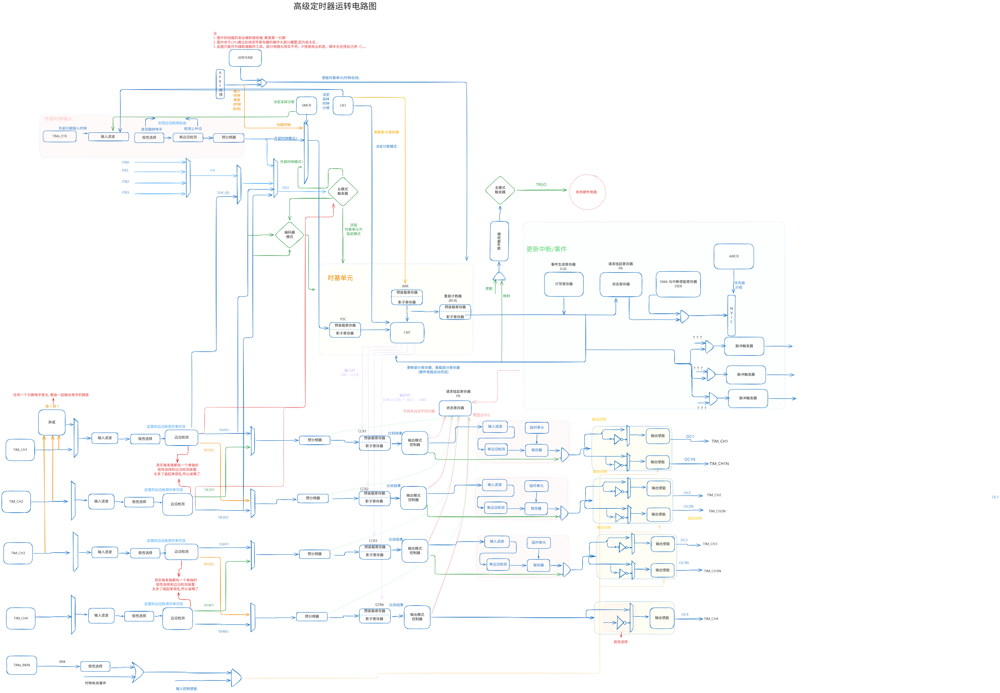
### 哲学
把所有模拟输入转化成数字输入;
把大多连续输入转化成独立输入.
>因为定时器内部大多都是逻辑电路,执行逻辑是事件间的对应关系,
 把连续的事件分割开来,变成一次次的脉冲信号, 然后脉冲信号再告诉硬件*来活了*,然后执行指定操作.
### 总概
- **工作原理简介：**
  定时器可以对输入的时钟**进行计数**，并在**计数值达到设定值时触发中断**；
  >  在STM32中, 定时器的基准时钟一般是主频72MHz.
 
  实质上，定时器的主体是一个**边沿触发的计数器**---计数寄存器，它对**信号的指定边沿**~（通常是上升沿）~进行计数。每次检测到一个有效的指定边沿，计数器就加 1~（或减1，取决于工作模式）~。
  >其思想就是----单位时间*计次 = 总时间

  .
- **基本单元**
  有**计数寄存器、预分频器、自动重装寄存器**等时基单元。
  - 计数寄存器:~CouNt_regisTer,即CNT~
    执行计数定时的一个寄存器, 每来一个信号的指定边沿,计数器就加1.
    **定时器的计数核心**.
     .
  - 预分频器(16位):~Prescaler~ ~PSC~
    预分频器的本质也是计数器: 
    预分频器从 0 开始计数，每接收到 1 个输入时钟脉冲，计数值 + 1。
    当计数值**达到 N−1 时，输出 1 个时钟脉冲，同时计数值清零**，重新开始计数。
    **用来控制计数寄存器的计数速度**.
    >注:
    预分频器的值和实际分配系数相差了1;
    在预分频器写入`X`,  `分频后输出频率 = 输入频率/(X+1)`
    .
  - 自动重装寄存器(16位):~Auto-Reload_Register,即ARR~
    我们可以在自动重装寄存器写入一个确定的值, 当计数寄存器**与该值相等**后,
    下一周期就会让**计数寄存器会自动清零**~(即,自动重装)~ ~(轻哼)~
    同时计数寄存器会让 **TIMx_SR 寄存器的相应位置1**~(和EXTI很像)~ ~(轻哼)~
    ~TIMx_SR寄存器前文没出现过,后文有用~
    >0  →  999 → 0(1000) → 2 ...
    **用来控制计数寄存器的计数范围**
    .
  - 
  在72MHz计数时钟下可以实现最大59.65s的定时:
  >(72*10^6^) / (2*^32^)= 59.65.

- **高级功能**
  不仅具备基本的**定时中断**功能，而且还包含**内外时钟源选择、输入捕获、输出比较、编码器接口、主从触发模式**等多种功能
  - 级联
    一个定时器的输出可以当作另一个定时器的输入.
    从而**实现更长的定时时间**.
    >两个定时器相连就是(2*^32^ * 2*^32^) ≈ 8035年,嗯,够用了...

    .
   

### 定时器类型
根据复杂度和应用场景分为了**高级定时器、通用定时器、基本定时器**三种类型


>APB2性能高,一般分给高速外设; APB1性能弱, 一般分给低速外设.
 注:
 STM32F103C8T6定时器资源：TIM1、TIM2、TIM3、TIM4;
 不同型号拥有的定时器数量和品类不同, 上面的编号对应某一品类, 而不是说所有型号的单片机都有相关编号的定时器. 
 所以用之前,要查清楚此类型有哪些编号的定时器.
#### 框图简析
##### 基本定时器:
   
   在`基本定时器`内,  只能选择内部时钟， `控制器`处直接连接内部时钟~(CK_INT)~.
   计数流程:
  ```text
   RCC_TIMxCLK  (72MHz)
      ↓   开启
   CK_INT  
      ↓   连接
   控制器 
      ↓   连接
   预分频器 
      ↓   降低计次速度           设置目标
   计数寄存器                      ←            自动重装寄存器
  ```
- **更新中断**~UIF~:
  计数值等于自动重装值所产生的中断, 叫做`更新中断`, 也就是图中`自动重装寄存器`旁边的`UI`;
  由于定时器是内部外设,所以`更新中断`**不会经过EXTI**,而是直接通往NVIC;
  我们只要再设置好 NVIC 的定时器通道, 就可以实现定时器的中断功能了.
  定时器的中断/事件与[EXTI内部框架](#内部框架)的原理相近.
  >与EXTI不同的,
  每个定时器都有一个独立的类似请求挂起寄存器的状态寄存器;
  原因是每个定时器有许多中断源, 不仅有更新中断`UIF`, 还有捕获比较中断`CCxIF`...等等.
- **更新事件**~UEV~:
  旁边的`U`指的是`更新事件`,~~他指的就是更新中断产生的事件嘛,多简单理解啊~~
  实则不然,在[EXTI功能实现和特点](#功能实现和特点)中提及过,`EXTI`的响应方式除了中断响应,还有事件响应;
  所以这里的事件指的是, **不触发通往CPU的中断, 而是触发内部其他电路的工作.**
  >两者不是二选一的关系,可以同时发生.
   只要定时器在运行，并且计数完成一个周期，UEV 就会自动发生 —— 这是定时器的基本工作机制。


  .   
- **主模式触发DAC**:
      将定时器的更新事件启用后,**手动让更新事件映射到主模式触发器，触发输出TRGO**~(Trigger_Out)~;
      随后让**TRGO连到DAC的触发转换引脚**上,从而实现DAC的触发.
      .
- **影子寄存器**~Shadow_Register~:
    大家可以看见图中的PSC和ARR的框图下方**有阴影**,这里有一定的含义在().
    其实这是内含影子寄存器的意思. 下面拿PSC举例:
    - 实际上的PSC内含两个寄存器:
      - 预装载寄存器/控制寄存器~（preload_register）~
      - 影子寄存器/缓冲寄存器~（shadow_register）~ (**PSC必选**)
       
    - 两者的关系:
    用户写入PSC的值**不会立即生效**，而是暂存在预装载寄存器，**直到发生更新事件~UEV~时**，才将值传送到影子寄存器,并开始影响计数频率。
    >ARR也有影子寄存器,**但是可选,默认不选**,不选就是立刻生效.
    - 目的:
     避免计数过程中的毛刺或非预期周期,如果立即生效：当前计数周期会被打断，产生一个极短的“毛刺”脉冲.
     >这对 PWM、编码器、精确延时等应用至关重要
    - 此更新事件的触发方式:
     
    | 触发方式 | 是否自动加载 PSC 到影子寄存器？ |
    |--------|-------------------------------|
    | 计数器溢出（ARR 匹配） | ✅ 是 |
    | 软件写 `UG` 位（TIMx_EGR.UG = 1） | ✅ 是 |
    | 主模式触发（如 TIM_TRGO） | ✅ 是 |
    | 手动写 PSC 寄存器 | ❌ 否（仅写入预装载寄存器） |
    
    .
    - 特殊情况:
    由于PSC的影子寄存器必选,所以第一次初始化时基单元的时候打包好的**库函数最后手动更新事件**了,此时需要我们在调用函数后手动清除标志位. 

 

#####  通用计时器:
  
  可以看见,中央部分和基本定时器的结构一致;但多了一些东西
- **计数模式**:
    除了常规的向上计数,增加了**向下计数模式**和**中央对齐模式**.
    如果说, 向上计数,是从0自增到重装值,然后清零并中断;那么,
    向下计数,就是从重装值自减到0,然后调至重装值并中断;
    中央对齐,就是从0自增到重装值,中断;然后从重装值自减到0,中断...循环.
    >中央对齐的优势只在**计数时序和输出波形**的特性 —— **生成对称 PWM 波**;
    这与下文会讲到的[输出比较](#输出比较)相关.
    .
- **时钟输入**:
  每个通用定时器的输入时钟选择,除了内部时钟外,还有其他选择: 
  - **外部时钟输入**
    - **TIMx_ETR**
    每个定时器都有一个TIMx_ETR引脚~(一般复用在GPIO引脚上)~ 
    .
    - **边沿检测**
    这个有点意思,和 [EXTI内部框架](#内部框架)的边沿检测电路是一个东西.
    .
    - **极性选择**
    这个和[EXTI内部框架](#内部框架)里的上下边沿触发选择寄存器原理相近;
    都是用来控制边沿检测电路检测上沿还是下沿的.
    .
    - **输入滤波**
      STM32 的输入滤波器是一个 “**连续采样 + 多数一致**” 的数字滤波器：
      - 只有当**频率为 f ,连续 N 次采样**结果都相同，才认为输入信号真正改变了状态。

      由CR1寄存器决定其采样频率,由SMCR寄存器决定其采样次数.
      >输入滤波是一种拿采样精度换采样抗干扰性的手段,面对低频率的信号时就是很好的策略,但对高频率的信号时就会面临严重失真问题.
    
    .
    - **两种输出路径**:
      - `外部时钟模式2` :
        ~为什么先讲2?因为简单....~
        如果想用ETR外部引脚提供时钟, 或者对ETR时钟进行计数,用它就够了;
        .
      - TRGI~(trigger_input)~
        触发输入, 路如其名,可以**触发定时器的从模式**.
        >当然从模式选择用作普通的外部时钟输入....此时TRGI这一路,就叫做`外部时钟模式1`
        .
    - **ITR 主定时器输入**    
    定时器的TRGO触发输出,可以连接到其他定时器的ITR输入上.然后的过程和TIMx_ETR一样,便不再赘述.
    >需要补充的一点: 如果走`外部时钟模式1`,那这就是**定时器级联**.
    注：每个定时器的ITRx不一定相同.
    

    .
  - **主从触发模式**
    后文再讲，有点大。详情请看[主从触发模式](#主从触发模式).
    .
  - **输入捕获**
    后文再讲，有点大。详情请看[输入捕获](#输入捕获).
    .
  - **输出比较**
    后文再讲，有点大。详情请看[输出比较](#输出比较).
    .
  - **编码器模式**
    后文再讲，有点大。详情请看[编码器模式](#编码器模式).
    .    
##### 高级定时器:
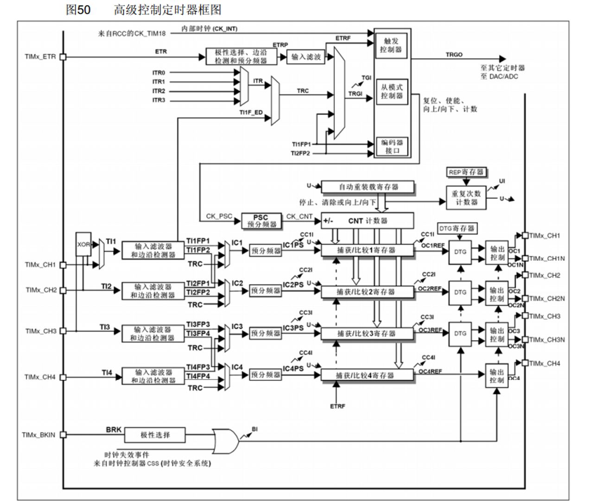
- **重复计数器**~(RCR)~:
  类似于一个的ARR和CNT集成模块.
  就是`ARR`和`CNT`比较后输出脉冲**不再是直接被更新中断/事件模块接收**,而是先被重复计数器接收, 再次经历轮回...**直到`RCR_ARR`和`RCR_CNT`一致的时候,才会向更新中断/事件模块发送信号**.
  .
- **互补输出**
  在高级定时器的输出比较电路最后的`输出控制`模块,不再像通用定时器那样只有一个输出了，,其可以同时输出互补的两路信号，分别接两个mos管。
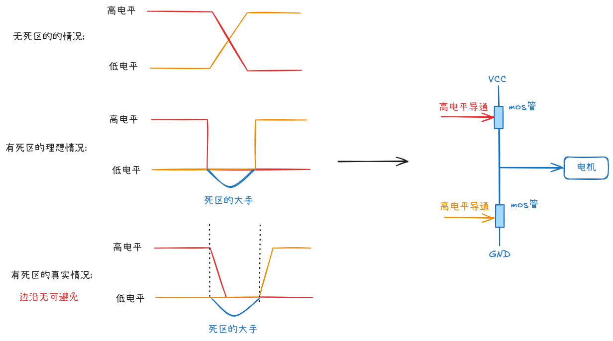
  >常用于三相无刷电机的驱动.

  .
- **死区生成**:
  在上文中的**互补输出**中,存在一个问题:
  - MOS管在关断和开启过程中存在延迟,当电平跳变时,会产生一段时间的双导通状态.导致元件短路.
  
  所以`死区`出手了()
  `死区`就是在互补信号切换时，人为插入一段两个开关都关闭的时间，确保一个管子完全关断后，另一个才开启。
  >内部构造似乎是 单边沿检测 + 转态锁存 + 延时单元
   检测到上升沿, 开启低电平锁存,直到延迟结束.

   .
- **刹车输入**:
  如果外部引脚TIMx_BKIN产生信号 或者 内部时钟故障, 控制电路就会自动切断电机输出.
  >内部构造似乎是 输入滤波 + 单边沿检测 + 锁存器 + `AND/OR门`使能
   当有信号进来时先经过滤波和边沿检测,**传达有效信号给锁存器**, 锁存器锁存高/低电平, 与另一路一同经过`AND/OR门`,**决定控制电路的使能情况**.

### 重大模块
#### PWM~(Pulse_Width_Modulation)~
~这个严格来看不是重大模块()实在不知道放哪了,所以就先放这里了....~
在**具有惯性**的系统中，可以通过对一系列脉冲的宽度进行调制，来等效地获得所需要的**模拟参量**，常应用于电机控速等领域.
其核心是在**惯性系统**下的**数字量等效模拟量**.

- PWM参数：
     频率 = 1 / T~S~            
     占空比 = T~ON~ / T~S~           
     分辨率 = 相邻周期占空比变化步距~(单位是`%`)~
     >频率越大,模拟量就越平稳, 但同时性能开销就越大.
     占空比越大, 模拟量就越趋向高电平.
     分辨率是占空比变化的精细程度,分辨率越高, 模拟量变化曲线越平稳.
#### 主从触发模式
~硬件自动化的大功臣!!!~
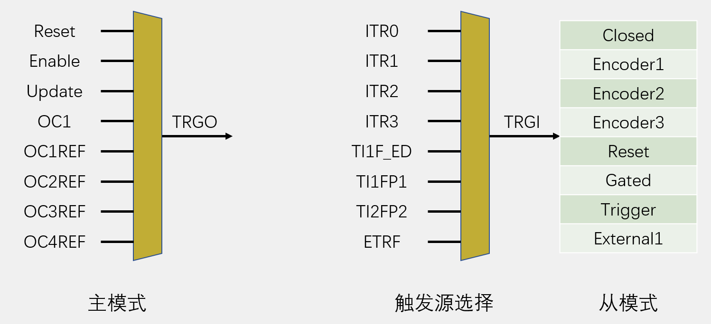
如图所示， 主从触发模式包括 `主模式`、`TRGO/TRGI`、`从模式` 和 `从模式的触发源选择`.
- **主模式:**
主模式可以将一些定时器内的特定输出映射到TRGO引脚，从而触发别的外设工作.
.
- **TRGO / TRGI:**
是一个普通的导线...
欸,但是😆👆, `TRGO`特别在,连通了所有能操控的外设, 但是被连接的外设才有选择是否接收信息的权力.
>打个比方就是, `TRGO`是路由器/交换机 ,  外设是 网卡/MAC.

>作者作者, 那`TRGI`呢?
欸当然怎么会忘了`TRGI`呢?
它真的只是个普通的导线...😆👆

.
- **从模式:**
从模式~,与主模式相对的,~ 其接收其他外设~甚至~自己内部的一些信号;
然后依据设定好的`从模式`选项,**硬件自动化**执行某一功能.
.
- **触发源选择:**
没啥的,就是个复用器`MUX`.
#### 输入捕获 
每个CCR寄存器都可以被设置成 捕获~输入~ 或者 比较~输出~ 两个模式.
这里先讲`输入捕获`: IC(in_capture)

输入捕获模式下，当通道输入引脚出现**指定电平跳变**时，当前**CNT的值将被锁存到CCR中**，可用于测量PWM波形的频率、占空比、脉冲间隔、电平持续时间等参数.
><span style="color:red">注:</span>
每个高级定时器和通用定时器都拥有4个输入捕获通道;
可配置为`PWMI模式`，同时测量频率和占空比;
可配合`主从触发模式`，实现硬件全自动测量.

有上可知，输入捕获 的主要应用在于获取 信号的`频率` / `占空比` 之类与时间相关的量.下面来聊聊频率测量的一些方法:
##### 频率测算
<span style="color:red">注:
STM32内部大多是逻辑电路，只能处理数字信号；
所以遇到非方波的信号， 一般会用`比较器` / `施密特触发器`， 来进行模数转换。</span>


- **测频法:**
  - **原理:** 
    利用信号触发外部中断, 在此中断函数中进行自增操作;
    同时用时基单元触发更新中断, 读取计数值,随后清零, 并输出 
    $频率 = 计数值 / 计数时间$
    .
  - **使用场景:**
    面对**频率较快**的波形信号时, 一般使用测频法, 因为**计次值会舍去绝对次数的小数项**, 从而产生一定误差;
    在一周期内的频率越高, 计数值越大, 其绝对误差越小. 
    .
- **测周法:**
  - **原理:**
    时基单元对单位时间进行计数;
    信号输入TIMx_CH,  每次边沿检测~(可上可下,可单可双)~后, 输出脉冲, 该脉冲
    使能CNT写入CCR, 
    同时通过`主从触发模式`, 对CNT进行清零操作.
    再同时使状态寄存器~(请求挂起寄存器)~置标志位, 产生中断,让CPU读取CCR的值.
    >`主从触发模式`只适用于通道1/2;
    用通道 3/4 的话, 只能在中断时手动清零了. 影响就是程序频繁中断, 比较耗软件资源. 

    .
  - **使用场景:**
    面对**频率较慢**的波形信号时, 一般使用测周法, 因为**计次时间会舍去绝对时间的小数项**~单位是CK_CNT的周期~, 从而产生一定误差;
    在一周期内的频率越低, 计数时间越大, 其绝对误差越小. 
    . 
- **中界频率:**
$𝑓_𝑚=√(𝑓_𝑐  / 𝑇)$
此频率是判断选择频率测算方法的分界线.
大于$𝑓_𝑚$,选测频法;  
小于$𝑓_𝑚$,选测周法.
.
##### PWMI
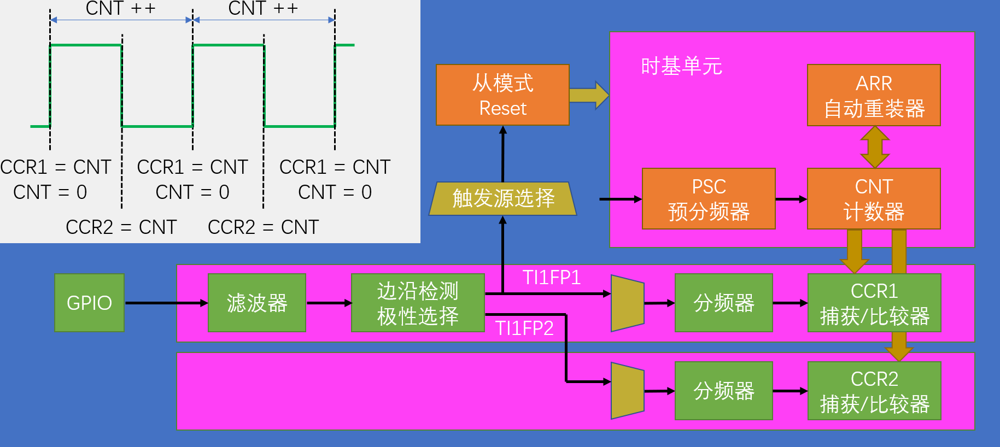
用一个输入通道, 分叉传送到两个CCRx;
`TI1FP2`极性取反;
占空比 = $CCR2 / CCR1$;
其他勿复言尔...
.
#### 输出比较 
好了这里讲`输出比较`: OC (out_compare)
电路会时刻比较`CNT`和`CCR`的值, **通过配置** , `输出比较电路`会在两者大小关系不同的时候,输出不同的电平信号.
注意, `CCR`的值是软件设置的, `CNT` 的值是随输入时钟变化的.
- 框图结构
  - 通用定时器
    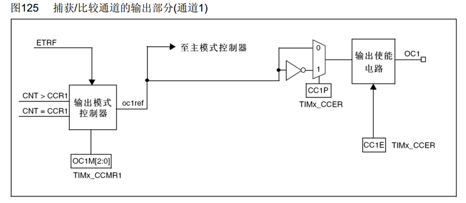 
    表中内容不再赘述,大家都能看的懂;~其实是我累了,不想写了...~/(ㄒoㄒ)/~~
    我们来主要讲讲输出比较的各类模式:
    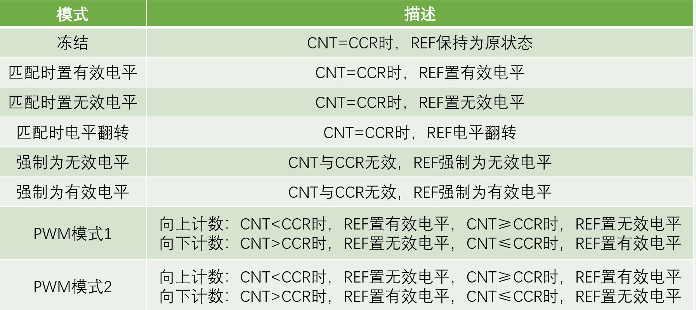
    - 冻结： 
      冻结，嗯...大白话();
      就是没用,REF的**电平**持续冻结前一刻的状态**不再改变**.
        .
    - 匹配时置有效电平:
      在`CNT`=`CCR`的那个`CK_CNT`~CNT的接收时钟~周期,REF置有效电平.
      一般做单次脉冲使用,触发中断.
      .
    - 匹配时置无效电平:
      勿复言尔.
      .
    - 匹配时置电平翻转:
      可以实现高低电平交替的周期性.
      .
    - 强制为有/无效电平:
      勿复言尔.
      欸,但是,没有但是().
      .
    - PWM模式: 
      嗯... 勿复言尔
      欸,但是,可以讲一讲PWM波形的频率 / 占空比 / 分辨率 ,如何调节:
      PWM频率：	Freq = $CK_PSC / (PSC + 1) / (ARR + 1)$
      PWM占空比：	Duty = $CCR / (ARR + 1)$
      PWM最小分辨率：	Reso~min~ = $[1 / (ARR + 1) ]\%$ 
      .
><span style="color:red">一些关于捕获/比较的注意事项:</span>
每一个CCR寄存器都只能被设置成 捕获 / 比较 的其中一种模式.
输入捕获和输出比较的外接引脚都是TIMx_CH,高级定时器的输出比较的引脚还会多一个TIMx_CHn.

#### 编码器接口模式 `Encoder Interface` 
编码器接口可接收`增量正交编码器`的信号，根据编码器旋转产生的正交信号脉冲，
**自动控制CNT自增或自减**，从而指示编码器的位置、旋转方向和旋转速度.
>每个高级定时器和通用定时器都拥有1个编码器接口
且该模式的两个输入引脚借用了**输入捕获的TI1FP1 和 TI2FP2**.
- **正交信号的好处:**
  - 正交信号**精度更高**, A / B 相都能计次, 取平均值后,相当于精度高了一倍.
  .
  - 正交信号可以**抗噪声**,  一相连续跳变 , 而另一相不跳变, 那么计次值就不变化.
  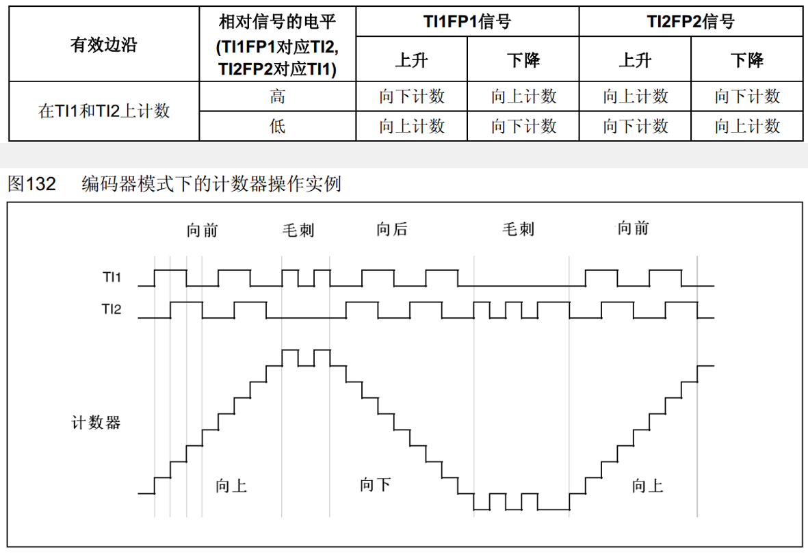
  如上图，如果发生毛刺，毛刺的上升沿和下降沿的影响会相互抵消掉。
  .

##### 工作原理
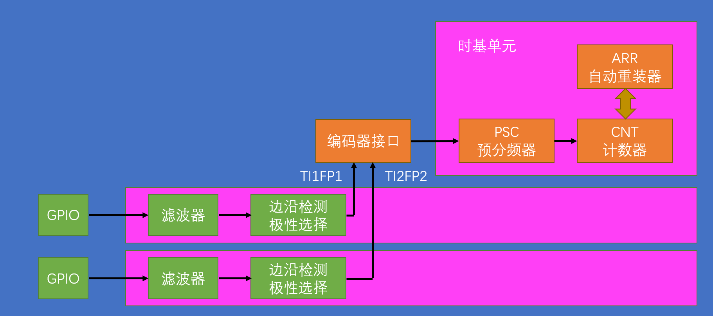
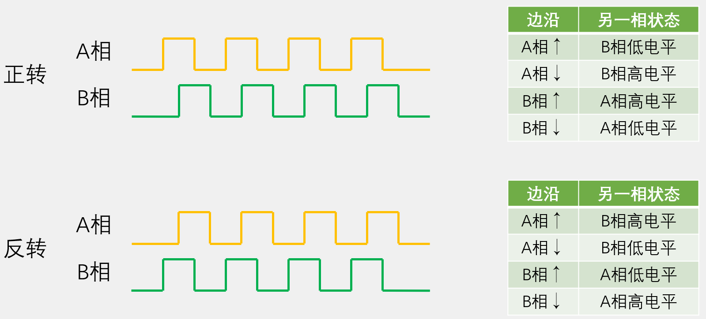
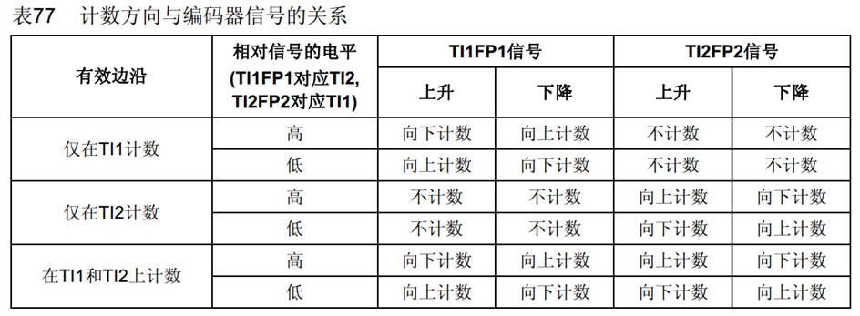
- **极性选择：**
  一个输入电平反向, CNT的增减也相应变化;
  两个输入电平反向, 负负得正, CNT的增减不变;
  .
- **编码器接口：**
  选择可计数的边沿后,内部电路根据上图`边沿-状态`的对应关系设计电路, 实现硬件自动化计数器自增或自减.
  >一般选择边沿全计数, 精度高。

.
- **ARR:**
  自动重装值要取最大量程`65535`,
  ~~原因当然是量程大好用,不容易溢出啦!~~
  大错特错!!!
  原因其实是**防止当CNT为0时反转时的处理麻烦:**
  当CNT为0时反转, 理论值应该为`-1`, 
  实际值为`65535`,但是,(int16_t)`65535` = (int16_t)`-1`, 我们可以对CNT的读取结果**进行类型转换,来规避此麻烦**. 


## ADC 模数转换器
### 简介
ADC，全称为 `Analog-Digital Converter`
ADC可以将引脚上连续变化的模拟电压转换为内存中存储的数字变量，建立模拟电路到数字电路的桥梁.
- **ADC的一些参数和子模块:**
  - 是12位`逐次逼近型`ADC，*最短*1us转换时间;
  - 输入电压范围：0~3.3V ~(NGD~ ~ ~VCC)~ ，转换结果范围：0~4095 = (2^12^-1);
  - 18个输入通道，可测量16个外部和2个内部信号源~(CPU温度传感器~ ~和~ ~内部参考电压)~;
    > 内部参考电压不随VCC变化而变化,始终是1.2V左右的基准电压.
    > 作用是VCC可能不是标准的3.3V, 所以用这个基准电压校准, 这样就可以获得正确的电压值了. 

  - 规则组和注入组两个转换单元, 
    规则组是常规时使用, 注入组是处理突发事件的;
  
  - 模拟看门狗自动监测输入电压范围,
    通过检测某些通道的AD值, 来判断是否越出阈值, 以触发事件或中断;

STM32F103C8T6 ADC资源：ADC1、ADC2，10个外部输入通道;
> 16个外部通道是指ADC这个模块最多能连16个;
> 而, 10个外部通道则是指我们这一款只配备了10个.

>有ADC,自然就有DAC. DAC就是`Digital-Analog Converter`, 用数字电路里仅存的几种电平, 通过DAC寄存器和**集成电阻网络**, 实现**一定分辨率的电平输出**.

这里简单说明一下 DAC 数模转换器:
### DAC 数模转换器
  我们只有VCC和GND,那怎么获得其他的电压值呢?
  最朴实且有效的方法就是电阻分压.
  ~~没错,那我们就用滑动变阻器吧~~
  滑动变阻器有两个大缺陷:
  - 没有动力让滑片移动,且就算有动力,又如何移的精准?
  - 滑久了,阻值变化.
  
  所以**滑动变阻器不行**.
  那用什么呢?
  欸😆👆, 这时就到寄存器和集成电阻网络出手了, 
  **集成电阻网络**常见的结构包括**R-2R梯形电阻网络** 或 **权电阻网络**:
  - **R-2R梯形电阻网络**结构简单,成本低,就是转换速度低;
  - **权电阻网络**结构较复杂些, 成本高, 但转换速度快.
  所以我们芯片内集成的是**R-2R梯形电阻网络**,以下做些简要介绍:
#### R-2R梯形电阻网络
  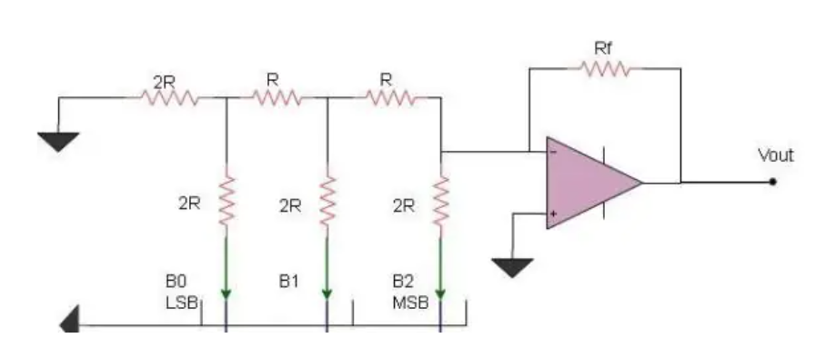
  
  如上图， **R-2R梯形电阻网络**核心部分就是这样的**R-2R梯形电阻**(说了更没说一样())
  它的逻辑很简单,就是`分层 + 叠加`:
  DAC寄存器的16位分别连着B0 - B15. 
  置`0`时，Bx的输出电压 = 0
  置`1`后，Bx的输出电压 = VCC * (2^x^ / 2^16^)
  最后总输出结果就是B0 - B15的输出电压之和。
  好了，事情解决了👌。 ... 但是当真如此吗？...
  我们STM32里所用的并非`R-2R梯形电阻网络`，而是`电流舵或电容阵列型`，因为`R-2R梯形电阻网络`的寄存器超过8位后，精确度大大降低。而我们**内置的DAC是12位的寄存器**。
  介绍一下`电流舵`和`电容阵列型`的基本原理
#### 电流舵
将参考电流源按二进制权重分成多个电流单元（例如 `1×I`, `2×I`, `4×I`, ..., `2ⁿ⁻¹×I`），**保证输出相应大小的电流值**。
每个数字位控制一个开关，决定对应电流是否流入输出节点。
所有选中的电流在求和节点叠加，形成总输出电流，再**通过负载电阻转为电压**。$U = I * R$
我觉得设计最好的地方就是**利用电流不变的特性，通过负载电阻去反向控制电压大小**。 
#### 电容阵列型
使用一组二进制加权电容（C, 2C, 4C, ..., 2ⁿ⁻¹C）构成阵列~（指上极板相连）~。
转换分两阶段：
- 采样阶段：
  所有电容上极板接地，下极板接参考电压（如 Vref），存储电荷。
  .
- 再分配阶段：
  根据数字输入，将各电容下极板切换到 Vref 或地，上极板浮空且极板间相连，导致**上极板电压最终平衡时处处相等**。
  利用电荷总值不变, 可以列`最终电压为未知量`, `恒等量为电荷总值`的恒等式。
  待到电荷重新分配，最终电压反映数字值。
  .

> 和PWM的区别:
> PWM只有完全导通和完全断开两种状态, 这两种状态**不会造成电器的功率损耗**. 所以在直流电机调速这种大功率的应用场景时,  往往会采用PWM, 而不是DAC. 
> 
> 而DAC的应用领域则是多在**波形生成**的领域,   比如信号发生器, 音频解码芯片...这种领域没有惯性, **电压与信息一一对应**, 不能用PWM模拟的方式解决问题.
>

### 诞生背景 
因为单片机内部多是逻辑电路,多用数字电压,也就是VCC和GND, 这给逻辑的判断提供了一个很好的先决条件：
 逻辑电路只要处理几个电平值, 就可以正常运行, 简化了电路, 也保证了电路工作时的稳定性.
但， 这也为读取外界模拟电压造成了一定的阻力： 内部电路就几种电平信号. 如何读取一定精确度的外部模拟电压呢?
这时ADC出手了...

### 基础逐次逼近型ADC的结构
下图是一个独立的ADC芯片, 我们接下来分析以下它的结构:
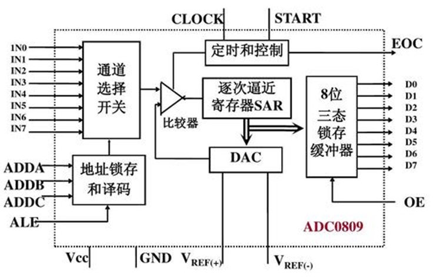

- **通道选择开关**
  选择指定的**几个**通道进行后续的比较器比较.
  .
- **地址锁存和译码**
  ADDx是该寄存器的几个引脚, 把通道号输入这几个引脚上, 
  然后用ALE发出信号,让该寄存器锁存, 对应的通路开关就自动拨好了.
  .
- **逐次逼近寄存器SAR**
  12位寄存器, 其和上文提及的DAC关联很密切, 因为它就是那个DAC寄存器. 它将值一次次的送给DAC, 随后生成特定电压和`通道选择开关`的那个电压进行比较, 然后把信息传递给定时与控制单元里的**SAR状态机**.
  .
  - 那么`SAR`**更改自身值的依据**是什么呢?
    **二分查找**.
    算法如下:
    1. 先猜最高位`MSB`为 1 ，其余为 0 → 即SAR = `0b10000000000`,对应 DAC 输出 = $\frac{1}{2} V_{max}$
    2. 用比较器比较：
      若 
      $𝑉_{in} > 𝑉_{DAC}$ → 猜对了，保留 `MSB`=1
      $V_{in} > V_{DAC}$ → 猜错了，`MSB`=0.
    3. 再猜后一位为 1 , 其他位不动.
       这样, DAC就在`已确定高位基础上` + $\frac{1}{4} V_{max}$.
    4. 然后SAR再次走上循环(), 重复 12 次，得到 12 位结果.
​  
    > 这个算法厉害的地方就是利用二进制的特性,仅是从高到低位, 依次进行数值的判断,就轻易实现了**二分**的操作. 简单又高效.
   
    .
- V~cc~ ,GND, V~REF(+)~, V~REF(-)~
  V~cc~ ,GND是整个芯片默认的供电参考电压;
  而 V~REF(+)~, V~REF(-)~ 是DAC**专用**的VCC和GND. 
  >通常是一样的.

  .
- **锁存缓冲器**
  SAR 经历`二分查找`的12次结果后, 会将结果写入该`锁存缓冲器`内,后供CPU读取.
- **定时与控制**
  上面的`CLOCK`是这个芯片的时钟, ADC内部发生着一次又一次的判断, 所以需要时钟推动这个过程. 
  而`START`负责提供`开始转换`信号.
  **ADC最最最核心的大脑也暗藏其中!!!!!!!!!!**
  TA就是——**SAR状态机**。
#### SA状态机
~太🐂了,忍不住开一个小单元讲~
- 什么是状态机?
  **接收输入, 改变状态, 并记住当前状态**, 方为状态机.
  > 状态机不一定是软件程序, 也可以是 专用数字逻辑电路, 自动化,无需耗费软件资源.
  .
##### 具体职能
在上文有在SAR寄存器那块提及过`二分查找`.
这个过程需要一个`控制器`来：
- 生成当前猜测的数字码;
- 控制 DAC 开关;
- 读取比较器输出
- 锁存每一位的最终值;
这就是 `SAR 状态机` 的职责。

具体些,就是如下:

- **状态计数与步进控制**
状态机有 12 个主状态`（对应 猜测 SAR 12 位）`
每个 ADC 时钟周期进入下一个状态
它**根据时钟周期改变主状态, 也知道每个状态该做什么**`（比如 state = 5 → 正在处理 bit 6）`
.
- **生成当前 DAC 控制码**
内部有一个 SAR 寄存器（12 位移位/锁存结构）
初始值：1000 0000 0000（MSB=1）
每一步：
将当前 SAR 值送入 电容阵列 DAC（控制各电容下极板接 Vref/GND）
等待比较器稳定
读取比较器输出（1 或 0）
.
- **决策与位锁定**
如果比较器输出 = 1（Vin > Vdac）→ 保留当前位为 1
如果 = 0 → 将该位清零
然后将下一位预设为 1（准备下一轮猜测）
.
- **同步时序控制**
精确控制：
  - 何时切换 DAC 电容
  - 何时采样比较器输出（避免毛刺）
  - 何时**锁存结果**到 ADC_DR
  - 何时**置位 EOC**
.
- **异常处理（部分高级 ADC）**
  - 超时检测
  - 时钟失效保护
  - 低功耗模式唤醒协调

### STM32内置ADC的结构
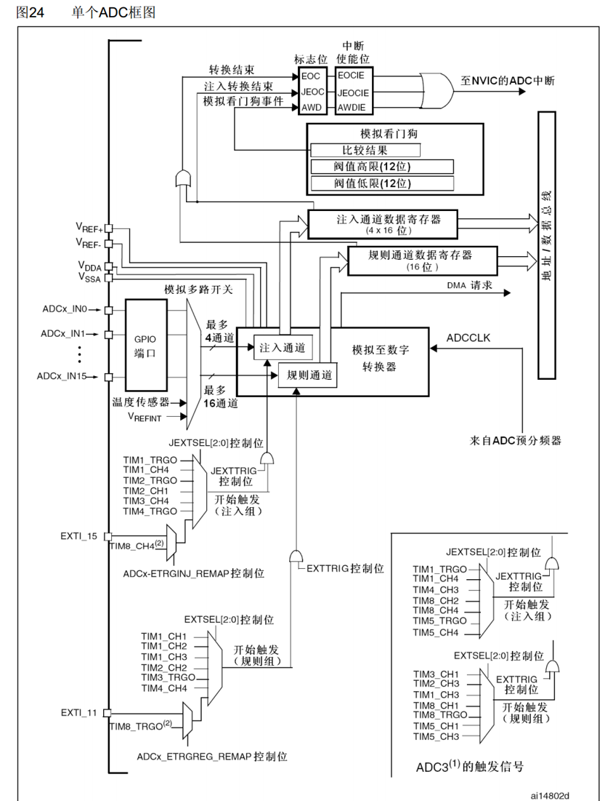
先在这里划分出几个模块：
`模拟多路开关` = `通道选择开关` + `地址锁存和译码`
`开始触发` = `START`
`模拟至数字转换器` = `定时与控制` + `SAR寄存器` + `DAC` + `比较器`
`锁存缓冲器` = `通道数据寄存器`
V~cc~ ,GND, V~REF(+)~, V~REF(-)~ = V~DDA~ ,V~SSA~, V~REF(+)~, V~REF(-)~
`ADCCLK` = `CLOCK`
.
接下来讲一些基础DAC里没有的东西:
- 在模拟多路开关中,  可以选择**多线同时连接** `规则通道 / 注入通道`.
  如果是普通ADC,你想同时测量多个通道的模拟量, 你要么连多个ADC, 要么在软件程序内频繁更换`地址锁存和译码`的值,一个耗软件,一个耗硬件.
  但是, 框图中的`多线同时连接`和`规则通道 / 注入通道`, 就可以避免这个问题. 
  .
- `规则通道 / 注入通道`
  - `规则通道`
    可以通过16条线同时连接, 填入最多16路的通道.
    随后按配置,对填入的通道**依次**进行`量化`
    但是其尴尬的地方在于它存放量化结果的寄存器只有一个, **每个量化结果都会放在其中**, 这会导致**前者会被后者覆盖!!!**
    > 所以想使用`规则通道`的多线同时连接功能, 需要配合DMA使用, 实现每次存放结果后及时转运数据.
    .
  - `注入通道`
     可以通过4条线同时连接, 填入最多4路的通道.
     但是和`规则通道`不同的, 其存放量化结果的寄存器足足四个, 主打一个量大管饱. 所以**不会有数据覆盖的问题**
     > 缺点就是配置复杂, 适合突发事件的量化.

- **开始触发**
  两种触发模式: 软件触发和硬件触发.
  - 在 AND 门旁边的`控制位` 就是 软件触发所用的寄存器的引脚.
  - 其余通过`复用器`的, 就是硬件触发所用的引脚输入.
  软件触发可以利用中断, 或者主程序;
  硬件触发可以利用定时器或者外部引脚. 
  > 一般建议使用硬件触发, **不使用中断**.
    因为在真正的开发项目中, 会有许许多多的中断, 由于优先级的不同,可能会导致**开始转换有一定的时间误差**, 也可能导致**其他中断无法及时响应**.  
    所以, 像这种需要**频繁进中断, 且工作简单**的情况, 往往会有硬件电路的专门设计. 

  .
- **ADCCLK**
  `ADCCLK`来自`ADC预分频器`, 而`ADC预分频器`又来自`APB2`. 关系如下图:
  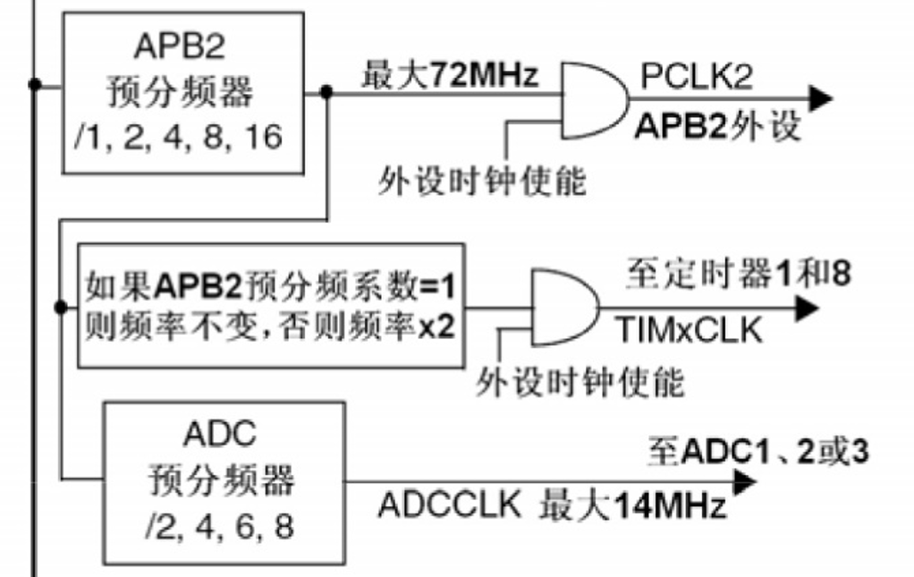
  .
  - **ADCCLK工作频率最高14MHz**.
    图中提到ADCCLK工作频率最高14MHz, 这是因为内部一次完整的模数转换需要一段时间. 如果频率太高会导致**上次转换还没完成, 就开始下一次转换**的情况, 导致结果不精准甚至出错.
    .
  - **ADC预分频器可以选择2、4、6、8分频**.
    因为ADCCLK工作频率最高14MHz, 所以实际只能选择6、8分频.
  > 在ADC中, 需要接入两个时钟, 分别是`RCC_APB2Periph_ADC` 和 `ADCCLK`, 前者是默认的时钟信号, **后者是模拟至数字转换器的专属时钟信号**.

    .
- **模拟看门狗**
内部有个`阈值高限`和`阈值低限`. 
该模块会关注它看门的通道, 并监测其电平范围, 一旦越出阈值, 就会申请中断.
.
- **EOC**~End_Of_Conversion~
  当`规则/注入通道`的任一通道的转换完成时, SAR状态机会发出EOC信号, 并在相应状态寄存器**挂起标志位**, 如果中断使能位使能, 则同时会在NVIC 的相应中断标志位.
  我们通过读取这个标志位, 就可以知道转换结束与否了.
  > 注入通道还会额外发出JEOC信号. 

  .
- `ADC_Cmd(ADCx)`——所有配置准备好后的**总开关**
  在写程序时, 需要在写完所有ADC配置后, 加入这个函数, 以激活ADC真正开启.

  | 软件操作 | 硬件响应 |
  |:--------:|:--------:|
  | `ADC_Cmd(ENABLE)` → `CR2[ADON]=1` | 触发上电控制逻辑 |
  | ↓ | 打开模拟电源开关（接通 VDDA） |
  | ↓ | 启动偏置和基准电路 |
  | ↓ | 释放时钟门控（允许 ADCCLK 进入） |
  | ↓ | 复位释放，状态机进入 IDLE |
  | ↓ | ADC 模块 ready，可接受 START |

  > 要在配置好再打开;
    同样, 想要再配置`模拟至数字转换器`~图里中心的方框~ , 也要先关闭`ADC_Cmd`函数
  **没有人会对一个正在高速旋转的扇片内部的电线动手动脚()**
  话糙理不糙, `ADC_Cmd`函数做的不是复位, 不是重启刷新, 只是单纯的让元件先停下来.

  .
- **双ADC模式**
  在我们这款单片机中, 有2个ADC, 其中他们`模拟多路开关`的输入引脚是完全一样的.(除了ADC1有内部的两个通道, 而ADC2没有以外)
   这个特性, 可以使得`ADC1`和`ADC2`配合组成`同步模式`和`交叉模式`.
   在交叉模式下, `ADC1`和`ADC2`交叉地对一个通道进行采样, 这样进一步提高了采样率, 结果更精准.
  .
- **数据对齐**
  ADC内部的`ADC_SAR`是12位的, 但是`ADC_DR` 是 16位的, 所以存在数据对齐的问题, 从而诞生了两种对齐模式:
  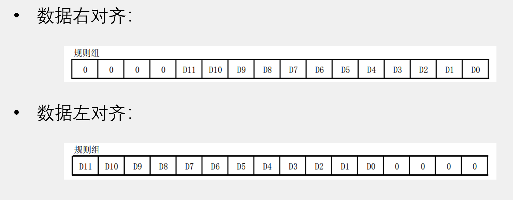
  - 数据右对齐：
    常用。 读取寄存器就是转换结果。
    .
  - 数据左对齐:
    虽然这样看, 转换结果变大16倍, 但是我们可以只读高8位.
    这样可以减轻数据不稳定,  时常尾部跳变的问题.
    属于是用采样精度换采样稳定性的举措.
    .

#### 转换模式
核心是**单次 / 连续转换** 和**扫描 / 非扫描模式**
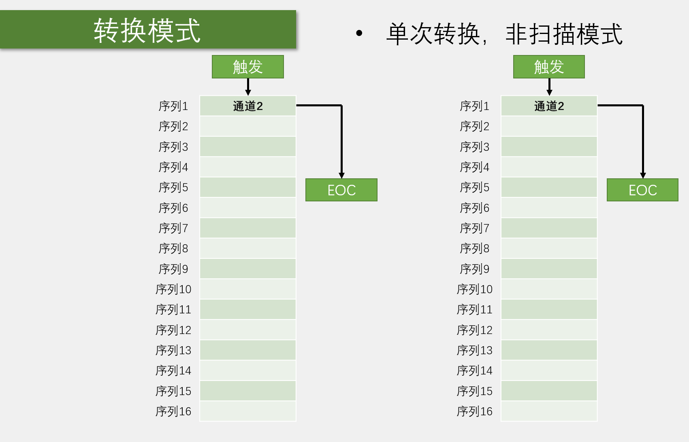
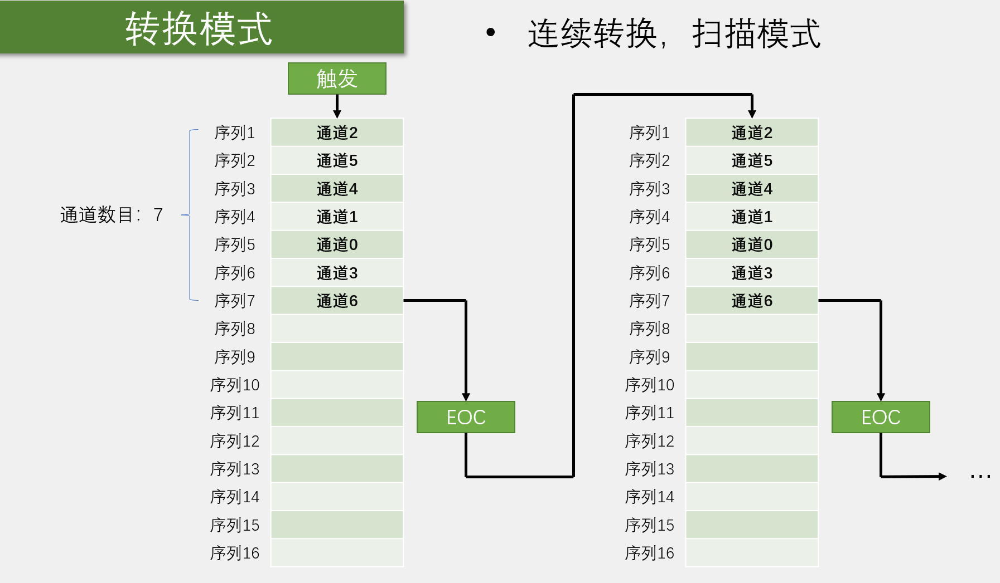
- **扫描 / 非扫描模式**
  `非扫描模式`只看序列 1 的通道， 后续序列的通道不转换, 
  第一通道转换完, 写入`数据寄存器`, 并同时发出`EOC信号`。
  `扫描模式`, 会通过配置, 转换前n个的通道, 
  **每次**的通道转换完都将值写入`数据寄存器`, 同时发出`EOC信号`.

  > EOC信号的本质是**每次转换结束**的标志，目的是通过标志位的挂起, 实现数据的读取和其他转换结束后必要的操作. 

  `扫描 / 非扫描模式`, 实际上也是个和SAR类似的**状态机**. 通过输入,改变状态, 并时刻记住当前状态
  .
  - **间断模式**
     在扫描的过程中, 每隔几个转换, 就暂停一次.
     等到再次触发才会继续转换.
  .
- **单次 / 连续转换**
  `单次转换`, `START信号`接收后, 进行**单次的扫描 / 非扫描模式**.
  此时**CONT位置 0** . `扫描 / 非扫描模式`读取到后, 在选择组的最后一个通道停止下来.
  .
  `连续转换`, `START信号`接收后, 进行**连续的扫描 / 非扫描模式**.
  此时**CONT位置 1** . `扫描 / 非扫描模式`读取到后, 不会在选择组的最后一个通道上停止，而是再次从选择组的第一个通道继续转换.
  .
  > 相较于`单次转换`, 连续转换省去了`读取 → 判断是否完成 → 再次触发`的过程, 效率更高;
  并且`单次转换`在扫描模式下读取完一整个选择组后,想再次触发一次单次转换, 需要利用到DMA和中断. 有点麻烦.

  其实`单次 / 连续转换`更像是`扫描 / 非扫描模式`的一个小功能, 提供输入, 控制状态机状态.
  .
- **EOC信号的清除**:
  - 新转换启动时~（硬件自动）~
    `START触发信号`被接收后, 硬件自动清除EOC标志位.
    . 
  - 读取 ADC_DR 时~（硬件自动）~
    CPU / DMA 读取完 `ADC_DR` 后, 会自动清除EOC标志位

#### 转换时间
- **AD转换的步骤：**
  `校准`，`采样`，`保持`，`量化`，`编码`
  - 量化编码:
    量化就是逐次逼近的过程;
    编码就是写入ADC_DR的过程.
    .
  - 采样保持:
    `量化编码`需要一定的时间, 所以需要保证量化编码期间的**输入电压保持不变**, 因此才有了`采样保持`的步骤:
    `模拟多路开关`的输入和ADC_SAR中间, 其实还有一个小容量的**接地**电容.
    在采样阶段, `模拟多路开关`的输入 与 电容相连, 
    过**额定**的采样时间后, 断开两者的连接, 电容转向和ADC_SAR相连, 开始保持阶段.
    > 采样时间短, 采样效率高;
      采样时间长, 采样稳定性高.
    .
  - **校准:**——前置操作
    ADC有一个内置自校准模式。校准可**大幅减小因内部电容器组的变化而造成的准精度误差**。
    - 原理:
    校准期间，在每个电容器上都会计算出一个误差修正码(数字值)，这个码用于消除在随后的转换中每个电容器上产生的误差
    
    > 建议在每次上电后执行一次校准
    **启动校准前， ADC必须处于关电状态超过至少两个ADC时钟周期**
    
    .
    
- STM32 ADC的总转换时间为：
  TCONV = `采样时间` + `12.5个ADCCLK周期`
  > 例如：当ADCCLK=14MHz，采样时间为1.5个ADCCLK周期
    TCONV = 1.5 + 12.5 = 14个ADCCLK周期 = 1μs

## MDA 直接存储器储存
### 简介
DMA~（Direct_Memory_Access）~`直接存储器存取`
DMA可以提供**外设和存储器**或者**存储器和存储器**之间的高速数据传输，**无须CPU干预**，节省了CPU的资源
12个独立可配置的通道： DMA1（7个通道）， DMA2（5个通道）
每个通道都支持软件触发和**特定的硬件触发**, 
也就是说每个通道的**硬件触发源是固定的**, 是硬件安排好的, **各不相同**

> STM32F103C8T6 DMA资源：DMA1（7个通道）, 上面的DMA2是其他型号拥有的.
> DMA实质上就是存储器之间的数据传输, 所谓的 **`外设` ,其实指的是外设的寄存器**, 可以写入信息,也可读出信息.

### 存储器映像
这一块建议去学计算机组成原理, 这里怎么讲都不够完善
#### 关于存储器的基本知识
##### 存储器分类
- **按是否断电后保留数据分类**
  - 易失性存储器（Volatile Memory）
    断电后数据丢失。
    典型代表：RAM（随机存取存储器），如 DRAM、SRAM。
    用于临时存储正在运行的程序和数据。
    .
  - 非易失性存储器（Non-volatile Memory）
    断电后数据仍保留。
    典型代表：ROM、Flash、硬盘（HDD）、固态硬盘（SSD）、EEPROM 等。
    用于长期存储操作系统、应用程序和用户文件。
    .
- **按访问方式分类**
  - 随机存取存储器（Random Access Memory, RAM）
    可以直接访问任意地址的数据，访问时间与位置无关,如主存（内存条）。
    .
  - 顺序存取存储器（Sequential Access Memory）
    数据必须按顺序读取，如磁带。
    .
  - 直接存取存储器（Direct Access Memory）
    可直接定位到大致位置再顺序查找，如硬盘。
    .
- **常见类型**
  | 类型 | 特点 | 应用场景 |
  |------|------|----------|
  | SRAM（静态 RAM） | 速度快、功耗高、成本高、无需刷新 | CPU 缓存（L1/L2/L3） |
  | DRAM（动态 RAM） | 速度较慢、需定期刷新、成本低、密度高 | 主内存（如 DDR4/DDR5） |
  | ROM（只读存储器） | 出厂写入，不可更改 | BIOS 固件 |
  | PROM / EPROM / EEPROM | 可编程或可擦写 ROM | 嵌入式系统配置存储 |
  | Flash Memory | 非易失、可擦写、速度快于传统硬盘 | U盘、SSD、手机存储 |
  | HDD（机械硬盘） | 容量大、价格低、速度慢、有机械部件 | 大容量数据存储 |
  | SSD（固态硬盘） | 速度快、无噪音、抗震、价格较高 | 系统盘、高性能存储 |


##### 存储器地址
**这是补充, 在单片机内没有操作系统 和 MMU, 所以只有物理地址.**

在现代计算机系统中，从**应用程序或普通进程**的视角看，存储器地址是**虚拟**的。
从`操作系统内核或硬件（如 MMU）`的视角看，最终必须转换为`物理`地址才能访问真实**内存**。
>虚拟物理地址是属于内存RAM的概念, 像是硬盘之类的, 不直接和程序打交道, 所以没有虚拟地址的概念.

| 概念 | 说明 |
|------|------|
| 虚拟地址（Virtual Address） | 由 CPU 生成、程序使用的地址。对每个进程来说，它好像拥有一个连续、独立的地址空间（如 0x00000000 到 0xFFFFFFFF）。 |
| 物理地址（Physical Address） | 实际对应内存芯片中某个存储单元的地址，由内存控制器使用，是硬件层面的真实地址。 |

- **虚拟地址的意义**
1. **内存隔离与保护**
  每个进程拥有独立的虚拟地址空间，互不干扰。一个进程无法直接访问另一个进程的内存。
  .
2. **简化编程模型**
   程序员无需关心物理内存布局，可以假设自己拥有连续的大块内存。
  .
3. **支持大于物理内存的地址空间**
  通过虚拟内存（Virtual Memory）机制，配合磁盘交换（swap），可以让程序使用比实际 RAM 更大的地址空间。
  .
4. **内存碎片管理**
  物理内存可能碎片化，但虚拟地址空间对程序来说是连续的。
  .

- **虚实地址转换方法**
  这个过程由 MMU（Memory Management Unit，内存管理单元） 完成，配合操作系统的页表（Page Table）： 
  > **操作系统负责建立和维护页表，将虚拟页映射到物理页。**

  .
- **地址表示**
  无论是虚拟地址还是物理地址，其地址空间都是以**字节为最小可寻址单位**。
  也就是说每位地址内可以存8位二进制数.
  .
  地址的表示是**32位的二进制数**~(uin32_t)~, 一共占四个字节, 也就是存一个地址需要 4位 的地址空间.  
  随后通过 `地址译码器` 硬件自动化地实现对物理内存的访问. 
  .
- **地址数据类型和32位无符号整形数据类型的异同**
  个人理解, 数据类型决定两个东西: 
  1. 内容 的 字节数
  2. 内容的使用规范
  > 比如, `int` 和 `float` 最基础的两种数据类型.
   `int` 和 `float` 都保证**读写**内容的字节数是 是 4 位.
   但同时 `int` 是按`补码规则`读写使用的;
   而 `float` 是遵循 `IEEE 754 标准`读写使用的.

  和(`int` 和 `float`)关系类似的, 
  (`int * / void * / ....`) 和 `uint32_t`  内容字节数相同, 但内容使用规范不同.  
  在 STM32（以及绝大多数 32 位嵌入式系统）中，都是用一整个寄存器读取物理地址,也就是32位. 所以标准库选择用 **uint32_t** 表示地址值, 
  这同时实现了**灵活地进行地址偏移计算、强制类型转换, 从而实现寄存器映射**
  举个例子:
  ```C
  #define APB2PERIPH_BASE    ((uint32_t)0x0d000721)        // 整数常量, 真实值不是这个 ,我只是在玩梗...
  #define GPIOB_BASE            (APB2PERIPH_BASE + 0x0C00)    //实现地址偏移.
  #define GPIOB         ((GPIO_TypeDef*)GPIOB_BASE)   // 强制类型转为指针类型！
  typedef struct
  {
    __IO uint32_t CRL;
    __IO uint32_t CRH;
    __IO uint32_t IDR;
    __IO uint32_t ODR;
    __IO uint32_t BSRR;
    __IO uint32_t BRR;
    __IO uint32_t LCKR;
  } GPIO_TypeDef;
  /**  这里也是很巧妙的结构体特性的地址偏移运算:
      &GPIOA->ODR = GPIOB_BASE + 0x0004 * 3

  */
  // 使用：
  GPIOA->ODR = 0xFFFF;  
  /** &GPIOA->ODR = GPIOB_BASE + 0x0004 * 3, 程序现在知道了该寄存器的物理地址. 就把右值赋值过去了
    GPIOA->ODR 是 &GPIOA->ODR 里存取的值.
   */
  DMAy_Channelx->CPAR = (uint32_t)&GPIOA->ODR;
  /**  这行👆代码,往往用于让寄存器保存地址数据,  
      寄存器本质上只认“二进制位模式”
      所以我们通常用 uint32_t 来表示这个位模式，因为它最方便、最直接
      &GPIOA->ODR 是存取的地址.
  */
  ```
#### STM32中的存储器及其地址
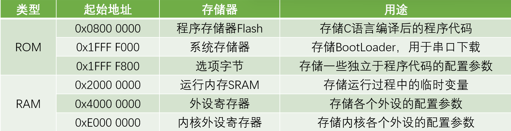
- **存储器类型**
  - **ROM:**
    ROM，意为`只读存储器`， 是一种非易失性, 掉电不丢失的存储器 
    >  并不是完全不可写, 只是只有在特定情况下才允许写入.
    > 特点就是数据保存时间长, 断电后数据仍保存.

  - **RAM:**
    RAM，意为`随机存取存储器`， 是一种非易失性, 掉电不丢失的存储器 
    > 读写超快，临时存放，断电就没
  
    .
- **外设寄存器 / 内核外设寄存器**
  RAM上属于`外设寄存器 / 内核外设寄存器`地址里的内容 会一一对应地存放在各个`外设寄存器 / 内核外设寄存器`里. 

### DMA框图
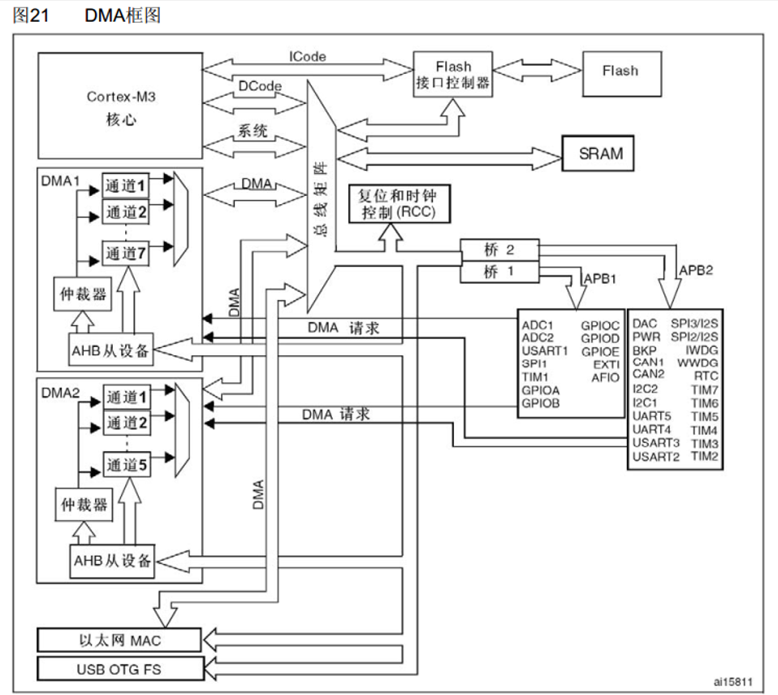
- **总线矩阵**
  为了**高效有条理地访问**存储器，所以设计了`总线矩阵`。
  `总线矩阵`的左边是`主动单元`/`主设备` 即 拥有存储器的访问权~(读写权限)~;
  右边是`被动单元`/`从设备`,  只能`主动单元`被读写.
  主动单元如下:
  1. `DCode` 专门访问Flash;
  2. `系统总线`访问其他东西;
  3.  `DMA总线`
    `DMA1` / `DMA2` / `以太网MAC` 各有一条`DMA总线`;
  >但寄存器**最终是否可被读写, 还得看寄存器自身的可读写性**.

    .
- **DMA内部结构**
  - **触发通道**
    每个通道都可以**独立**设置它们转运数据的**配置**, 包括源地址和目的地址等等.
    .
  - **仲裁器**
    多个通道可以独立转运数据, 但是总线矩阵的`DMA总线`只有一条;
    所以 同一DMA的所有通道都只能**分时复用**这一条MDA总线.
    `仲裁器`就是安排他们先后顺序的.
    > 和`NVIC`很像, 但是不一样的地方在于`仲裁器`只有从占优先级, 并没有先占优先级

    > 总线矩阵也有一个仲裁器, 如果 DMA 和 CPU都要访问**同一个**目标, 就会暂停CPU的访问, 先让DMA来.
    但此仲裁器会保证CPU得到一半的总线带宽, 保证CPU正常工作.
  
    .
  - **AHB从设备**
    其实就是 DMA的相应配置寄存器.
    它有一个很有意思的点——**它连接在AHB总线上**.
    这意味着 `AHB从设备` 是可以被`主设备`控制读写的, 包括DMA自己.
    
    > 所以DMA既是`主设备`, 可以读写各种存储器, 
      同时也是`从设备`, CPU可以通过`AHB从设备`对DMA进行配置.

    .
  - **DMA请求**
    其实就是DMA的**数据存取的触发**.
    箭头源就是DMA的**硬件触发源**;

### DMA基本结构图
此图主要展现的是软件需要的配置内容.
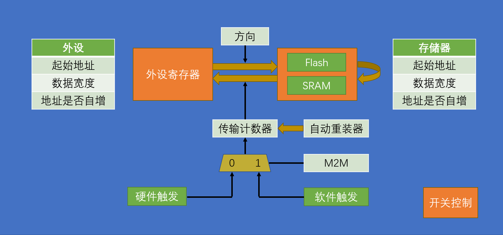
> <span style="color:red">注:
> 图中近乎所有配置都是某一具体通道的, 不同的通道的配置互不影响~(除了优先级)~</span>
能从图中看出来的我下文就不说了,写笔记太耗时了...

- **数据宽度**
  可以选择`字节`(8位) / `半字`(16位) / `全字`(32位)
  .
- **外设寄存器 和 存储器**
  所谓的外设寄存器和 存储器 其实都可以放任意地址. 外设寄存器也可以放SRAM ,存储器也可以放外设寄存器.
  都可以, 这只是为了**区分开两者**而已.
  .
- **传输计数器**
  一个自减计数器, 每转运一次, 计数器的值就要减一;
  当此计数器减到 0 后, 该通道就不会再进行数据传输了, 同时`外设寄存器`和 `存储器`配置中计数时**自增的地址, 会恢复到起始地址的值**
  > 需要在该**通道失能时赋值**.

  .
- **自动重装器**
  自动重装器若开启, 传输计数器减到 0 后, 会自动恢复到最初的值.
  如果不启动, 就是`单次模式`; 如果启动, 就是循环模式.
  .
- **触发模块**
  - `M2M`, ~意为Memory_to_Memory~, 选择是硬件触发, 还是软件触发.
  - **软件触发:**
    **ADC的软件触发**是触发一次,模数转换一次;
    但DMA的软件触发是, 以最快的速度**不断连续**触发DMA, 直至传输计数器为0, **目的是快速, 一般适用于存储器之间的转运**
    > 所以`软件触发`和`自动重装`不能一起开启.


    .
  - **硬件触发:**
    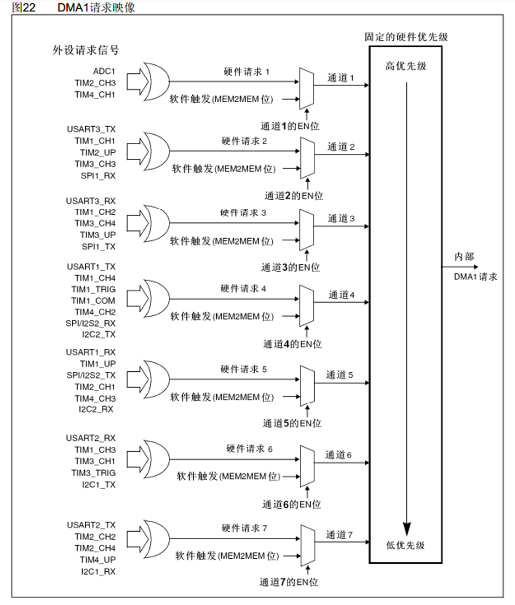
    一个通道会接许多的硬件触发源, 但自己并没有拦截措施.
    所以硬件触发源会有个函数, 叫做`XXX_DMACmd()`.用于决定是否开启向DMA的通道.
    .
- **开关控制:**
  就是DMA_Cmd()函数.
  需要注意的是这个函数它的**参数是具体的通道, 不是一整个DMA**

### 数据宽度与对齐
总之一句话，
**宽度不对， 要么高位补 0 ， 要么高位截断**

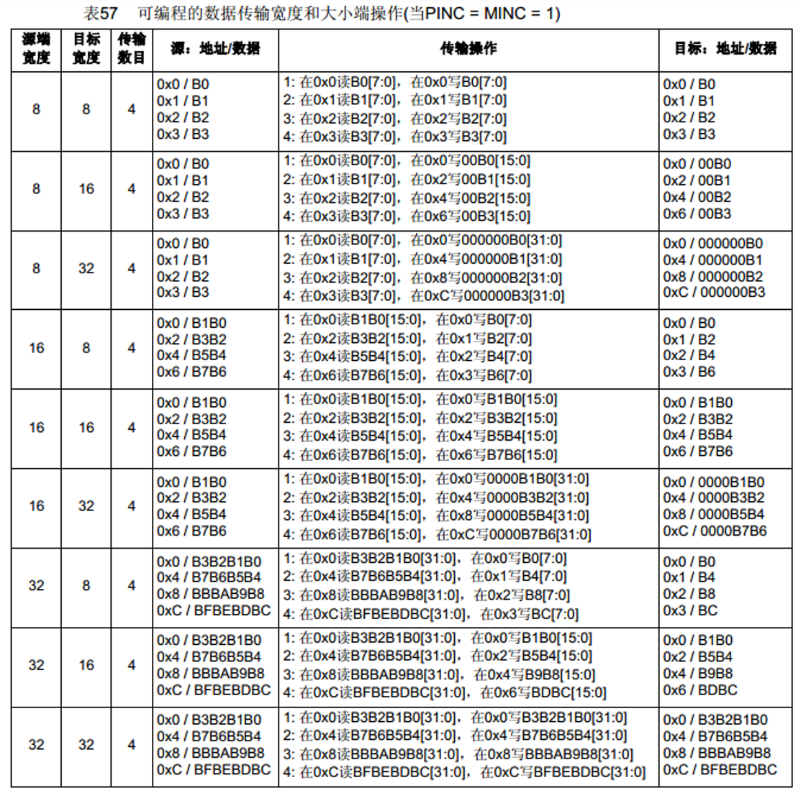


## 位段
### 简介
位段~（Bit-Banding）~是 `ARM Cortex-M3/M4/M7/M33` 等处理器提供的一种**硬件级内存映射机制**，其核心原理是：
> 将 1 个比特（bit）的读写操作，映射为对一个 32 位字（word）地址的普通读写操作，从而利用 CPU 的原子写指令实现“单 bit 原子操作”。


### 硬件原理：
**别名区（Alias Region） + 位展开**
#### 核心思想
ARM 在内存地址空间中额外开辟了一块“别名区”（Alias Region），这块区域的每一个 32 位地址，都唯一对应原始内存区域中的 1 个比特。
写别名区的某个 32 位地址 → 硬件自动将值（0 或非 0）写入对应的原始 bit；
读别名区的某个 32 位地址 → 硬件返回该 bit 的值（0 或 1）。

>当 CPU 访问别名地址 时：
>1. 地址译码器识别出这是“位段别名区”；
>2. 提取原始地址和 bit 位置（**通过地址编码**）；
>3. 向原始存储器（如 ODR 寄存器）发起一个“原子位写”操作；
>4. 该操作由**总线矩阵或存储器控制器内部逻辑完成**，确保不可中断。

### 地址映射原理
ARM 定义了两个支持位段的原始区域及其别名区：
| 原始区域 | 地址范围 | 别名区地址范围 |
|--------|--------|--------------|
| SRAM 位段区 | `0x20000000 – 0x200FFFFF`（1 MB） | `0x22000000 – 0x23FFFFFF`（32 MB） |
| 外设位段区 | `0x40000000 – 0x400FFFFF`（1 MB） | `0x42000000 – 0x43FFFFFF`（32 MB） |

要访问 原始地址 A 的第 b 位（b = 0~31），其对应的别名地址为：
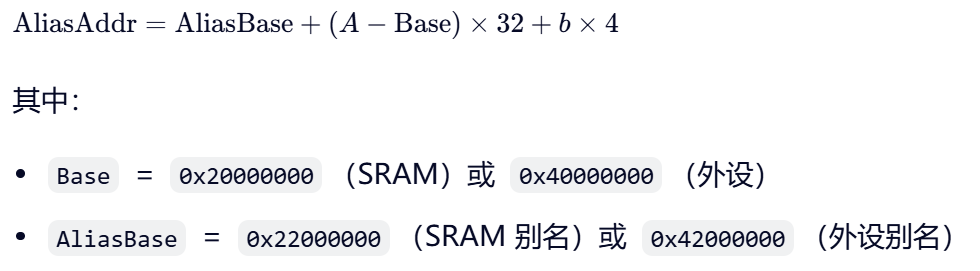

### 诞生原因
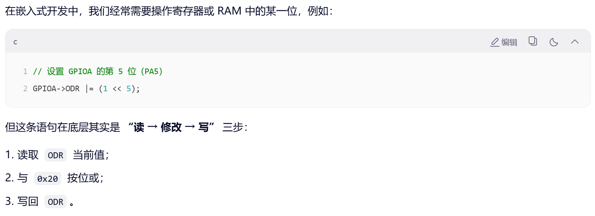
~偷个懒，bro累了。~
上图的传统方法有个问题——**非原子性**：

- 如果在第 1 步和第 3 步之间发生中断，且中断服务程序也修改了 ODR，就会导致位操作被覆盖（竞态条件）。
虽然可以用 __disable_irq() 关中断解决，但影响实时性。

所以采取了位段这种**用空间换取原子性**的操作。

## USART 串行通信接口
### 简介
USART, 全称为 `Universal Synchronous/Asynchronous Receiver/Transmitter`, 意为 `通用同/异步收发器`. 
俗称 `串行通信接口`, 简称 `串口`~serial_port~.
其用于在两个设备之间`逐位`传输数据。
> 与并行通信（一次传多个 `bit`）相比，串口引脚少、布线简单、抗干扰强，广泛应用于嵌入式系统、调试、传感器通信等场景。

支持同步模式、硬件流控制、DMA、智能卡、IrDA、LIN;

> STM32F103C8T6 USART资源： USART1~在APB2上~、 USART2、 USART3~这俩在APB1上~


除了串口直连芯片，还可以通过串口-其他通信接口的**转接口**，进一步扩大通信对象的范围。
比如，单片机与单片机~USART直连~ 、单片机与电脑~USART-USB转接口~等等，这极大地**扩展了单片机的应用范围**，增强了单片机系统的硬件实力
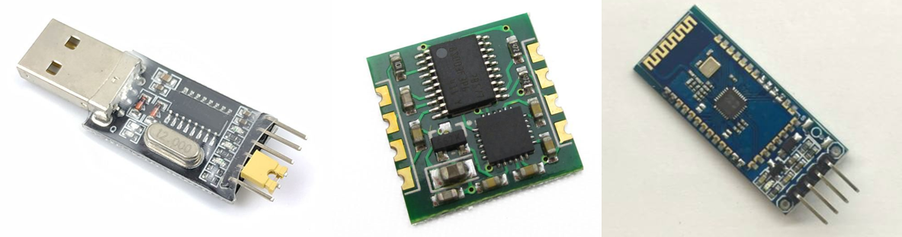
> 左边是`USART - USB`转接口;
> 中间是`USART - I^2^C`转接芯片;
> 右边是`USART - BLUETOOTH`转接模块;

- **常见类型**
  | 名称 | 全称 | 特点 |
  |------|------|------|
  | UART | Universal Asynchronous Receiver/Transmitter | 异步通信，仅需 TX（发送）、RX（接收）两根线，无时钟信号 |
    | USART | Universal Synchronous/Asynchronous Receiver/Transmitter | 支持异步（UART 模式）和同步（带 CLK 时钟线） 两种模式 |
  |在绝大多数应用场景（如打印调试信息、与蓝牙/WiFi 模块通信）中，串口 = UART/USART 的异步模式。|||
  |USART的同步时钟只能输出, 并不能输入, 不能支持两个USART直接进行同步收发.所以这个模式更多的是为了兼容其他协议或者特殊用途|||

- **优缺点**
  | 优点 | 缺点 |
  |------|------|
  | 引脚少，硬件简单 | 速率相对较低（一般 ≤ 2 Mbps） |
  | 协议简单，易于实现 | 无内置错误恢复机制 |
  | 成本低，兼容性好 | 点对点通信（一般不支持多机总线，除非用 RS-485） |

- **总结就一句话**:
  串口是最基础、最常用的嵌入式通信方式——它用最少的线，实现可靠的“对话”。
  所以常被选作新手学习`通信`的 第一方案.

### 通信接口
- **通信**
  一个芯片的集成能力始终是有限的， 当超出芯片集成能力范围的时候， 就会使用外挂其他芯片来实现某一功能，以扩展硬件系统。 
  两个芯片之间~亦或者说两个设备之间~， 需要沟通和指挥，**这个沟通和指挥的过程， 就是通信。**
  .
- **通信协议**
  制定通信的规则，通信双方按照协议规则进行数据收发.
  .
- **STM32上的常见通信接口**
  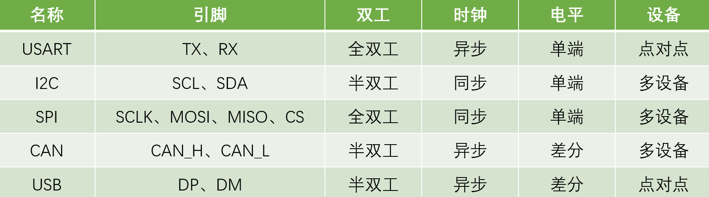
  - **引脚**
    - USART:
      TX 和 RX, 意为 `Transmit Exchange` / `Receive Exchange`;
      有的地方也叫 TXD 和 RXD, 意为 `Transmit Exchange Data` / `Receive Exchange Data`;
      .
    - I2C / I^2^C
      SCL 和 SDA ， 意为 `Serial Clock` 和 `Serial Data`;
      .
    - SPI
      SCLK , MOSI, MISO 和 CS， 意为 `Serial Clock` / `Master Output Slave Input` / `Master Output Slave Output` / `Chip Select`.
      .
    - CAN
      CAN_H 和 CAN_L, 意为 `Controller Area Network High` / `Controller Area Network Low`
      是一组差分数据脚, 用两线的电压差来表示信息.
      .
    - USB
      DP 和 DM, 意为 `Data positive` 和 `Data Minus`.
      同样是一组差分数据脚
      .
  - **工作模式**
    有两种配置, 一个是`单 / 双`, 一个是`全 / 半`.
    - 单 / 双
      指通信方向, 
      单工只能实现一方对另一方的通信, 反过来则无法实现;
      双工可以实现双方的相互通信.
      .
    - 全 / 半
      指通信的同时性.
      全工往往有两条互不相干的通信线, 一根作为 A → B 的通信线, 一根作为 B → A 的通信线. 两个通信线可以同时工作.
      而半工往往要么只有一条通信线, 要么就是两根通信线是差分数据线.导致通信无法同时双向进行.
      .
    - **时钟特性**
      分为 `同步` 和 `异步`, 
      `同步`, 接收方可以在时钟信号的指引下进行采样.
      `异步`, 没有时钟信号同步指挥, 所以双方就会**约定一个采样频率**, 比如`波特率`.同时还需要**加一些帧头帧尾, 以对齐采样位置**.
      > 其中`异步` 在面对容易出现突发中断的情景下可能会造成数据丢失, 这时需要 `DMA` .
      .
    - **电平特性**
      分为`单端` 和 `差分`, 
      `单端`判断信号为 `0 / 1`的 依据是, 其**电平值和GND之间的电压差**, 所以设备间一定要共地;
      `差分`判断信号的依据是, 差分引脚的电压差, 勿复言尔.
      > 差分的抗干扰能力很强, 所以传输速度和距离都很高.
      
      .
    - **拓扑模型**
      `点对点`是只能两个设备之间对话;
      `多设备`就是可以多设备之间沟通,可以是`主从`~一对多指挥~, 可以是`对等`~平等沟通~
      > 多点通信需要给每个设备分配地址, 需要寻址才能通信.

### 数据收发单元——数据帧
在串口中， 每8 或 9 位 `bit` ~数据位和校验位~都被封装到一个数据帧内，打包好后进行收发。
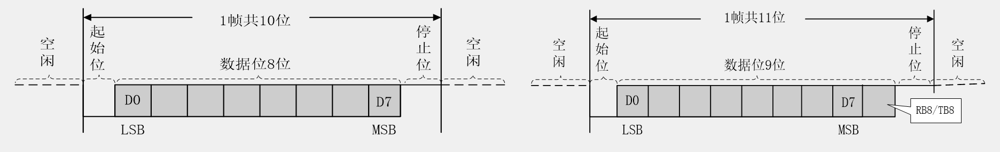
每个数据帧都由 `起始位`，`数据位`， `校验位` 和 `停止位`组成
以下是数据帧参数的介绍:
- **波特率:**
  用于规定串口通信的速率.~因为串口是异步通信~, 以保证双方发送和接收的速率一致.
  单位是 `码元 / s`, 也叫做波特`Baud`.
  > ``码元``是数字信号在信道上传输的**最小信号单元**,也就是`最小的能发出完整信号的一个单元` 不仅包含数据位, 还包括 起始位 / 校验位 / 停止位. 
  我们这里采用电平高低表示二进制信息 `0` / `1`, 那这里的规定时间内的高低电平就是一个码元.
  又或者,  想象用手电筒通信：
  1秒内闪 1 次 表示 “00”
  1秒内闪 2 次 表示 “01”
  1秒内闪 3 次 表示 “10”
  1秒内闪 4 次 表示 “11”
  此刻 1秒内闪光次数代表的信息就成了`码元`, 在这个例子里, **码元和比特不是一比一对等的关系.**

  > `各码元持续时间`不一定相同, 因为其他位时间都是一致的, 但停止位的时间长度可以是他们的 1 / 1.5 / 2 倍, 这就导致了设置波特率后, 再**设置不同时长的停止位, 其实每秒发送的码元数量是不一样的**?
  所以, 在波特率这个概念中, 码元更像是被定义成数据位的`码元持续时间`, 成为了时间概念.

  回归正题, 也就是说, 数据包里的每一位都是一个码元.
  > **不是一个数据帧,是一个码元!!!**
  .
  
- **起始位:**
  标志一个数据帧的开始,固定为低电平.
  > 由于这个设计, 所以引脚在空闲状态必须是高电平.
    目的是**产生一个下降沿**.

  .
- **停止位:**
  用于数据帧间隔, 固定为高电平.
  停止位可以选择配置宽度(单位是`码元`)
  > 发送多个数据帧的时候, 数据帧是紧密相连的.
  也就是说 `停止位` 后面紧跟 `起始位`, 所以需要`停止位`置高电平, 方便**后续产生下降沿**.

  .

- **校验位:**
  串口可以选择`无校验` / `奇校验` /  `偶校验`, 用于数据验证，根据数据位计算得来, 如果数据出错, 会置位 `奇偶错误` 标志位~（Parity_Error）~.
  基本实现如下:
  奇校验时, 发生方会保证 `数据位 + 校验位`中 **置 1 的位数是奇数个**.
  偶校验时, 发送方会保证 `数据位 + 校验位`中 **置 1 的位数是偶数个**.
  然后接收方会对数据置 1 个数进行验证.
  > 缺点是, 如果由于干扰, 同时出错偶数项, 那就检测不出来了.
    **如果想要更高的检出率, 可以使用[CRC检测](#crc检测)**
  
  .
- **数据位:**
  数据帧的有效载荷, 1为高电平，0为低电平，**低位先行**.
  如果选择无校验, 数据位就会把数据帧中无校验的那一位当成数据位使用, 也就是 **数据位 + 1**
  > 为了每一个数据包内都恰好包含一个字节的数据, 我们一般不校验的时候, 就选含 8 `bit` 数据包; 
  需要校验的时候, 就选含 9 `bit` 数据包; 

  .
#### 输入采样
在串口的输出中, 只要管`波特率`, 按波特率的频率,一次次的向右移位, 将**翻转的高低电平**发送出去就可以了.输出中管理这种`移位发送`的时钟, 称为 `移位时钟`.`移位接收`也是靠的移位时钟.

**但是**, 在输入中, 串口要管的就不止这么些了:
1. 不仅要基本地保证输入的`移位接收`频率和波特率一致, 和判断起始位的到来.
2. 还要在*每次对码元高低电平进行**多次**读取*,即**输入采样**时, 保证采样位置 正好处于每一码元的正中间, 以确保`移位接收`的结果可靠.
> 为什么要进行多次读取?
  防止噪声对结果造成污染.
  .
> 为什么要在正中间读取?
  如果采样位置在码元交替处不远, 电平不稳定, 采样出错的可能就高了.

先提下背景, 为了解决这些问题, STM32将`移位时钟`频率进行`16倍增`, 产生`采样时钟`, 在**每个采样时钟周期**都对 `RX` 输入的数据帧 进行采样.
这意味着, `输入采样`会对**每一个码元进行16次采样**~停止位不一定~
- 为了解决第一个问题, STM32进行了`起始位侦测`:
  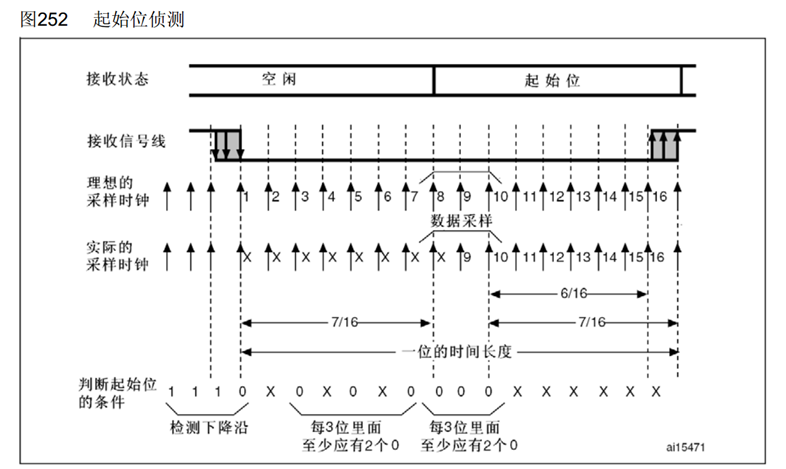
  在数据检测到下降沿时, 也就是一次 `1 → 0`~这算作第一次采样~, 会对后续的第  `3 / 5 / 7` 、 `8 / 9 / 10` 进行两批`三采样`, 要求每批结果中都 需要至少 2个`0`;
  如果检测结果为 只有 2 个 `0`, 算是检测成功, 但是会置一个`NE`噪声标志位.
  如果检测结果为 少于 2 个 `0`, 算是检测失败, 重新捕获下降沿.
  这解决了**判断起始位的到来**的问题;
  同时因为此刻的`8 / 9 / 10`就是起始位的正中间, 只要对之后数据位的`8 / 9 / 10`进行`三采样`, 也照样是在码元的正中间.这解决了**保证输入的`移位接收`频率和波特率一致** 、**多次采样**  和 **采样位置 正好处于每一码元的正中间**的问题.
> 因此, 这种模式也被叫做`16倍过采样模式`.

#### CRC检测
全称为`循环冗余检测`。
CRC检测的精髓在于 `模 2 算法`,
其对二进制数据进行**自定义的算法逻辑**, **不同往常十进制的数值算法**.
##### 模 2 算法
该算法自定义了以下规则怪谈( ):
1. 二进制数不再被看成整体的数值, 而是被看作一个 x^n^ 多项式的系数, 
  这导致在加减法上 各位的数值互不干扰, **不再有进制**.
  .
2. `原数 ≡（原数 mod 2）`，当原数出现 `0` / `1`以外的值的时候, 需要立刻通过这个等式换成 只剩 `0` / `1`的数.
  这导致`加法 = 减法 = 异或`。  .
  .
3. 基于`1.`, × x^n^ 相当于把整个多项式左移 n 位;
  在二进制中，就是在末尾添加 n 个 0.
  .
4. 基于`1.`，除以某一个数，就相当于以这个数进行**长除法**, 其中每次长除之前, 被除数都要进行一次`2.`操作.
  这导致所得**余数必定是  (n - 1)位以内 的二进制数**。
  .
5. 基于`2.`和`4.`，因为 `原数 = 商 * 除数 + 余`， 所以`（原数 + 余） = 商 * 除数`
所以，`（原数 + 余）mod 除数 = 0`

以下对上述规则进行一定注释:
- `1.`中的`就像x^n^之间互不干扰`:
  举个例子:
  > 在 这种算法中,
    1011 = x^3^ + x^1^ + x^0^, **而非** 1011 = 11
    其中, x不是普通的`数字`或`未知数`,是二进制多项式中的`位权`
    **这体现出这种算法注重结构,而非数值.**
  
- `2.`中的`原数 ≡（原数 mod 2）`:  
  所有的数值, 按奇偶划分, 经历 `2.`后, 只剩下 `0` / `1`
  | 普通整数 | mod 2 |
  |--------|------|
  | 0      | 0    |
  | 1      | 1    |
  | 2      | 0    |
  | 3      | 1    |
  | 4      | 0    |
  
  比如
  . 
- `2.`中的`加法 = 减法 = 异或`:

  | a | b | a + b (mod 2) |      
  |---|---| :-------------:|
  | 0 | 0 | 0              |
  | 0 | 1 | 1              |
  | 1 | 0 | 1              |
  | 1 | 1 | 0              |

  | a | b | a - b (mod 2) |
  |---|---|----------------|
  | 0 | 0 | 0              |
  | 0 | 1 | 1              |
  | 1 | 0 | 1              |
  | 1 | 1 | 0              |

##### 检测原理
举个简单例子(CRC-4):
原始数据：`11010011101100` ~(12位)~
生成特定多项式：x⁴ + x + 1 → 二进制表示为 `10011`
> 多项式是每种`余数长度`特定的, CRC-4是指,余数结果是 `4 位` 二进制数, 余数结果也叫CRC值, 也就是**校验码**

1. 在原始数据末尾补 4 个 0~（因为CRC-4有4位）~ → `11010011101100 0000`
2. 用这个数除以 `10011`（**模 2 除法**）, 得到的余数就是 CRC 值（4 位）
3. 把**余数替换掉末尾的 4 个 0**，得到最终发送帧
4. 接收方做**同样除法，余数应为 0**，否则出错。

讲完了. 讲完了? 并非.
原理讲完不够, 还要讲讲它和硬件的超级契合度❤❤❤.
由于[模-2-算法](#模-2-算法)算法的规则,
在实际运算中, 其实该算法和以下操作效果一致:
1. 运算取最高位以及紧跟在后的4位, 一共 5 位, 
  最高位下一轮换成次高位,下下轮换成次次高位.... 
2. 对每次取出来的 5 位二进制数 的**最高位的数值** 进行判断
  如果是 `1`, 与 除数`10011`进行**异或**操作, **所得结果置换掉原数中的取出的这几位**;
  如果是`0`, break;
  >这一步 本质上就是一次长除, 是 `长除` **+** `原数 ≡（原数 mod 2）`的合体操作.
3. 直到 进行8次`2.`, 这时剩下四位数, 这就是 `余数 / CRC值`, 然后把把**余数替换掉末尾的 4 个 0**，得到最终发送帧.
  
天才的地方就在这三步操作中———硬件的电路逻辑和上述的操作非常契合:
- `1.`可以设置一个**移位寄存器**, 每轮运算后`移位寄存器`自动左移一位, 电路只要一直读取最高5位即可.
- `2.`的`异或`操作和`置换`操作更是硬件电路的家常便饭.

> 非常完美!!! 算法的魅力!!!

##### 优点
| 校验方式 | 能检测的错误 | 缺点 |
|----------|------------|------|
| 奇偶校验 | 仅能可靠检测1 个比特错误 | 无法检测偶数位错误（如 2、4 位同时错） |
| CRC 校验 | 可检测：<br>• 所有单比特错误<br>• 所有双比特错误（**特定多项式**）<br>• 任意奇数位错误<br>• 长度 ≤ 校验码长度的突发错误 | 不能纠错，但检错能力极强 |

### 硬件电路
#### 外部接口
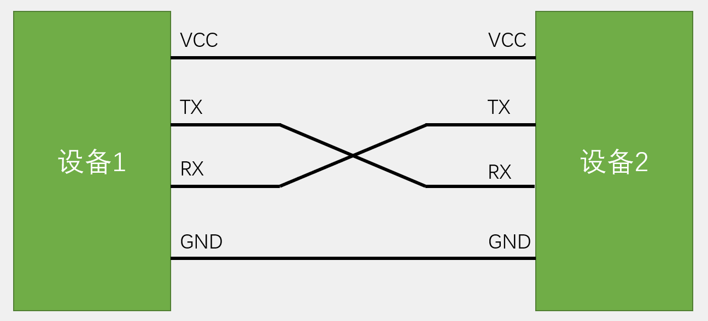
VCC 和 GND 用于供电； 
同时由于`单端`的特性，GND共同与 TX , RX 用于通信.
> 所以如果两个设备已经有独立共电了, VCC可以不接, 但是GND , TX, 和 RX一定要接.
> 如果某一设备需要连接VCC供电, 要注意供电的电压是否在子模块要求内
- 一些注意点：
 - TX与RX要交叉连接；
 - 当只需单向的数据传输时，可以只接一根通信线；
 - 当**电平标准不一致**时，需要加`电平转换芯片`：

都说到这了， 也顺便讲讲串口的`电平标准`:
电平标准是数据1和数据0的表达方式，是传输线缆中人为规定的**电压与数据的对应关系**，串口常用的电平标准有如下三种：

**TTL电平**：+3.3V或+5V表示1，0V表示0
~比如从`控制器`里出来的信号一般都是TTL信号.~

**RS232电平**：-3~-15V表示1， +3~+15V表示0
~RS232电平一般在大型的机器上运作,由于环境恶劣和静电干扰, 往往电压扰动比较大, 所以允许波动的范围也比较大~

**RS485电平**：两线**压差**+2~+6V表示1， -2~-6V表示0（差分信号）
~通信举例能达千米远~
> 实际生活中,想改变电平标准, 只要加个电平转换芯片就好了,**自动改变电平标准**

#### USART框图
**主体是上半部分**, 下边之所以看起来乱,只是因为它把寄存器控制的每一位的都写出来了;
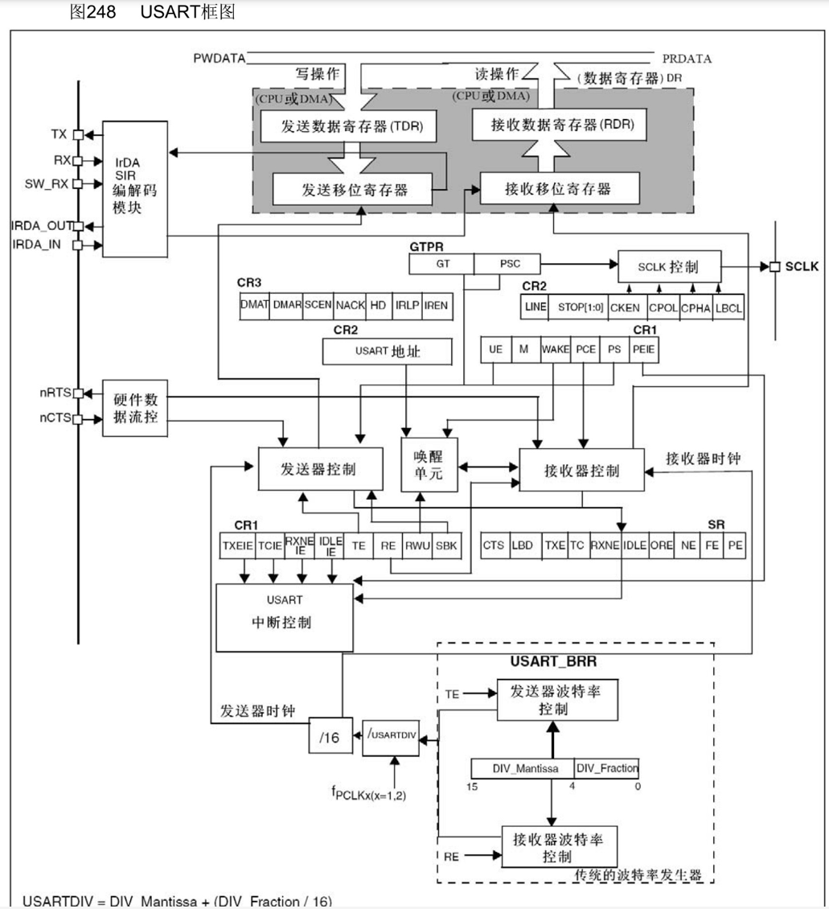
- **发送数据寄存器~TDR~ / 接收数据寄存器~RDR~**
  这两个寄存器在硬件上是两个相互独立的`16位`寄存器寄存器;
  但是在程序中共用一个地址.,指的都是 `数据寄存器`~DR~.
  - 这样真的不会读写错寄存器吗?
    CPU 执行 写指令（如 `STR R0, [DR]`）时，**写使能信号**（WE）有效 → 数据只进 TDR
    CPU 执行 读指令（如 `LDR R0, [DR]`）时，**读使能信号**（RE）有效 → 数据只从 RDR 出
    ```text
                     ┌───────────────┐
      CPU 地址总线───►│ 地址译码器     │
                     │ (匹配 DR 地址) │
                     └───────┬───────┘
                             │
             ┌───────────────┴───────────────┐
             ▼ (写使能 WE=1)                 ▼ (读使能 RE=1)
      ┌───────────────┐             ┌────────────────┐
      │  TDR          │             │  RDR           │
      │ (发送缓冲)    │              │ (接收缓冲)     │
      └───────┬───────┘             └────────┬───────┘
  
    ```
- **发送移位寄存器**
  其硬件结构似乎有点玄妙, 暂时不理解.
  装载的是一个数据帧中的`数据位`和`校验位`, 比如 
  ```text
  TDR中:
  数据位 
  11010001
    ↓
  发送移位寄存器中:(奇校验)
  校验位 数据位  
    0    11010001  
  ```
  这样构造的原因是,  发送移位寄存器**每次都是固定**读取**最低位**, 即**低位先行**, 然后通过`Tx通信线`进行发送.
  发送移位寄存器每隔一个单位时间`baud`, 对自身进行一次**右移**操作, 这时次低位变成了最低位, 就可以读取了.
  > "每隔一个单位时间`baud`", 这句话是有一个例外的 ,就是停止位 ,停止位 到下一个起始位的时间间隔可以是 1 / 1.5 / 2 个 `1 / baud`.
  - 那起始位和停止位呢?
    通过硬件状态机判断当前状态, 如果是起始位或者停止位, 
    发送状态机**直接控制 TX 引脚电平**，不经过移位寄存器。
    .
  - 那发送移位寄存器怎么知道什么时候是起始位, 什么时候是停止位, 什么时候进行移位呢?
    硬件状态机永远的神, 只能说是.
    .
  - `TDR` / `发送移位寄存器`写入数据的流程和要求
    ```C
    伪代码如下:
    if (TXE = 1)// 实际上应该是  (USARTx->SR & USART_FLAG_TXE)
    {
      CPU → TDR; // →代表写入数据 , ->代表索引 
      TXE = 0;
    }

    if (TXE = 0 && (TSR状态机状态 == 数据发送完毕))
    {
      TDR → TSR;
      TXE = 1; 
      TSR状态机状态 = 开始发送数据;
    }

    if (TXE = 1 && (TSR状态机状态 == 数据发送完毕))
    {
      TC = 0;
    }

    if (CPU ← USARTx->SR)// →代表读取数据
    {
      while(不超出时间窗口)// 时间窗口就是,规定的一定量时钟周期
      {
        if (CPU → TDR)
        {
          TC = 0;// 还有一种方法是软件清除.
        }
      }
    }// 这个叫做序列操作
    ```
    **补充:**
    当 TDR 被写入数据的时候, 硬件自动化检查, 当前移位寄存器是否有数据正在移位~应该是通过查看状态机~
    如果没有, TDR数据就会马上并行发送到`发送移位寄存器`的相应位置, 同时置`1`一个标志位, 叫`TXE`~(Tx_empty)~; 
    > <span style="color : red">注: 此时的发送移位寄存器还没完全向外发送完</span>

    程序上, CPU通过读取`TXE`,其置 `1` 后, 写入下一位数据.  
    > <span style="color : red">注: TDR被写入数据后会自动清零 `TXE` 标志位</span>
    
      
    
    有了TDR 和 发送移位寄存器 的双重缓存, 保证了连续发送数据的时候, 数据帧之间不会有空闲.
    .
- **接收数据寄存器**
  与`发送移位寄存器`十分类似, 下面讲一些差异:
  - 接收移位寄存器每次都**固定读取最高位** , 而非最低位;
    所以每隔一个单位时间`baud`, 同样进行**右移**操作.
    > 两次的`低位先行`, 最终结果的数据顺序负负得正.
    .
  - 接收完成后, 会马上把数据位转移到RDR中, 同时置一个标志位, 叫`RXNE`, 这个标志位置 `1` 后, CPU就会读取RDR中的数值了, 
    同时`接收移位寄存器`开始下一轮的接收数据.
    .
  - 那起始位和停止位呢?
    通过状态机判断当前状态, 如果是起始位或者停止位, 
    接收状态机**进行其他操作**，不经过移位寄存器。
    .
  > TR方会告诉RX方 其发送数据帧格式吗?
  > 答案是不会.
    **UART 通信的核心前提：收发双方必须预先约定相同的帧格式, 这步操作在各自程序中设定.**
- **硬件数据流控**
  目的是防止 `RX → 接收移位寄存器` 的速度 > `接收移位寄存器 → RDR` 的速度 , **出现数据覆盖的现象**.
  - nRTS(Request To Send) 
    请求发送, 输出脚~(自身作为接收方)~.
    n是低电平有效的意思, **接收来的及的时候, RTS置低电平**, 表示可以发送下一个数据.
    .
  - nCTS(Clear To Send)
    清除发送, 输入脚~(自身作为发送方)~
    接收方的nRTS --发送方的nCTS.
    .
- **同步时钟 SCLK**
  这是STM32作为发送端时的一个功能, 
  `发送移位寄存器`每发出一位, SCLK同时也跳变一个周期, 指导接收方的数据接收.
  > 因为只有串口当发送端的时候才有用, 所以不能用于串口之间的通信;
    一般用于兼容其他通信协议~(比如SPI协议)~
    也可以通过同步时钟的输出判断 发送端 的 波特率.

    .
- **唤醒单元**
  实现串口挂载多设备.
  串口多是`点对点模型`的通信, 所以需要这个模块.
  使用`唤醒单元`时, 会给串口分配一个地址, 且串口一般扮演`主从架构`中的`从机`, 
  主机发送特定地址时, 相应串口会被**唤醒工作**;
  没接收到特定地址时, 串口保持**低功耗沉默**.
  - 原理：
    主机这时发送的数据包都是 `8位数据位 + 1 位地址位`的格式;
    而且此时的数据包分为两种功能: 1.寻址  . 2.传输有效数据;
    - 寻址:
      寻址时, 前八位数据位写入想要命令的从机的`USART地址`, 最后的地址位置 `1` .
      这时从机 会检查前八位是否是自身地址,如果是就被唤醒, 接收后来的有效信号.
      .
    - 传输有效数据:
      此时地址位置 `0` , 只有被唤醒的从机会接收信息.
      同时, 从机**也可以通过自身的TX引脚,向主机发送信息.**
      .
    
  - 那可以同时唤醒两个从机吗?
    理论上可以, 但是实践中有风险.假设第一个唤醒的从机是A, 第二个是B.
    1. 从机A 会收到 从机B唤醒 的数据包, 这个数据包会被同样解析, 导致缓存区溢出， 解析错乱...
    2. 两个从机被唤醒后, 主机 的 每一条信息都会被两者接收读取. 这样没法让 A / B 的操作差异化.
    3. 最严重的, 烧毁从机芯片.
        ```text
        主机 RX ───┬── 从机A TX
                   ├── 从机B TX
                   └── 从机C TX   ← ❌ 危险！
        ```
        如果 从机 A 发送 1（高电平），而 从机 B 发送 0（低电平）
        两者的 TX 引脚会 直接短接.
        结果：
        总线电平不确定（可能是中间电压）;
        电流倒灌，可能烧毁 IO 口;
        主机收到乱码;
        > 这就是 “总线冲突” —— **UART 本身不支持多主/多从共享 TX 线！    **
      - 那有什么解决方法吗?
        1. 一个时刻只唤醒一个从机.
        2. 使用三态缓冲器~（Tri-state_Buffer）~
           每个从机的 TX 经过一个 使能控制的缓冲器;
           只有被选中的从机才 使能输出，**其他处于 高阻态**;
           即使多个从机通电，也不会冲突.
            .
  - 那如何让从机停机呢?
    1. 可以主机发送`休眠命令`
    2. 也可以从机唤醒单元自检测距离上次接收指令的时间, 超时自动休眠.
    3. 完成任务后立刻休眠. 
    .
    - 补充一个知识点: `停机`~Stop~ / `待机`~Standby~ / `关机`~Shutdown~
      | 模式 | 中文名 | 功耗 | 唤醒速度 | 保留 RAM？ | 保留寄存器？ | 典型用途 |
      |------|-------|------|----------|------------|--------------|--------|
      | Run | 运行 | 高（mA级） | — | ✅ | ✅ | 正常工作 |
      | Sleep | 睡眠 | 中（几十~几百 μA） | 极快（μs级） | ✅ | ✅ | 短暂空闲 |
      | Stop | 停机 | 低（几 μA） | 快（几 μs ~ ms） | ✅（可选） | ❌（部分复位） | 中等休眠 |
      | Standby | 待机 | 极低（<1 μA） | 慢（ms级） | ❌ | ❌（几乎全复位） | 长期休眠 |
      | Shutdown | 关机 | 接近 0 | 需外部上电 | ❌ | ❌ | 完全断电 |

      |模式|具体表现|
      |---|:---|
      |停机|<br>•CPU 和大部分时钟停止<br>•内核电压仍供电 → **RAM 和部分寄存器内容保留**<br>•可通过 EXTI、RTC、USART 等外设唤醒<br>•唤醒后从停机处继续执行（`程序状态保留`）|
      |待机|<br>•CPU、RAM、**大部分电路完全断电**<br>•仅备份域（Backup Domain）供电（含 RTC、备份寄存器）<br>•唤醒 = 几乎冷启动：`从复位向量开始执行`<br>•可通过 WKUP 引脚、RTC、复位按钮唤醒|
      |关机|<br>•**完全切断芯片电源**（VDD = 0）<br>•所有状态丢失，包括备份域（除非有独立电池）<br>•只能通过外部电源重新上电启动|

      .
- **中断控制**
  有很多位, 包括`TXE` 和 `RXNE`.
  .
##### 波特率发生器
~太天才了,所以专门拿一个标题讲~
波特率的本质就是 `分频`, APB1 / APB2 的时钟经过分频, **得到发送和接收的时钟**
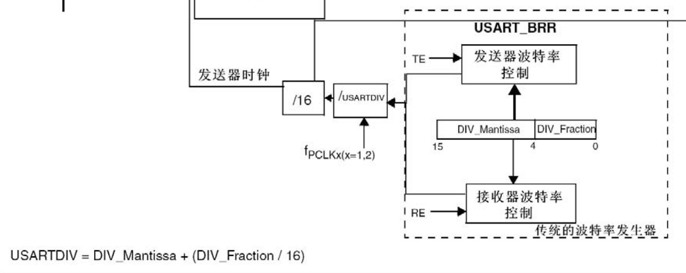
~虚线框部分是``/USARTDIV``的放大图.~
以下是波特率计算公式: 
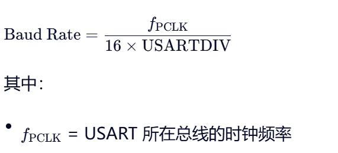

<span style = "color : red">在讲之前需要辨明几个概念:</span>

1. .[输入采样](#输入采样)
2.  `/USARTDIV`后得到的是`采样时钟`;
    `/16`之后得到的才是 `移位时钟`.
    > 所以是先有的`采样时钟`, 再分频得到`移位时钟`
3. **分频器其实是计数器**.
- `/USARTDIV`
  内部核心是虚线框的波特率寄存器~Baud_Rate_Register~
  `USART_BRR` 是一个 16 位寄存器，但实际装载的是高位 `12 位整数`~Mantissa~ + 低位`4 位小数`~Fraction~.
  - 核心思想: 
    不用真正的小数，而是用**平均分频**.
    硬件**无法直接处理** `39.0625` 这样的**小数分频**。
    但可以做到：在 16 个采样周期内，有时分频 39，有时分频 40，就可以实现**平均分频** = 39.0625。
    而 USART 的 `16 倍过采样机制` 正好提供了在**一个码元持续时间内就可以让平均分频为39.0625**的可能, 这意味着**每个码元的持续时间能保持一致**！
    > 如果没有`16 倍过采样机制`, 
      比如 `15 倍过采样机制`, 可能总平均分频 = 39.0625, 但是每个码元的平均分频就不一定都是39.0625, 这会导致有的码元长, 有点码元短, 采样容易出错.

      .
  - 运作过程:
    在硬件电路中, `USART_BRR`整数部分指挥一个`分频器`~(计数器)~ ,小数部分指挥一个`累加器` 
    
    假设`USART_BRR` = M.F ~M是整数,F是小数~
    .
    1. 每次分频计数到 M（整数部分） 时：
       输出一个采样时钟脉冲
       同时将小数部分 F 加到累加器
       .
    2. 如果累加器 ≥ 16（溢出）：
       **下一次分频值 = M + 1**
       累加器减去 16
       **否则：**
       下一次分频值 = M

    这相当于：**每 16 个周期，多插入 F 个 长周期**
    相较于前 (16 - F)个周期,`整数计数器`计数到 M ;后 F 个周期,`整数计数器`计数到 M + 1;
    STM32采样的方法在电路上实现逻辑简单, 也不需要状态机指挥, 同时**分频变化曲线上更平稳**.  
    > 一句话, **整数计数器 + 小数累加器 = 总分频器**
 
    .
  > 在USART中, 不同模块使用不同频率的时钟, 这就是不同的时钟域.以下是一些串口模块使用的时钟:
  
  | 模块 | 功能 | 时钟来源 | 原因 |
  |------|------|--------|------|
  | TDR / RDR | CPU 读写数据寄存器 | APB 时钟（PCLK1/PCLK2） | CPU 通过 APB 总线访问，必须同步到 APB 时钟 |
  | 中断控制器<br>（如 TXEIE, RXNEIE） | 产生 USART_IRQn 中断请求 | APB 时钟 | 中断请求需同步到 NVIC（属于系统时钟域），由 APB 逻辑生成 |
  | 唤醒单元<br>（Wake-up from Stop） | 检测起始位唤醒 MCU |**LSE 或 LSI（低功耗时钟）<br>或 HSI（运行时）** | 在 Stop 模式下，HSI/HSE 已关闭，必须用始终运行的低速时钟（如 LSE=32.768kHz）来监听 RX 线 |
  | 硬件流控<br>（RTS/CTS） | 自动控制 RTS 输出、检测 CTS 输入 | APB 时钟 + 波特率时钟混合 | - **CTS 采样：用波特率时钟**（精确匹配通信节奏, `采样点通常在发送停止位期间`）<br>- **RTS 控制逻辑：用 APB 时钟**（响应 RDR 状态, **由 TDR 是否为空决定`（RXNE 标志）`** |
  | 波特率发生器 | 生成采样和移位时钟 | PCLK / (8 or 16 × DIV) | 直接由 APB 时钟分频得到，用于串行引擎 |
  | 发送/接收移位器<br>（TSR/RXR） | 串行位移操作 | 波特率时钟（×16 过采样） | 必须与通信波特率严格同步 |

### 数据包收发
#### 作用
把单独的数据打包起来， 方便进行多次的多字节 的 数据覆盖。

- 举个例子：
  一个陀螺仪传感器， 其数据需要通过串口得到 X / Y / Z 轴的坐标信息。
  三个数据交替不停发送， 这时会有两个问题：
  1. 程序需要设置状态机, 来判断当前数据和  X / Y / Z 轴 对应关系, 软件性能开销大.
  2. 接收方可能从任意位置开始接收数据，可能错把 `Z轴`数据对应成 `X轴`数据 之类错误.

  所以, 为了解决这些问题, 我们需要对该数据流进行分割再打包.
  比如可以把数据流同一时刻的X / Y / Z轴数据放在一起, 在加上`包头包尾`, 就变成了一个数据包, 也就是说数据包的结构是:
  > `包头` + 按某一规则分割的`数据流` + `包尾`.

#### 包长选择
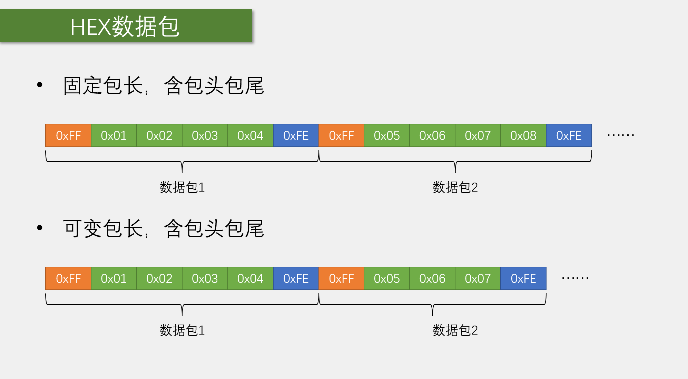

不论是`HEX`还是 `文本` 类型的数据包, 都有固定包长和可变包长两种选择, 两种选择都有利弊,应观察使用场景选择适合的, 以下是他们相应的优势:
- 固定包长:
  数据流中可以传输**代表包头包尾的元素**.
  如上图中的`0xFF` / `0xFE`
  .
- 可变包长:
  当**包头包尾绝无可能与数据流中传输数据相同**时, 使用可变包长还能使数据包的长度更加灵活.
  - 举个例子:
    我们通过串口控制LED灯闪烁, 要发送数据流"`LED_ON`" 和 "`LED_OFF`", 
  这时两者的指令长度是不同的, 只能通过`可变包长`实现.
#### 收发状态机
固定包长接收数据包：
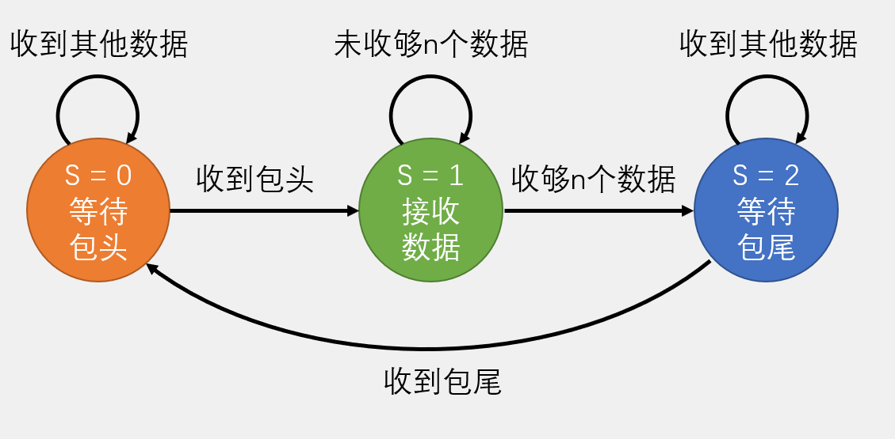
.
可变包长接收数据包:
- 单字节包尾
  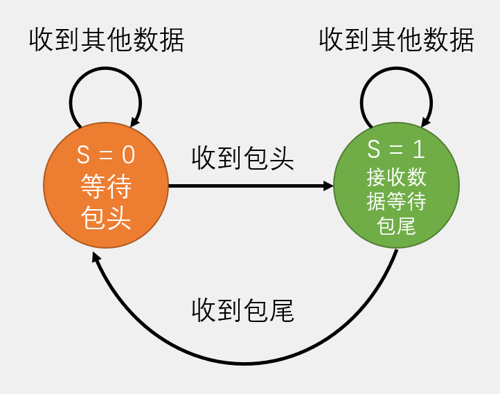
- 多字节包尾
  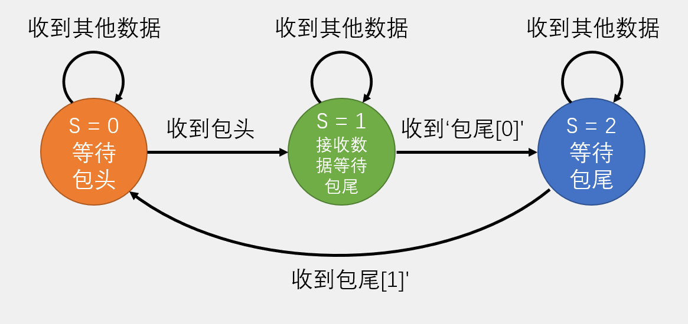


#### 字节流
串口的数据一次只能传  8位的二进制数据, 但是如果想传送 16 / 32 位的数据类型, 那该怎么办?
`字节流`会给出答案()
以下是字节流在收发数据包时的额外补充的核心代码:
```C
// 发送数据包: 
// 利用短数据类型 截断 长数据类型低字节 的特性
void int32_to_bytes(int32_t value, uint8_t *bytes) 
{
    bytes[0] = (value >> 0)  & 0xFF;  // LSB
    bytes[1] = (value >> 8)  & 0xFF;
    bytes[2] = (value >> 16) & 0xFF;
    bytes[3] = (value >> 24) & 0xFF;  // MSB
}

// 接收数据包:
// 搞半天还得自己拼()
int32_t bytes_to_int32(uint8_t *bytes) 
{
    return (int32_t)(bytes[0] | 
                    (bytes[1] << 8) | 
                    (bytes[2] << 16) | 
                    (bytes[3] << 24));
}

```

## I2C 集成电路间总线
### 简介
I2C ，也叫IIC， 全称`Inter-Integrated Circuit Bus`, 即`集成电路间总线`, 是一种**同步**串行通信协议.
- 较串口而言的特点
  - **半双工**:
    **只有一条数据线`SDA`~Serial_Data~, 但双方都能发送信息**~(发送真正交流数据的线)~
    因为整个过程中, 所有设备都不需要同时进行发送和接收;
    每一时刻都最多只有一个设备掌握话语权, 也就是发送能力.
    .
  - **有应答机制**:
    不论哪一方,每发送一个字节, 对方都需要给一个应答;~除`起始`和`停止`外.~
    保证对方确实接收到数据, 或者决定是否进行下一次的发送;
    .
  - **总线挂载多设备**:
    一个`I2C BUS`能同时连接多个模块, 这些模块可以是主模式, 也可以是从模式. 而且主从模式的数量不限, 既可以`一主多从`, 也可以`多主多从`.
    且主机向某一从机进行通信时, 其他从机不会造成干扰.
    > 在`多主多从`的情况下, 可能发生总线冲突, 因而需要仲裁管理.

    | 特性 | 主机(Master) | 从机(Slave) |
    |------|-------------|------------|
    | 通信发起权 | 主动发起通信 | 被动响应，等待主机指令 |
    | 时钟控制 | 生成时钟信号(SCL) | 依赖主机时钟，**不主动产生时钟,~除时钟延展外~** |
    | 总线控制权 | 决定何时开始/结束通信 | 仅在主机寻址时响应 |
    | 典型设备 | 单片机、CPU、电脑 | 传感器、存储器、外设模块 |
    | 角色灵活性 | 可在特定条件下切换角色 | 通常固定为从机角色，但有些设备可切换 |

    .
  - **同步时序**:
    **异步时序的发送与接收时刻是固定的**, 这导致了如果主机或者从机, 
    一方正常 发送 / 接收, 但另一方进了中断, 没空管接收 / 发送, 
    这就很可能导致数据的断送或者丢失.
    同步时序中, 主机通过`时钟线SCL`~Serail_Clock~, **对主从机的行动时刻进行了规定**.
    规范的说法：
    **主机产生SCL时钟信号**，所有数据传输都**同步于这个时钟**——下降沿后紧贴的低电平期间发送数据，上升沿后紧贴的高电平期间采样并接收数据。**主机自己的读写操作也必须遵循这个时序**，不能不顾时钟信号，下一刻就执行读写操作。
    > **不是说每个上升沿后双方都进行读操作, 在每个下降沿后双方都进行写操作**. 具体这个边沿后谁读谁写, 看主机在SDA线发送的指令是什么.
    > <span style = "color : red">注: </span>
    关于这点的说明, 更顺的逻辑应该是
    主机认为 主从机什么时候读取了, 就抬高时钟线电平; 认为该写入了, 就拉低时钟线电平. 

    关于同步的这个特性, 使其在某些单片机没有`I2C`外设的情况下, 也可以很简单地用软件模拟`I2C`.
    .

### I2C时序基本单元
#### 起始 / 终止条件
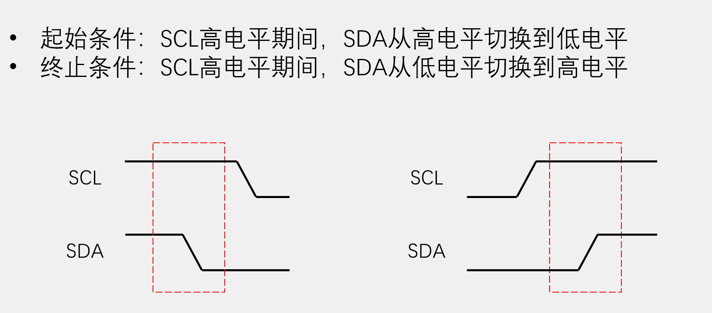
- **起始**`S`：
  - **时序**
    1. 主机释放SCL, 拉低SDA;
    2. 主机拉低SCL.
    .
  - **作用** 
  当`从机`捕获到SCL高电平， SDA**下降沿信号**时， `从机`会
  1. 主机重置I2C通信状态机
  2. 主机清空发送/接收缓冲区
  3. 主机准备接收地址字节
  4. 主机等待被寻址。
    .
- **重复起始**`Sr`:
  **和起始的时序一致**, 只是出现时机和起始不同. 
  - **作用**:
    1. 更改读写模式
        > 因为读写模式是紧跟在`S`之后的一个`Tbyte`中的. 想要改变只能重复起始.
    
        .
    2. **不改变**当前`从机`指向将要读 / 写寄存器的**寻址指针**.
        .
- **终止**`P`：
  - **时序**
    1. 主机拉低SDA;
    2. 主机释放SCL;
    3. 主机释放SDA;
    .
  - **作用** 
  当`从机`捕获到SCL高电平， SDA**上升沿信号**时， `从机`会

    | 行为 | 说明 |
    |------|------|
    | 释放总线 | 释放SDA线（进入高阻态） |
    | 重置通信状态机 | I2C模块回到空闲监听状态 |
    | 清空缓冲区 | 发送/接收缓冲区清零 |
    | 结束当前事务 | 完成本次通信的所有操作 |
    | 可能触发中断 | 通知CPU通信已结束 

    > <span style="color:red">注:
    `起始`和`停止`都不会**复位**寻址指针.
    因为写入的地址会存在地址指针中, 不会被重置.</span> 
    
    .
#### 发送 / 接收数据
~以主机视角描述~
- **时序基础**:
  - **发送一个比特**`Tbit`：
    - **时序**：
      1. 主机拉低 / 释放SDA；
      2. 主机释放SCL;
      3. 从机读取SDA;
      4. 主机拉低SCL； 
      .
  - **接收一个比特**`Rbit`:
    - **时序**:
      1. 从机拉低 / 释放SDA；
      2. 主机释放SCL;
      3. 主机读取SDA;
      4. 主机拉低SCL； 
      . 
- **时序单元**:
  - **发送一个字节**`Tbyte`:
    重复8次`Tbit`.
    > I2C中, 高位先行, 先bit7 , 最后再bit0.
    
    .
  - **接收一个字节**`Rbyte`:
    重复8次`Rbit`.
    .
  - **发送应答**`TAck`:
    一次`Rbit`.
    .
  - **接收应答**`RAck`:
    一次`Tbit`.
    .

#### 时序集成
##### 指定地址写
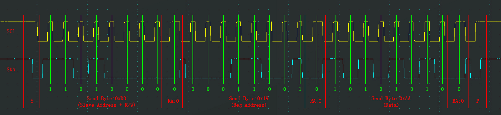
时序经历以下阶段：
|行为|时序|
|---|---|
|起始|`S`|
|指定从设备和写模式<br>(通过发送从设备地址和读写位, 进行唤醒)<br>**高七位是地址, 最低位是写模式.**|`Tbyte` + `RAck`|
|指定将要写的寄存器<br>(通过发送从设备中的各寄存器的偏移量)|`Tbyte` + `RAck`|
|发送字节数据|for(i = 0 ;i < n; i++)<br>{<br>`Tbyte` + `RAck`<br>}|
|停止|`P`|

##### 当前地址读
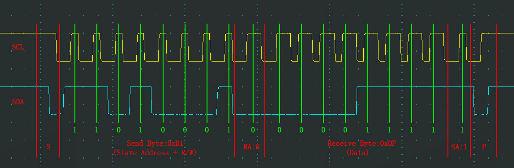
时序经历以下阶段：
|行为|时序|
|---|---|
|起始|`S`|
|指定从设备和读模式<br>(通过发送从设备地址和读写位, 进行唤醒)<br>**高七位是地址, 最低位是读写模式.**|`Rbyte` + `TAck`|
|读取从设备发来的数据<br>主机最后一次应答为1|for(i = 0 ;i < n; i++)<br>{<br>`Rbyte` + `TAck`<br>}|
|停止|`P`|
> <span style = "color : red">注: </span>
> 如上所示, 指定**读模式**后, **直接开始读取数据, 并没有指定地址的操作**
那我们该如何实现指定地址读呢?
答案是`复合操作, 重复起始`

##### 指定地址读
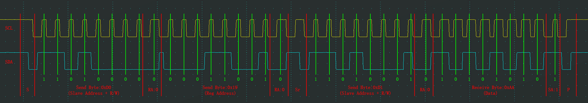
时序经历以下阶段：
|行为|时序|
|---|---|
|起始|`S`|
|指定从设备和写模式<br>(通过发送从设备地址和读写位, 进行唤醒)<br>**高七位是地址, 最低位是写模式.**|`Tbyte` + `RAck`|
|指定将要写的寄存器<br>(通过发送从设备中的各寄存器的偏移量)|`Tbyte` + `RAck`|
|||
|停止<br>~可有可无~|`P`|
|重复起始|`Sr`|
|指定从设备和读模式<br>(通过发送从设备地址和读写位, 进行唤醒)<br>**高七位是地址, 最低位是读写模式.**|for(i = 0 ;i < n; i++)<br>{<br>`Rbyte` + `TAck`<br>}|
|读取从设备发来的数据<br>主机最后一次应答为1|`Rbyte` + `TAck`|
|停止|`P`|

> 一个困惑:
> 在读操作中, 
> > 主机进行应答 0, 从机就继续发送数据;
> > 主机进行非应答 1, 从机就停止发送数据;
> > 且主机最后会发一个`停止`, 这时从机照样会停止发送数据, 
> 
> 那最后的`非应答` 和 `停止`  的功能是否有所冲突?

答案是不冲突, 而且这刚好是I2C浑然天成的设计:

进行`非应答`时, 从设备会释放SDA, 交还SDA控制权.
而`停止`, 要求SDA出现上升沿, 如果从设备没交还SDA控制权, 则从设备会在下个时序发送下一位寄存器的数据, 
这可能导致`停止时序`时, SDA仍然是 低电平, 没有产出上升沿, 从设备也接收不到`停止信号`;
而且此时SCL高电平, SDA低电平, **主设备在等待停止成功发出; 从设备在等待SCL电平跳变, 然后发第二位bit的数据.** 
这意味着 **I2C通信被卡在了这个时刻**. 

### SCL / SDA 设计哲学
~左图是一主多从的~ ~SCL~ ~/~ ~SDA~ ~线路模型，~ ~右图是每个设备~~SCL~ ~/~ ~SDA~ ~接口内部结构~
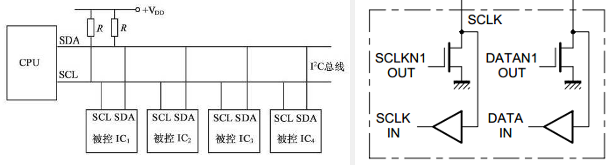
> 左图的一些要点:
所有I2C设备的SCL连在一起，SDA连在一起;
设备的SCL和SDA均要配置成**开漏输出模式**;
SCL和SDA都采用了**弱上拉**, 各添加一个上拉电阻，阻值一般为4.7KΩ左右, 改变电平的速度慢, 态度柔;

> 右图的一些要点:
所有设备SCL和SDA**输出口**采用了 与GPIO输出口一致的`nmos管`开漏输出模式, 
当施加低电平,则外部通信线直连GND, 由于无电阻, 这是一种强下拉, 速度快, 态度硬; 
当施加高电平, 则外部通信线浮空, 但由于**弱上拉的设计**, 最终表现是高电平.
.
那个三角形不是二极管, 是施密特触发器;
由于输入对电路没有任何影响, 所以任何设备的任意时刻都是可以输入的.
.
所有设备SCL和SDA**输入口**都永远敞开。

#### 总线掌控权
- **主机**:
  对SCL线有近乎完全控制权, 
  在时序需要主机发送数据时, 主机可以主动发起对SDA的控制.
  .
- **从机**:
  对SCL线几乎没有控制权, 除了**时钟延展**外;
  - **时钟延展**:
    时钟延展是一种由**从设备发起**的、用于**暂停一次I2C传输**的机制.
    具体原理是, 它可以通过**主动将SCL时钟线拉低**，主设备检测到SCL为低电平，不会继续产生下一个时钟脉冲, 从而强制让主设备进入等待状态。
    > 从设备还没有准备好继续通信的例子:
    需要时间处理数据、写入非易失性存储器或执行内部操作.


#### 开漏输出和弱上拉输入的智慧:
- **开漏输出**:
  开漏输出的nmos管做到一件很安全的事情——保证 电路出现过大电流时, 电流直通GND, 而不是闯入CPU核心电路内部, 
  **这种内部逻辑电路和外部实现电路相分离的设计**, 既保证了单片机"大脑"的安全, 也能更灵活的输出不同于逻辑电压的电压. 
  .
- **弱上拉输入**:
  可以想象弱上拉是上端连着**拉力很小的弹簧**的一个杆子,杆子越高, 电平越大.当有人向下拉时, 由于人力比较大, 所以杆子向下运动, 即总线电平变低; 当没人向下拉时, 就会回弹到高电平.
  换成设备也一样, 输出低电平时, 强下拉; 输出高电平时, 弱上拉.
  这时所有设备对 SCL / SDA两线的操控只有`释放` 和 `拉低`, 两种操作. 
  .
  所以, 解释了这么久, `弱上拉`到底有什么好处? 我不能用推挽输出模式`强上下拉`吗?
  原因如下:
  1. **`线与`的思想**:
      在I2C通信中, 数据传输的核心思想就是,**需要的是有设备置0 , 那么数据线就必须是低电平.**
      强下拉和弱上拉刚好满足这一点.
      > 如果没有弱上拉和开漏输出, 取而代之的是推挽输出, 
      那现在, 一设备置低电平, 一设备置高电平, 最终设备读取的是低电平还是高电平?
      读取会不稳定, 所以不好. 

      .
  2. **电路安全的保证**:
      如果没有弱上拉, 电路的每次信号传输, 电压 和 电流 都比较大, 这既**拉高了功耗**, 又**增加了电子元件老化损坏的风险**. 
      .
  3. **避免浮空输入**:
      勿复言尔..
  > 弱上拉电阻的选择:
    电阻值：通常选择几千欧姆（如4.7kΩ或10kΩ）的电阻作为上拉电阻。
    **电阻值不能太小，否则会增加功耗；**
    **也不能太大，否则上拉速度会变慢，边沿上升所需时间变多, 影响通信速度**。  
    
- **总结**
  `开漏输出` + `弱上拉输入` 是 是I2C总线实现"**同时兼具输入输出能力**"的核心设计. 


## 软件使用
### Keil_v5
#### 使用库函数的一些方法
##### 头文件,寻声明

点击头文件,点击 "`open document`", 打开头文件;
你可以在所有的功能前都找到相应注释;
可以在头文件的前大半部分看见一系列的**宏定义`#define`, 以及类型定义`typedef`**,这是对抽象底层信息~(如地址)~的一种封装, 利于后期维护和优化时的理解;
可能在中间穿插几个**条件编译**;
然后可以在最后部分找到一堆**函数声明**;

然后点击想用的函数的函数名,右键,点击"Go To Defination Of ";


然后就可以跳转到函数实现,通过注释了解函数,参数的含义与取值;


##### 库函数用户手册
可以打开[STM32F103xx固件函数库用户手册](./datum/STM32F103xx固件函数库用户手册.pdf)
这里有所有库函数的介绍和使用方法;

#### STM32里的C语言
##### C语言数据类型

注 : 
在51单片机里`int`是16位的,但是在STM32里`int`是32位的;
右边是`stdint.h`里的类型转换.

##### C语言宏定义
用一个字符串代替~(代表)~一个数字，便于理解，防止出错;
提取程序中经常出现的参数，便于快速修改;
`#define GPIOA_0 (0x0001)`
宏定义是预处理阶段的直接文本替换,必须要给替换后的值加括号,不然因为结合律可能出问题.

##### C语言类型转换
关键字：typedef
用途：将一个比较长的**变量类型名**换个名字，便于使用
`typedef unsigned char uint8_t;`

##### C语言结构体
用途：
数据打包，不同类型变量的集合,结构体让结构更有结构(确信)
其实更有用的是他做实参的能力,**一个结构体里有多个变量,但函数实参只要放一个结构体的`指针`就行了**
定义结构体变量,一般配合类型转换一起使用:
```C
  typedef struct
{
  uint16_t GPIO_Pin;             /*!< Specifies the GPIO pins to be configured.
                                      This parameter can be any value of @ref GPIO_pins_define */

  GPIOSpeed_TypeDef GPIO_Speed;  /*!< Specifies the speed for the selected pins.
                                      This parameter can be a value of @ref GPIOSpeed_TypeDef */

  GPIOMode_TypeDef GPIO_Mode;    /*!< Specifies the operating mode for the selected pins.
                                      This parameter can be a value of @ref GPIOMode_TypeDef */
}GPIO_InitTypeDef;\

GPIO_InitTypeDef GPIO_InitStructure;
GPIO_InitStructure.GPIO_Mode = GPIO_Mode_Out_PP;
GPIO_InitStructure.GPIO_Pin = GPIO_Pin_12;
GPIO_InitStructure.GPIO_Speed = GPIO_Speed_50MHz;
GPIO_Init(GPIOB, &GPIO_InitStructure);
```

##### C语言枚举
用途：定义一个取值受限制的整型变量，用于限制变量取值范围；宏定义的集合
定义枚举变量：
```C
  enum{FALSE = 0, TRUE = 1} EnumName;
//   因为枚举变量类型较长，所以通常用typedef更改变量类型名
// 引用枚举成员：
  EnumName = FALSE;
  EnumName = TRUE;
```
这样虽然写的麻烦,但是其代表意义跃然纸上,不易写错
同时,其实枚举变量里的每一个变量都和一个整型数据对应
即, `TRUE == (EnumName) 1`(强制类型转换)

#### 调试方式
- **串口调试**：
通过串口通信，将调试信息发送到电脑端，电脑使用串口助手显示调试信息
一般在造PCB板的时候,会在边上留一个`串口通信`的引脚,,把单片机连电脑伤后,就可以通过电脑屏幕打印信息; 调试好后,断开串口,程序就可以正常工作了.
  - 优势: 
   软件强大,可以显示单独参数, 还可以显示曲线、图形、图像等。
   三个字，交互爽。
  - 弊端:
   拖家带口,比较笨重; 且通常的串口助手只能通过信息流的方式呈现数据~一行一行的打印~ ,如果很多不断变化的数据要显示,会刷屏,很...难看
- **显示屏调试**：
直接将显示屏连接到单片机，将调试信息打印在显示屏上
  - 优势:
    对于不断变化的数据,可以覆盖刷新显示;
    显示屏接在单片机上,显示方式直接;
    做复杂的东西,总归会有一个人机交互的界面,这样的话显示屏也能作为产品的一部分;
  - 弊端: 
    屏幕小,显示内容有限,功能不强大;

- **Keil调试模式**：
借助Keil软件的调试模式，可使用单步运行、设置断点、查看寄存器及变量等功能,
魔法棒可以选择硬件仿真或者Keil软件仿真.
  >调试模式一通百通,但是需要一段时间细致的学习.(也就是说,我现在目前还没有)

##### 局部调试方法
- **点灯调试法**
  与`printf调试法`异曲同工.
  在你不确定有没有执行的代码区域放个点灯函数吧:
  亮了就是有运行,说明代码区域内部有坏人;
  没亮就是没运行,说明代码区域外部有坏人;

- **注释调试法**
  加了某一段代码后,程序突然死了啦~ ~(台湾音)~,可以通过对新增代码分批次注释运行,观察哪几次程序能运行,那就是哪个部分处了问题.

- **对照法**
  找一个没问题的程序,分析他的程序和你的程序的逻辑,步步替换逻辑

- **求援法**
  当然是呼叫AI大人啦 😆👆

##### 核心思想
缩小范围、控制变量、对比测试

### FlyMcu——串口程序烧录软件
#### 基础使用步骤
1. 让STM32用 `USART1` 和电脑进行串口通信．
  .
2. 生成烧录程序的HEX文件，创建方法如下：
   Keil_v5 → Options for Target → Output
   随后勾选 `Create HEX File`, **进行一次编译build**, 之后HEX文件就在工程文件夹的`Objects`文件夹中了.
   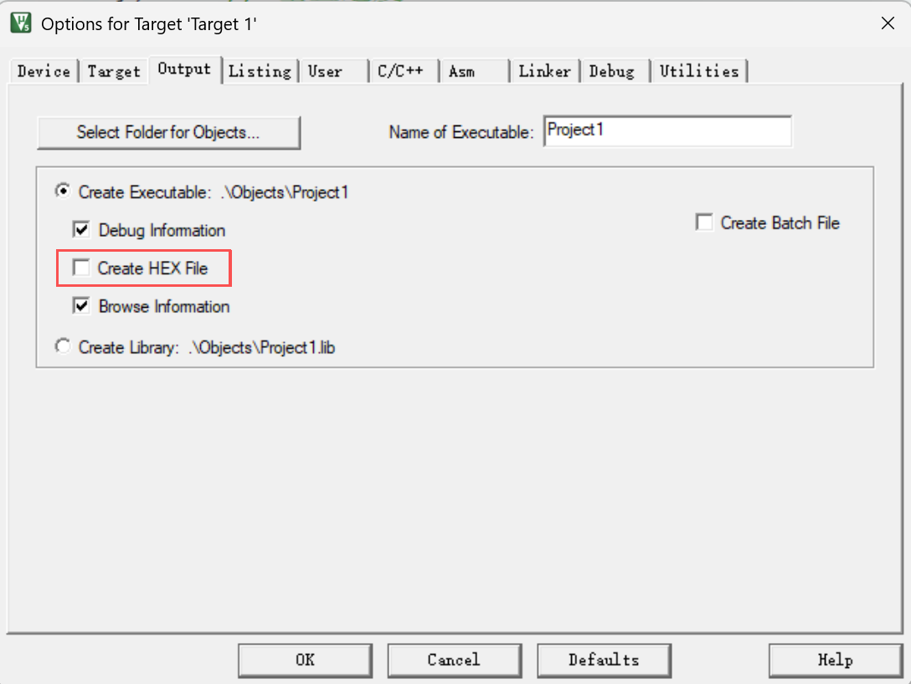
  .   
3. 配置BOOT引脚:
   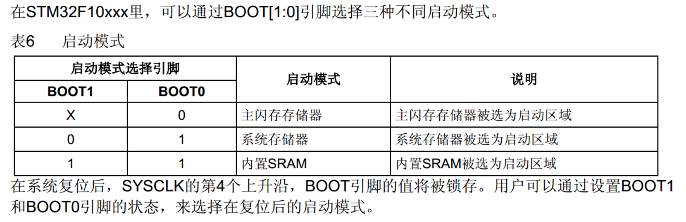
   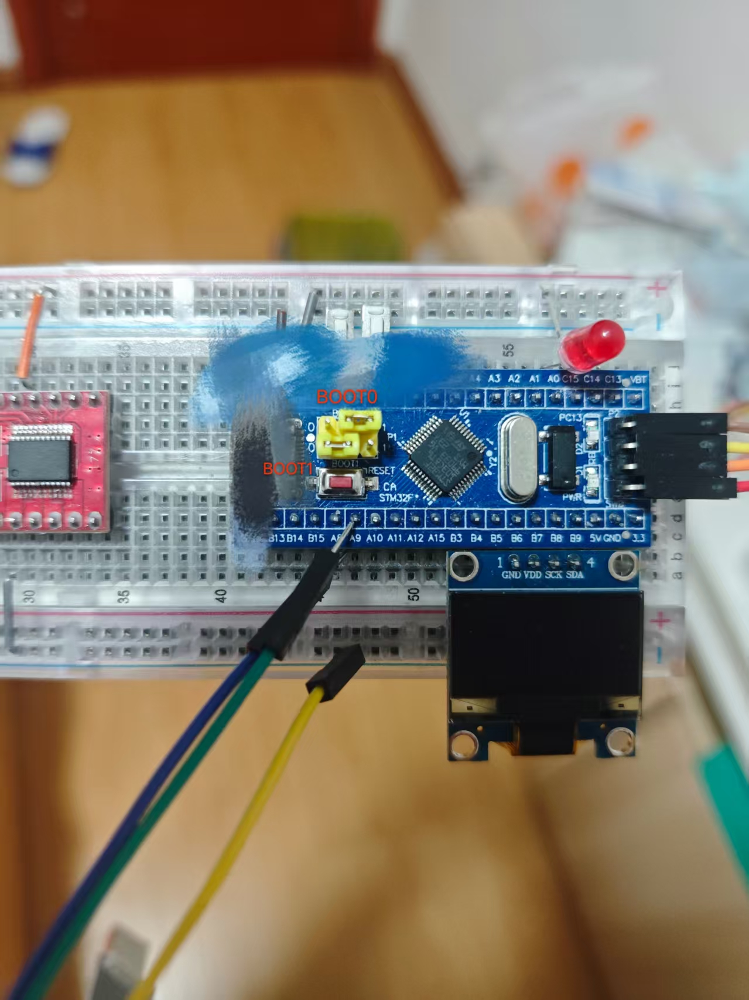
   **按上图的配置要求， 对 `BOOT0`置 1 操作, 以选择`系统存储器`作为启动区域, 即启用BootLoader刷机程序**
   **然后按一次复位键, 此时芯片进入BootLoader程序, 即不断接收USART1 的数据, 刷新到主闪存**
   ~按一次复位键是因为只有在刚复位的时候读取BOOT引脚的值.~
   
   .
4. 回到FlyMcu软件, 进行配置.
   插上`USB串口转换器`后, 点击"搜索串口", 配置"Port";
   设bps = 115200;
   在"联机下载时的程序文件:"中, 选择已下好的HEX文件.
   点击开始编程.
   .
5. **对单片机的 `BOOT0` 置 0 操作, 以选择`主闪存存储器`作为启动区域**
    **然后按一次复位键, 此时芯片执行主程序（烧录程序）,烧录成功.**
    执行这步的原因是,在该步操作前, STM32还一直在执行BootLoader的刷机程序.
    > 这种使用方法的操作需要手动的插拔`BOOT0`引脚的跳线帽, 
      也有不需要手动插拔的方法——一键下载电路 , 有兴趣可以上网查查.正点原子有讲.
      .
      还有一种折中的方法——**勾选`编程后执行`并且取消`编程到FLASH时写选项字节`**， 这样就可以在烧录完后执行一遍烧录程序。~虽然只能执行一遍，但是在频繁烧录调试的时候有大用处~
      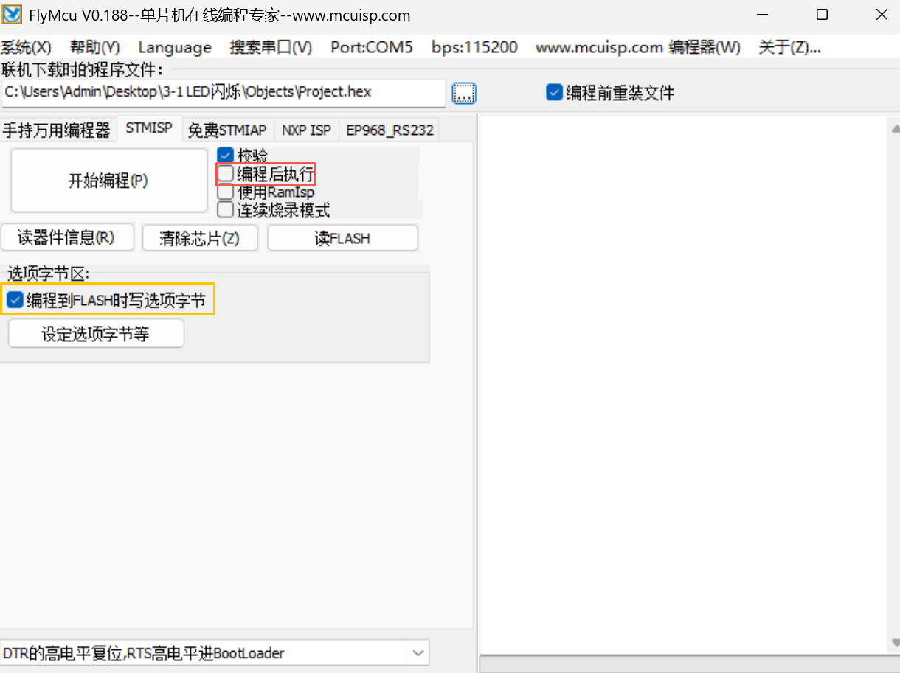

#### 其他功能
- **读取`FLASH`的主程序**
  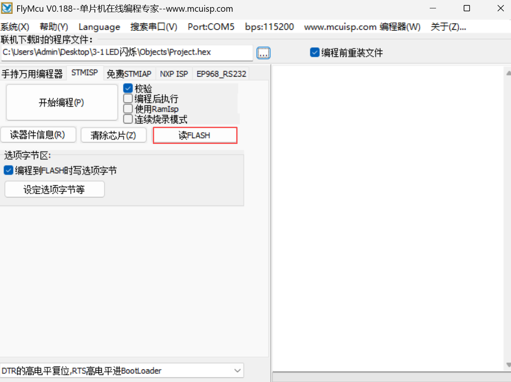
  可以读取芯片内主程序, 以二进制格式存放在一个`.bin文件`中.
  .
- **清除芯片**
  把`FLASH`主程序区域全部擦除, 擦除 后所有数据都是 `1`.
  .
- **读器件信息**
  会读出芯片的序列号之类的信息 
  .
- **设定选项字节**
  **该软件无法单独写入选项字节, 只能被烧录软件捎带进去**
  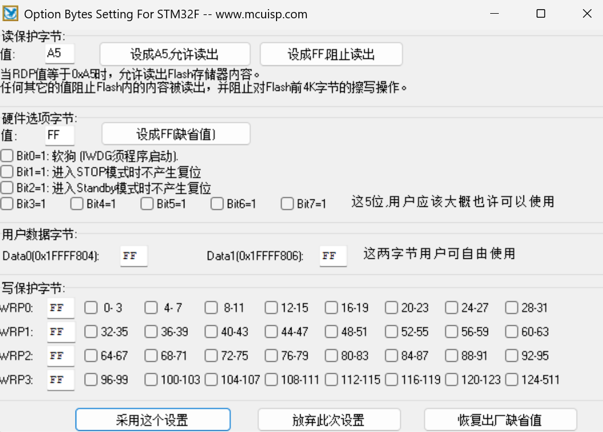
  - **选项字节简介**
    | 特性 | 说明 |
    |------|------|
    | 位置 | Flash最高地址区或独立配置扇区 |
    | 独立性 | **擦除Flash主程序区不会影响选项字节** |
    | 生效条件 | 修改后**需复位**才能生效 |
    | 写入要求 | 需要特殊解锁流程才能修改 |


  - **读保护**
    
    | 级别 | 名称 | 说明 | 可逆性 |
    |------|------|------|--------|
    | Level 0 | 无保护 | 调试接口可自由读写Flash | ✅ 可自由切换 |
    | Level 1 | 中级保护 | 禁止SWD/JTAG读写Flash，**但可调试运行** | ⚠️ **降级会触发全片擦除** |
    | Level 2 | 最高保护 | 永久禁用调试接口，芯片几乎无法再编程 | ❌ 不可逆 |

    RDP Level 1 的实际详细效果:
    | 操作 | 是否允许 | 说明 |
    |------|---------|------|
    | 调试器连接芯片 | ✅ 可以 | SWD/JTAG接口仍能握手 |
    | 调试器读取Flash | ❌ 拒绝 | 读返回0或错误 |
    | 调试器写入Flash | ❌ 拒绝 | 写操作失败 |
    | 调试器运行程序 | ✅ 可以 | CPU可正常执行 |
    | 调试器读写RAM | ✅ 可以 | RAM不受保护 |
    | 调试器设置断点 | ⚠️ 受限 | 硬件断点可能可用 |

    .
    全片擦除的范围:
    | 存储区域 | RDP降级擦除 | 手动全片擦除 | 说明 |
    |---------|:----------:|:-----------:|------|
    | 主Flash | ✅ 是 | ✅ 是 | 用户程序区 |
    | 数据Flash | ✅ 是 | ✅ 是 | EEPROM模拟区 |
    |系统存储器|❌ 不可写| ❌ 不可写|Bootloader区（部分型号）|
    | 选项字节 | ⚠️ 重置 | ⚠️ 重置 | RDP归零，WRP清除 |
    | 系统存储器 | ❌ 否 | ❌ 否 | 系统Bootloader |
    | 校准数据 | ❌ 否 | ❌ 否 | 工厂校准值 |
    | 唯一ID | ❌ 否 | ❌ 否 | 96位UID |
    | SRAM | ⚠️ 上电丢失 | ⚠️ 上电丢失 | 非存储区 |
    |擦除后置 1 ||||

    .
    RDP Level 2 的实际详细效果:
    | 操作 | 是否允许 | 说明 |
    |------|---------|------|
    | 调试器连接芯片 | ❌ 完全拒绝 | 调试接口被禁用 |
    | 任何调试操作 | ❌ 全部禁止 | **无法读取/写入/调试** |
    | ISP串口编程 | ❌ 通常禁止 | 部分型号允许 |

    ```text
    AI的超绝诙谐:
    ┌─────────────────────────────────────────────────────────┐
    │                    RDP Level 1                           │
    ├─────────────────────────────────────────────────────────┤
    │  调试器：我能连接芯片...                                 │
    │  芯片：   可以连接，但别想读Flash 😏                      │
    │  调试器：那我读一下0x08000000...                         │
    │  芯片：   返回 0x00000000 (假数据)                       │
    │  调试器：...🤬                                          │
    └─────────────────────────────────────────────────────────┘

    ┌─────────────────────────────────────────────────────────┐
    │                    RDP Level 2                           │
    ├─────────────────────────────────────────────────────────┤
    │  调试器：我能连接芯片吗？                                │
    │  芯片：   无可奉告 🚫 (调试接口直接关闭)                  │
    │  调试器：...😭                                          │
    └─────────────────────────────────────────────────────────┘
    ```
    .
  - **写保护**
    写保护用于防止特定Flash区域被意外修改或擦除。
    | 特性 | 说明 |
    |------|------|
    | 保护粒度 | 可**按扇区/页配置** |
    | 保护对象 | 防止程序或数据被篡改 |
    | 解除方式 | 需先解除写保护才能编程 |
    | 与`RDP`关系 | 独立配置，**可同时启用** |
    ```text
    ┌─────────────────────────────────────────────────────────┐
    │              Flash 区域写保护配置                        │
    ├──────────────┬──────────────┬───────────────────────────┤
    │   扇区编号   │   地址范围    │      写保护状态            │
    ├──────────────┼──────────────┼───────────────────────────┤
    │   Sector 0   │  0x08000000  │  🔒 保护 (Bootloader)     │
    │   Sector 1   │  0x08004000  │  🔒 保护 (参数区)         │
    │   Sector 2   │  0x08008000  │  🔓 开放 (应用程序)       │
    │   Sector 3   │  0x0800C000  │  🔓 开放 (应用程序)       │
    └──────────────┴──────────────┴───────────────────────────┘
    ```
    .
  - 硬件参数
    更改一些单片机外设的硬件选择.
    .
  - 用户数据字节  
    **由于选项字节区不会随烧录程序改变而改变**~只要不改选项字节的内容~
    可以提供给用户自定义设值, 且上位机可以轻松更改, 这样用户操作方便.

### ST-LINK Utility
#### 基本使用步骤
1. 让STM32用 `ST-LINK` 和电脑进行通信．
  .
2. 让BOOT0 = 0 && BOOT1 = 0,随后复位, 然后打开`ST-LINK Utility`, 点击`connect to the target`进行单片机和电脑的连接.
  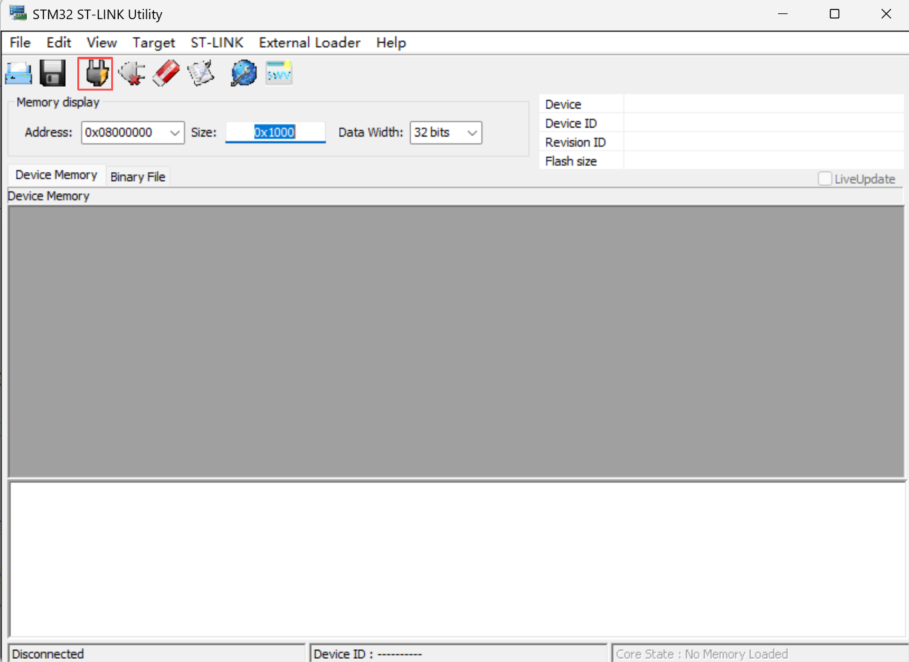
  连接成功后界面如下：
  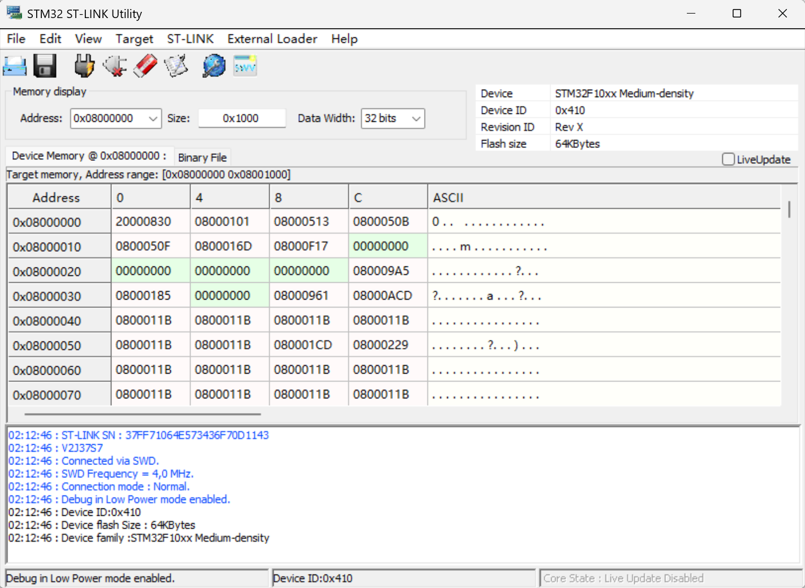
  > 正中间是存储数据, 右上角是芯片型号相关信息.

  .
3. 点击`下载`按钮, 该软件支持`.hex文件` / `.bin文件`进行烧录.
  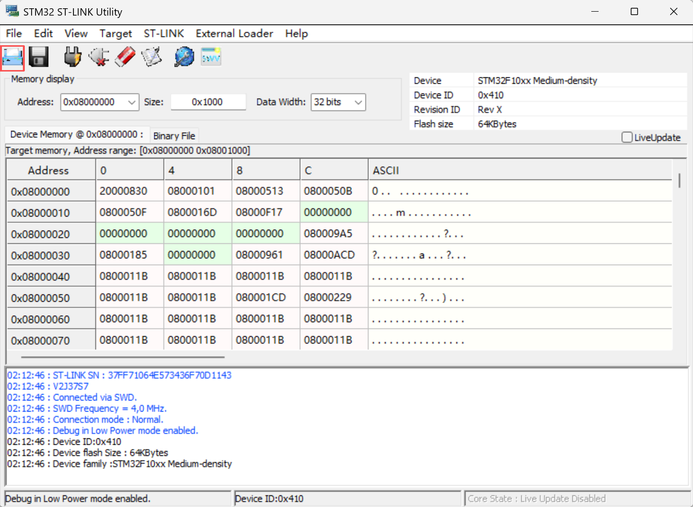
  .
4. 点击`编程`按钮, 在新窗口直接点击Start
  

#### 其他功能
- 保存
  点击保存按钮, 就可以下载主程序为`.hex文件` / `.bin文件`
  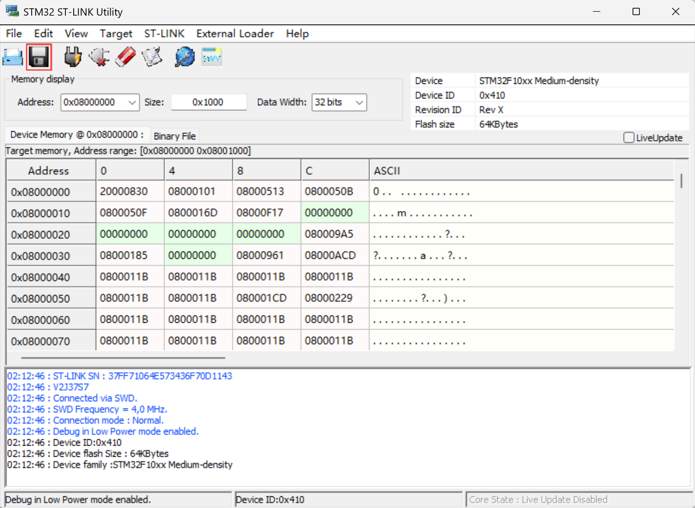
  .
- 清除全片
  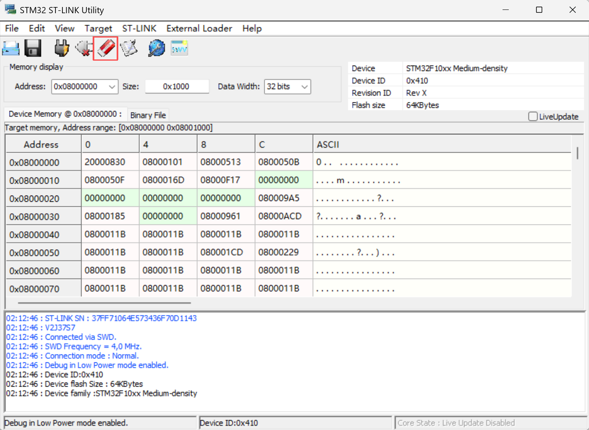
  .
- 断开连接
  
  .
- **选项字节配置**
  点击 `Target` → `Option Bytes`, 
  配置完后, 直接点击`Apply`, 就直接更新选项字节参数了.
  .
- 固件更新
  点击`ST-LINK` → `Firmware update` → `Device Connect`, 随后按操作执行就可以更新STLINK版本了.
  > 使用没问题没必要更新, 和电脑系统一样.
  
## STM32外设及其电路
### LED 和 蜂鸣器
#### 基础常识
- LED：发光二极管，正向通电点亮，反向通电不亮
没剪过的LED中,长脚是正极,短脚是负极;也可以看LED内部,较小一半是正极,较大一半是负极

- 有源蜂鸣器：内部**自带振荡源**，将正负极接上**直流电压**即**可持续发声，频率固定**
VCC接正极,GND(ground)接负极
中间引脚接低电平,蜂鸣器就响,接高电平,蜂鸣器就关闭

- 无源蜂鸣器：内部**不带振荡源**，需要控制器**提供振荡脉冲才可发声**，**调整**提供振荡脉冲的**频率**，**可发出不同频率的声音**

#### 硬件电路~(电阻R1防止电流过大,还能调节功率)~
- **LED**
低电平触发

由二极管特性和电压高低决定,懂得都懂

---
高电平触发

一般选第一种`低电平驱动`,因为很多单片机和芯片都使用的是高电平弱驱动,低电平强驱动的模式~(比如开漏输出,此时高电平无用)~

- **蜂鸣器**
使用了三极管开关的驱动方案
对于功率大一点的外设,如果直接用IO口驱动会导致STM32负担过重.这时就可以用一个三极管驱动电路来完成驱动,这里要先介绍一下三极管:
##### 三极管
三极管（晶体管）是电子电路中最基础、最重要的半导体器件之一，主要用于**放大信号**和**开关控制**
- **三极管的类型**

| 类型 | 全称 | 结构 | 符号特点 |
|------|------|------|--------|
| NPN | N-P-N 型 | 两层 N 型夹一层 P 型 | 箭头向外（从基极指向发射极） |
| PNP | P-N-P 型 | 两层 P 型夹一层 N 型 | 箭头向内（发射极指向基极） |
>箭头就是 发射极电流 IE 的方向.

| 类型 | 掺杂元素 | 多数载流子 | 特点 |
|:------:|--------|-----------|------|
| N 型 | 磷（P）、砷（As）等（5价元素） | 电子（负电荷） | “N” = Negative（负） |
| P 型 | 硼（B）等（3价元素） | 空穴（等效正电荷） | “P” = Positive（正） |
|N 型：多出自由电子 → 导电靠 电子流动|
|P 型：缺少电子（形成“空穴”）→ 导电靠 空穴移动|

| 对比项 | NPN | PNP |
|-------|-----|-----|
| 控制逻辑 | GPIO 高电平 → 导通 | GPIO 低电平 → 导通 |
| 接法 | 负载接 Vcc → C，E 接 GND | 负载接 E，C 接 GND |
| 常用场景 | 低边开关（Low-side switch） | 高边开关（High-side switch） |
PNP:

NPN:

- **三个引脚**
以NPN举例

| 引脚 | 英文 | 作用 |
|:----:|-----|------|
| B | Base（基极） | 控制端：小电流输入，控制大电流 |
| C | Collector（集电极） | 接电源正（负载端） |
| E | Emitter（发射~(载流子)~极） | 接地（GND） |
|口诀： “基极控流，集电进，发射出~(载流子)~”|

- **工作原理**
  - **核心思想**
用小电流（IB）控制大电流（IC）
满足关系：IC = β × IB
（β 是电流放大倍数，典型值 50～300）
  - **工作状态**(以NPN举例----**无能的基极**)


未通电时,E富集电子,B较多空穴.
B E之间开始有电压后, 空穴被电子占据(进入空穴,意味着将要流向B区);
V<sub>BE</sub>随着越来越大,空穴容纳不下所有的电子.
此时V<sub>CE</sub>开始有了电压,促使基极区的多余电子跑到了集电极去,使得CE间也有了电流,此时,B区的电流是IB,  C区的电流是IC, E区的电流是(IB+IC).

| 状态 | 条件（NPN） | 特点 | 应用 |
|------|-------------|------|------|
| 截止区 | V<sub>BE</sub> < 0.7V | IB ≈ 0，IC ≈ 0 → 关断 | 开关“断开” |
| 放大区 | V<sub>BE</sub> ≈ 0.7V，V<sub>CE</sub> > V<sub>BE</sub> | IC = β·IB，线性放大 | 音频放大、传感器信号放大 |
| 饱和区 | V<sub>BE</sub> ≈ 0.7V，V<sub>CE</sub> ≈ 0.2V | IC 不再随 IB 增大 → 完全导通 | 开关“闭合” |
>截止区 : 电压太小,BE间无法导通,所以IB ≈ 0，IC ≈ 0
放大区 : BE间导通,但空穴未被完全占满,此时由于概率关系,在空穴里的电子和未在空穴里的电子比例是恒定的.所以会说`IC = β × IB`
饱和区 : B区空穴被占满,不管多余电子全走CE电路,线性关系打破

>数字电路中，三极管只工作在 截止（0） 和 饱和（1） 两种状态，当作电子开关用。
- - 设计哲学
CE端之间隔着一层薄薄的B区,但是就是因此可望不可及;
当B区和E区开始载流子的交流后, E区的载流子才能偷偷流到B区去
真是对苦命鸳鸯!

---

这个图里,是PNP三极管的驱动电路,
基极给低电平导通,高电平断开

---

这个图里,是NPN三极管的驱动电路,
基极给高电平导通,低电平断开

### 面包板
面包板正面:

面包板背面:

面包板的上下各两行是电源线,每行的线路连通;
面包板的中间部分,每列5个孔通过金属爪连通.想实现外设通电,就将电源行上的孔连到中间列的孔上去


---
### 按键
常见的输入设备，按下则两引脚导通，松手则两引脚断开
#### 按键抖动：
由于按键内部使用的是**机械式弹簧片**来进行通断的，所以在*按下和松手的瞬间*会伴随**有一连串的抖动**

|||
|---|---|
|||
||假设按键没按下时是高电平，按下是低电平;|
||在没有任何消抖措施的情况下每次高到低的跳变~(下降沿)~都会被记作一次触发|

##### 不良影响
那可以看见，在按下和松手的(5-10ms)均出现了电平的抖动.对人而言比较快;
但是对高速运转的单片机而言,是很漫长的,*每一次电平变化单片机都能接收到,所以会出现,我们**按一次按钮**,单片机出现**多次反馈**的情况.*,这有很多负面影响 :
- 误触发 :
抖动会使一个物理按键按下被识别为多次按下。
例如：你只按了一次按钮，但程序却执行了 3 次操作,导致单片机控制的 LED 切换状态异常（如计数器加了 3，而不是 1）。

- 状态机逻辑混乱 :
如果系统使用有限状态机（FSM），一次抖动可能让状态机错误地跳转多次。
例如：从“待机” → “运行” → “暂停” → “停止”，本应只进入“运行”，却因抖动直接跳到“停止”。

- 中断服务程序（ISR）被频繁触发 :
若按键连接到外部中断引脚，抖动会在几毫秒内产生多个上升/下降沿，导致 ISR 被反复调用。
后果：
系统负载突增
主程序被频繁打断
可能丢失其他重要中断
在极端情况下引发堆栈溢出或看门狗复位

- 计数或测量误差
在需要精确计数的场合（如转速传感器、脉冲计数器），抖动会引入**虚假脉冲**，导致数据严重失真。
例如：流量计、编码器、频率计等对边沿敏感的设备。

- 通信协议干扰
  如果按键信号被误当作通信信号（如通过 GPIO 模拟 UART 或 SPI），抖动可能被解析为错误的数据帧，导致通信失败。

##### 解决方法--过滤消抖 :
- - **硬件消抖** :
- RC 低通滤波 + 施密特触发器 :
  在开关输出端加一个 **RC 电路**（电阻+电容），构成低通滤波器，**滤除高频抖动脉冲**。
后接 **施密特触发器**，将缓慢变化的模拟信号**整形为干净的数字电平**，避免中间电平导致逻辑错误。
优点：无需 CPU 资源，响应快
缺点：增加硬件成本和 PCB 面积
- 使用专用消抖芯片
- - **软件消抖** :
- 延时检测法~最简单~ : 
```C
if (read_button() == PRESSED) {  //读取当前按键的电平状态
    delay_ms(10);               // 等待抖动结束（通常 5～20ms）
    if (read_button() == PRESSED) { //再次读取当前按键的电平状态
        // 确认按键有效
        handle_keypress();          //执行下一步操作
    }
}
```
简单直观, 但阻塞式，影响主程序运行
- 定时采样 + 状态机 ~推荐~ :
**核心思想：**
只在按键状态真正稳定且从未被处理过时，才执行一次操作
**工作步骤:**
使用定时器（如每 5ms 采样一次）读取按键状态。
连续 N 次（如 3～5 次）采样结果一致，才认为状态有效。
以下是arduino的部分代码,stm32库函数开发的版本太长了,这里先看设计哲学 :
```C
// 伪代码示例
static uint8_t button_state = 0; //记录“当前按键是否已经被确认按下并处理过” 
//  ↓                               `0`--`否`;    `1`--`是`
// 保证变量在函数多次调用之间保持值（不会每次重置为 0）
static uint8_t stable_count = 0;//记录当前状态连续被采样到的次数

void check_button() {
    uint8_t current = read_button();
    if (current == button_state) 
    {//这个判断语句就相当于一个采样计数器
        if (stable_count < 5) 
          stable_count++;
    } 
    else 
    {
        stable_count = 0;
        button_state = current;
    }

    if (stable_count == 5 && button_state == PRESSED) 
    {   //这个判断语句相当于状态机
        //必须累计5次并且按钮状态是 `pressed`,才触发一次有效事件
        on_button_pressed();
        stable_count = 0; // 避免重复触发（可选）
    }
}
```
非阻塞、可靠、可扩展
支持**长按、双击**等复杂逻辑
这段代码里用的是电平触发,但更好的方法是边沿触发
- - **其他高级方法** : ~先简单了解,后续再次进行补充~
- 计数器法 / 边沿检测法 :
检测电平变化后启动计时器，在固定时间窗口内忽略后续变化。
或使用“边沿触发 + 软件锁”机制。
- 卡尔曼滤波 / 中值滤波：一般用于模拟信号噪声，不适用于数字开关抖动。
- FPGA 实现状态机消抖：在高速或并行处理场景中使用。

#### 使用方法
|||
|:---:|:---:|

|前两种是下接法|后面两种是上接法|
|一般使用前两种,是电路设计的规范;||
|而且,使用第一种,必须要求引脚是`上拉输入`,防止引脚电压不确定||

### 传感器
- 类型:
光敏电阻传感器
热敏电阻传感器
对射式红外传感器
反射式红外传感器
- 工作原理: 
传感器模块：传感器元件的电阻会随外界模拟量的变化而变化，通过与定值电阻分压即可得到模拟电压输出，再通过电压比较器**进行二值化**即可得到数字电压输出

||
|---|
||
|图中的Rx是定值电阻,   Cx是滤波电容,  Nx是敏感电阻,   其余勿复言尔|
|定值电阻和敏感电阻形成简易分压电路; 滤波电容可以给电压输出进行滤波,使之波形平滑.
#### 滤波电容
用于平滑电压,从而抑制噪声、稳定电源或信号;
一般一边接地,一边接电路中,可以将高频交流电流导向GND,只留稳定的直流电.
所以一般就是保证电路稳定用的,日常分析可以去除.
- 工作原理 :
对于电容而言,
  - 直流电：
   电容充电完成后相当于电阻无穷大/开路。
结果就是,在电容所在路线阻断了直流
  - 交流电 (常出现在纹波 / 噪声): 
   频率`𝑓`越高 或 电容`𝐶`越大，容抗越小 → 高频信号更容易“通过”电容到地。

#### 电路组成
||||||
|:---:|---:|:---:|:---|:---:|
||
|U1| U2 |U3|U4|     U5|
|LM393 比较器核心电路|IN- 参考电压与保护电路|IN+ 输入端电路/ AO 输出电路|LED1 电源指示灯|LED2 和 P1 排针输出电路|
|核心比较器，输出数字信号 DO|正输入端（参考电压）生成与保护|负输入端（待测信号）输入接口|电源状态指示（常亮）|DO端状态指示（低电平常亮，也就是光强大时常亮） + 外部接口|

看图方法是这样的:
前面的图都是最后一张图的黑匣子(P1)的内部部分电路;
而最后一张图,是此元件引脚的外部接法.


##### 内部电路
###### LM393 比较器核心电路~(实现二值化的最大功臣)~

实质是  双路电压比较器（两个独立比较器）
| 引脚 | 功能 |
|------|------|
| 8 (VCC) | 电源正极（2.7V～36V） |
| 4 (GND) | 接地 |
| 5 (IN+) | 正输入端（参考电压或信号） |
| 6 (IN-) | 负输入端（待测信号） |
| 7 (DO) | 数字输出（OUT） |
| 1,2,3 | 第二路比较器（本电路未使用） |
|这个例子里的IN+ IN-作用似乎反了,但原理一样||
- 电压比较器(运算放大器)
**每个比较器有：**
同相输入端/正输入端（IN+）
反相输入端/负输入端（IN-）
输出端(DO)~其实和DO没什么关系,只是这里输出作为数字输出,所以叫DO~
**输出逻辑：**
如果 IN+ > IN- → 输出 8号引脚(接VCC)（内部晶体管导通到 VCC）
如果 IN+ < IN- → 输出 4号引脚(接GND)（内部晶体管导通到 GND）

###### IN- 参考电压与保护电路

连接一个分压电路,可以调整滑片从而改变参考电压(即IN-的电平)

###### IN+ 输入端电路/ AO 输出电路

因为N1和R1 的分压, 得到红点处电压(即IN+和AO的电平)

###### LED1 电源指示灯

这个电路与AO/DO无关，单纯接上VCC和GND，检测外接的VCC和GND是否故障

##### 外部电路
~来自后期的矫正，其实左半边连接DO的电路还是器件内部的电路，只是刚好连着DO，所以就这样画。~

######  P1 排针
P1代表的就是传感器元件及其引脚(接口)
内部电路的所有VCC和GND就是这里接入的
内部电路的AO/DO 就是在这里输出的

###### LED2
这个电路通过**LED2的发亮与否**.就可以判断**DO端的输出值**, 进而判断某一**环境变量是否超过阈值**;
而那个上拉电阻是为了保证**无输出情况下,DO端的电平是VCC**

#### 使用方法

具体使用已经在电路组成那一块说明了,便不再赘述.


### OLED ：
#### 简介
OLED（Organic Light Emitting Diode）：有机发光二极管
OLED显示屏：性能优异的新型显示屏，具有**功耗低、相应速度快、宽视角、轻薄柔韧**等特点
0.96寸OLED模块：小巧玲珑、占用接口少、简单易用，是电子设计中非常常见的显示屏模块
供电：3~5.5V，
通信协议：I^2^C/SPI，
分辨率：128*64
||
|:---:|
|**实物图**|
||
|其中,四针脚用的是 I^2^C 通信协议;七针脚用的是 SPI 通信协议.|
|**屏幕坐标图**|
||
|4*16|

#### 针脚接法

- 四针脚OLED
SCL和SDA都是I^2^C的通信引脚,需要接在单片机的I^2^C的通信引脚上,
但是可以通过驱动函数模块,用GPIO口模拟I^2^C通信;

- 七针脚OLED
剩下五个都是SPI的通信引脚,需要接在单片机的SPI的通信引脚上,
但是可以通过驱动函数模块,用GPIO口模拟SPI通信;

### 旋转编码器
**用来测量位置、速度或旋转方向**的装置，当其旋转轴旋转时，其输出端可以输出**与旋转速度和方向对应的方波**信号，读取方波信号的频率和相位信息即可得知旋转轴的速度和方向
- 类型：光栅式/机械触点式/霍尔传感器式
  

#### 测速原理
- 第一张图---**光栅式编码器**
    ~属于增量式编码器~
    
    最简单的编码器样式，主要由`对射式红外传感器`和`光栅编码盘`构成.
    **工作原理:**
    当光栅编码盘转动的时候, 红外传感器也就会发射高低电平交替的方波.
    方波个数可以代表转过的角度值, 方波的频率从而可以表示转速. 
    我们可以通过设置外部中断, 来捕获边沿, 从而测量位置和速度.
    >缺点: 
    不能测量旋转方向.

    .
- 第二张图---**机械触点式编码器**
  ~属于增量式编码器~
  
  **主要组成 :**
  - 中央绿色电路板模块：
五个引脚：VCC、GND、C（开关信号输出）、A/B(旋转信号输出)
绿色部分左右两侧是各有三个金属触点,通过电平变化传递旋转和开关信息;  而中间圆的金属圆片是个按键,内置弹簧~(动件是电刷,静件是触点)~
**所有触点连接上拉电阻**
    .
  - 右侧的小型白色旋转部件：
    是编码器的独立旋转头，底部和电路板结合部分带有内外共三圈电刷结构.
    >其实没有所谓的金属圈电刷,有的只是一层金属实心薄片, 其上方有一个部分镂空的塑料片.
    其中,外圈/中圈被覆其上的塑料部分遮挡,分成一段段的扇形;
    而内圈无塑料遮挡,是完整的圈.

    **所有金属片连接GND**
    .
  - 右边是固定器件,便不多展开描述

  **工作原理:**
  我们放大来看:
  
  三个电刷金属圈和左边三个金属弹簧触点的对应关系如上(右边同理);
  六个金属弹簧触点和A/C/B引脚的关系也如上;
  如下,是电路图:
  
    - **旋转测速功能**
      由前文的概述,我们可以得知,我们通过旋转产生的方波电平信号,从而推断转速.
      这里也同理,拿隶属A引脚的两个触点举例:
      触点在旋转时,
      可能**接触塑料**,因为触点连接上拉电阻,**A引脚呈高电平**;
      可能**接触金属片**,此时**A引脚呈低电平**;
      从而产生方波状的电平信号
      那现在会有三个问题:
      - 测速有一个触点就行,为什么设计时采用了分叉的两个触点呢?
        其实是为了保证稳定性, 采用了两个触点的设计形式,这样确保了如果其中一个触点失灵,整个器件仍然可以正常工作.
        .
      - 测速有一个A引脚就够了,为什么设计时采用了A/B双引脚的形式呢?
        前一句是对的, 测速有一个A引脚就够了.
        **B引脚的作用其实是判断旋转方向**:
        废话不多说,上图(excalidarw真好用😋)
        
        >由于该码盘中塑料块的个数和角度设计,保证了A/B的电平变化图像相位差始终在90°.
        因此,这种编码器也叫正交输出的编码器
        
        当A边沿变化后,会检测A/B的电平:
        若电平不同,则逆时针;
        若电平相同.则顺时针;
        ~(具体情况和结构相关)~
        .
      - 靠北,那为什么还有C引脚啊?!!
        首先,我们知道**金属片电刷与GND相连**,那大家有没有想过,他们是如何相连的呢?
        其实最大功臣就是我们的C引脚:
        >**在PCB板的背面,GND与C引脚相连**, 同时C引脚相连的两个金属弹簧触点与无塑料遮挡的内圈相接触-----从而一整个金属片都是GND电平.
      .

    - 按压确认功能 
    ~(疑似没有这个功能，按键按下不会产生任何反应)~
      
- 第三张图---**霍尔传感器式编码器**
  ~一般直接附在电机后面~
  
  **主要组成:**
  红色PCB板：安装在电机轴端
  中间的圆柱体：是电机转子的一部分，**上面嵌有一个磁铁**
  霍尔传感器：静止不动，相差90°地安装在PCB上，用于感应磁场变化
  .
  **工作原理**
  每个霍尔传感器会检测到经过它上方的磁极极性（N/S）。
  当 N 极靠近传感器 → 输出 低电平
  当 S 极靠近传感器 → 输出相反电平
  >具体的输出电平取决于设计
  和机械触点式的编码器一样,也属于正交输出的编码器
  不再赘述.
  
  .

- 第四张图---**独立编码器元件**
  
  可以塞入电机内,然后测速,比较精细.
  虽然似乎是光电式的,但工作原理与前两个大差不大

#### 用途
第二张图的机械触点式的旋转编码器,**作交互类功能**,比如调节音量之类的功能
其余的旋转编码器,非接触的形式, 可以与其他元件一同封装,用于电机测速等.


### 直流电机&驱动芯片
- 直流电机:
直流电机是一种将电能转换为机械能的装置，有两个电极，当电极正接时，电机正转，当电极反接时，电机反转。
>直流电机属于大功率器件，**GPIO口仅能作逻辑电路**,需要配合电机驱动电路来提供动力.
- 驱动芯片:
而`TB6612`是一款双路H桥型的直流电机驱动芯片，可以驱动两个直流电机并且控制其转速和方向.

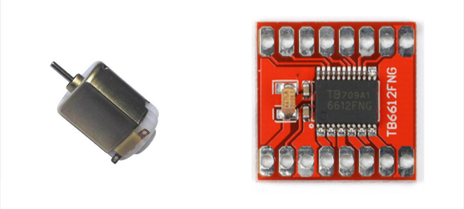
如下电路图所示:
>不妨设四个MOS管为
1  3
2  4

当1, 4mos管接通的时候,输出是左正右负; 
当2, 3mos管接通的时候,输出是左负右正.
从而实现正反转.
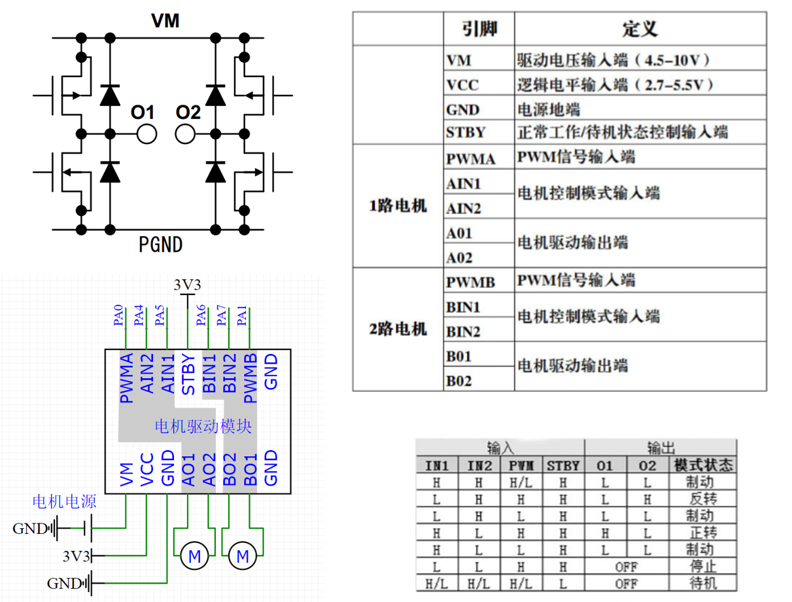
~部分说明如上图,勿复言尔.~
主要讲讲PWM / IN1 / IN2 / STBY的作用:
  - PWM :
    作为转动和制动,决定电机的动与静;
    .
  - IN1 / IN2 :
    决定转动方向.  
    .
  - STBY :
    高电平则正常工作,低电平则处于待机状态. 
而其对应的模式状态也在上图中了,也不多赘述.


### 舵机
舵机是一种根据输入PWM信号**占空比**来控制**输出角度**的装置;
这个器件最有意思的点就是, 它更像是把PWM信号**作为通讯协议,用于逻辑电路**,而非动力系统.
>**输入PWM信号要求**：周期为20ms，高电平宽度为0.5ms~2.5ms


害害害! 没想到其实舵机内部有一个直流电机吧!

#### 核心逻辑
`SG90` 舵机内部是一个**闭环位置控制系统**, 其核心逻辑如下：
外部 PWM 信号 + 内部电板(控制板) → 编码目标角度
内部电位器 → 实时反馈当前角度
驱动芯片 + 直流电机 + 减速齿轮 → 驱动转轴向目标靠近
当电位器反馈 = 目标值时，电机停转 → 实现“固定角度”
虽然它用的是直流电机（本身会一直转），但通过负反馈控制，让它只转到指定位置就停下。
>毫秒级循环 ↑

.
以下是几个核心部分:
- **内部电板(控制板):**
其 内置 脉宽测量电路~（类似输入捕获）~
检测 PWM 上升沿和下降沿
计算高电平持续时间~（例如用内部RC振荡器+计数器）~
将脉宽转换为一个模拟电压或数字参考值，代表“目标位置”;
把这个值变为对应电压值输出,记作V~1~;
.
- **电位器:**
电位器类似一个滑动变阻器,其两端连着`VCC`和`GND`;
电位器的滑动端~（类似滑片）~随输出轴同步转动;
这样一来,每个位置的滑片电平值都对应一个相应的扇片角度, 记电平值为V~2~.
.
- **直流电机&驱动芯片**
驱动芯片的 IN1 / IN2分别连V~1~ / V~2~.
然后电机就可以通过V~1~ 、V~2~ 的大小关系选择正反转, 实现**负反馈调节**.
>在V~1~ = V~2~时,利用死区,冻结此次循环.

### USB转串口模块
#### 内部电路图
##### 核心电路

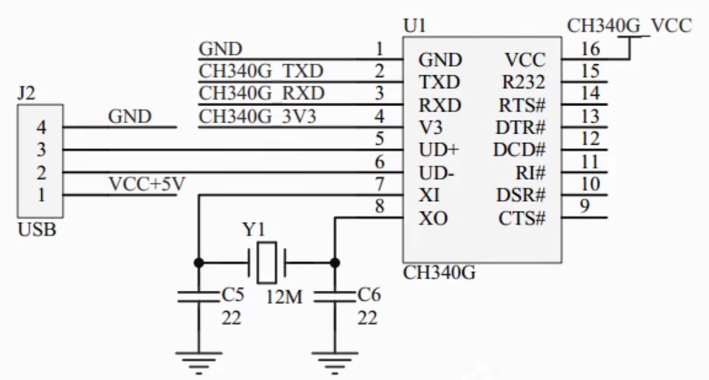
第一张图的 `J1` 是串口端的外部接口.
左边的 `J2` USB端的外部接口， `U1`则是该转化模块中芯片`CH340G`的各个引脚 
>三个方框中, 连在一起的肯定就是连接, 这肯定没有问题.
 如果两个方框都有同一个名字的引脚线, 那也代表他们相连.
 注: `CH340G 3V3` 和 `VCC 3V3` 是同一个引脚线.

接下来讲几个引脚的具体作用:
- `UD+` / `UD-`
  USB的差分通信线.
  在`CH340G`芯片处理后, 连接`RXD` 和 `TXD`.
  .
- `VCC+5V` / `CH340G 3V3 / VCC 3V3` / `CH340G VCC`
  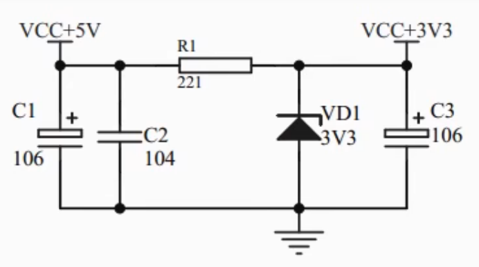
  `VCC+5V`通过上图的不在`CH340G`芯片中的 `稳压管电路` 与 `CH340G 3V3 / VCC 3V3`连接, 使`CH340G 3V3 / VCC 3V3`带上 3.3V 的电平.
   .
  **但是**, `CH340G芯片`的供电, 是由`VCC`引脚决定的, 也就是`CH340G VCC`引脚线.
  再看向第一张图的 `J1`, 引脚 4 / 5 / 6就是这三根线, 其中`CH340G VCC`是`CH340G芯片`的**电源输入脚**. 而引脚 4 / 6 分别带上了 3.3V / 5V 的电压。
  这时就需要将 `J1` 的引脚 4 / 6 和 引脚5相连, 以开启电源输入脚.
  > 可以使用`跳线帽`, 将两个引脚连在一起.
    不连接默认3.3V 

##### 指示电路
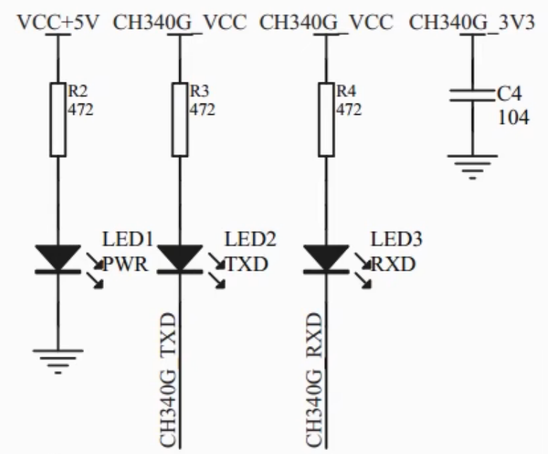
左边的LED灯是电源通断灯;
中间的LED灯是串口传输数据灯;
右边的LED灯是串口接收数据灯.

### MPU6050
#### 简介
MPU6050是一个6轴姿态传感器，可以测量芯片自身X、Y、Z轴的**加速度**、**角速度**参数，通过数据融合，可进一步得到**姿态角**, 也叫做`欧拉角`，常应用于平衡车、飞行器等需要检测自身姿态的场景
6轴指的是:
- 3轴加速度计（Accelerometer）：测量X、Y、Z轴的加速度
- 3轴陀螺仪传感器（Gyroscope）：测量X、Y、Z轴的角速度
> 如果集成一个 10轴的传感器, 那就是再加上 3 轴磁场传感器 和一个 气压传感器.

- 何为姿态角?
  姿态角一开始用于描述  飞机机身相对于初始3个轴的夹角
  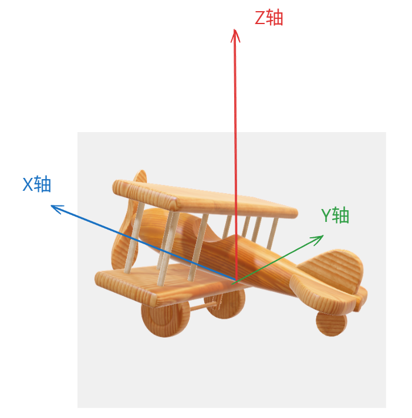
  X-Z面 与 X轴 的夹角， 叫做`俯仰`, 即`Pitch`.
  Y-Z面 与 Y轴 的夹角,  叫做`滚转`, 即`Roll`.
  X-Y面 与 X轴 的夹角,  叫做`偏航`, 即`Yaw`.

  > 前文所提到的所有传感器, **单一拎出来, 都无法精准地在任一时刻都测量出三个姿态角**, 只有集成在一起, 把进行数据融合, 谁负责在什么运动状态下测量, 谁负责测哪一姿态角, 各司其职, 才能精准.
  >> 常见的数据融合算法有, `互补滤波`, `卡尔曼滤波`等. 
  这
  这也叫 `姿态解算`.

接下来详细讲讲`加速度计`和`陀螺仪传感器`的实现原理.
#### 加速度计 Accelerometer
- 如下， 是单轴加速度计的结构示意图：
  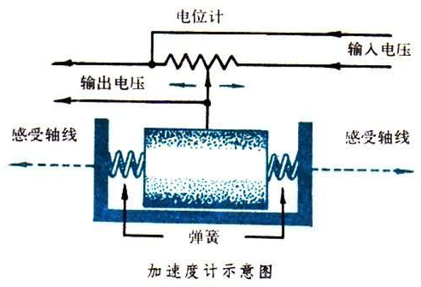
  弹簧中间的具有一定质量的小滑块，**在`感受轴线`上具有加速度时, 会向左右移动**, 从而带动电位计滑片移动, 从而**改变电压, 等效替代了加速度**.
  🤔
  那只要在一个小滑块的上下左右前后都安上弹簧, 是不是就可以测三轴加速度了呢?
  😋
  那我问你, 是做上述所言的元件造起来简单, 还是三个放在不同轴单轴加速度计造起来简单🤣👆
  所以, 我们采用的是, 在`MPU6050`中, 安装三个放在不同轴单轴加速度计, **这样不同轴的测量还不会相互产生干扰**.
  .
- 加速度和姿态角有什么关系?
  当**MPU6050静止**时，加速度计测量的是**重力加速度**在各轴的分量：
  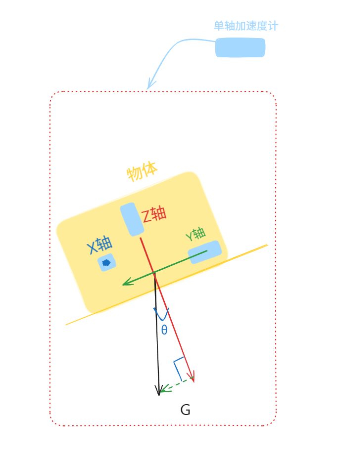
  通过测量各轴的值, 计算 `θ` 的值, 也就可以得到物体的 `俯仰角`和 `滚转角` 了.
  
  > 🤔,这么说, 加速度计的用处居然只是测力()

#### 陀螺仪传感器
详情可看[【陀螺仪的工作原理⚡ 陀螺仪是什么】](https://www.bilibili.com/video/BV1FP41167Jm?vd_source=7acd15f8dc409504a76f1086442daa5a)
##### 扭矩, 角动量和进动
- **扭矩和角动量**：
  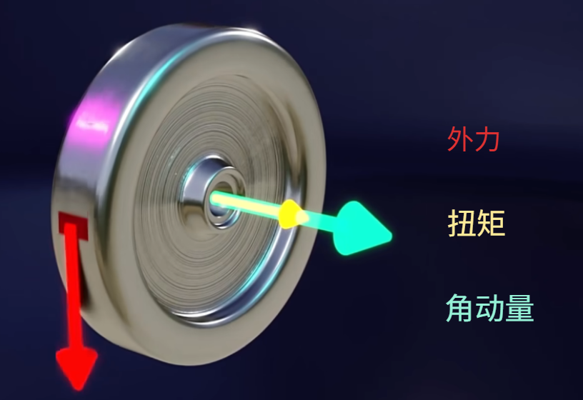

  在旋转轴上的系统中，当我们在转子边沿施加一个力时,
  就会产生一个`扭矩`，它使系统旋转，并以**与旋转轴平行的矢量**表示， 你可以认为 `扭矩 = 角加速度 * 转动惯量`.
  > 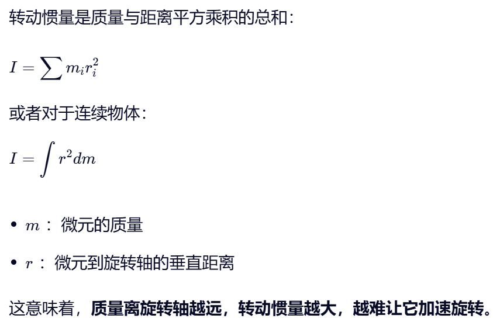
  > 在旋转运动中，物体抵抗旋转状态改变的能力，不仅取决于它有多重，还取决于质量分布离旋转轴有多远。

  .
  除此之外，当系统旋转时，它还具有`角动量`，它也是由**与旋转轴平行的矢量**表示，并由两个因素确定：
  1. 系统的`转动惯量`，其取决于其形状和质量分布.
  2. `角速度`， 其告诉我们系统在一段定义的时间内的旋转度数.
  > 和动量相似

- **角动量守恒**：
  如果我们有一个能够**绕轴旋转**的系统，并且作用于它的**净外部扭矩为零**，角加速度就不变， 角速度就不变， 系统的总角动量也将保持恒定。
  > 因为总角动量保持恒定， 所以 旋转轴方向也保持恒定， 那么就可以利用这一特性精确指定方向。

  .
- **进动**:
  `进动`是当**旋转物体受到力的影响而改变其方向**时产生的**圆周运动**。
  经典例子是把自行车轮挂在轴的一端(具体空降 原视频的 4:12 [【陀螺仪的工作原理⚡ 陀螺仪是什么】](https://www.bilibili.com/video/BV1FP41167Jm?vd_source=7acd15f8dc409504a76f1086442daa5a))
  . 
  以下对原视频做一些解释:
  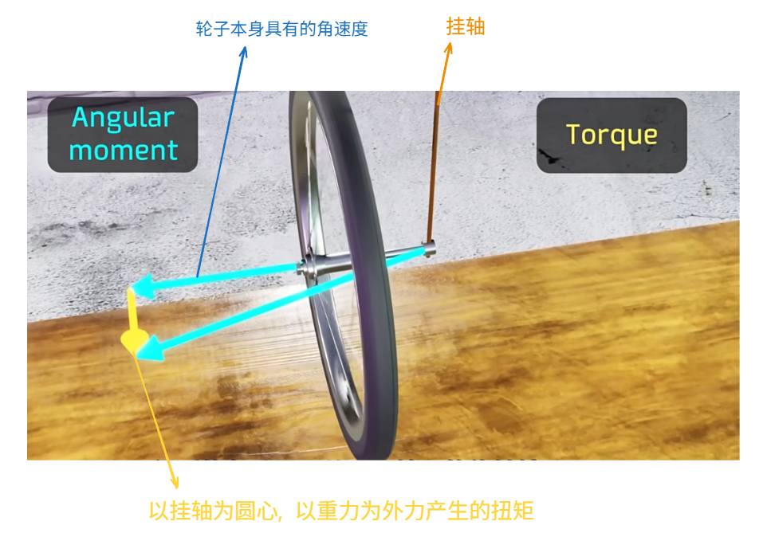
  扭矩， 意味着有相应方向上的角加速度。 
  角速度， 意味着有相应方向上的角动量。
  .
  由于角速度很大的原因, 相应方向上的角动量也会很大, **重力造成的 扭矩 和 角加速度 不够看**, 
  合角动量方向的变化很小, 从第一个蓝色的箭头, 转移到了第二个蓝色的箭头;
  两箭头间夹角很小, `自转轴`轻易地就能移动到第二个箭头, 实现`自转轴`和`合角动量`的重合, 实现系统角动量的**重新平衡**. 
  但当角速度不大的时候, 两个箭头间跨度很大, 自转轴无法马上跑到第二个蓝色箭头上, 系统平衡打破, 所以下坠.
  > 就这样, 自转轴一直追逐着`合角动量`, **这过程产生的水平圆周运动就是 进动**
  
  .
  如果你只是想了解个大概, 这就够了, 以下内容是笔者沉思良久后认为真正合理的解释: ~大家感兴趣的话,~ ~看看就行,~ ~不保真()~
  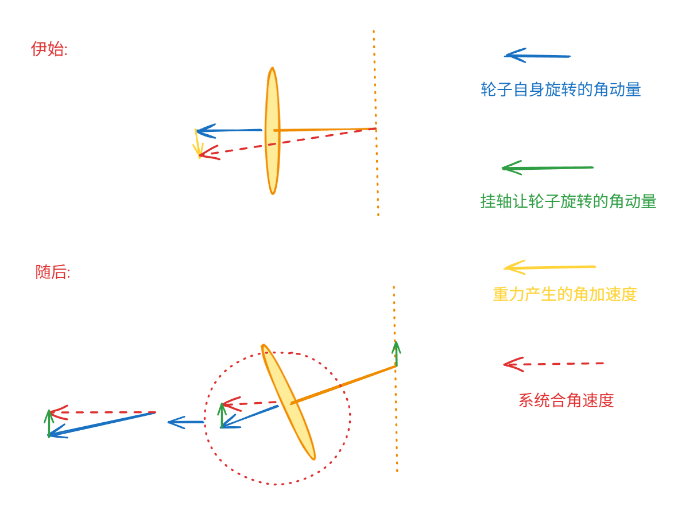
   在我们上述所谈论的进动模型中， 有如下几个规则怪谈：
   1. 由于最初的系统角动量是水平的， 之后重力产生的角加速度也都是水平的，这意味着， 在进动过程中， **系统角动量始终保持水平**。
   .
   2. 在进动过程中, 有角速度的地方只有两个, 一个是 **轮子自身旋转的角动量**, 一个是 **挂轴让轮子旋转的角动量**.
   .
   3. 基于 `2.`, **轮子自身旋转的角动量** + **挂轴让轮子旋转的角动量** = **系统合角速度**.
   .
   由上述事实, 我们可以大致还原案发现场了():
   > 基于上图, 我们把**轮子自身旋转的角动量**叫做`蓝角动量`, **挂轴让轮子旋转的角动量**叫做`绿角动量`.
   
   `伊始`的下一刻, `系统合角速度` 和 此时的 `蓝角动量` 不等, 所以出现了 `绿角动量`, **方向水平, 向着屏幕**, 因此转子做**竖直面**的圆周运动, 俗话叫下坠().
   .
   `伊始`的下好几刻后, 轮子的状态变成了`随后`里的那样, 此时**系统角动量仍然保持水平**, 但是`蓝角动量`变的向下倾斜, 所以**绿角动量需要指向斜上方**, 保证 **蓝角动量** + **绿角动量** = **系统合角速度**.
   .
   由于蓝角动量puls big 的原因, **绿角动量几乎是垂直向上的**.
   .
   有没有发现?
   绿角动量从**方向水平, 向着屏幕**, 变成了**几乎是垂直向上的**.
   .
   这意味着什么?
   这说明**挂轴让轮子旋转的方向从竖直面变成了水平面**！！！
   然后系统一直保持`随后`的运动状态.
   这， 就是`进动`的真正产生原因....应该？()

##### 传统机械陀螺仪
- **测量角度**:
  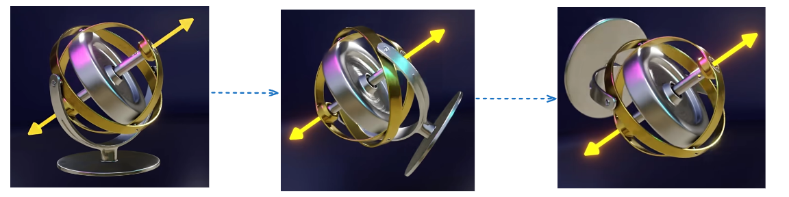

  - **原理：角动量守恒**
  利用一个高速旋转的刚性转子~（飞轮）~。根据角动量守恒定律，在**没有外力矩作用下**，旋转物体的**自转轴在惯性空间中保持方向不变**~（定轴性）~,
  从而实现自转轴始终指向某一方向, 以测量**目前方向和自转轴方向的夹角**, 在以前航行指路时发挥大用.
    .
  - **缺点：**
    体积大、成本高、启动慢（需要时间加速到工作转速）、有**轴摩擦**和**机械磨损**, 
    悬挂传递的转矩或多或少都会影响转子的合角速度方向, 进而改变自转轴的方向。
    .
  - **现状：**
  虽然有以上缺点, 但其仍是具有极高精度的.
  主要用于对精度要求极高且不计成本体积的场合（如部分老式航天导航、高精度经纬仪），或者作为教学演示模型。
  . 
- **测量角速度:**
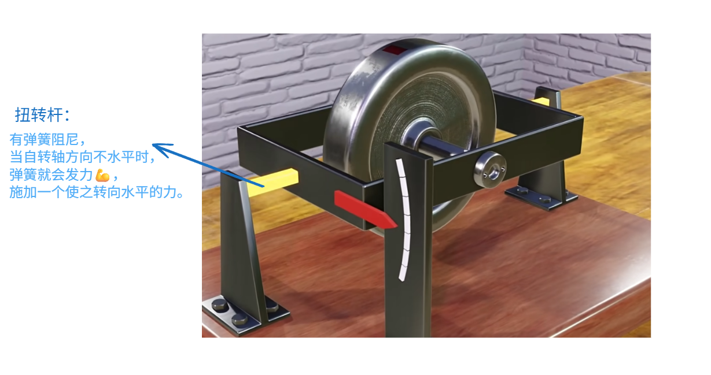
其中心有一个旋转的`圆盘`，而这个`圆盘`又会被`扭转杆`悬挂。这些杆允许悬挂支撑的圆盘旋转, 但也会加一个随着扭矩成比例增加的阻力, **一个扭转角度对应一个扭矩值**;
当圆盘平衡, 即自转轴不动时, 其 `扭矩 + 角加速度 * 转动惯量 = 0`
这意味着我们**可以利用扭转角度来计算当前系统的角速度**, ~和加速度计类似~
  - **缺点**：
    依赖转动惯性， 这意味着无法在保证一定精度或旋转时间的情况下缩小这些系统的尺寸。
  
  因此, 欢迎今天的主角！！！（bushi）

##### 科里奥利效应振动陀螺仪
本外设使用的陀螺仪, 目前最广泛， 且可以在**低成本下造出小尺寸**。
通常也被直接称为`MEMS陀螺仪`（微机电系统陀螺仪）
累了， 偷个懒：
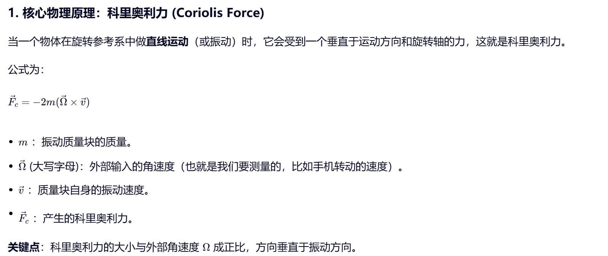
.
.
.
在`MEMS陀螺仪`中, 有如下元件:
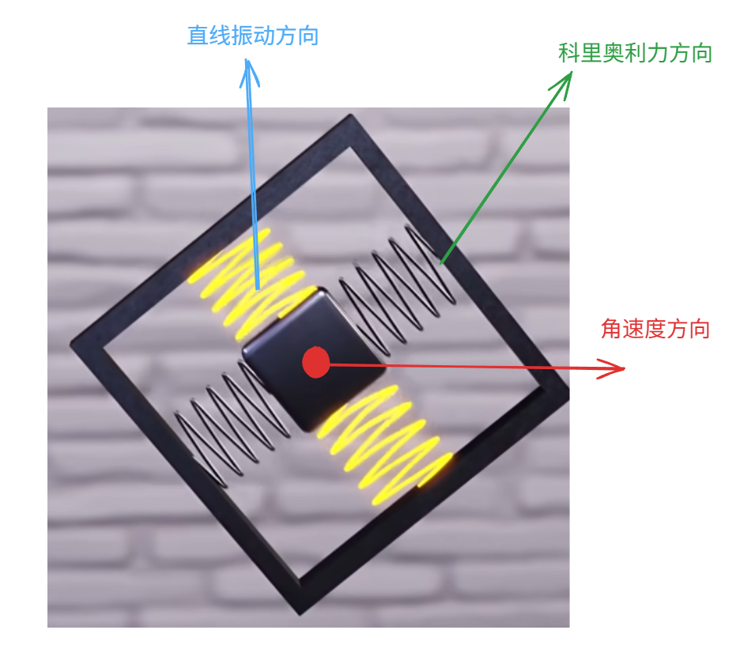
最中间的, 是有一定质量的小物块, 
**黄色弹簧**通过电路会给小物块极高的设定好的振动频率, 这就是上图中的**质量块自身的振动速度**.
小物块在**黑色弹簧的方向**会随振动和旋转, 而左右移动, **动的原因就是科里奥利力**, 然后我们就可以通过测量黑色弹簧方向上 物块的位置, 来测量科里奥利力了.
最后, **振动频率是电路设定好的, 科里奥利力也测量好了, 我们就可以求出角速度了**.
- **缺点**:
  虽然它们设计用于测量角速度, 但**线性加速度也会对振动质量施加力**, 这就导致**系统遇到大的加速度, 精确性会受到影响**.

所以, 他来了():

##### 光学陀螺仪
|||
|---|---|
|||

考虑一个由光纤组成的环，并假设由激光器产生的两束光在同一起点沿着环的相反方向传播, 两个黑块是起点和终点。
如果系统静止，两束光将在相同的时间内沿着环的周长传播。

**但**， 如果该光纤环在旋转， 那结果就不同了：
与系统旋转方向相同的光束在到达路径的终点前必须行进更长的距离。
方向相反的光束行进的距离则变短。
~~那么我们就可以通过测量时间差算出角速度了~~，  
仔细想想， 如果是👆这样， 又何必用两条光束呢？ 一条照样可以。
所以， ~~这个元件不会设计， 多用了一条光束🤣👆~~
.
咳咳咳, 言归正传, 实际原因是, 光的传播速度太快了, 我们无法掌握他的精确到达时间, 所以利用到达时间的方法一律是不合适的, 那原因到底是什么呢?~🤬作者你怎么还不讲~
马上马上(っ °Д °;)っ
原因如下:
因为光是一种具有特定频率和波长的电磁波，通过让两束光线沿相反的方向传播，**它们自然会相互干涉**，生出具有新特性的合成光束, 
这个**新光束的特性与产生它的光束之间的相位差有关**，因此也与行程距离的差异有关, 从而最终允许我们计算角速度。
> 具体如何测量相位差, 我实在看不懂😭, 大家想了解的自行查阅资料吧.