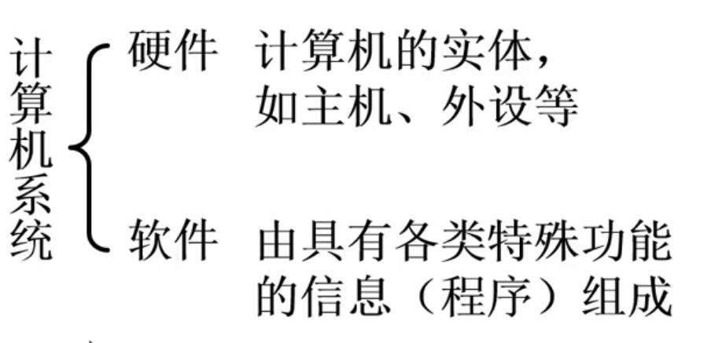

# 计算机组成原理笔记
>跟着B站的`计算机组成原理（哈工大刘宏伟）`课程进行学习
---
## 目录
- [计算机组成原理笔记](#计算机组成原理笔记)
  - [目录](#目录)
  - [计算机系统简介](#计算机系统简介)
    - [计算机系统组成——硬件和软件的抽象分层](#计算机系统组成硬件和软件的抽象分层)
    - [计算机系统的层次结构](#计算机系统的层次结构)
      - [物理架构上的层次结构](#物理架构上的层次结构)
      - [程序语言上的层次结构](#程序语言上的层次结构)
    - [计算机体系结构和计算机组成](#计算机体系结构和计算机组成)
  - [计算机的基本组成](#计算机的基本组成)
    - [冯·诺依曼计算机的特点](#冯诺依曼计算机的特点)
    - [计算机硬件框架图](#计算机硬件框架图)
      - [冯·诺依曼计算机硬件框架图](#冯诺依曼计算机硬件框架图)
      - [以存储器为中心的计算机硬件框图](#以存储器为中心的计算机硬件框图)
---
## 计算机系统简介
### 计算机系统组成——硬件和软件的抽象分层

软件是一堆二进制数字,通过不同的解析方式,然后向硬件发送指令的信息(比较片面.后期补充完善)

>
语言处理程序--`编译程序`
操作系统--管理计算机系统的软硬件资源,实现人机交互,多个程序可以协调在一台计算机上执行
服务性程序--数学库之类的调用库,以及不同进程之间通信和数据传输的程序
数据库管理系统--??有空查一下
网络软件--支持网络功能的软件
而**应用软件**向下与系统软件通信,从而驱动硬件运转,以达成某一高级特定任务的高层程序

### 计算机系统的层次结构
(**加一层的魅力时刻**)
#### 物理架构上的层次结构
| 层次（Layer）           | 主要内容 / 组成要素                     | 对应的抽象概念 / 功能说明                             |
|------------------------|----------------------------------------|------------------------------------------------------|
| **Application Software** | 应用程序（programs）                   | 用户直接使用的软件，如浏览器、办公软件等               |
| **Operating Systems**    | 操作系统（device drivers, processes）   | 管理硬件资源，提供系统调用接口                         |
| **Architecture**         | 指令集架构（instructions, registers）   | 定义处理器的行为，如 x86、ARM 架构                     |
| **Micro-architecture**   | 数据通路（datapaths）、控制器（controllers） | 实现指令集架构的具体电路设计                           |
| **Logic**                | 逻辑门电路（adders, memories）          | 基本的数字逻辑单元，如加法器、存储器等                 |
| **Digital Circuits**     | 数字电路（and gate, not gate）          | 使用晶体管构建的基本逻辑元件                           |
| **Analog Circuits**      | 模拟电路（amplifiers, filters）         | 处理连续信号的电路，如放大器、滤波器                   |
| **Devices**              | 物理器件（transistors, diodes）         | 半导体器件，构成电路的基础元件                         |
| **Physics**              | 物理原理（electrons, quantum effects）  | 最底层的物理现象，如电子运动、量子效应等               |

> **注**：从物理构成的角度看，计算机系统是一个由下至上逐层抽象的体系。每一层都依赖于下一层并为其上层提供服务，同时隐藏了底层的复杂性。
#### 程序语言上的层次结构
| 层次（Layer）           | 作用过程 / 作用内容                     | 对应的抽象概念 / 额外补充                             |上下级关系|
|------------------------|----------------------------------------|------------------------------------------------------|----------------------------------------------------------------|
|高级语言|通过`编译程序`、`解释程序`生成`目标程序`,进而生成`可执行代码`|易编写,效率高|用编译程序翻译成汇编语言程序|
|汇编语言|通过`汇编程序`把汇编语言转为机器语言|符号语言,其指令与机器语言的指令一一对应|用汇编程序翻译成机器语言程序|
|操作系统|沟通上层与下层的管家|自操作系统向上都是软件,其之下都是硬件|用机器语言解释操作系统|
|软         硬          件          交          互          接          口
|机器语言|二进制的0,1代码|直接控制硬件的语言,硬件执行指令时操作复杂|用微指令解释机器指令|
|微指令系统|把在每一个时间点上能执行的操作放到同一微指令中,通过微指令的执行顺序,进而控制那些操作之间的先后顺序|可利用指令编写微程序来实现机器语言指令，多个微指令构成一个微程序，一个微程序又对应一个机器指令|由硬件直接执行微指令|
### 计算机体系结构和计算机组成

>看不懂，以后回来再看看
***
## 计算机的基本组成
### 冯·诺依曼计算机的特点
| 序号 | 特点 | 说明 |
|------|------|------|
| 1 | 存储程序原理 | 程序和数据以二进制形式共同存储在同一个存储器中，计算机可按地址访问并自动执行指令。 |
| 2 | 五大基本组成部分 | 包括运算器、控制器、存储器、输入设备和输出设备。其中运算器`ALU`与控制器`CU`合称中央处理器（`CPU`）。 |
| 3 | 采用二进制表示 | 所有指令和数据均使用二进制编码，便于电子器件实现逻辑运算和存储。 |
| 4 | 顺序执行指令 | 指令由操作码和地址码组成，指令通常按存储地址顺序执行，除非遇到跳转或分支指令。 |
| 5 | 以运算器为中心（早期结构） | 在原始冯·诺依曼结构中，数据传输需经过运算器，现代计算机已演变为以存储器为中心的结构。 |
### 计算机硬件框架图
#### 冯·诺依曼计算机硬件框架图

> 可以看见,主要以运算器为中心
> 实线代表`数据通路`,虚线代表`控制和状态反馈`
> |组成部分|功能|
> |---|---|
> |输入设备|物理信息转为二进制信息输入运算器,进而输入存储器|
> |输出设备|把二进制信息转为物理信息,并呈现给用户|
> |运算器|核心,输入会先到运算器,输出也要先经过运算器,程序的运行和数据的处理也都在其中|
> |存储器|存储指令和数据,两者同级,指令被送到控制器,数据被送到运算器|
> |控制器|接收指令并指挥运算器运算|
#### 以存储器为中心的计算机硬件框图

